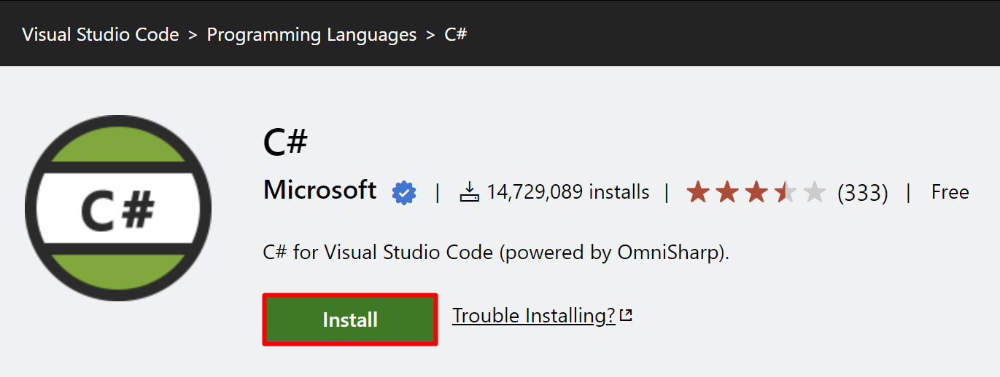

The prerequisites for installation are:

-   Microsoft Azure subscription and an Azure resource group

-   Install the latest version of:

    -   [Visual Studio Code](https://code.visualstudio.com/?azure-portal=true)

    -   [.NET 6.0 SDK](https://dotnet.microsoft.com/download/dotnet/thank-you/sdk-6.0.101-windows-x64-installer/?azure-portal=true) (The link directly downloads the setup. Double-click the .exe file and then select **Install**.)

		> [!div class="mx-imgBorder"]
		> 

		> [!div class="mx-imgBorder"]
		> 

    -   Install the following Visual Studio Code extensions (you can select the **Install** buttons to install each, which you’re required to complete **after** you’ve installed Visual Studio Code):

        -   [C# - Visual Studio Marketplace](https://marketplace.visualstudio.com/items?itemName=ms-dotnettools.csharp/?azure-portal=true)

		> [!div class="mx-imgBorder"]
		> 

        -  [Azure App Service - Visual Studio Marketplace](https://marketplace.visualstudio.com/items?itemName=ms-azuretools.vscode-azureappservice/?azure-portal=true)

		> [!div class="mx-imgBorder"]
		> 

-   A local [copy of a sample Fabrikam Application](https://github.com/microsoft/BAS-Ecosystem-Engineering/tree/main/Microsoft-Cloud-For-Retail/In-A-Day-Labs/Lab%20Resources/?azure-portal=true) is available in GitHub.

	> [!div class="mx-imgBorder"]
	> 

## Microsoft Clarity

[Microsoft Clarity](https://clarity.microsoft.com/?azure-portal=true) is a behavioral analysis tool that helps you understand user interaction with your website. By using Clarity's analysis tools, you can monitor how your website is used on different platforms, such as PC, mobile, and tablet, and enhance your website for your clients and your business. Through dashboard insights, session recordings, and heatmaps, Clarity helps you identify usability requirements of your website by allowing you to study user behavior.
