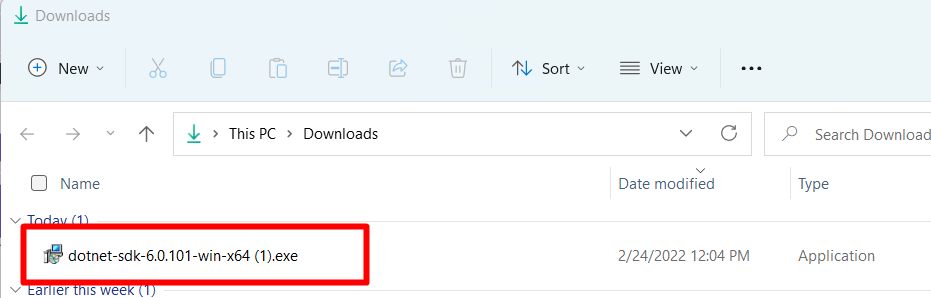
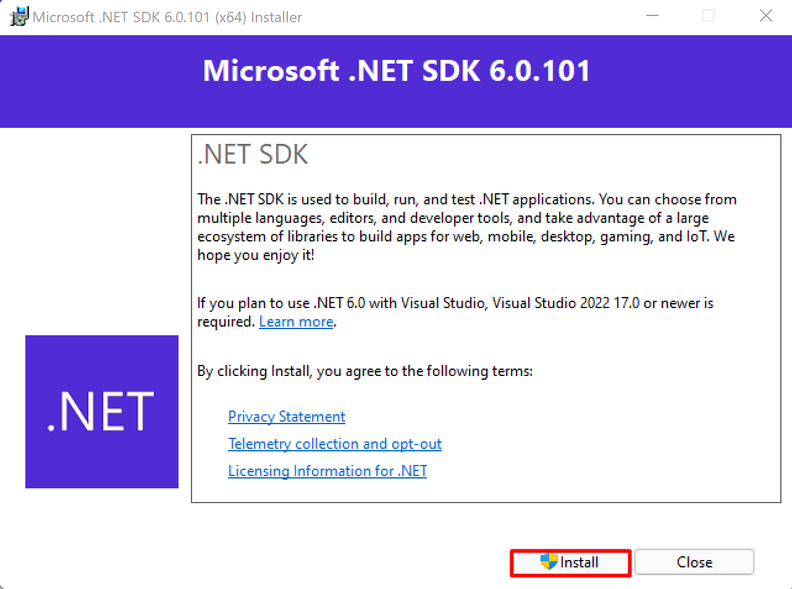
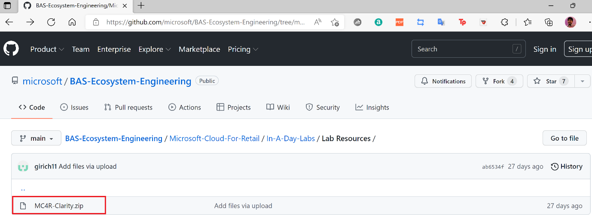

Below are the prerequisites for installation.

-   Azure Subscription, and an Azure resource group

-   Install the latest version of:

    -   [Visual Studio Code](https://code.visualstudio.com/?azure-portal=true)

    -   [.NET 6.0 SDK](https://dotnet.microsoft.com/download/dotnet/thank-you/sdk-6.0.101-windows-x64-installer/?azure-portal=true) (The link directly downloads the setup. Double click the Exe file, and select Install.)

		> [!div class="mx-imgBorder"]
		> 

		> [!div class="mx-imgBorder"]
		> 

    -   Install below Visual Studio Code Extensions (you can select the green Install buttons to install each, this is required to be done **after** installing the **VSCode**):

        -   [C# - Visual Studio Marketplace](https://marketplace.visualstudio.com/items?itemName=ms-dotnettools.csharp/?azure-portal=true)

		> [!div class="mx-imgBorder"]
		> 

        -   [Azure App Service - Visual Studio Marketplace](https://marketplace.visualstudio.com/items?itemName=ms-azuretools.vscode-azureappservice/?azure-portal=true)

		> [!div class="mx-imgBorder"]
		> 

-   A local [copy of sample Fabrikam Application](https://github.com/microsoft/BAS-Ecosystem-Engineering/tree/main/Microsoft-Cloud-For-Retail/In-A-Day-Labs/Lab%20Resources/?azure-portal=true) is available in GitHub.

	> [!div class="mx-imgBorder"]
	> 

## Microsoft Clarity

[Clarity](https://clarity.microsoft.com/?azure-portal=true) is a behavioral analysis tool that helps you understand user interaction with your website. By using Clarity's analysis tools, you can monitor how your website is used on different platforms like PC, Mobile, Tablet and enhance your website for your clients and your business. Through Dashboard insights, Session Recordings and Heatmaps, Clarity helps you identify usability requirements of your web site by allowing you to study user behavior.
