In this exercise, you'll integrate Microsoft Clarity with the E-Commerce Add-in for Microsoft Dynamics 365 Commerce. During the setup process, you’ll need to use the live production domain URL that’s associated with your Dynamics 365 Commerce site. You should have already created a new webpage on E-Commerce in Lab 1, which is the webpage that you’ll use in the following tasks.

## Task 1: Create a Clarity project for your E-Commerce page
To create a Clarity project for your E-Commerce page, follow these steps:
1.  Go to [Microsoft Clarity](https://clarity.microsoft.com/?azure-portal=true) and sign in.

1.  Select **My Projects**.

	> [!div class="mx-imgBorder"]
	> 

    The Projects Listing page will open, as shown in the following image.

	> [!div class="mx-imgBorder"]
	> 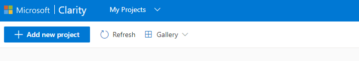

1.  Select **Add new project**.

	> [!div class="mx-imgBorder"]
	> 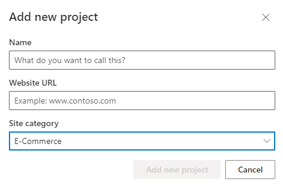

1.  Create a new project for tracking your E-Commerce page by using your page's direct URL for the Dynamics 365 Commerce page that you created in a previous lab (such as `https://mcriad.commerce.dynamics.com/mcrdemopage`).

	> [!div class="mx-imgBorder"]
	> 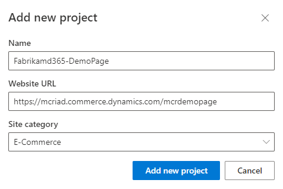
	
1.  Select **Add new project**.

## Task 2: Set up a content security policy for Clarity

For Clarity to function on an E-Commerce site, you’ll need to set up some Cloud Solution Provider (CSP) program directives to allow Clarity resources to be called. The setup steps in Task 2 might have already been performed for initial lab environment setup by your instructor. 
Follow these steps to verify that setup is complete. If settings aren't present, you can use the following steps to set up.

1.  Open the Dynamics 365 Commerce site builder URL in an InPrivate window.

1.  Select the active E-Commerce project.

	> [!div class="mx-imgBorder"]
	> 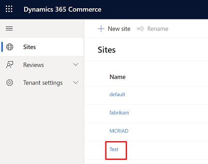

1.  Select **Site settings > Extensions**.

	> [!div class="mx-imgBorder"]
	> 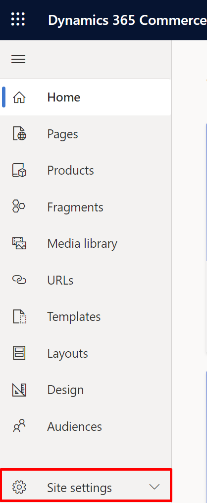

	> [!div class="mx-imgBorder"]
	> 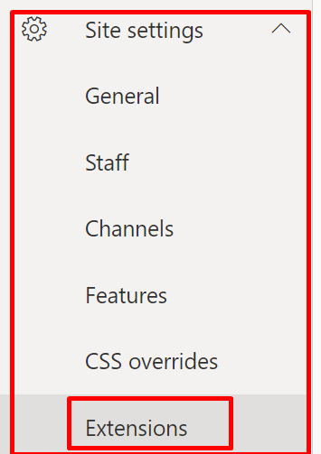

1.  Select the **Content security policy** tab. Scroll to the **child-src**, **connect-src**, and **script-src**  directive sections and check if `https://www.clarity.ms` is added in all three sections.

    If not, select **Add** and then enter `https://www.clarity.ms` in all three sections.

	> [!div class="mx-imgBorder"]
	> 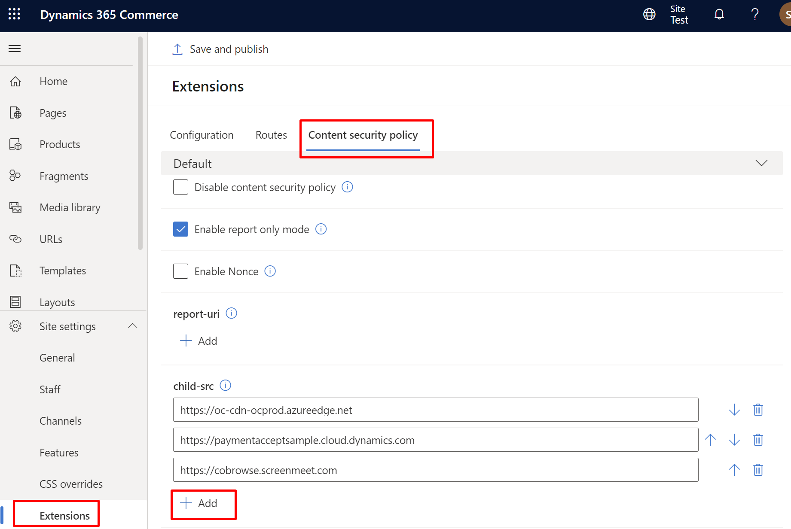

1.  The extensions should resemble the following images.

	> [!div class="mx-imgBorder"]
	> 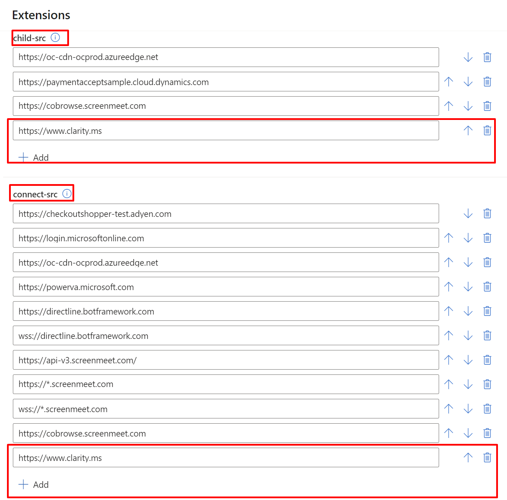

	> [!div class="mx-imgBorder"]
	> 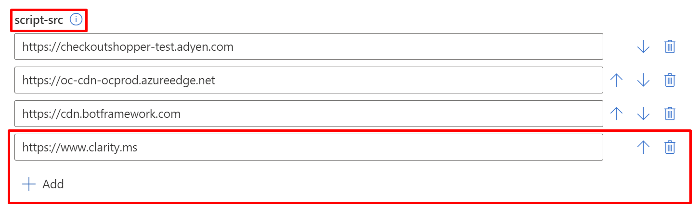

1.  Select **Save and publish** at the top of the **Extensions** blade to save your changes.

## Task 3: Embed a Clarity tracking script code into your site page

You can embed a Clarity tracking script code into any Commerce site page that you want to track with Clarity.

1.  Copy the tracking code from **Microsoft Clarity > Settings > Setup > How to install Clarity > Clarity tracking code**.

	> [!div class="mx-imgBorder"]
	> 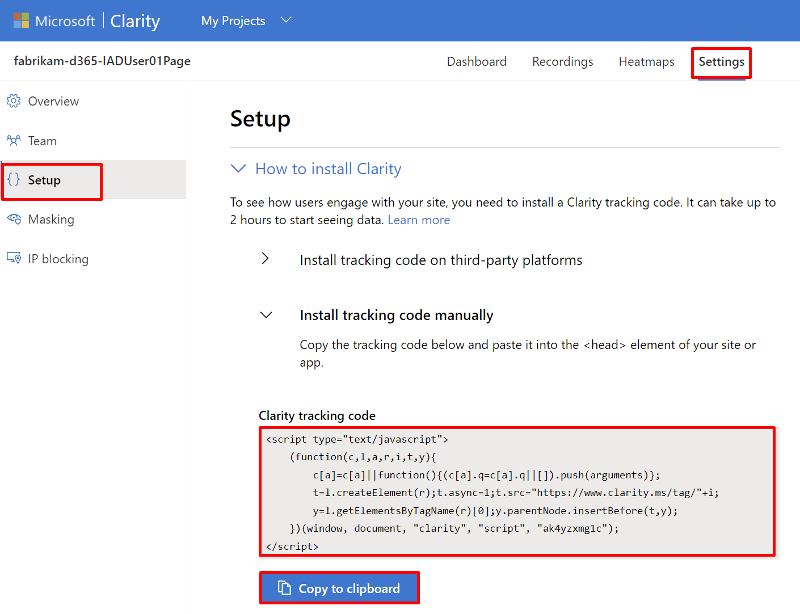

1.  In an InPrivate or Incognito window, go to the site builder URL.

1.  Open the site that’s mentioned by the instructor and then select the page that you previously created.

	> [!NOTE]
	> Use the page that was created as part of Lab 01: Seamless customer service.

	> [!div class="mx-imgBorder"]
	> 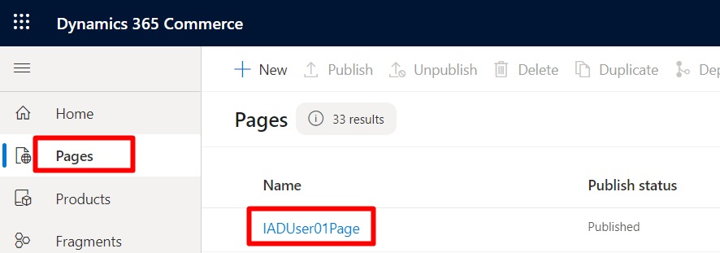

1.  To add the tracking script on an E-Commerce page, you need to ensure that the template that the page is inheriting will support inline script. To verify, follow these steps:

	1. In the **Page** view, in the **Properties** blade, select **Page attributes > Template**.

	> [!div class="mx-imgBorder"]
	> 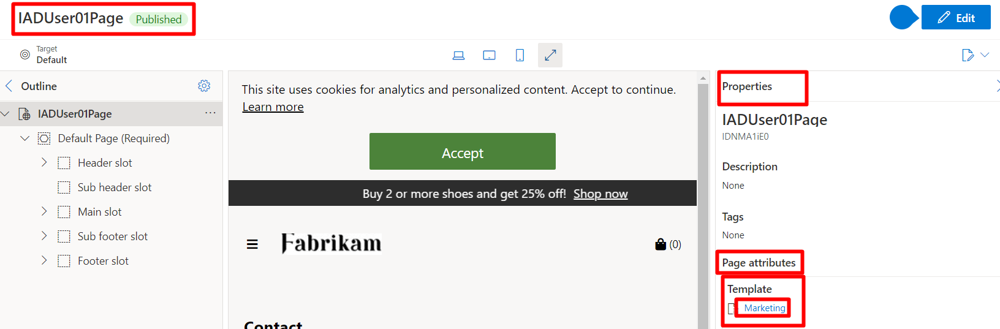

	1. From the **Template** view, go to the **Outline** blade, select **Core Root 1**, expand **HTML Head**, and then check if **Inline script** is shown.
      

	> [!div class="mx-imgBorder"]
	> 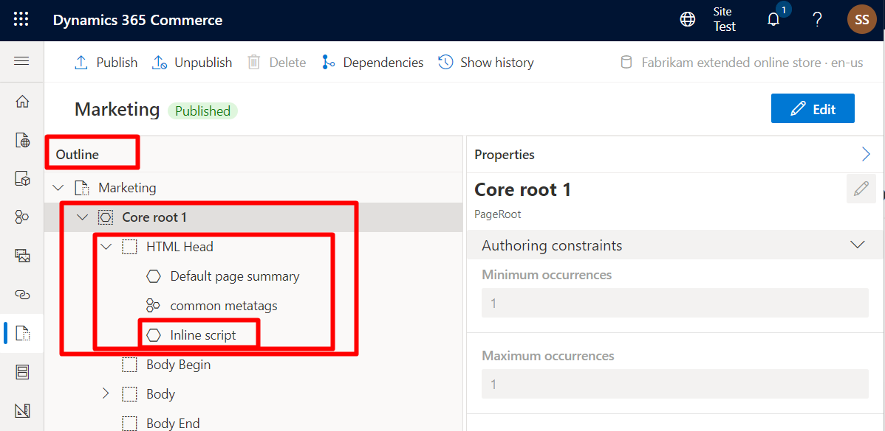

	1. If **Inline script** isn’t shown, select **Edit**.

	1. From **Outline > Core Root 1 > HTML Head, select the ellipsis (**...**) menu and then select **+ Add module**.

	> [!div class="mx-imgBorder"]
	> 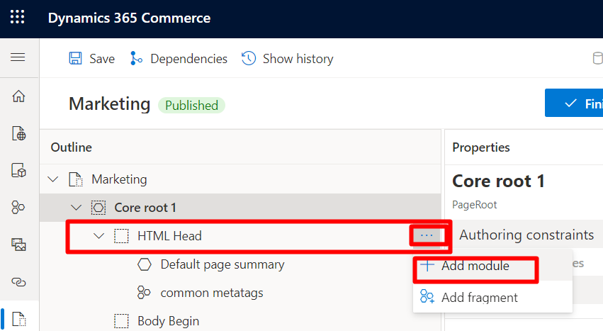

	1. From the pop-up window, select **Inline script** and then select **OK**.

	> [!div class="mx-imgBorder"]
	> 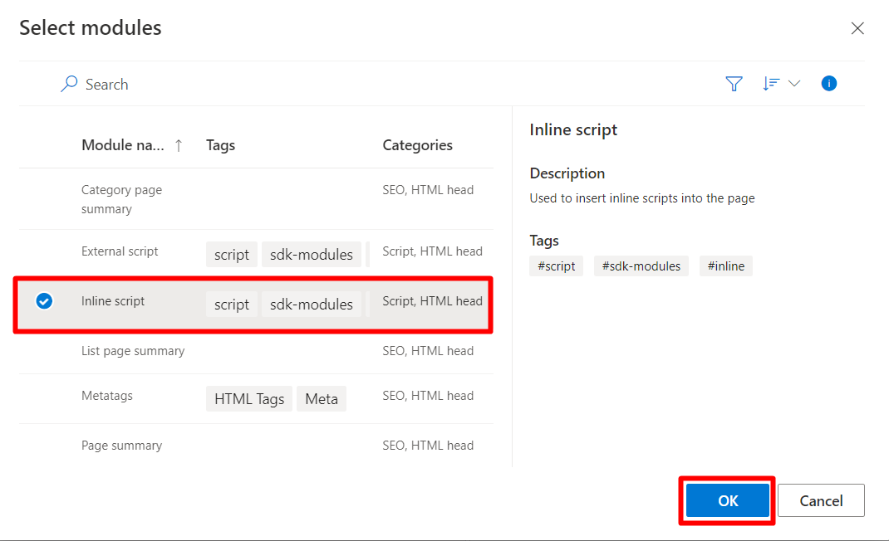

	1. **Inline script** should now show under **HTML Head**. Select **Finish editing** and then **Publish** your changes.

1.  Return to your page and select **Edit**. 

	> [!div class="mx-imgBorder"]
	> 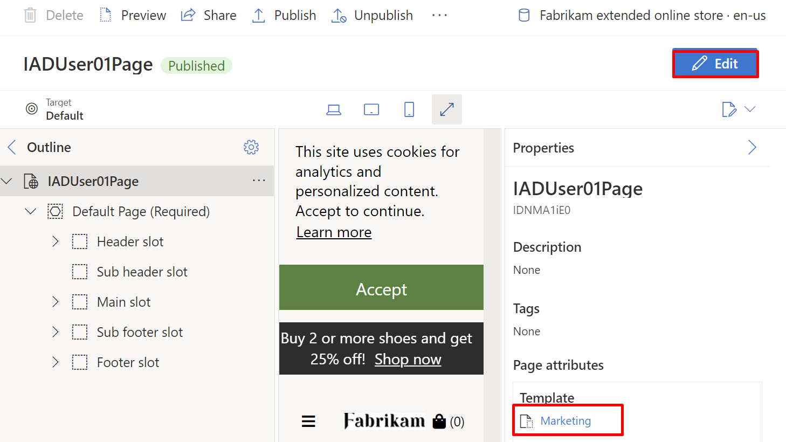

1.  Select **Outline > Settings** (gear icon) and then switch to **Advanced outline view**.

	> [!div class="mx-imgBorder"]
	> 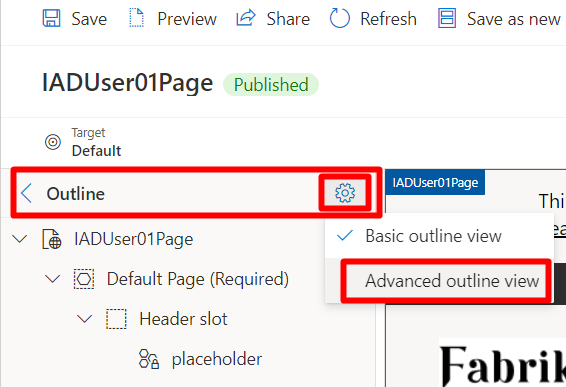

1.  Expand the **Core root 1** menu.

	> [!div class="mx-imgBorder"]
	> 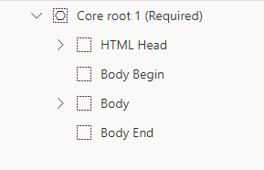

1.  Expand the **HTML Head** menu.

	> [!div class="mx-imgBorder"]
	> 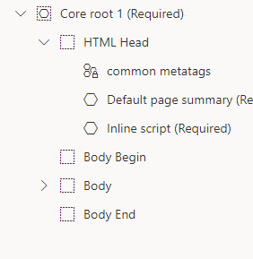

1.  Select **Inline script** under **Advanced outline > Core Root 1 > HTML Head**. Now, **Inline script** should show in the **Properties** blade.

	> [!div class="mx-imgBorder"]
	> 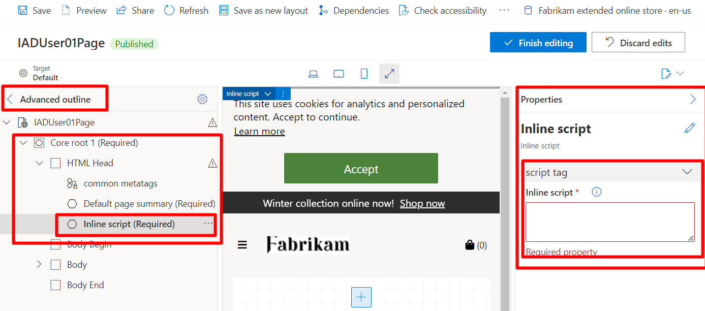

1. Paste the tracking script that you copied from **Microsoft Clarity** in the **Inline script** text box. Make sure that you remove the surrounding **<script type=\"text/javascript"\> </script\>** tags if you copied the script string because it will be added by the builder.

	> [!div class="mx-imgBorder"]
	> 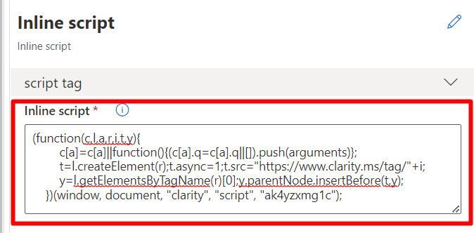

1. Select **Finish editing**.

1. Select **Publish** to publish the page.

Congratulations, you’ve integrated your E-Commerce website page with Microsoft Clarity. Now, you need to create traffic on your E-Commerce website page, as you did with the custom page, so that you can observe it Microsoft Clarity.
