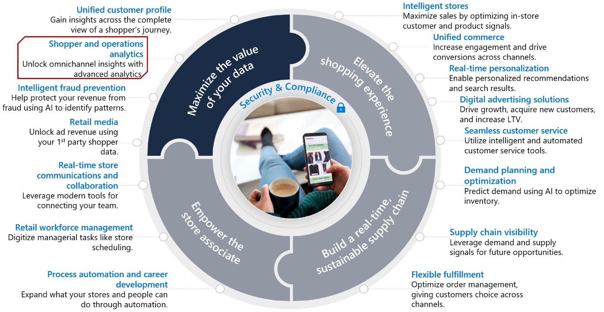
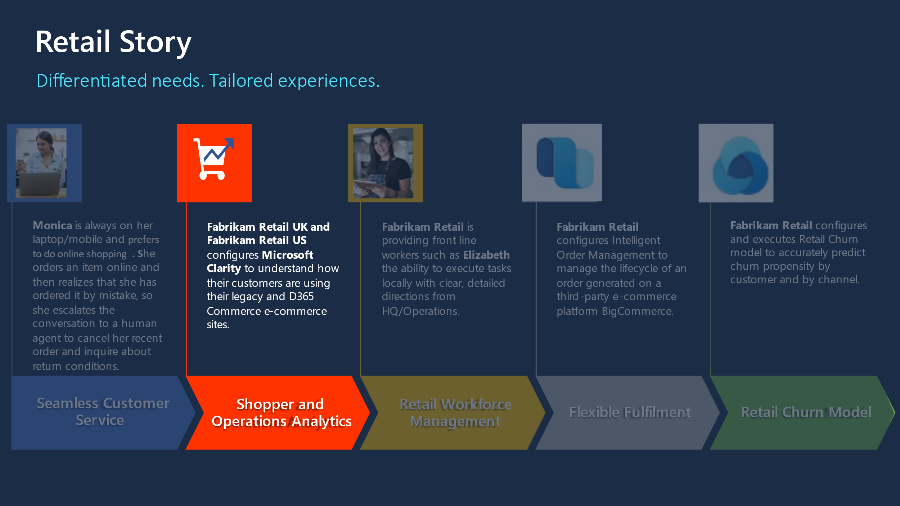

Shopper and operations analytics priority helps you unlock omnichannel insights with advanced analytics. With shopper and operations analytics, you can predict customer and operational needs, monitor and understand online engagement, and unify data integration, warehousing, and analytics.

You can **monitor and understand engagement**:

-   Utilize the heatmap feature to see where your site generates the most clicks, what people are ignoring, and how far they're scrolling.

-   Watch how customers are using your site with anonymized, hi-definition recordings and discover user frustrations by documenting rage clicks, dead clicks, and quick backs with behavior-focused insights allowing you to come up with solutions more efficiently.

-   Understand customer engagement using built-in web and mobile analytics and return customer activity recognition, allowing you to create custom reports and views based on real-time customer behavior data.

> [!div class="mx-imgBorder"]
> 

Microsoft Clarity focuses on the **Maximize the value of your data, Shopper and operations analytics** priority scenario of Microsoft Cloud for Retail, by providing insight on your websites' usage patterns either as an e-commerce web shop built on [Dynamics 365 Commerce](/commerce/overview/?azure-portal=true), or a custom e-commerce website, or just a website for providing information about your physical shop.

## Learning objectives

> [!div class="mx-imgBorder"]
> 

In this lab, you'll assume yourself to be a system administrator of Fabrikam UK and Fabrikam US websites. Fabrikam US has recently migrated to Dynamics 365 E-Commerce but Fabrikam UK is still using an ASP.NET website *(for the sake of Azure deployment simplicity we provided a simple multipage no image containing web application to represent Fabrikam UK website).* You want to track, monitor and analyze the user behavior on both websites to provide a better user experience. For that purpose, you'll be integrating both the websites with Microsoft Clarity.

In this module, you'll learn how to do the following:

-   How to create a Microsoft Clarity project

-   How to integrate Microsoft Clarity with a custom website

-   How to integrate Microsoft Clarity with Dynamics 365 E-Commerce Web Page

-   How to interact with Microsoft Clarity dashboards, heatmaps and recordings

Bonus Learning Opportunity: (Since part of this lab needs an up and running sample website to do the integration, you'll also learn how to deploy an ASP.NET web site to Azure App Service with Visual Studio Code in the upcoming exercises.)