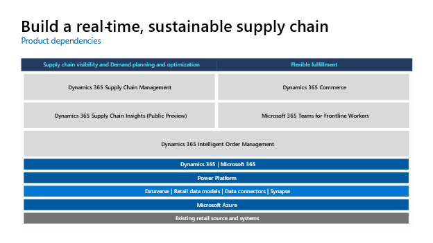
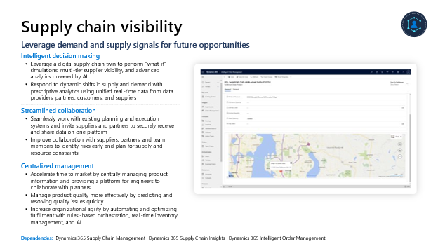
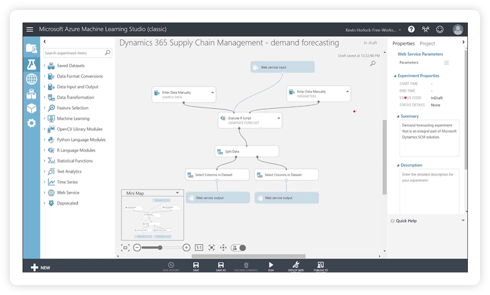
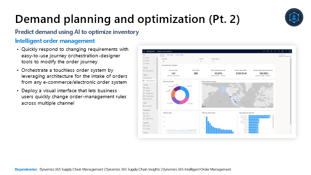
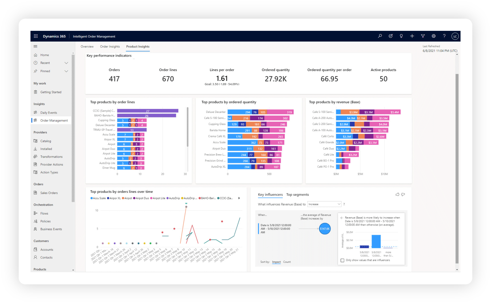

## Core components

The Microsoft Cloud for Retail uses a combination of Microsoft Products to address the industry prioritized scenarios focused on building a real-time, sustainable supply chain. The illustration below reflects the required and recommended capabilities.

> [!div class="mx-imgBorder"]
> 

### Supply chain visibility

Key to a robust supply chain is improving visibility. Retailers are sitting on a treasure trove of data from across their supply chain and many can't use it to their full advantage. Supply chain visibility can help you use supply and demand signals for future opportunities.

With supply chain visibility, you can reduce stock-outs, automate and optimize fulfillment, boost sustainability, and improve decision-making.

> [!div class="mx-imgBorder"]
> 

Start with **intelligent decision making.** You can:

- Use a digital supply chain twin to perform "what-if" simulations, multi-tier supplier visibility, and advanced analytics powered by AI

- Respond to dynamic shifts in supply and demand with prescriptive analytics using unified real-time data from data providers, partners, customers, and suppliers

You can also expect **streamlined collaboration**:

- Seamlessly work with existing planning and execution systems and invite suppliers and partners to securely receive and share data on one platform

- Improve collaboration with suppliers, partners, and team members to identity risks early and plan for supply and resource constraints

And you can do this all with **centralized management**:

- Accelerate time to market by centrally managing product information and providing a platform for engineers to collaborate with planners

- Manage product quality more effectively by predicting and resolving quality issues quickly

- Increase organizational agility by automating and optimizing fulfillment with rules-based orchestration, real-time inventory management, and AI

### Demand planning and optimization

In this dynamic and shifting market, demand planning and optimization are more challenging than ever before. Planning optimization ensures correct inventory distribution at all points of the supply chain, from factory lines to shipping. The real-time planning engine can be configured and automated to optimize replenishment based on priority. This enables businesses to increase service levels, reduce inventory levels, and optimize their supply chains by prioritizing replenishment orders to ensure that urgent demand is prioritized over less important demand. Companies can replan multiple times a day within minutes, instead of waiting 8 hours or over night for a complete MRP run.

With demand planning and optimization, AI helps:

- Plan for a dynamic and shifting market

- Optimize your inventory and agile distribution and manufacturing processes

- Automate replenishment

- Reduce waste and unnecessary emissions

> [!div class="mx-imgBorder"]
> 

With this capability, you can have access to **real-time inventory visibility**:

- Utilize AI-enriched demand forecasting to help ensure
    on-time delivery of the right product and near-real-time production planning to eliminate stockouts

- Deliver cross-channel inventory visibility and maintain accounting ledgers globally in near-real time

Invest in **planning optimization, even during disruption.** You can:

- Respond intelligently to dynamic shifts in supply and demand with prescriptive analytics using unified real-time data from data providers, partners, customers, and suppliers

- Optimize operations, material handling, workforce planning, and inventory flow with integrated warehouse management

- Scale distribution during peaks and keep critical warehouse processes running at high throughput all while ensuring business continuity even when disconnected from the cloud

> [!div class="mx-imgBorder"]
> 

Finally, acquire **intelligent order management**:

- Quickly respond to changing requirements with easy-to-use journey orchestration-designer tools to modify the order journey

- Orchestrate a touchless order system by using architecture for the intake of orders from any e-commerce/electronic order system

- Deploy a visual interface that lets business users quickly change order-management rules across multiple channels

### Flexible fulfillment

The last capability in supply chain, flexible fulfillment, can help you optimize order management giving customer choice across channels.

With flexible fulfillment, streamline curbside pickup and buy-online-pickup-in-store operations, provide customers with real-time inventory and order status, and gain greater control of the entire order lifecycle.

> [!div class="mx-imgBorder"]
> 

Offer an **enhanced customer experience**:

- Streamline returns management and enable flexible return scenarios

- Use AI and anomaly detection models to identify and address fulfillment constraints and improve delivery times while reducing costs

- Give customers ordering flexibility such as home delivery, curbside pickup, and pick up in-store with connected ordering and fulfillment tools

- Offer real-time inventory availability and order status with AI, providing a single solution to order-fulfillment orchestration

And gain **seamless inventory management**:

- Access a single global view of your inventory positions in real-time to ensure that the right products are available in the right place at the right time

- Track inventory across channels and make informed inventory supply decisions with advanced analytics and machine learning

- Utilize the Tasks app in Microsoft Teams to assign associates to stock count allowing for real-time numbers
