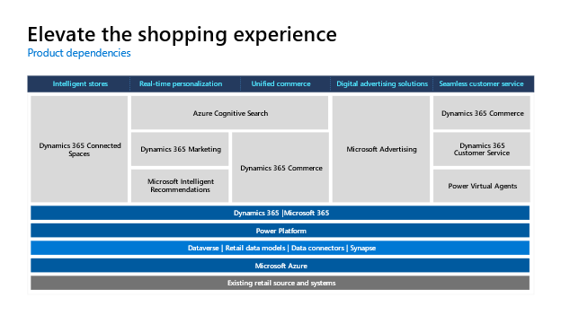
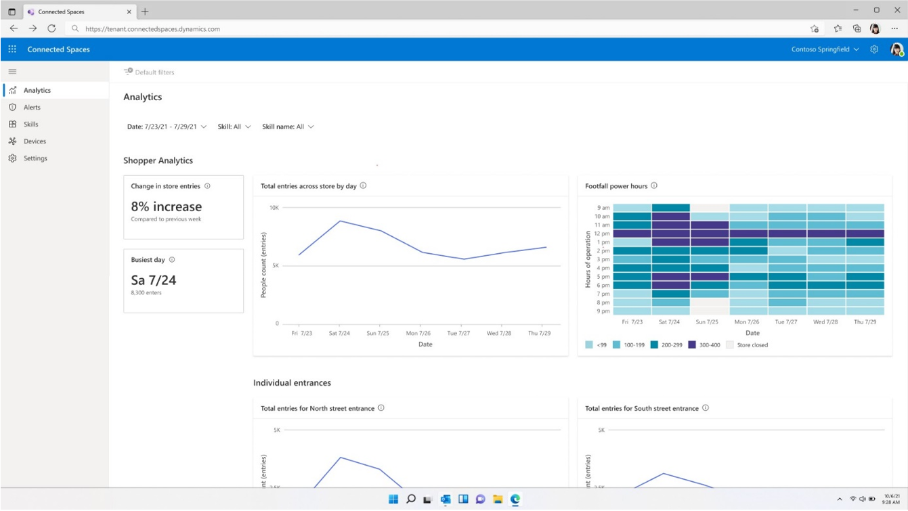
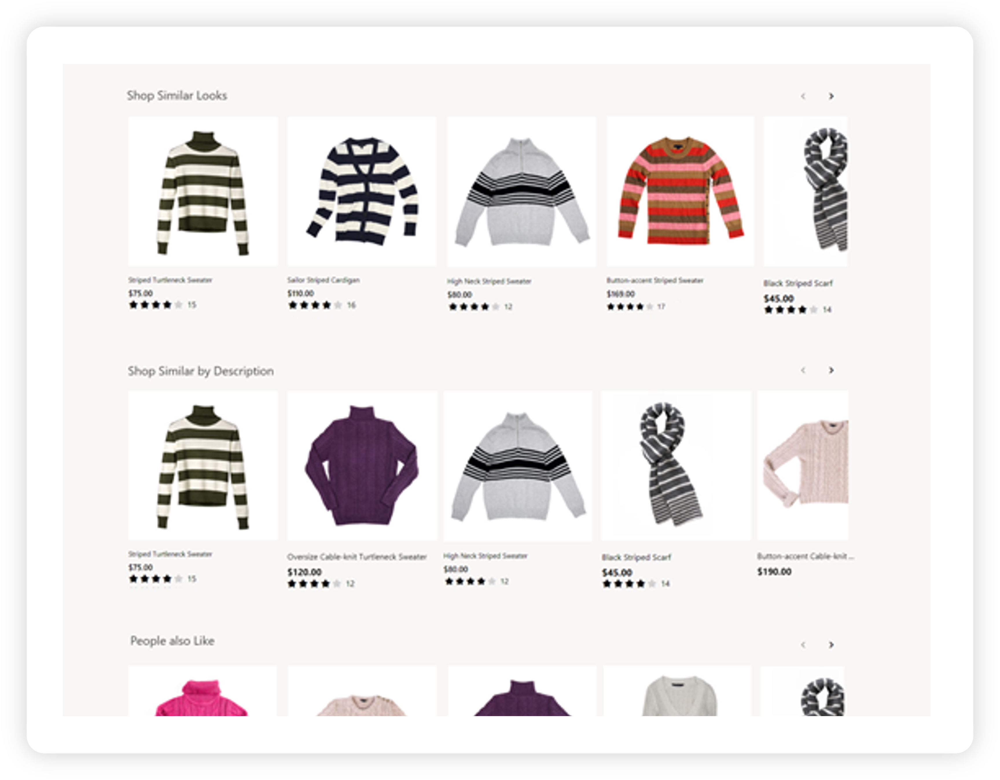
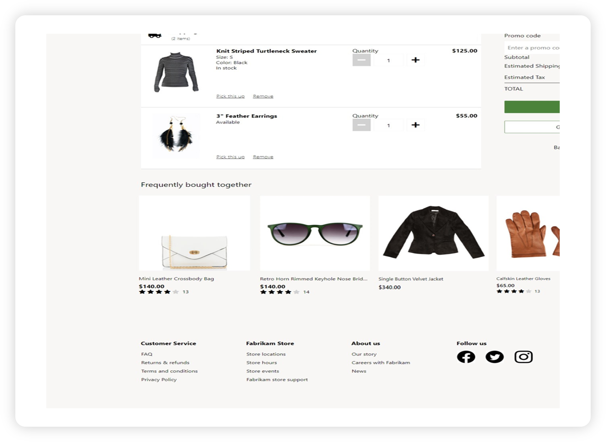
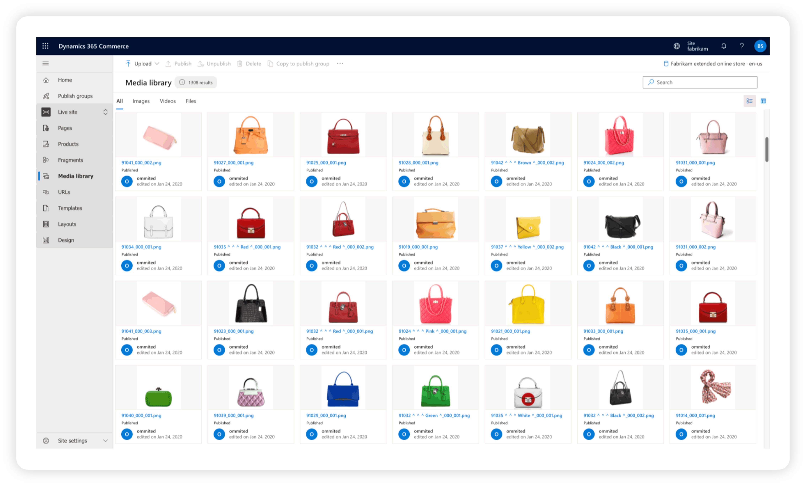
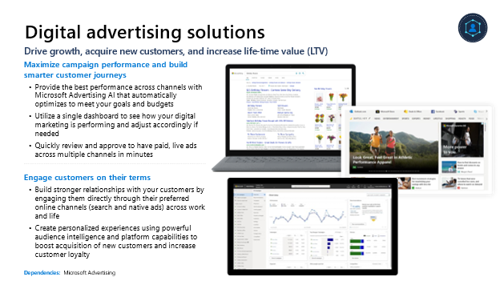
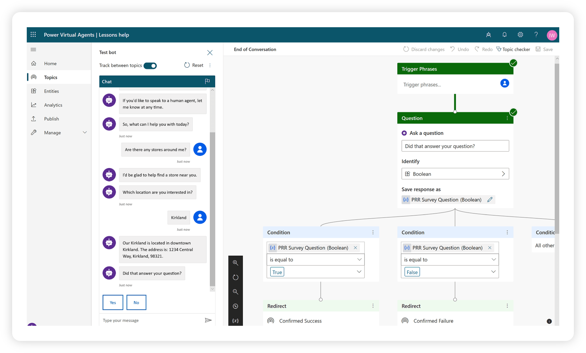
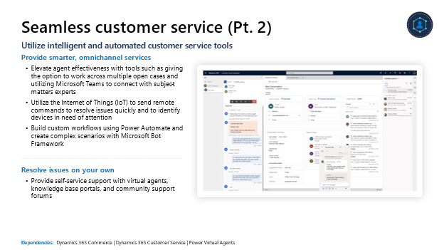

## Core components

The Microsoft Cloud for Retail uses a combination of Microsoft Products to address the industry prioritized scenarios focused on elevating the shopping experience. The illustration below reflects the required and recommended capabilities.

> [!div class="mx-imgBorder"]
> 

### Intelligent stores

Intelligent stores helps you protect your revenue from fraud using AI to identify patterns.

With intelligent stores, you can maximize sales by optimizing in-store customer and product signals.

> [!div class="mx-imgBorder"]
> 

Use **actionable insights to improve sales**:

- Utilize pre-built AI models and existing cameras to unlock trends, patterns, and new data

- Improve customer and employee experiences with features such as traffic patterns for optimal staffing placement, product display performance, and built-in alerts to gain real-time insights

- Deploy scenario-based AI models, or skills, such as display effectiveness, queue management, and shopper analytics to target specific business opportunities and pinpoint trouble areas

And gain a **single view into insights**:

Seamlessly view data-driven insights and alerts with a single, unified dashboard

### Real-time personalization

Real-time personalization helps you enable personalized recommendations and search results.

With real-time personalization, you can help drive conversion and make it easier for customers to find what they're looking for, and offer more relevant options.

> [!div class="mx-imgBorder"]
> 

With real-time personalization, **shop similar looks and similar descriptions**:

- Implement popular discover scenarios like Bring the Look, Shop Similar Looks, and more, using world-class AI-ML to deliver personalized and tailored results

- Provide relevant discovery from existing user behavior data or item metadata, whether it's structured or unstructured data

Concurrently, offer **real-time recommendations**:

- Enable personalized product recommendations--not standard generic recommendations--and customer content insights using modern machine-learning algorithms

- Utilize semantic search capability to understand the intent of what your customers are trying to search, offer improved search results, and drive deeper customer engagement

- Help customers and sellers find products online and in-store with intelligent product search

> [!div class="mx-imgBorder"]
> 

Real-time personalization also makes way for **hyper-personalized customer journeys**:

- Understand the customer journey so far, and provide next best action based on your datasets and insights

- Create multi-touchpoint, personalized journeys using demographics and behaviors to orchestrate experiences across marketing, commerce, sales, and service

Finally, experience **elevated experience across all channels**:

- Experience quick onboarding with codeless tooling paired with extensible application programming interfaces (APIs) allowing seamless integration into any ecosystem

- Deploy capabilities anywhere: e-commerce sites, in-store, email, social media, and more, and align teams across your company by sharing a single, real-time view of customer context

### Unified commerce

Unified commerce can help increase engagement and drive conversions across channels.

With unified commerce, connect operations, enhance and personalize customer experiences, and connect physical and digital storefronts.

> [!div class="mx-imgBorder"]
> 

Unified commerce can allow you to **engage across channels**:

- Operate on a flexible, unified commerce platform that allows you to connect digital, in-store, and back-office operations, with the ability to expand and grow to fit business needs

- Unify physical and digital storefronts, providing a single view of transactions, observational data, and behavioral data for customers

- Access real-time omnichannel sales and cost data to centrally manage promotions across all channels, and track inventory across channels to make informed inventory supply decisions with advanced analytics and machine learning

It can also help you **predict and personalize to drive conversions.** You can:

- Predict customer demand with actionable insights provided by historical sales and purchase data

- Use a modern retail POS & AI-driven recommendations to enhance and personalize customer experience and help them discover what's relevant to them

### Digital advertising solutions

Digital advertising solutions can help drive growth, acquire new customers, and increase life-time value (LTV).

With digital advertising solutions, you can optimize your campaigns across channels, find new customers and increase current customer loyalty, and build stronger customer relationships.

> [!div class="mx-imgBorder"]
> 

Use digital advertising solutions to **propel growth**:

- Ensure the best performance across channels with Microsoft AI that automatically optimizes to meet your goals and budgets

- Utilize a single dashboard to see how your digital marketing is performing and adjust accordingly if needed

- Quickly review and approve to have paid, live ads across multiple channels in minutes

Furthermore, **engage new and loyal customers**:

- Build stronger relationships with your customers by engaging them directly through their preferred online channels (Bing.com, Yahoo.com, AOL.com, DuckDuckGo.com, MSN.com, Outlook.com and other top publishers) across work and life

- Create personalized experiences using powerful audience intelligence and platform capabilities to boost acquisition of new customers and increase customer loyalty

### Seamless customer service

Seamless customer service can help you utilize intelligent and automated customer service tools.

With seamless customer service, you can eliminate problems before they arise, tailor customer engagements, and free up live agents to manage complex problems.

> [!div class="mx-imgBorder"]
> 

With this capability in your back pocket, you can **offer help anytime with AI-powered chatbots**:

- Create AI-powered chatbots that can resolve common issues and answer questions 24 hours a day

- Integrate your chatbots with the products and services you use everyday allowing it to look up records, hand off conversations to live agents, and
    call APIs

- Create personalized conversations with distinct topics using natural language understanding and entity extraction

- Monitor and improve your chatbot's performance using AI and data-driven insights

You can also **extend personalized assistance**:

- Tailor customer engagement by providing at-a-glance customer history, and utilize AI to classify, prioritize, and assign customers across all channels to the most qualified agent

> [!div class="mx-imgBorder"]
> 

Further, you can **provide smarter services**:

- Elevate agent effectiveness with tools such as giving the option to work across multiple open cases and utilizing Microsoft Teams to connect with subject-matters experts

- Utilize the Internet of Things (IoT) to send remote commands to resolve issues quickly and to identify devices in need of attention

- Build custom workflows using Power Automate and create complex scenarios with Microsoft Bot Framework

Finally, you can empower customers to **resolve issues on their own**:

- Provide self-service support with virtual agents, knowledge base portals, and community support forums
