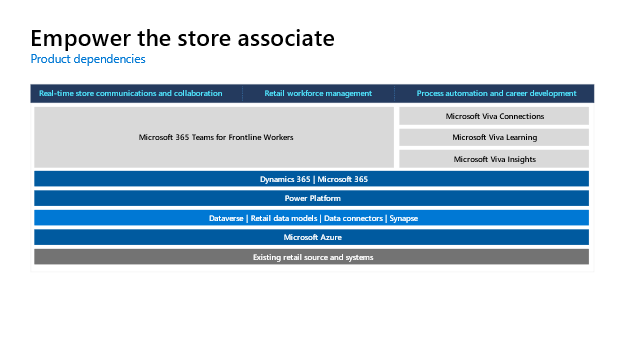
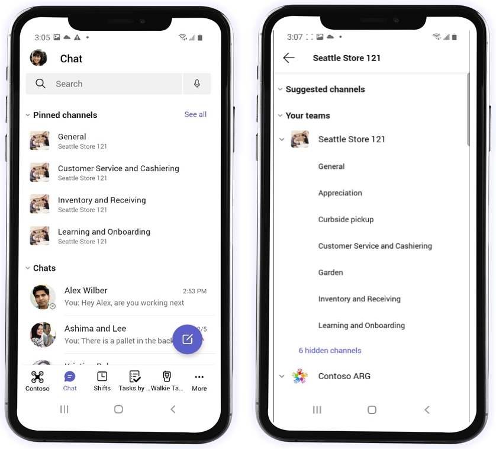
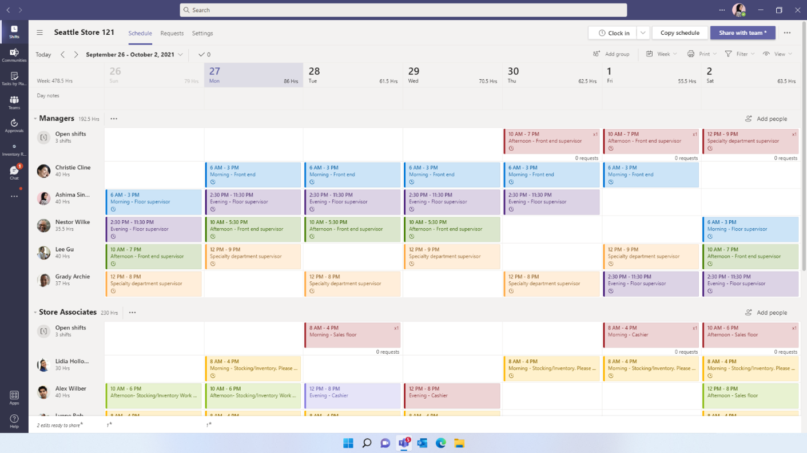
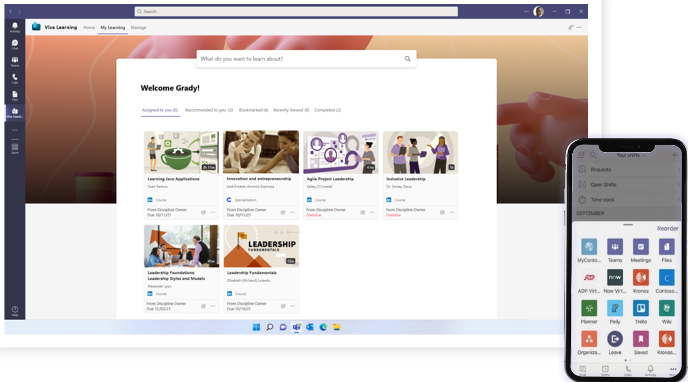
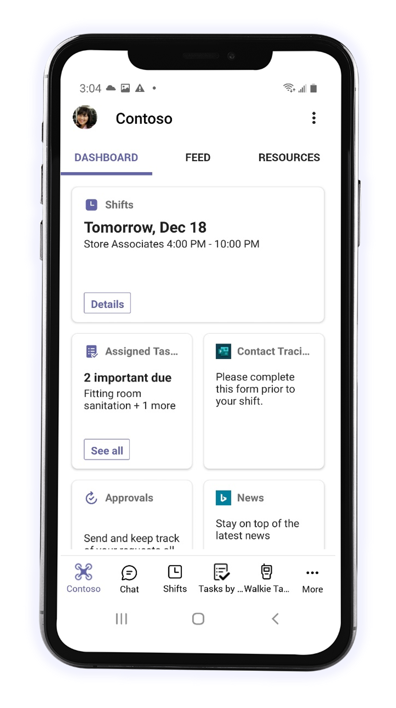

## Core components

The Microsoft Cloud for Retail uses a combination of Microsoft Products to address the industry prioritized scenarios focused on empowering the store associates. The illustration below reflects the required and recommended capabilities.

> [!div class="mx-imgBorder"]
> 

### Real-time store communications and collaboration

Real-time store communications and collaboration can help you use modern tools for connecting your team.

With real-time store communications and collaboration, gain productivity by putting empowered associates on a level playing field with deeply informed customers. Provide modern communication, streamline work, and maintain an engaged, inclusive workplace.

> [!div class="mx-imgBorder"]
> 

Offer your team **real-time collaboration.** You can:

- Provide effective communication tools such as Walkie Talkie to facilitate real-time collaboration across the floor and speed up customer service

- Equip workers with secure messaging and file sharing to access key information all in one app

- Use Microsoft Teams to create channels to connect your workforce, coordinate planning and tasks, and streamline communications

Take it up a step with **secure and rich messaging and file sharing**:

- Take advantage of priority notifications, tagging capabilities, read receipts, and share images, files, and praise all over Teams chat

- Use shared or personal devices securely and equip workers with your choice of purpose-built devices

### Retail workforce management

Retail workforce management helps you digitize managerial tasks like store scheduling.

With retail workforce management, manage shifts seamlessly, easily connect to your existing workforce, simplify task dissemination, and help your team complete tasks more easily.

> [!div class="mx-imgBorder"]
> 

With retail workforce management, offer **seamless scheduling**:

- Manage shifts seamlessly--enable managers to easily create and manage their team's schedule and let employees set their availability and easily adjust schedules to fluctuating business needs

- Track time & attendance with easy clock in and out with geo detection and digital time tracking sheets.

- Enable Shifts connectors with workforce management systems for real-time visibility into labor scheduling, time and attendance, and store operation scheduling in a single interface--ensuring a seamless and accurate scheduling experience

Also, experience **task management made easy**:

- Enable corporate employees like corporate communications nor retail operations team easily create, distribute and track task assignments to targeted location.

- Equip managers to manage tasks regionally and assign them to the right individuals in the store

- Provide frontline workers from executing tasks locally with clear, detailed directions from HQ/Operations.

### Process automation and career development

Process automation and career development help you expand what your stores and people can do through automation.

With process automation and career development, utilize a customizable and extensible platform, quickly implement new retail use cases, use automation so employees can focus more on customers, and facilitate employee growth and development.

> [!div class="mx-imgBorder"]
> 

This capability can help you **leverage automation with apps**:

- Utilize Power Apps templates to start building and launching apps right away in Microsoft Teams

- Learn to build custom, low-code solutions with Microsoft Power Automate, allowing apps, bots, automated workflows, and data to handle repetitive tasks

- Gain access to over 700 apps in the app store and integrate workflow apps and process automation apps into your everyday Microsoft Teams workspace workflow

Further, you can **equip people and processes to offer better experiences**:

- Enable virtual fittings and appointments that create a seamless  experience for customers and workers alike with virtual visits.

- Enable Approvals to make customer discounts to run more smoothly

> [!div class="mx-imgBorder"]
> 

Finally, you can **facilitate employee growth and development**:

- Connect everyone in your organization on a single platform with individually tailored feeds, personalized dashboards, and powerful targeting through Viva Connections

- Keep your entire workforce up to date and quickly onboard new employees on newest training, policies, and general learnings with the learning management system and content providers inside Viva Learning in Teams

- Focus on employee wellbeing and employee insights with Viva Insights
