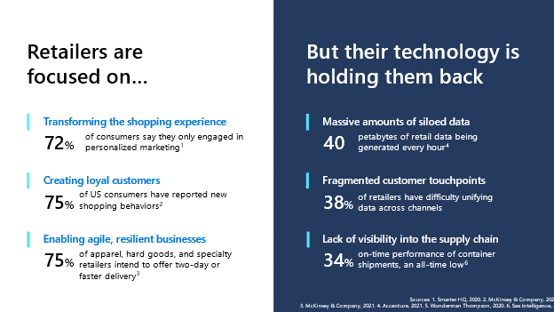
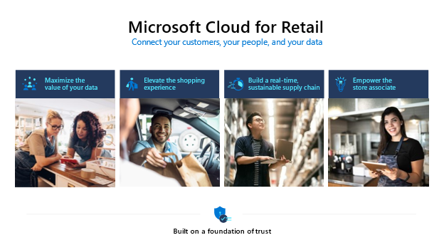
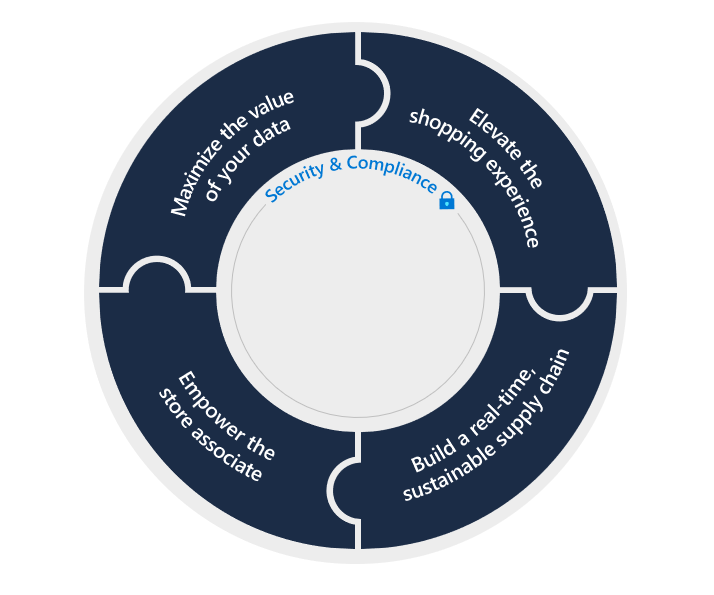

Microsoft Cloud for Retail provides capabilities to manage retail data at scale and make it easier for retail organizations to improve the customer experience drive operational efficiency, while helping support security, compliance, and interoperability of retail data.

Let's see how retail is currently in transition and how Microsoft Cloud for Retail is helping transform the retail journey.

## Retail industry and shifting priorities

With the pandemic and other disruptions in the industry, retailers' priorities are shifting.

> [!div class="mx-imgBorder"]
> 

> [!NOTE]
> For more information, see the following resource links (numbers correspond with reference numbers in the preceding screenshot):
>
> 1. [Smarter HQ, 2020](https://smarterhq.com/privacy-report/?azure-portal=true),
>
> 2. [McKinsey & Company, 2020](https://www.mckinsey.com/~/media/McKinsey/Business%20Functions/Marketing%20and%20Sales/Our%20Insights/The%20great%20consumer%20shift/ten-charts-show-how-us-shopping-behavior-is-changing.pdf#:~:text=The%20crisis%20has%20prompted%20a%20surge%20of%20new,high%20earners%20are%20most%20prone%20to%20switching%20brands.),
>
> 3. [McKinsey & Company, 2021](https://www.mckinsey.com/industries/retail/our-insights/retails-need-for-speed-unlocking-value-in-omnichannel-delivery/?azure-portal=true),
>
> 4. [Accenture, 2021,](https://www.accenture.com/blogs/cloud-computing/how-to-get-more-value-out-of-your-data-in-the-cloud/?azure-portal=true)
>
> 5. [Wunderman Thompson, 2020,](https://www.wundermanthompson.com/insight/experiences-customers-want/?azure-portal=true)
>
> 6. [Sea Intelligence, 2021,](https://sea-intelligence.com/press-room/97-schedule-reliability-drops-to-all-time-low-33-6-in-august-2021/?azure-portal=true)

Today, retailers are focused on:

**Transforming the shopping experience.** For example, 72% of consumers say they only engage in personalized marketing.

**Creating loyal customers is also a top priority.** 75% of US consumers have reported new shopping behaviors, which isn't surprising, given the rise of social media, curbside pickup, personalized shopping experiences, and more.

**Retailers are also focused on enabling agile, resilient businesses.** The need to adapt and change quickly to meet shifting needs is more present than ever before. For example, 75% of specialty retailers are aiming to offer two-day or faster delivery.

But retailers are finding that their technology is holding them back.

First, they're dealing with **massive amounts of siloed data.** In fact, 40 petabytes of retail data being generated every hour.

Furthermore, **customer touchpoints are fragmented.** 38% of retailers have difficulty unifying data across channels and 34% have difficulty unifying data siloes organization-wide with 31% of retailers say they can't track consumers across devices.

On the back end, companies have **limited visibility of their supply chain.** Companies are experiencing 34% on-time performance of container shipments, an all-time low.

Fortunately, these barriers aren't insurmountable.

## Priority retail scenarios

In response to industry's focus on Cloud Services, Microsoft has prioritized developing services specific to the industry. Microsoft Cloud for Retail, built on a foundation of privacy, security, and regulatory compliance across Microsoft and the partner ecosystem.

> [!div class="mx-imgBorder"]
> 

Microsoft Cloud for Retail is our collection of proven tools to connect your customers, your people, and most importantly, your data. The Microsoft Cloud for Retail is an industry-specific cloud, that introduces capabilities for retail customers across four key parameters.

**Maximize the value of your data**: Retailers are challenged to unify vast and increasing amounts of data across various sources that don't necessarily communicate well with one another. Maximizing the value of your data is about unifying these data sources to realize greater value across your enterprise.

**Elevate the shopper experience**: Retailer's customers demand an experience that is tailored to their tastes and respects their time and energy. These tools help foster stronger customer relationships, increase online and offline cart size, and drive loyalty.

**Build a real-time, sustainable supply chain**: Supply chain stability and agility is perhaps the most pressing frontier for retail organizations around the world right now. So we have dedicated solutions that include artificial intelligence to provide visibility across your entire supply chain and predict and manage for changes in supply and demand at all points.

**Empower the store associate**: We provide modern work solutions that help manage burnout so they can be as effective and empowered as possible. Equip your retail workforce with solutions to increase customer satisfaction, while reducing the burden on your frontline and empowering your team's growth.

And finally and as importantly, every pillar of the Microsoft Cloud for Retail is supported by a foundation of trust. We know your customers are your customers and your data is your data, so you own and control it at every stage. And we support it with identity and data privacy and security.

## Featured retail capabilities

There are 15 capabilities enabled through the four prioritized scenarios as depicted below:

> [!div class="mx-imgBorder"]
> 

Now, let's take a closer look at the capabilities around the value chain.

We'll be going over each of these in detail, but at a glance...

Maximizing the value of your data starts with a **unified customer profile** that creates a holistic view of shoppers by integrating various data points across omnichannel behaviors. It's further supported by **AI-driven analytics** that help you make better operational decisions, **fraud prevention** that recognizes and flags known suspicious patterns, and **retail media** that turns your web experience into an extra revenue driver using the products and partners you already stock.

Elevating the shopping experience uses **real-time personalization** to elevate recommendations right down to the individual shopper level, when their shopping online or even coming in to a location to browse. **Intelligent stores** keep brick-and-mortar operations optimized, **unified commerce** connects digital and physical storefronts into one holistic, consolidated view, **digital advertising** maximizes your return on ad spend, and **seamless customer service** connects in-store and call-center employees to the same customer intelligence so shoppers have a consistent experience with your brand.

A real-time, sustainable supply chain is supported by **supply chain visibility** that uses real-time inventory management to give a complete view of stock and orders from the warehouse through to a customer's front door. **Demand and planning optimization** helps with forecasting and anticipating inventory issues, and **flexible fulfillment** supports omnichannel buying behaviors allowing customers to shop how they like.

And finally, and empowered store associate is supercharged with **modern communication tools** that allow them to reach other store associates quickly and communicate the right information to the right people right away. Store managers are better able to **manage their workforce** through tools like task and shift management that giver associates better visibility into their scheduling, and resources that drive **process automation and career development** help associates better manage their time and upskill their abilities.

The Microsoft Cloud for Retail is supported with retail industry-specific data models, APIs and an ecosystem of partners that are purpose built for retail-specific scenarios. And it's all built on a foundation of trust. Our approach to security, compliance and privacy includes, protecting identities and endpoints, defending against threats, securing cloud infrastructure, protecting and governing sensitive data, and using integrated regulatory compliance tools.
