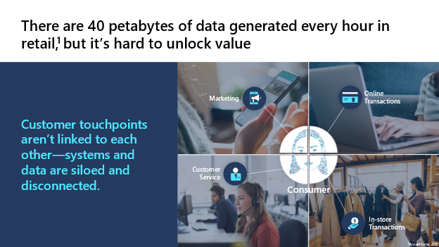
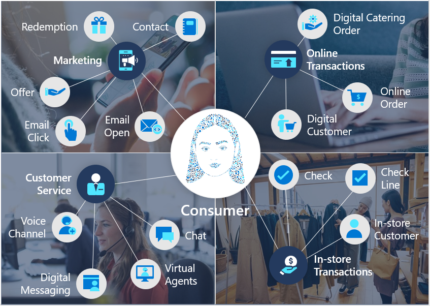
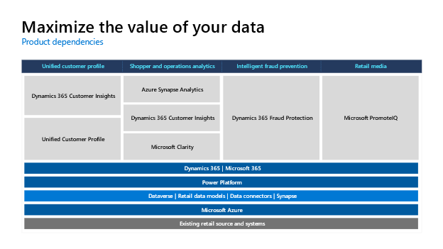
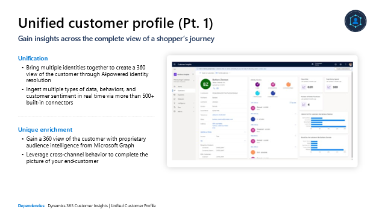
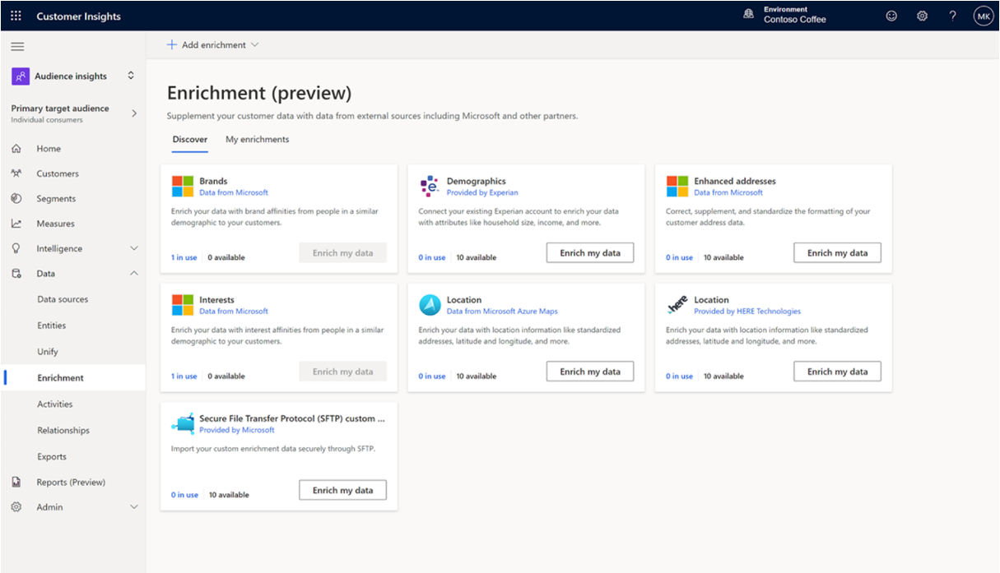
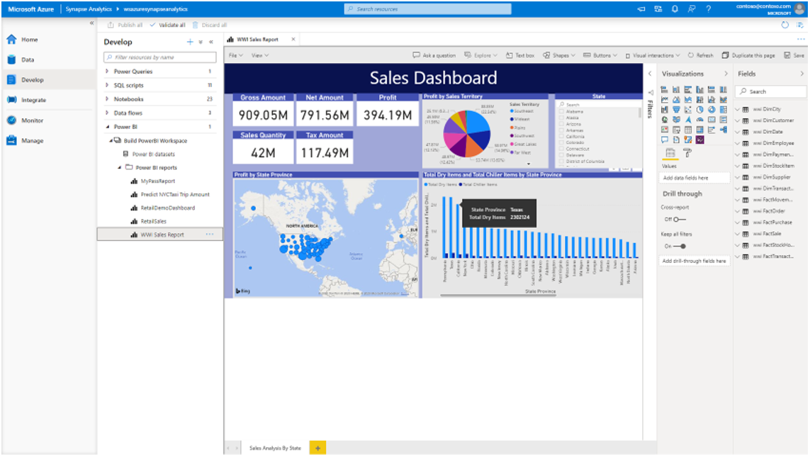
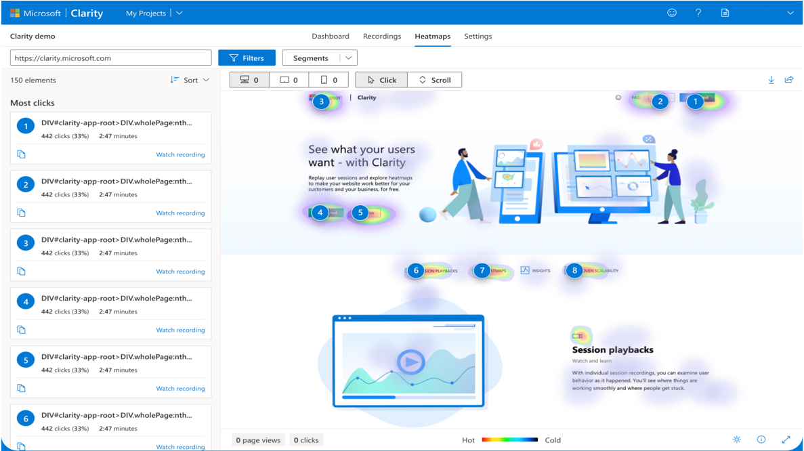
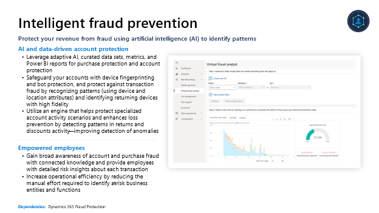
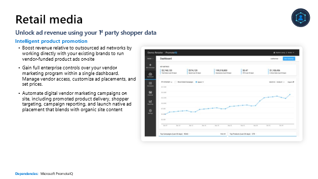

> [!div class="mx-imgBorder"]
> 

> [!NOTE]
> For more information, see the following resource links (numbers corresponding with reference numbers in the preceding screenshot):
>
> 1. Accenture, [How to get more value out of your data in the cloud](https://www.accenture.com/blogs/cloud-computing/how-to-get-more-value-out-of-your-data-in-the-cloud), 2021

There are 40 petabytes of data generated every hour in retail, but it's hard to unlock the value. Customer touchpoints aren't talking to each other--they're siloed and disconnected. The same customer who completes a transaction on social media versus in-store may appear as two, three, or four different customers because their data sits in different databases, speaking different languages.

Most retailers are only set up to use a fraction of the data that's available. They lack the tools and technologies to extract business value from unstructured, dark data.

> [!div class="mx-imgBorder"]
> 

With Microsoft Cloud for Retail, we're using retail data models to bring multiple systems and applications together by providing a shared language for your applications. This simplifies data management and app development by unifying data into common formats and applying consistency across multiple apps and deployments.

What does this offer:

- **Industry specificity**: Use data models with retail-specific semantics

- **Interoperability**: Data models ingest, enrich, and unify data to break down data silos and ease interoperability through industry specific pre-built connectors

- **Faster innovation**: Extend the value of the platform with more solutions, analytics, and predictions

## Core components

The Microsoft Cloud for Retail uses a combination of Microsoft Products to address the industry prioritized scenarios focused on maximizing the value of your data. The illustration below reflects the required and recommended capabilities.

> [!div class="mx-imgBorder"]
> 

### Unified customer profile

Unified customer profile is one of the key capabilities of the Microsoft Cloud for Retail. In some ways, it's where the data story comes together. So what does it do? Unified customer profile helps you gain insights across the complete view of a shopper's journey.

> [!div class="mx-imgBorder"]
> 

With unified customer profile, you can gain a 360-degree perspective of the customer in a clear and intuitive way so that you can provide personalized experiences, reveal important opportunities, prevent potential loss, or churn, and improve customer satisfaction.

Unified customer profile bolsters **unification**. You can:

- Bring multiple identities together to create a 360 view of the customer through AI-powered identity resolution

- Ingest multiple types of data, behaviors, and customer sentiment in real time via more than 500+ built-in connectors

It also fosters **unique enrichment**:

- Gain a 360 view of the customer with proprietary audience intelligence from Microsoft Graph

- Use cross-channel behavior to complete the picture of your end-customer

> [!div class="mx-imgBorder"]
> 

Furthermore, unified customer profile also gives you better access to customer **insights**:

- Gain more nuanced insights by combining digital analytics with customer profiles to create richer segments, and use churn models to understand churn risk at a glance

- Observe customer progress through each defined step of the journey, quickly identifying obstacles and opportunities

- Create custom reports and views based on real-time customer behavior data, use built-in web and mobile analytics to predict customer needs

Finally, **trust, privacy, and consent** is essential to this capability. You can:

- Build and uphold customer trust through Azure Purview with advanced security capabilities, including a cookie-less future, consent across workflows, sensitive data security, and regulation compliance

### Shopper and operations analytics

Shopper and operations analytics helps you unlock omnichannel insights with advanced analytics. With shopper and operations analytics, you can predict customer and operational needs, monitor and understand online engagement, and unify data integration, warehousing, and analytics.

> [!div class="mx-imgBorder"]
> 

First, **predict customer and operational needs**:

- Use industry-leading text-indexing technology to gain customer and operational insights from time-series, log, and customer content data

- Analyze real-time transactional data stored in operational databases, such as Azure Cosmos DB, and use end-to-end analytics with deep integration of Azure Machine Learning, Azure Cognitive Services, and Power BI

It also **unifies disparate silos**:

- Use database templates to eliminate data silos for shaping your data estate and rapidly building analytics-infused applications

- Perform data integration, data exploration, data warehousing, big data analytics, and machine learning tasks from a single, unified environment

- Build ETL/ELT processes in a code-free visual environment to easily ingest data from more than 95 native connectors

> [!div class="mx-imgBorder"]
> 

You can also **monitor and understand engagement**:

- Use the heatmap feature to see where your site generates the most clicks, what people are ignoring, and how far they're scrolling

- Watch how customers are using your site with anonymized, hi-definition recordings and discover user frustrations by documenting rage clicks, dead clicks, and quick-backs with behavior-focused insights allowing you to come up with solutions more efficiently

- Understand customer engagement using built-in web and mobile analytics and return customer activity recognition, allowing you to create custom reports and views based on real-time customer behavior data

### Intelligent fraud prevention

Intelligent fraud prevention helps protect your revenue from fraud using AI to identify patterns.

With intelligent fraud prevention, you can protect against digital fraud and stop patterns of fraudulent transactions, and identify at-risk business entities and functions.

> [!div class="mx-imgBorder"]
> 

Secure **AI and data-driven account protection**:

- Use adaptive AI, curated data sets, metrics, and Power BI reports for purchase protection and account protection

- Safeguard your accounts with device fingerprinting and bot protection, and protect against transaction fraud by recognizing patterns (using device and location attributes) and identifying returning devices with high fidelity

- Use an engine that helps protect specialized account activity scenarios and enhances loss prevention by detecting patterns in returns and discounts activity--improving detection of anomalies

With fraud prevention also comes **empowered employees**. You can:

- Gain broad awareness of account and purchase fraud with connected knowledge and provide employees with detailed risk insights about each transaction

- Increase operational efficiency by reducing the manual effort required to identify at-risk business entities and functions

### Retail media

Retail media unlocks ad revenue using your 1^st^ party shopper data.

With retail media, you can unlock high-margin revenue streams, keep messaging consistent, and generate more revenue than ever.

> [!div class="mx-imgBorder"]
> 

With **intelligent product promotion,** you're set. You can:

- Generate 5x more revenue than outsourced ad networks by working directly with your existing brands to run vendor-funded product ads on-site

- Gain full enterprise controls over your vendor-marketing program within a single dashboard. Manage vendor access, customize ad placements, and set prices.

- Automate digital vendor marketing campaigns on-site, including promoted product delivery, shopper targeting, campaign reporting, and launch native ad placement that blends with organic site content
