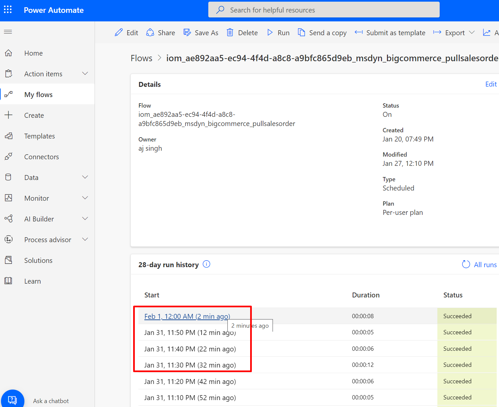
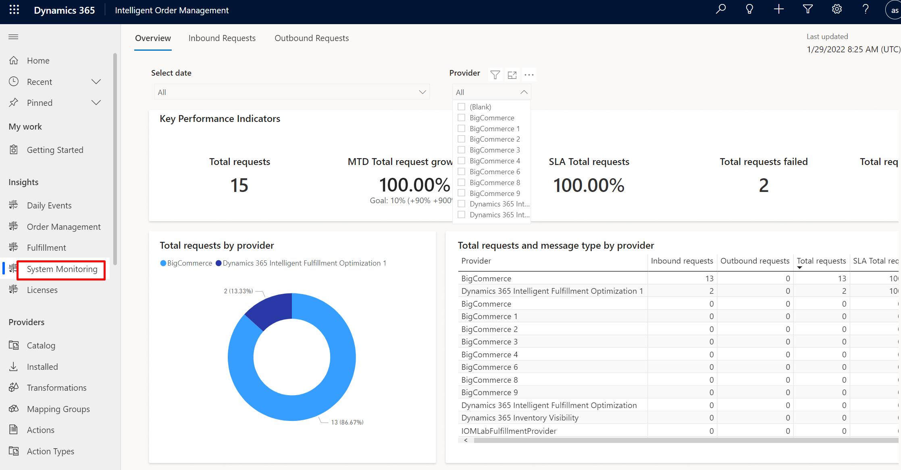
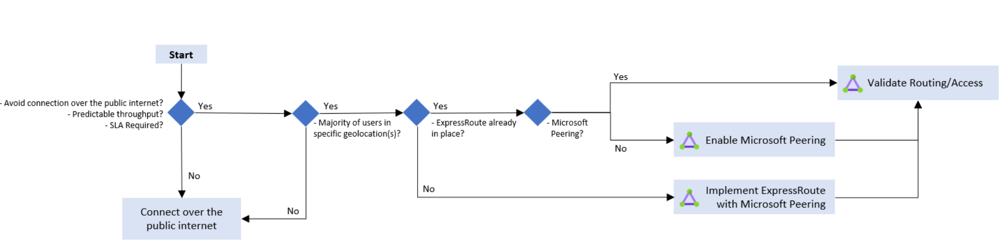
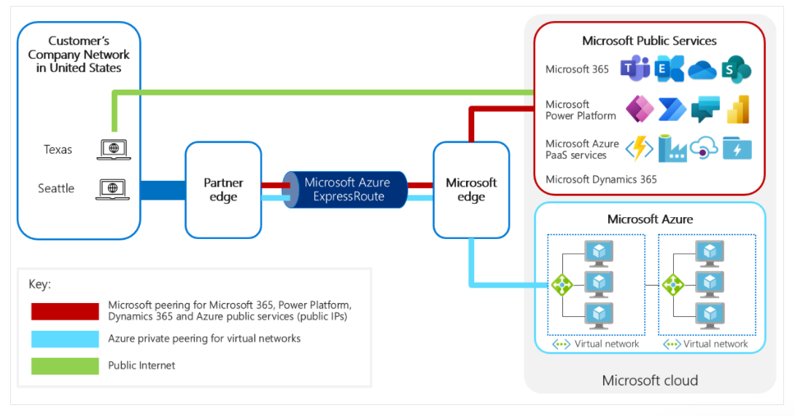
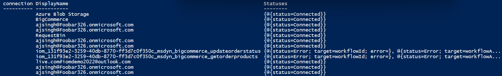
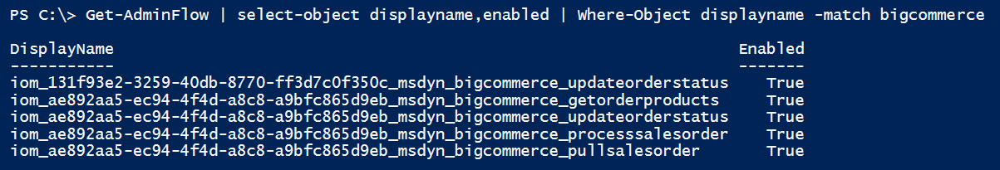

In this exercise, you'll complete the following tasks:

- Learn about operational aspects of Intelligent Order Management and Microsoft Power Platform.

- Learn about command line features of Microsoft Power Platform to perform administrative tasks that are related to Intelligent Order Management.

## Operational aspects
The following sections describe the operational aspects of Intelligent Order Management and Microsoft Power Platform.

### Scalability

Intelligent Order Management is built on Microsoft Power Platform, Dataverse, and Power Automate. It doesn't have turnkey features where you can adjust the scale of deployment. Instead, the scale is predicated by scaling features of foundational pieces (Dataverse, Microsoft Power Platform, and Power Automate) and the type of [license](https://go.microsoft.com/fwlink/p/?linkid=2085130&azure-portal=true).

### Monitoring

You can monitor Power Automate flows that underpin providers by using the following methods:

- [Power Automate](https://flow.microsoft.com/?azure-portal=true) stores the complete history of flows and associated run times. Power Automate, by default, stores history for a 28-day run history. Selecting a timestamp will display all actions and triggers that make up a flow. You can also use the details to investigate and troubleshoot issues, such as long-running flows.

  > [!div class="mx-imgBorder"]
  > 

- **Insights > System Monitoring** is a dashboard on the Intelligent Order Management portal that shows metrics that are related to requests.

  > [!div class="mx-imgBorder"]
  > 

- **PowerShell cmdlets for Microsoft Power Platform** - With [PowerShell cmdlets](/power-platform/admin/powerapps-powershell/?azure-portal=true) for app creators and administrators, you can automate many of the monitoring and management tasks. For more information, see the following **Automation** section.

### Administration
Administration is an operational aspect of Intelligent Order Management and Microsoft Power Platform that allows you to:
- Grant users with access to the Intelligent Order Management environment through the administrative capabilities of [Microsoft Power Platform](/power-platform/admin/grant-users-access/?azure-portal=true).

- Manage security by using concepts such as business units, teams, and users in [Dataverse](/power-platform/admin/wp-security-cds/?azure-portal=true).

- Select between two types of backup options:

  - [System backups](/power-platform/admin/backup-restore-environments?azure-portal=true#system-backups) - These backups are performed continuously, and production environments where Dynamics 365 apps are deployed, are retained for 28 days. Trial environments aren't backed up. Restore is performed from Microsoft Power Platform admin portal, and backups must be restored in the same region where the backup was taken.

  - [Manual backups](/power-platform/admin/backup-restore-environments?azure-portal=true#manual-backups) - Microsoft creates a backup when an environment is updated. Manual backups for production environments that have been created with a database and have one or more Dynamics 365 applications installed are retained for up to 28 days.

### Networking

Two connectivity models are supported by Dynamics 365 and Microsoft Power Platform: one over public endpoint and the other over private network through Microsoft Azure ExpressRoute. The following flowchart helps guide customers through the decision process of choosing between the two connectivity models. For a full list of considerations and recommendations for connectivity models, see [Power Platform Landing Zones](https://aka.ms/northstarpowerplatform/?azure-portal=true).

> [!div class="mx-imgBorder"]
> 

#### Connect to Dynamics Intelligent Order Management over public endpoint

You can access a default deployment of Intelligent Order Management by using public endpoint. Connectivity is over HTTPS, and data is encrypted by using a certificate that’s generated and managed by Microsoft.

Administrators can change the name of the URL through [Microsoft Power Platform admin portal](https://admin.powerplatform.microsoft.com/environments/?azure-portal=true). In the admin portal, you can use the admin center to review the status of your apps and solutions, apply updates, and manage your Dynamics 365 instances, solutions, and apps.

   > [!div class="mx-imgBorder"]
   > 

    > [!Note]
    > In this connectivity model, the sources that Intelligent Order Management interacts with through providers can be behind a firewall (in other words, on a corporate network). However, you’ll need to set up proxies and routing rules on the source system side to facilitate communication between resources/source systems that are deployed on the corporate network and Intelligent Order Management, which is accessible over a public endpoint.

#### Connectivity over private network by using ExpressRoute

ExpressRoute enables connectivity to Dynamics 365 and Microsoft Power Platform over private network. Customers opt for this connectivity model for compliance, more security, and predictable network bandwidth.

   > [!div class="mx-imgBorder"]
   > 

### Business continuity and disaster recovery

Microsoft provides business continuity and disaster recovery for production instances of the Dynamics 365 software as a service (SaaS) application to provide continuity if an Azure region-wide outage occurs. Apps such as Intelligent Order Management run on the Microsoft Dataverse platform. For detailed design considerations and recommendations, see [Design Considerations](https://github.com/microsoft/industry/tree/main/foundations/powerPlatform?azure-portal=true#design-considerations-5).

For production environments, a replica of the different storage services (Azure SQL and file storage) is established in the secondary region for each environment at the time of deployment. Tenant admins can deploy a production instance of a customer engagement app or Dataverse with the purchase of appropriate licenses. These replicas are referred to as geo-secondary replicas. The geo-secondary replicas are kept synchronized with the primary instance through continuous data replication. A small replication latency (or lag) will occur, which typically lasts less than a few minutes, between the primary data sources and their corresponding geo-secondary replicas.

> [!div class="mx-imgBorder"]
> 

#### Unplanned failover

In an unplanned failover scenario, such as a primary region becoming unavailable due to a natural disaster, Microsoft will switch over the traffic to route to secondary instances. In this case, Recovery Point Objective (RPO) is approximately up to 15 minutes.

#### Planned failover

If Microsoft determines that a risk to the availability of the primary Azure region is present, for example in a scenario with an impending hurricane, Microsoft will notify customers and switch over the traffic to route to the secondary region. Users who are connected to customer engagement and Dataverse apps at the time of the failover will experience a brief disruption. No data loss will occur because both Azure regions will be online and data will be replicated fast enough to the secondary region.

## Task 1: Command line features

With PowerShell cmdlets for app creators and administrators, you can automate many of the monitoring and management tasks that are currently only possible manually in Power Apps. You can still use the cmdlets if you're not an admin on the tenant, but you'll be limited to the resources that you own. Cmdlets that start with the word *Admin* are for use by an administrative user account.

PowerShell cmdlets are available as two separate modules:

- **Administrator** - Targeted at administrators for administration and management operations

- **Maker** - Targeted at app creators

1. Install PowerShell modules.

    > [!Note]
    > You need admin rights to install these modules on your machine.

    `Install-Module -Name Microsoft.PowerApps.Administration.PowerShell`

    `Install-Module -Name Microsoft.PowerApps.PowerShell -AllowClobber`

1. Add credentials. In this case, you’ll use an admin account.

    > [!Note]
    > You can also create and use [a service principal in Microsoft Power Platform](/power-platform/admin/powershell-create-service-principal/?azure-portal=true).

    `Add-PowerAppsAccount`

1. After you've signed in, you can run PowerShell commands to add, edit, and view details. For example, you can view environment details.

   `Get-AdminPowerAppEnvironment | Select-Object displayname, location, environmenttype`

    > [!div class="mx-imgBorder"]
    > 

1. Read connections.

   `Get-AdminPowerAppConnection | select-object connection,displayname,statuses`

    > [!div class="mx-imgBorder"]
    > 

   Read flows were created when you enabled the BigCommerce provider.

   `Get-AdminFlow | select-object displayname,enabled | Where-Object displayname -match bigcommerce`

    > [!div class="mx-imgBorder"]
    > 

Congratulations, you’ve learned about administrative aspects of Intelligent Order Management and how to use CLI, which you can use for building automation.
