In this exercise, you'll complete the following tasks:

- Set up mandatory Power Automate connections for Intelligent Order management.

- Enable Bing Maps integration.

- Enable the **Timeline** feature.

## Task 1: Set up system connections
To set up system connections, follow these steps:

1.	Open an InPrivate or Incognito window in your browser and then go to [Microsoft Power Apps](https://make.powerapps.com/?azure-portal=true).

1. Ensure that you choose the correct environment from the **Environment** dropdown menu.

    > [!div class="mx-imgBorder"]
    > 

1. Select **Apps** on the left navigation bar.

    > [!div class="mx-imgBorder"]
    > 

1. Select **Intelligent Order Management**.

    > [!div class="mx-imgBorder"]
    > 

1. Select the **Get Started** button on the welcome screen in Intelligent Order Management.

    > [!div class="mx-imgBorder"]
    > [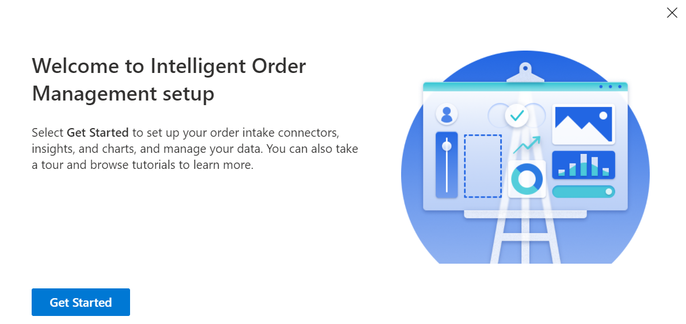](../media/get-started.png#lightbox)

1. On the Intelligent Order Management screen, select **Getting Started** in the left navigation pane and then select the **Manage** button next to the **Configure settings** option to set up connections that are required by Intelligent Order Management.

    > [!div class="mx-imgBorder"]
    > 

   A list of **System Connection References** should display. These references are used by Intelligent Order Management to communicate with Microsoft Dataverse, Power Automate, and IOM Data Transformer. The general setup process for each system connection is the same. Administrator privileges are required to set up these system connections.

1. Select the **IOM Data Transformer** record.

    > [!div class="mx-imgBorder"]
    > 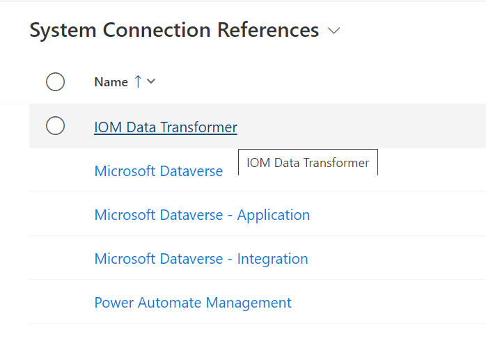

1. Select **Retrieve Link**.

    > [!div class="mx-imgBorder"]
    > 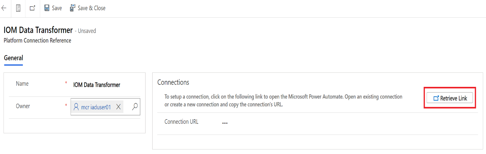](../media/transformer.png#lightbox)

1. A **Power Automate** portal will open. If you're opening Power Automate for the first time, then a welcome screen will display.

    > [!Important]
    > Select **United States** as your country/region and then select the **Get started** button for this lab.

    > [!div class="mx-imgBorder"]
    > 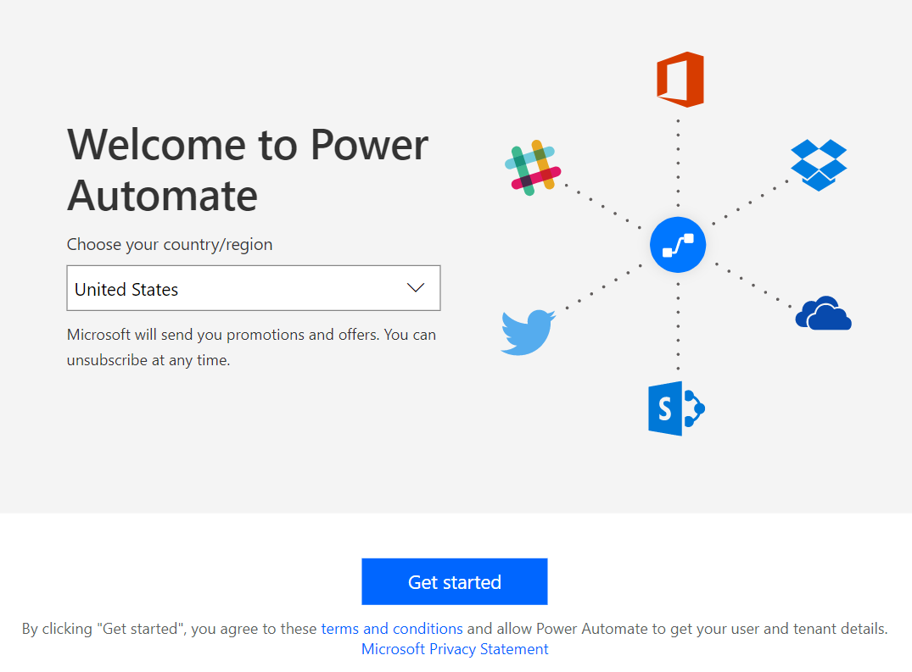

1. Ensure that the correct environment is selected from the **Environment** dropdown menu.

    > [!div class="mx-imgBorder"]
    > 

1. On the left pane, select **Data > Connections**.

    > [!div class="mx-imgBorder"]
    > 

1. Select **+ New connection**.

    > [!div class="mx-imgBorder"]
    > 

1. Search for **IOM Data Transformer** in the search bar in the upper-right corner of the screen, and then select **IOM Data Transformer** to add the connection.

    > [!Note]
    > If you don’t find the connection, close this browser tab and then repeat the steps from Step 9.

    > [!div class="mx-imgBorder"]
    > 

1. Select the plus (**+**) button to add the connection.

1. Select the **Create** button on the **IOM Data Transformer** dialog.

    > [!div class="mx-imgBorder"]
    > 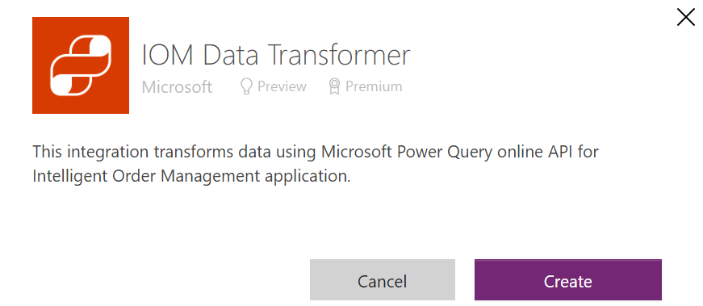

1. This connector will prompt for credentials. These account and connection details will be used by the IOM Data Transformer connector in the Intelligent Order Management Power Automate flows to transform data by using a Microsoft Power Query online API for Intelligent Order Management application. For this task, you can use your **In A Day** user account (credentials that you're using to sign in to [Power Apps](https://make.powerapps.com/?azure-portal=true)) to establish the connection. However, in a customer's environment, make sure that you use a dedicated service account instead of a user's account.

1. After you’ve established the connection, select the ellipsis (**...**) menu on the connection and then select **Details**.

    > [!div class="mx-imgBorder"]
    > [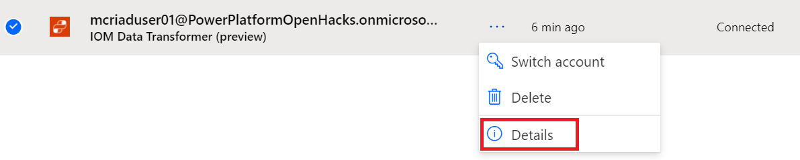](../media/details.png#lightbox)

1. On the **Details** page, copy the **URL** from browser's address bar.

    > [!div class="mx-imgBorder"]
    > [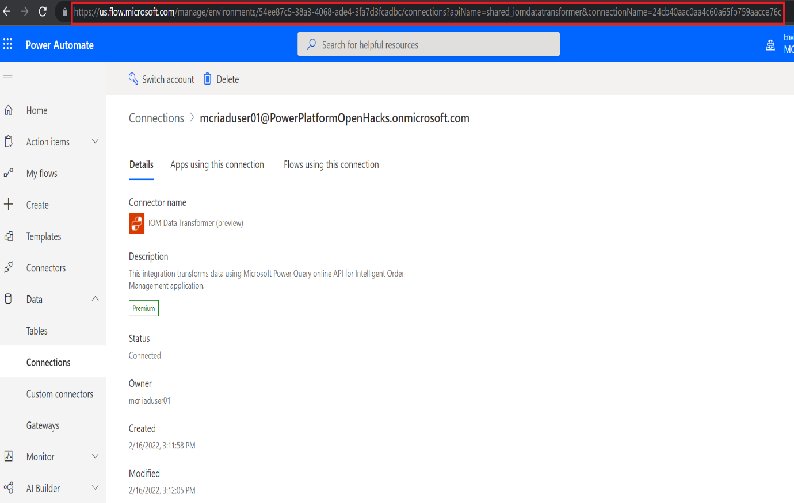](../media/url.png#lightbox)

1. Go to the Dynamics 365 Intelligent Order Management application page in your browser, paste the URL into the **Connection URL** field for the **IOM Data Transformer** record, and then select **Save & Close** on the command bar.

    > [!div class="mx-imgBorder"]
    > [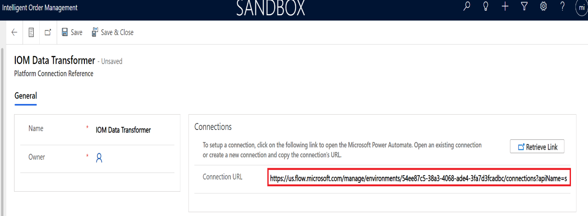](../media/connection-url.png#lightbox)

1. Return to the **Power Automate** page on your browser, and on the left pane, select **Data > Connections**.

    > [!div class="mx-imgBorder"]
    > 

1. Select **+ New connection**.

    > [!div class="mx-imgBorder"]
    > 

1. Search for **Microsoft Dataverse** in the search bar that’s located in the upper-right corner of the screen, and then select the plus (**+**) button to add the connection.

    > [!div class="mx-imgBorder"]
    > [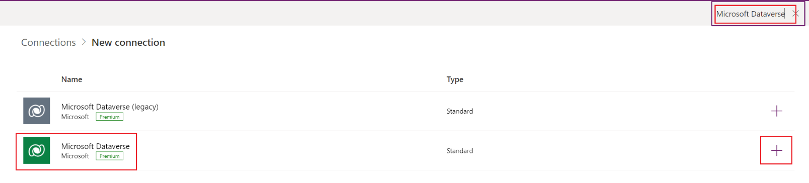](../media/dataverse.png#lightbox)

1. Select the **Create** button on the **Microsoft Dataverse** dialog.

    > [!div class="mx-imgBorder"]
    > 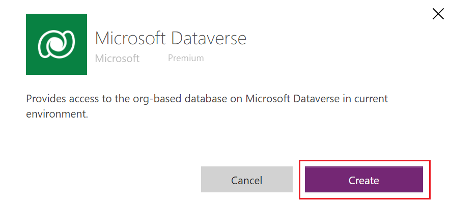

1. This connector will prompt for credentials. The Microsoft Dataverse connector uses these account and connection details in the Intelligent Order Management Power Automate flows to perform CRUD operations on this environment's database. For this task, you can use your user account (credentials that you use to sign in to [Power Apps](https://make.powerapps.com/?azure-portal=true)) to establish the connection. However, in a customer's environment, use a dedicated service account instead of a user's account.

1. After you’ve established the connection, select the ellipsis (**...**) menu on the connection and then select **Details**.

    > [!div class="mx-imgBorder"]
    > 

1. On the **Details** page, copy the **URL** from the browser's address bar. Save this URL in your OneNote or Notepad because you'll need to paste the URL in the next step and in the next exercise.

    > [!div class="mx-imgBorder"]
    > 

1. Go to the Dynamics 365 Intelligent Order Management application page in your browser. Paste the same URL into the **Connection URL** field on the **Microsoft Dataverse**, **Microsoft Dataverse - Application** and **Microsoft Dataverse - Integration** system connection reference records.

    When you're done, the **System Connection References** list will show the records as **Active**, except for the **Power Automate Management** record, which will show as **Inactive**.

    > [!div class="mx-imgBorder"]
    > 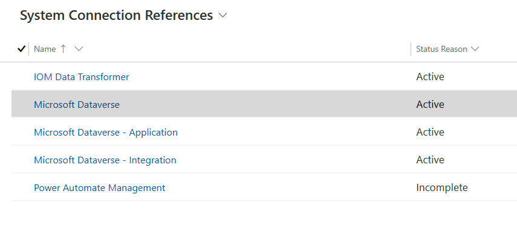

1. Go to the Power Automate page in your browser and repeat the previous steps to add the **Power Automate Management** connection in Power Automate. Leave the **Authentication Type** as **First Party** and then select **Create**.

    > [!div class="mx-imgBorder"]
    > [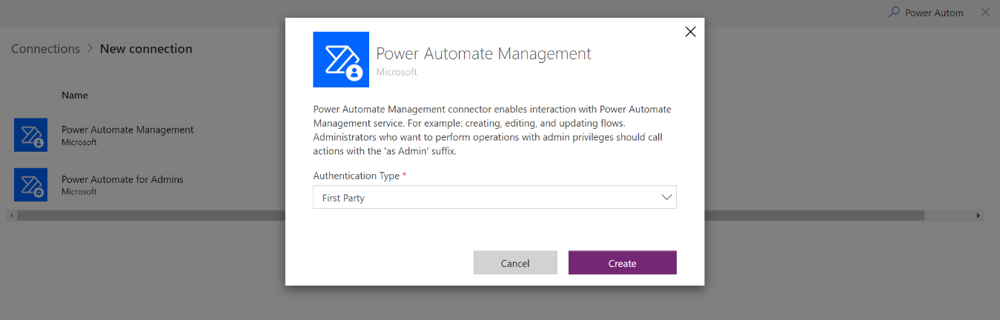](../media/power-automate-management.png#lightbox)

1. A new window prompt will ask for credentials. These account/connection details will be used by the Power Automate Management connector. For this task, you can use your **In A Day** user account (credentials that you're using to sign in to [Power Apps](https://make.powerapps.com/?azure-portal=true)) to establish the connection. However, in a customer's environment, make sure that you use a dedicated service account instead of a user's account.

1. Paste the connection URL in the **Power Automate Management** record in Dynamics 365 Intelligent Order Management.

1. Go to Dynamics 365 Intelligent Order Management page and, when the **Status Reason** for all listed **System Connection References** are in an **Active** state, select **Activate System** on the command bar.

    > [!div class="mx-imgBorder"]
    > 

1. It takes about five minutes to activate all system connections. The following message should appear on the screen while connections are being activated.

    > [!div class="mx-imgBorder"]
    > 

> [!Note]
> An error might occur if Intelligent Order Management is unable to activate a system connection within a timeout window. If so, make sure that you close the error message and retry by selecting the **Activate** button. The root cause is that activating one or more system connections might take longer than usual, thereby causing the application to raise a timeout error. If an error message doesn’t display in your retries, then the connections have been successfully activated.

Congratulations, you’ve finished setting up Power Automate connections.

## Task 2: Enable Bing Maps for Intelligent Order Management

Dynamics 365 Intelligent Order Management can display information about fulfillment order source and destination locations by using Bing Maps. In this task, you'll enable Bing Maps for Intelligent Order Management.

1. While in Dynamics 365 Intelligent Order Management, select **Settings** (gear icon) in the upper-right corner and then go to **Advanced Settings**.

    > [!div class="mx-imgBorder"]
    > [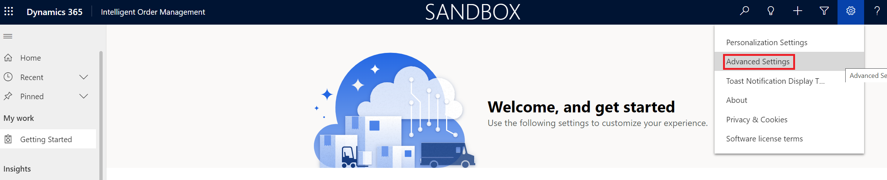](../media/advanced-settings.png#lightbox)

1. A new window should open and direct you to Dynamics 365. The page might take a while to load. If it's been longer than a minute, stop and reload the page. Then, the page should load faster, when you’ll be directed to the Business Management section of Dynamics 365.

    > [!div class="mx-imgBorder"]
    > [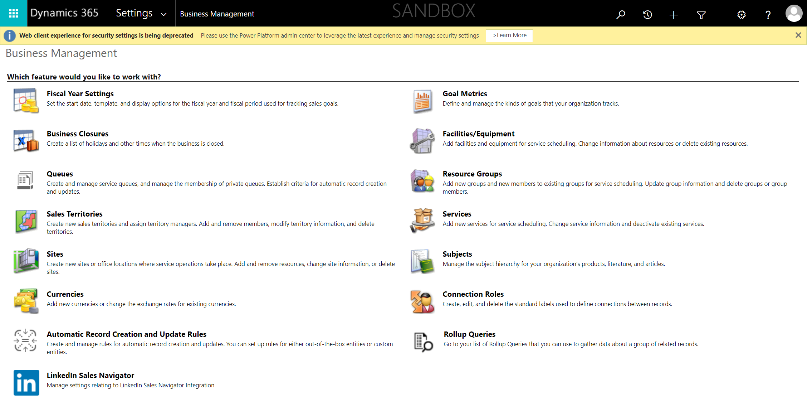](../media/dynamics-365.png#lightbox)

1. On the top command bar, next to Dynamics 365, select the **Settings** dropdown menu, and then select **Administration** in the third column under **System**.

    > [!div class="mx-imgBorder"]
    > 

1. Select **System Settings**.

    > [!div class="mx-imgBorder"]
    > 

1. On the **General** tab, select **Yes** for **Show Bing Maps on forms**, and then select **OK**.

    > [!div class="mx-imgBorder"]
    > [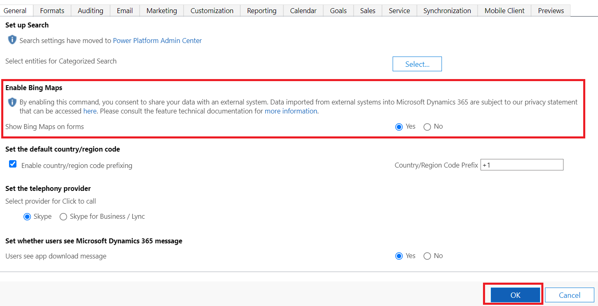](../media/enable-bing.png#lightbox)

Congratulations, you’ve enabled Bing Maps integration, which will show the information about fulfillment order source and destination locations by using Bing Maps.

## Task 3: Enable the Timeline feature

The **Timeline** feature aims to improve user experience and give users a timeline of business events that are associated with a sales order.

1. On the top command bar, next to Dynamics 365, select the **Settings** dropdown menu, and then select **Activity Feeds Configuration** in the fourth column.

    > [!div class="mx-imgBorder"]
    > 

1. Under **Entity Name**, select **salesorder** and then select the **Activate** button. You can find the **salesorder** entity name by typing the name in the search box in the upper-right corner or by selecting the **O** in the lower part of the screen and then selecting the **salesorder** entity.

    > [!div class="mx-imgBorder"]
    > 

1. Select **Activate** on the dialog.

    > [!div class="mx-imgBorder"]
    > 

1. After they’ve been enabled, sales orders will start displaying a timeline of business events. To view a timeline, select a sales order and **Timeline** will be populated.

1. Open the **Intelligent Order Management** application and select **Sales Orders** in the left navigation pane.

    > [!div class="mx-imgBorder"]
    > [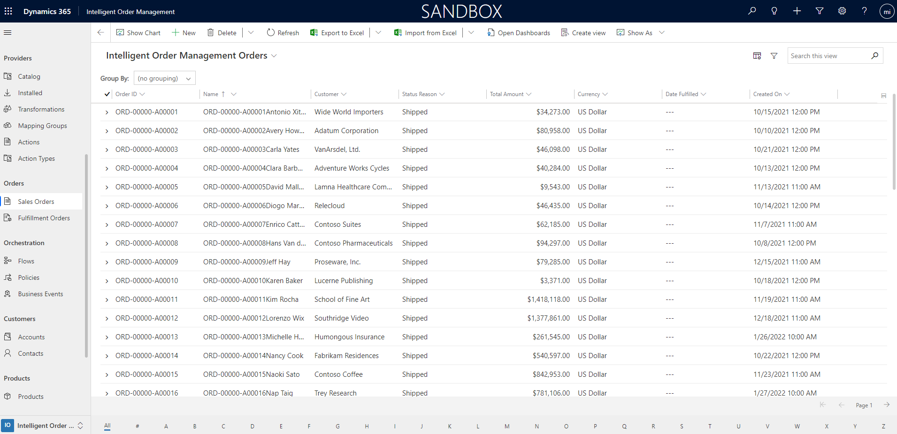](../media/sales-orders.png#lightbox)

1. Select any available sales order to view its details.

    > [!div class="mx-imgBorder"]
    > [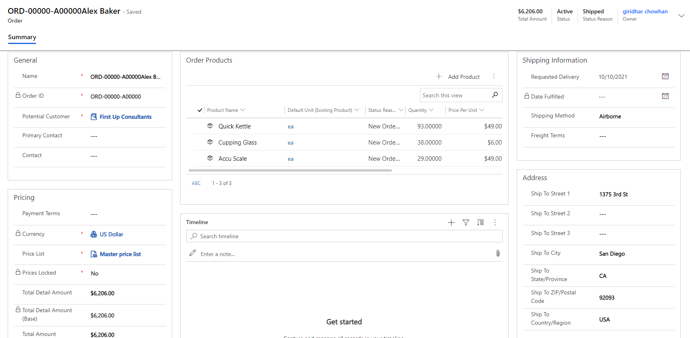](../media/timeline.png#lightbox)

> [!Note]
> Enabling the **Timeline** feature doesn’t retrospectively populate the timeline of events for existing orders. However, after the **Timeline** feature has been enabled, if an order changes states and/or goes through different states (events), those are reflected under **Timeline**.

Congratulations, you’ve finished setting up the **Timeline** feature.
