In this exercise, you'll complete the following tasks:

- Learn about Intelligent Order Management providers and their roles.

- Set up a provider for BigCommerce that enables communication between Intelligent Order Management and the 3PL e-commerce platform BigCommerce.

- Set up internal-external mappings in Intelligent Order Management.

- Set up an internal provider for **Dynamics 365 Intelligent Fulfillment Optimization**. This provider enables the use of intelligent fulfillment optimization capabilities in Intelligent Order Management.

- Set up an internal provider for **Dynamics 365 Inventory Visibility**. This provider enables use of inventory feasibility capabilities in Dynamics 365 Intelligent Order Management.

## Overview of providers

A key value proposition of Dynamics 365 Intelligent Order Management is the ability to seamlessly integrate with other systems. To do so, Intelligent Order Management uses *providers*. [Providers](/dynamics365/retail-intelligent-order-management/work-providers?azure-portal=true#components) are constructs that allow you to connect Intelligent Order Management to external systems.

Intelligent Order Management providers were designed with the following properties:

- **Extensibility** - You can extend and customize providers by using Microsoft Power Platform.

- **Low code customization** - Because providers are built on Microsoft Power Platform, customizations require little to no code.

- **Scale** - Providers use Power Automate so that they can scale with the volume of incoming messages.

Key components of a provider are:

- Connection

- Business event

- Action

- Parameter

- Transformation

## Task 1: Set up the BigCommerce provider
To set up the BigCommerce provider, follow these steps:

1. Open your browser in an InPrivate or Incognito window and then go to [Power Apps](https://make.powerapps.com/?azure-portal=true).

1. Ensure that you choose the correct environment from the **Environment** dropdown menu.

    > [!div class="mx-imgBorder"]
    > 

1. Select **Apps** on the left navigation bar.

    > [!div class="mx-imgBorder"]
    > 

1. Select **Intelligent Order Management**.

    > [!div class="mx-imgBorder"]
    > [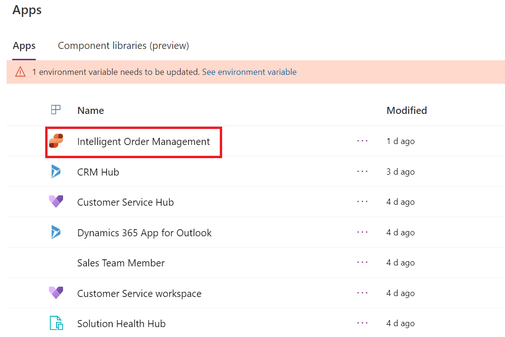](../media/intelligent-order-management.png#lightbox)

1. On the left pane, select **Providers > Catalog**. The form will display a list of prebuilt providers. Intelligent Order Management also supports custom providers. For this lab, you’ll use BigCommerce as your source system, so select the **Add provider** button on the **BigCommerce** tile.

    > [!div class="mx-imgBorder"]
    > [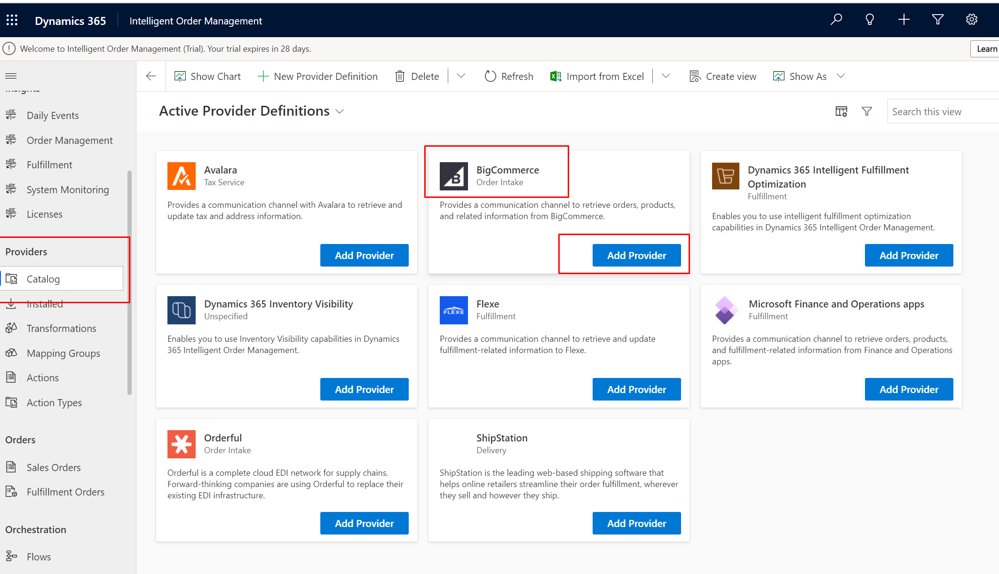](../media/big-commerce.png#lightbox)

1. To accept the terms and conditions, select the **Create** button. The process will take a few seconds.

    > [!div class="mx-imgBorder"]
    > 

1. The system will automatically open the Big Commerce provider screen. Select **BigCommerce Connection** to enable communication between Dynamics 365 Intelligent Order Management and the associated BigCommerce account.

    > [!div class="mx-imgBorder"]
    > [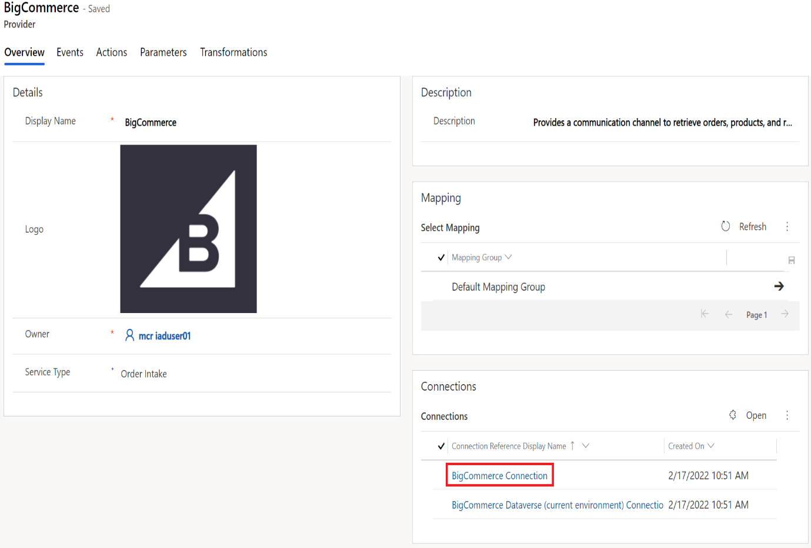](../media/big-commerce-connection.png#lightbox)

1. Select the **Retrieve Link** button.

    > [!div class="mx-imgBorder"]
    > 

1. Selecting **Retrieve Link** will take you to **Power Automate**. Ensure that you select the correct environment from the **Environment** dropdown menu in the upper right.

    > [!div class="mx-imgBorder"]
    > 

1. On the left pane, select **Data > Connections**.

    > [!div class="mx-imgBorder"]
    > 

1. Select **+ New connection**.

    > [!div class="mx-imgBorder"]
    > 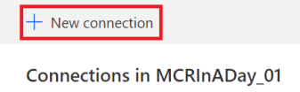

1. Search for **BigCommerce** in the search bar located in the upper-right corner of the page, and then select **BigCommerce** to add the connection.

    > [!div class="mx-imgBorder"]
    > [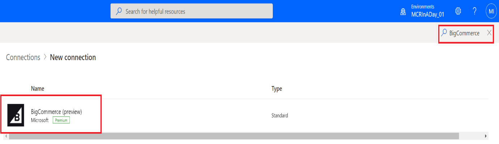](../media/big-commerce-search.png#lightbox)

1. You'll be prompted for the **API Key**. Copy and paste the **Access Token** that generated during Exercise 1 – Set up and deploy a BigCommerce e-commerce site - Task 2 - Step 4 that you had copied from the screen, as shown in the following image.

    > [!div class="mx-imgBorder"]
    > 

1. Paste the API key and then select **Create**.

    > [!div class="mx-imgBorder"]
    > [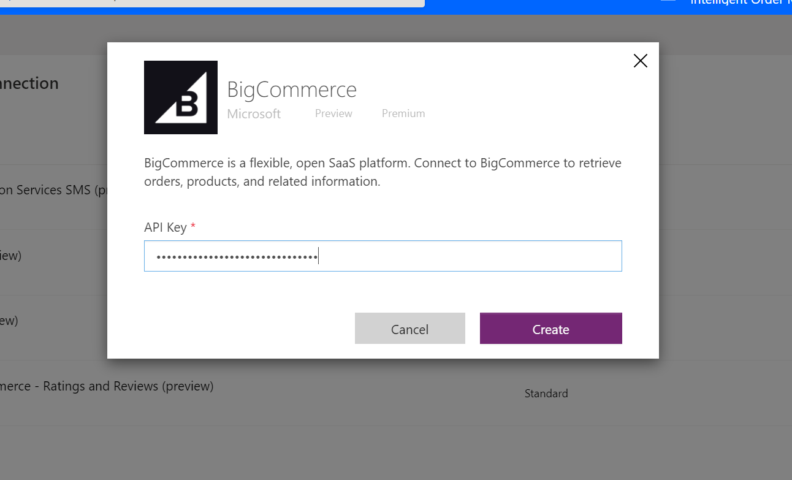](../media/key.png#lightbox)

   After you’ve created a connection based on the API key, the connection **Status** should show as **Connected**.

    > [!div class="mx-imgBorder"]
    > [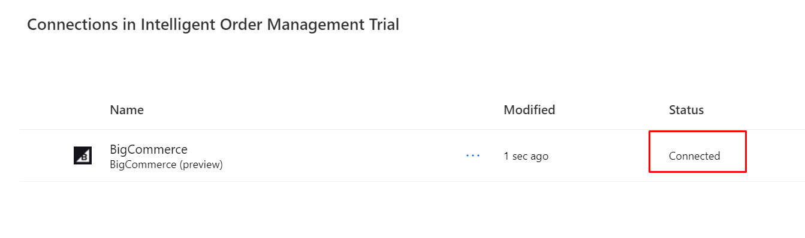](../media/connected.png#lightbox)

1. Select **BigCommerce Connection** to view its details. Copy the **URL** that’s shown in the address bar of your browser.

    > [!div class="mx-imgBorder"]
    > [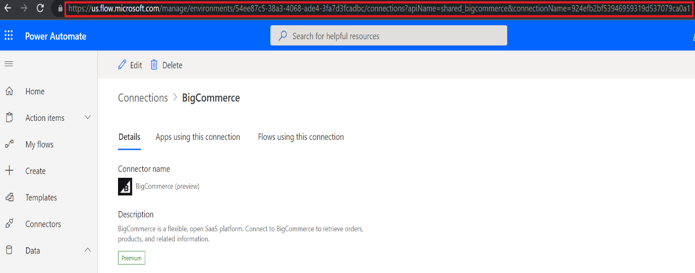](../media/big-commerce-url.png#lightbox)

1. Go to Dynamics 365 Intelligent Order Management and paste the URL in the **Connection URL** field in the BigCommerce **Provider Connection Reference** screen. Select **Save** and then select **Activate**. Intelligent Order Management will take about 15-20 seconds to activate a provider for BigCommerce.

    > [!div class="mx-imgBorder"]
    > [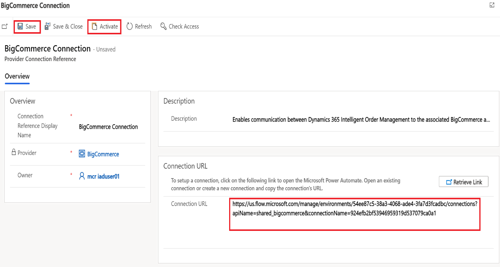](../media/big-commerce-connection-url.png#lightbox)

1. Select **Save & Close**.

1. Select **BigCommerce Dataverse (current environment)**.

    > [!div class="mx-imgBorder"]
    > 

1. Paste the Dataverse connection URL that you used in Exercise 2 - Task 1 - Step 1. Select **Save > Activate**.

    > [!div class="mx-imgBorder"]
    > [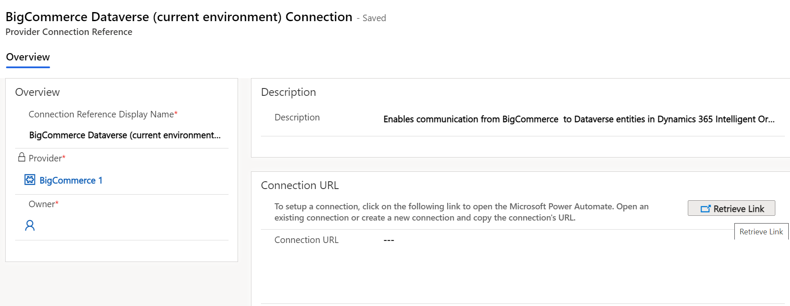](../media/big-commerce-dataverse-connection.png#lightbox)

   At this stage, you should have connections for BigCommerce and Dataverse set up and activated.

1. Select **Save & Close**.

1. Switch to the Dynamics 365 Intelligent Order Management screen, and on the **BigCommerce** provider screen, select the **Parameters** tab.

1. To find your store hash value from the BigCommerce site, sign in to your BigCommerce store (that you created in Exercise 1 - Task 1). Go to **Advanced Settings > API Accounts > Create API Account (V2/V3 Token)**. On this screen, you’ll find a field named **API Path**, with the following structure `https://api.bigcommerce.com/stores/<storehash>/v3`. You can also find the path from the store URL, as shown in the following image.

    > [!div class="mx-imgBorder"]
    > [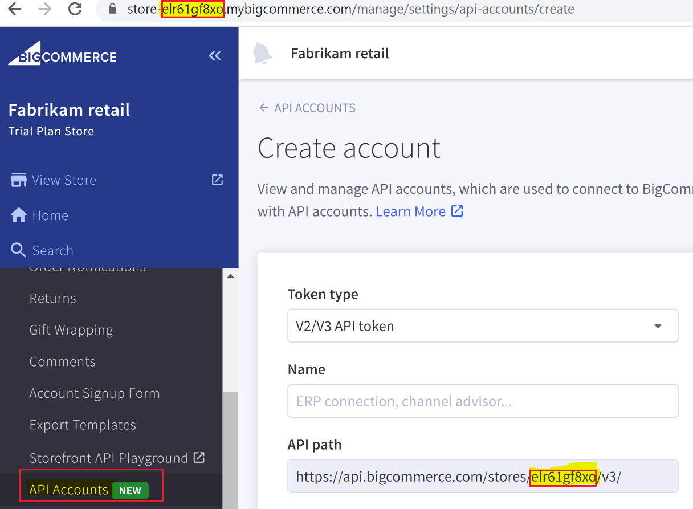](../media/hash.png#lightbox)

1. Paste the store hash value into the **Value** field for **BigCommerce Store Hash** and then select **Save > Activate**.

    > [!div class="mx-imgBorder"]
    > [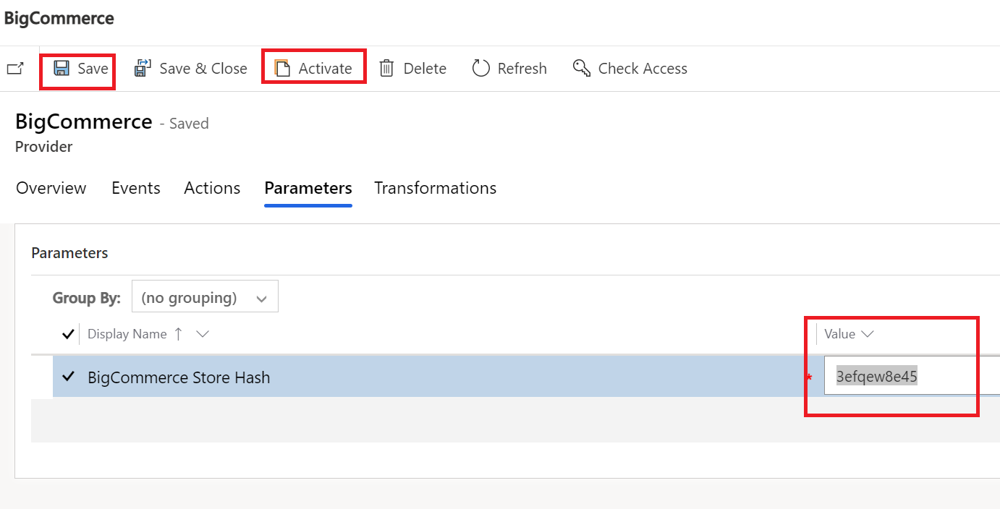](../media/store-hash.png#lightbox)

   If all connections are provided correctly, then a message should display, stating that the record's status is **Active**.

    > [!div class="mx-imgBorder"]
    > [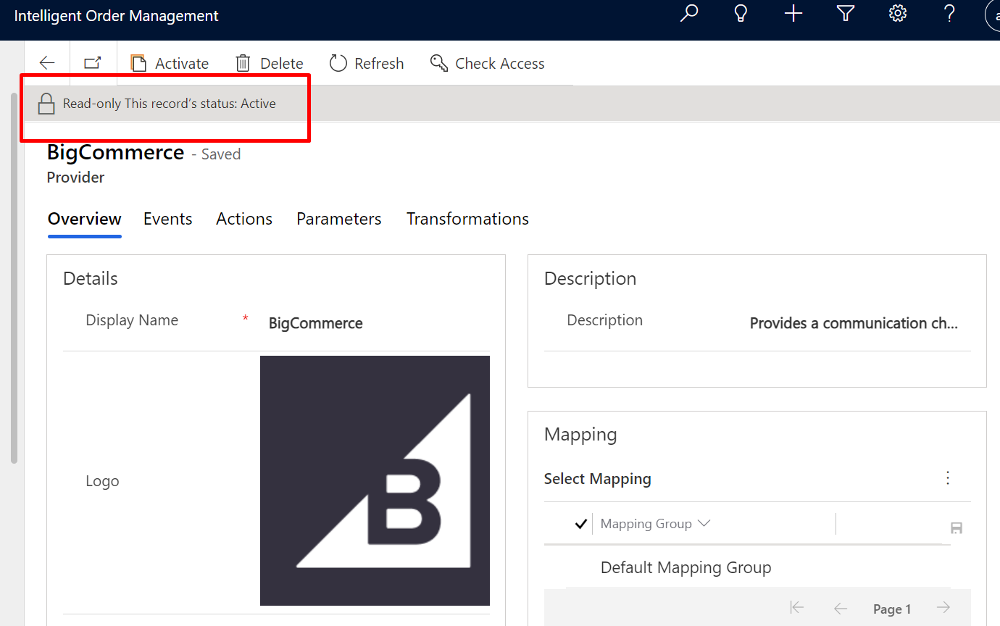](../media/active.png#lightbox)

    > [!Note]
    > An error message might display, as shown in the following screenshot, if the system connections have not been set up, as mentioned in the previous exercises and tasks.
    >
    > [!div class="mx-imgBorder"]
    > [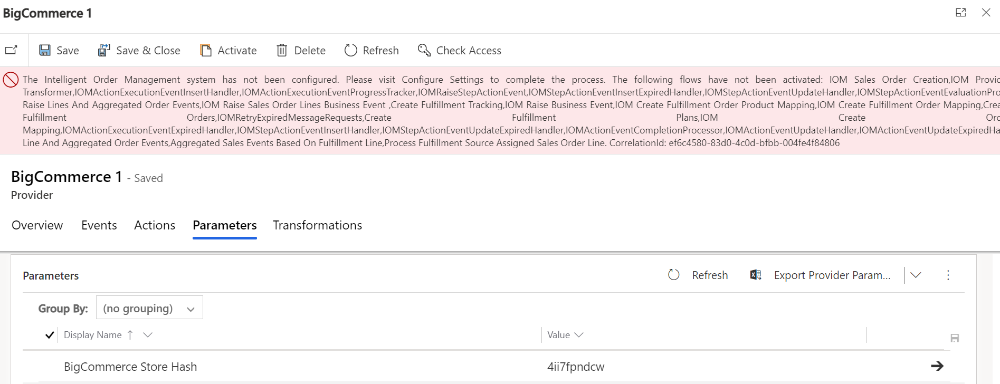](../media/error.png#lightbox)

## Task 2: Set up internal-external mappings for BigCommerce provider transformations

After you’ve set up the BigCommerce provider, your next step is to set up mappings in Intelligent Order Management. Mappings enable translation of fields between external platforms, such as BigCommerce, and Intelligent Order Management. With the internal-external ID mappings functionality, you can perform the following tasks:

- Define the relationship between identities in an enterprise across applications and operating systems.

- Use the mapping for multiple integrations.

- Enable an end-to-end visualization of mapping across multiple systems.

- Set up and add your own mapping and mapping tables.

In context of the BigCommerce provider, you’ll need to set up the following internal-external mappings before orders that are generated in BigCommerce are visible in Intelligent Order Management:

- Accounts

- Products

- Price Lists

- Units

1. You’ll need a customer account to map it to BigCommerce providers. To create a customer test account, go to **Customers > Accounts**.

    > [!div class="mx-imgBorder"]
    > 

1. Select **+ New** on the command bar.

    > [!div class="mx-imgBorder"]
    > 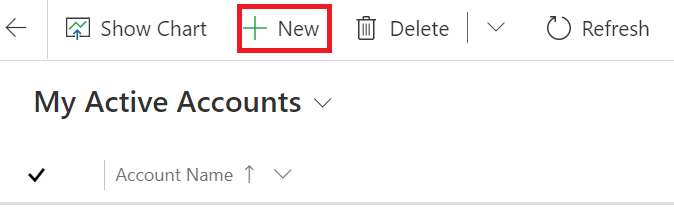

1. Enter information in the following fields and then select **Save & Close** in the command bar:

    - **Account Name** - TestBCAccount

    - **Account Number** - TestBCAccount

    > [!div class="mx-imgBorder"]
    > 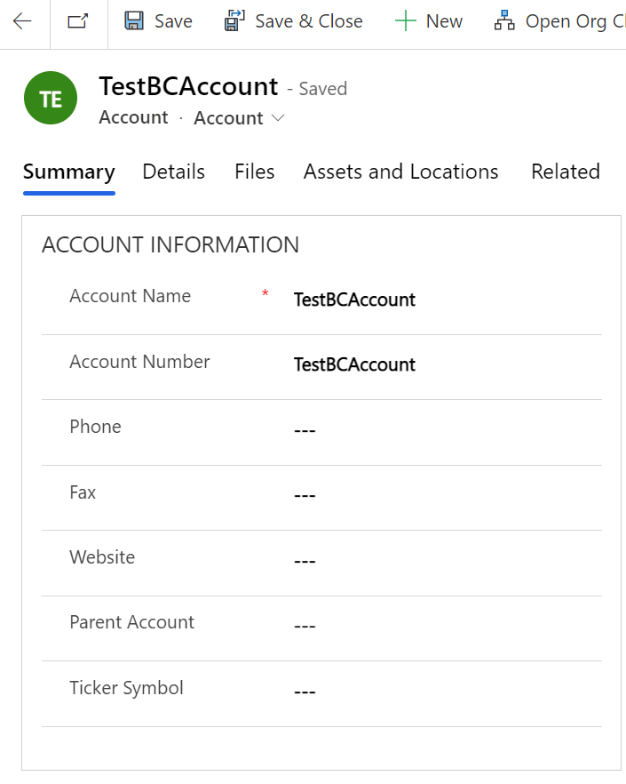

1. To access the **Mappings** configuration, on the left pane of Dynamics 365 Intelligent Order Management, change the area in the lower-left corner of the screen from **Intelligent Order Management** to **Configurations**.

    > [!div class="mx-imgBorder"]
    > [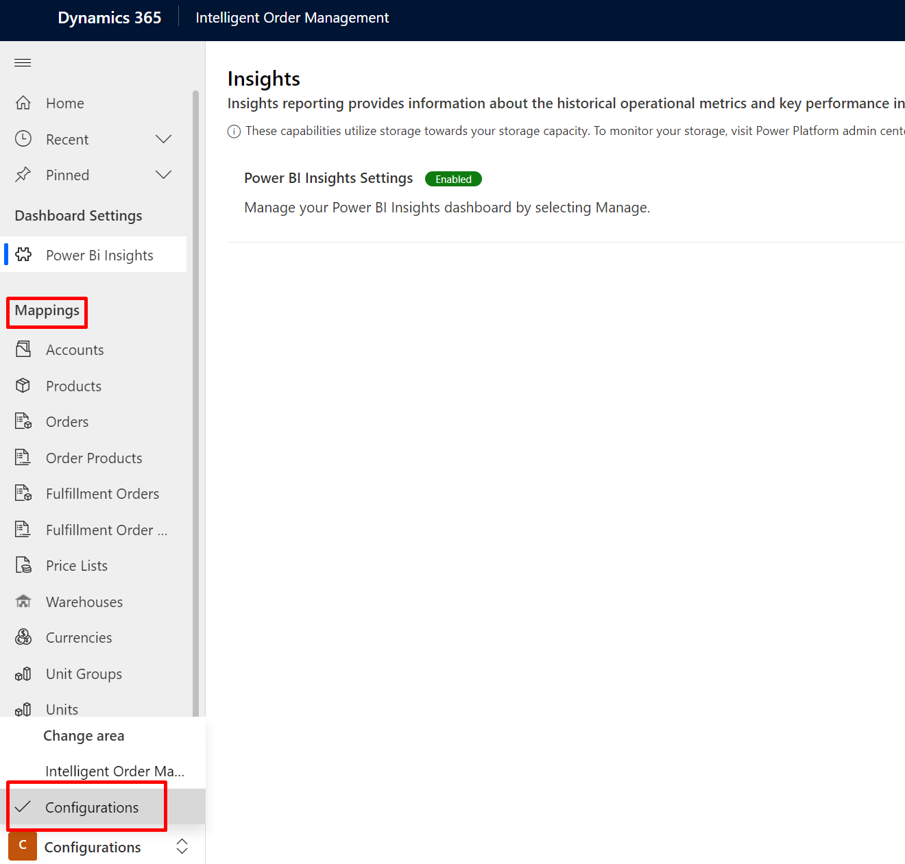](../media/mappings.png#lightbox)

1. To set up internal-external mapping for **Accounts**, select **+ New**.

    > [!div class="mx-imgBorder"]
    > [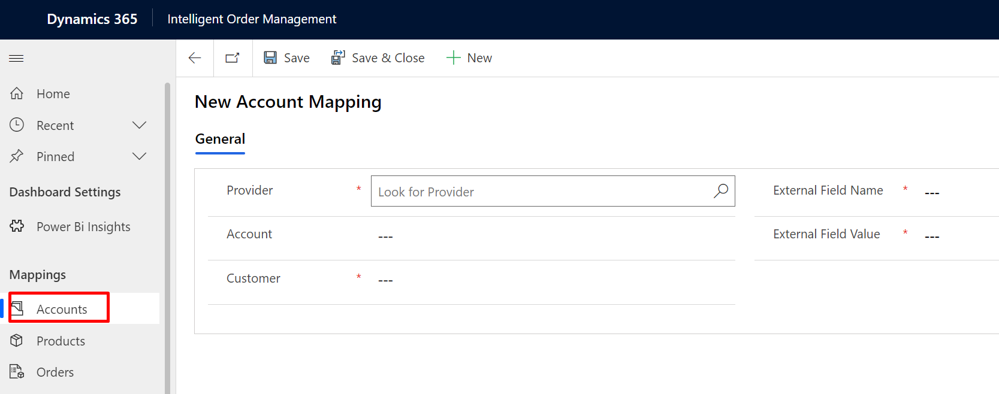](../media/account-mapping.png#lightbox)

1. Enter the following details and then select **Save & Close**.

    - **Provider** - BigCommerce

    - **Customer** - TestBCAccount

    - **External Field Name** - ProviderName

    - **External Field Value** - BigCommerce

    > [!div class="mx-imgBorder"]
    > 

1. Select **Save & Close**.

1. To set up the product mapping, on the left pane, select **Products**.

    > [!div class="mx-imgBorder"]
    > 

1. Select **+ New** and then enter the following fields:

    - **Provider** - BigCommerce

    - **Product** - Accu Scale (you’ll map this item to ABS from the BigCommerce platform)

    - **External Field Name** - sku

    - **External Field Value** - ABS

    > [!div class="mx-imgBorder"]
    > [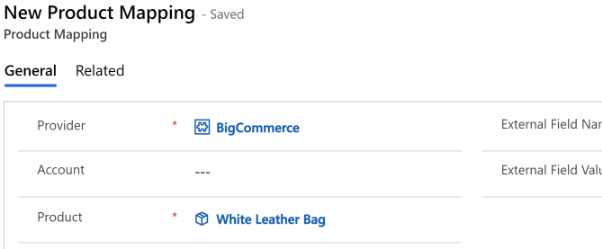](../media/product-mapping.png#lightbox)

    > [!Note]
    > Make sure that you complete the product mapping step for each individual product that you expect to come through on orders from BigCommerce or any other 3PL platform. If an order item doesn't have a corresponding item, then those orders will not flow through to Intelligent Order Management through a provider.

1. Select **Save & Close**.

1. To set up the price lists, select **Price Lists** on the left pane.

    > [!div class="mx-imgBorder"]
    > 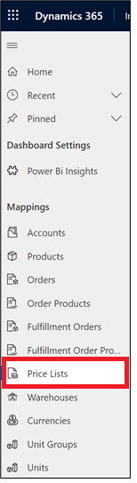

1. Select **+ New**, enter information in the following fields, and then select **Save & Close**.

    - **Provider** - BigCommerce

    - **Price List** - Master price list

    - **External Field Name** - ProviderName

    - **External Field Value** - BigCommerce

    > [!div class="mx-imgBorder"]
    > [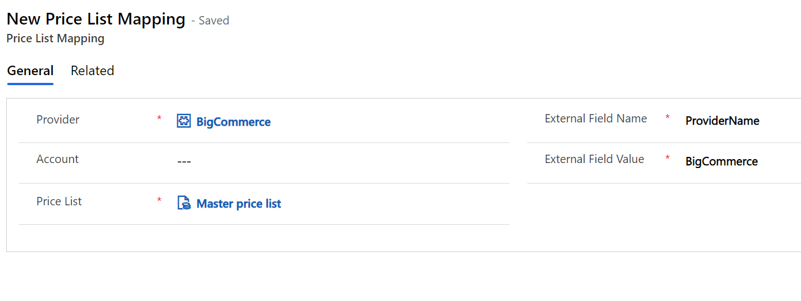](../media/price-list-mapping.png#lightbox)

1. To set up units, select **Units** in the left pane.

    > [!div class="mx-imgBorder"]
    > 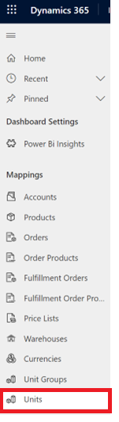

1. Select **+ New**, enter the following values, and then select **Save & Close**.

    - **Provider** - BigCommerce

    - **Unit** - ea

    - **External Field Name** - unit

    - **External Field Value** - each

    > [!div class="mx-imgBorder"]
    > [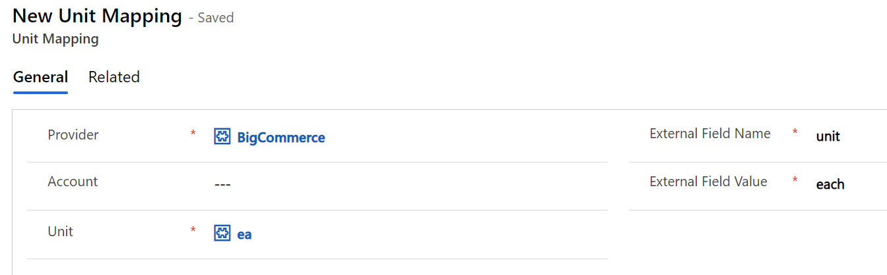](../media/unit-mapping.png#lightbox)

Congratulations, you’ve finished setting up the BigCommerce provider and internal-external mappings to enable a flow of orders from BigCommerce.
