In this exercise, you'll complete the following tasks:

- Learn about orchestration flows.

- Create a policy.

- Create an orchestration flow.

## Overview

Orchestration flows determine how data that’s been obtained from providers is being orchestrated. Intelligent Order Management supports the ability to define orchestration flows for different purposes, such as ordering intake to fulfillment and collecting and distributing inventory visibility information. Currently, Intelligent Order Management supports Order Orchestration, which enables users to define an end-to-end orchestration flow for orders, from order capture to fulfillment and billing.

Intelligent Order Management supports three types of orchestration flows: **Order Orchestration**, **Inventory Visibility Orchestration**, and **Cancelled Order Orchestration**.

> [!div class="mx-imgBorder"]
> 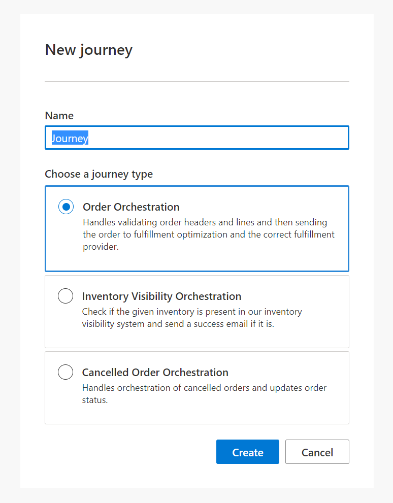

Key components of an orchestration flow are policies, rules, actions, and elements:

- Policies and their associated rules enable businesses to perform the following types of actions on an orchestration flow: 
  - [**Filter**](/dynamics365/retail-intelligent-order-management/policies-rules?azure-portal=true#policy-types) the orchestration step to run based on the policy success criteria.
-	[**Check and update data that’s running**](/dynamics365/retail-intelligent-order-management/policies-rules?azure-portal=true#policy-types) through an orchestration flow.

- The policies are referenced as part of [**actions and elements**](/dynamics365/retail-intelligent-order-management/orchestration-flows?azure-portal=true#actions-and-elements). An action might reference a policy to decide the course of flow of an orchestration flow.

As part of this lab, you'll create an **Order Orchestration** flow that validates an attribute that’s associated with an order header. Based on the result, the business can decide the next course of action. For example, if the delivery address on the order is set to **Seattle**, then you can choose to fulfill the order from a Seattle store.

The first step is to create a policy. The current experience doesn't support switching between **Orchestration Designer** and **Policy** designer view. In addition, a policy must be in the **Published** state before it can be referenced in an orchestration flow.

## Task 1: Create a policy
In this task, you’ll create an [execution policy](/dynamics365/retail-intelligent-order-management/policies-rules?azure-portal=true#policy-types) that checks the order delivery address and validates if it's set to Seattle.

1. In Dynamics 365 Intelligent Order Management, select **Policies** on the left navigation pane.

    > [!div class="mx-imgBorder"]
    > 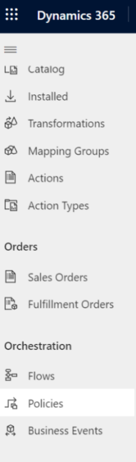

1. Select **+ New**.

    > [!div class="mx-imgBorder"]
    > 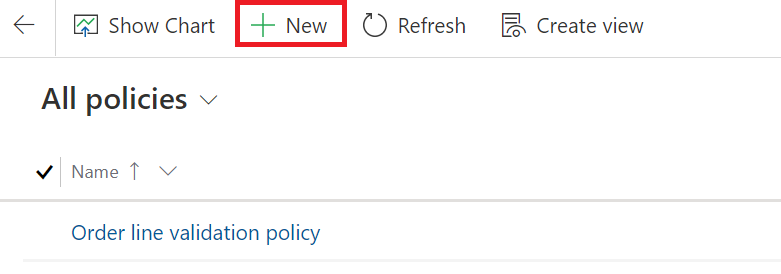

1. Enter the following details:

    - **Policy Name** - Demo - check city name

    - **Policy Type** - Execution Policy

    - **Policy Criticality** - Information

    - **Associated Entity** - Order

    > [!div class="mx-imgBorder"]
    > [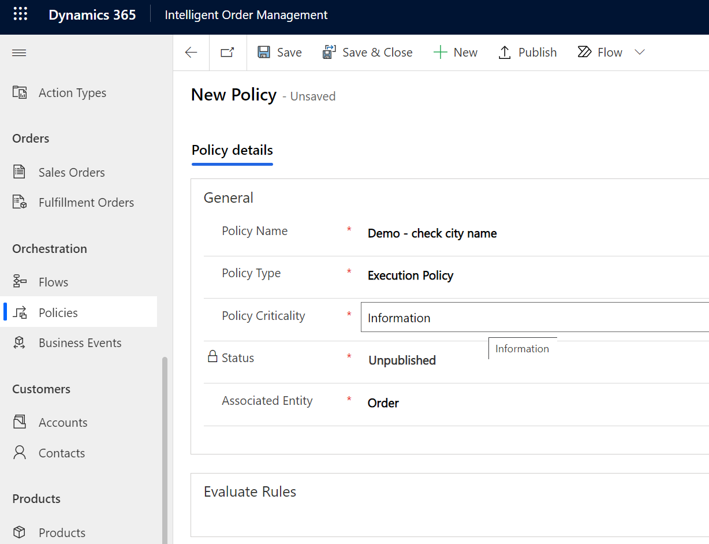](../media/policy-details.png#lightbox)

    > [!Note]
    > Having the **Policy Criticality** field set to **Information** doesn’t stop an orchestration flow if conditions are unsuccessful. If the **Policy Criticality** field is set to **Critical**, then an orchestration flow will stop in case of an unsuccessful evaluation.

1. After you’ve filled out the details, select **Save** and then select **+ New Rule** in the **Evaluate Rules** section.

    > [!div class="mx-imgBorder"]
    > [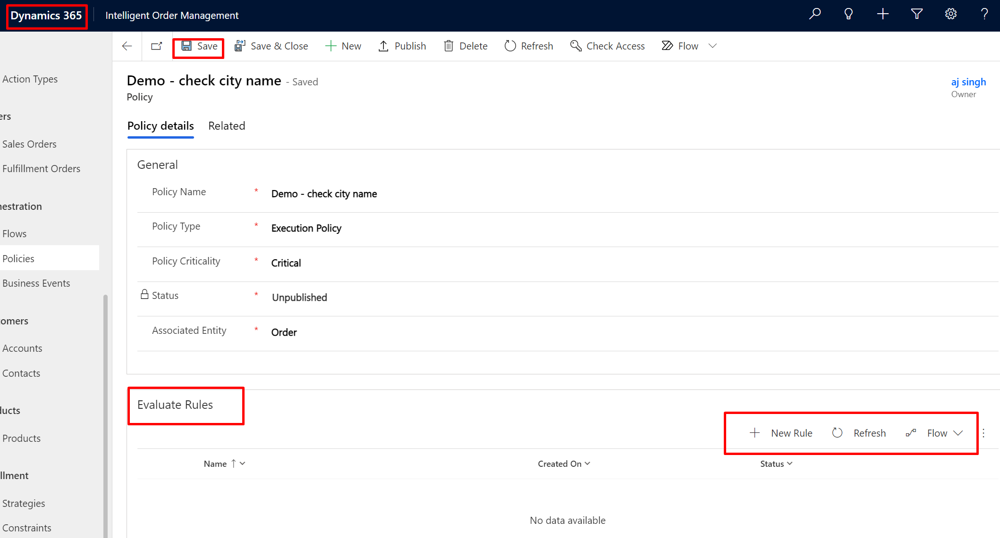](../media/new-rule.png#lightbox)

1. **Rules** have conditions that must be evaluated. In the **Condition Builder**, add one condition where **Ship to City** evaluation is done. In this case, you're validating that **Ship to City** equals **Seattle**. You can enter one or more rules and then add one or more **Actions**. For now, you won't add an action. Select **Save & Close** to return to the policy definition window.

    > [!div class="mx-imgBorder"]
    > [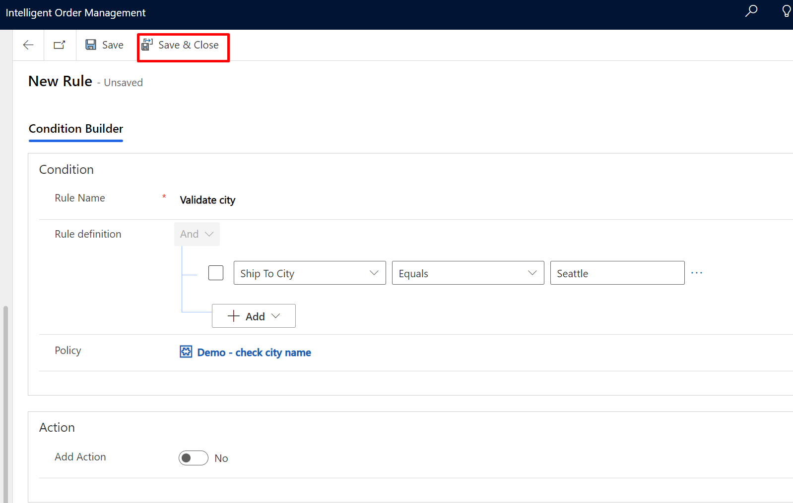](../media/save-rule.png#lightbox)

1. In the policy definition window, select **Save** and then select **Publish**.

    > [!Note]
    > A policy must be published before you can reference it in an orchestration flow.

    > [!div class="mx-imgBorder"]
    > [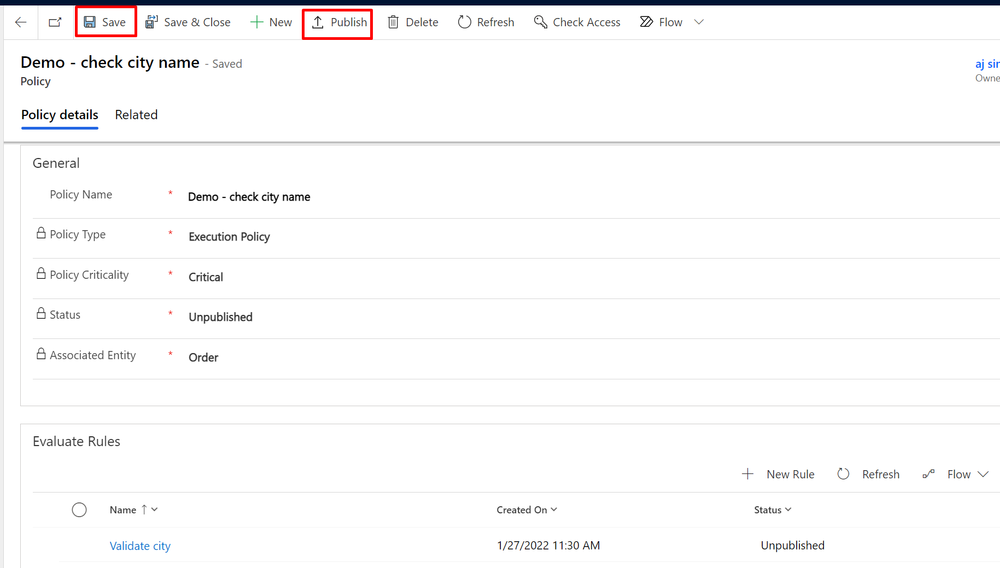](../media/publish.png#lightbox)

Congratulations, you've successfully created and published a policy.

## Task 2: Create an orchestration flow

In this task, you'll create an orchestration flow.

1. Select **Flows** in the left navigation pane.

    > [!div class="mx-imgBorder"]
    > 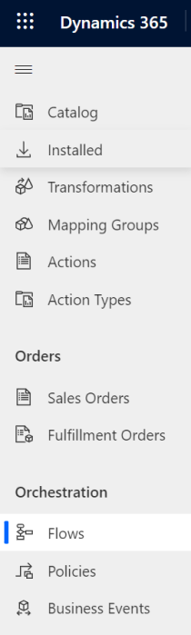

1. Select **New**, provide the following details, and then select **Create**.

    - **Name** - Simple flow to validate city

    - **Journey type** - Order Orchestration

    > [!div class="mx-imgBorder"]
    > 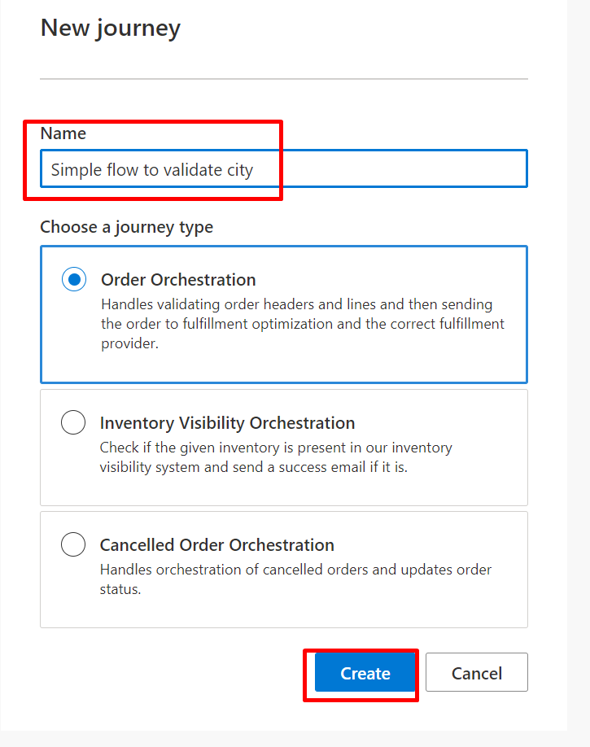

1. Select the plus (**+**) sign to add a new action.

    > [!div class="mx-imgBorder"]
    > [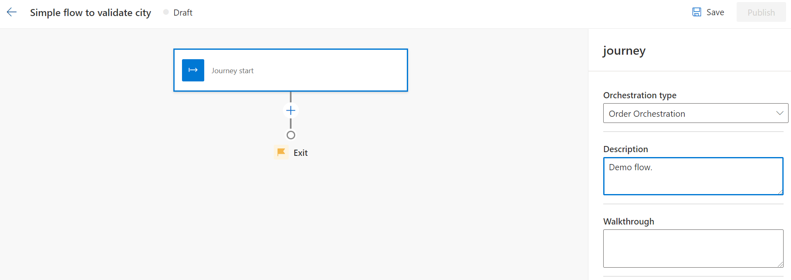](../media/add-action.png#lightbox)

1. Select **Validate order header**.

    > [!div class="mx-imgBorder"]
    > [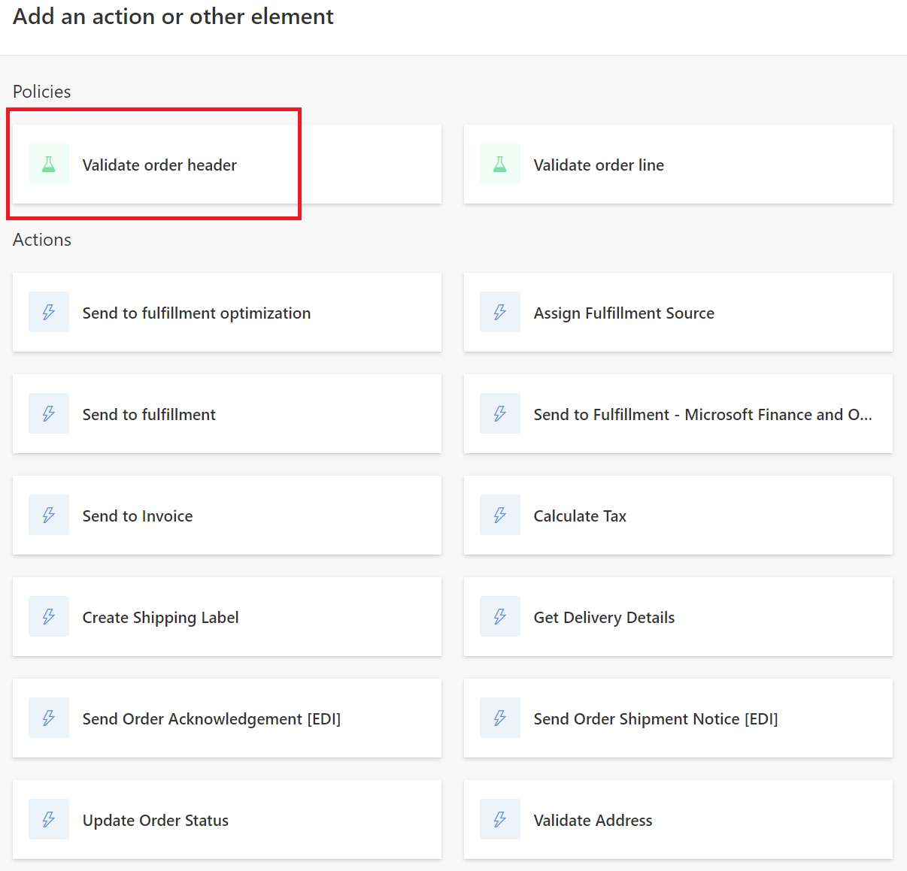](../media/validate.png#lightbox)

1. Provide the following values in the properties of the action:

    - **Name** - Validate order header

    - **Input Events** - Select **New Order**

    - **Execution Policies** - Select **Demo-check city name**. This policy was created in a previous task.

    > [!Note]
    > You can have more than one execution policy attached to a step if required. In this case, you’ll attached a single execution policy.
    >
    > [!div class="mx-imgBorder"]
    > 

    > [!Note]
    > In the lower part of the pane is the **Output Events** section, which shows the outputs that you could pass to subsequent steps in an orchestration flow as **Input Events**.

1. After you’ve filled out the details, select **Save > Publish** in the upper-right corner of the properties pane. The status of the orchestration flow will change to **Live**.

    > [!div class="mx-imgBorder"]
    > [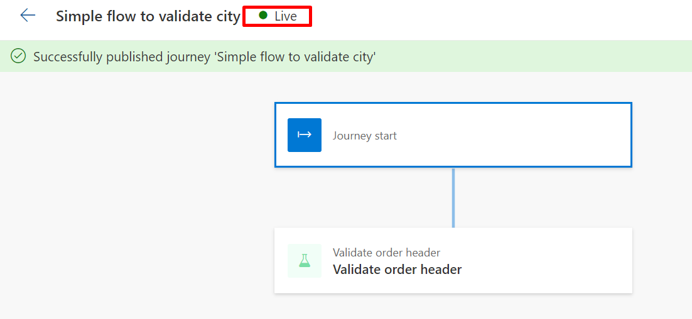](../media/live.png#lightbox)

After the orchestration flow status changes to **Live**, all incoming sales orders will be processed by this orchestration flow, and it will validate the address city as **Seattle**.

Congratulations, you’ve successfully created and published an orchestration flow.

## Task 3: Test the orchestration flow

In this task, you'll test the orchestration flow that you created in the previous task. You’ll create a sample order in BigCommerce by setting the delivery city as Seattle. When the sales orders flow into Intelligent Order Management, the order gets validated and marked as **Order Validated**.

> [!Note]
> While you’re creating an order in BigCommerce, ensure that the item is **Big Commerce** because it’s the only item that’s set up in internal-external mapping.

1. Go to the BigCommerce e-commerce portal store and sign in with the registered credentials.

1. If your training team is using a BigCommerce Trial environment and is using this URL for the first time in a browser session, then the e-commerce portal might be in private mode and will expect a preview code for each browser session. Enter the **Preview Code** that’s provided by your instructor, select the **I'm not a robot** checkbox, and then select the **Submit** button to enter the site.

    > [!div class="mx-imgBorder"]
    > 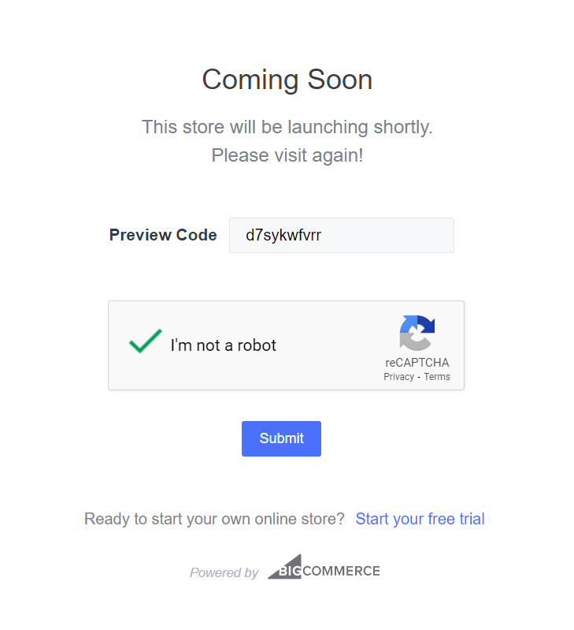

1. Select **White leather bag** on the home page and then select **Add to Cart**.

    > [!div class="mx-imgBorder"]
    > 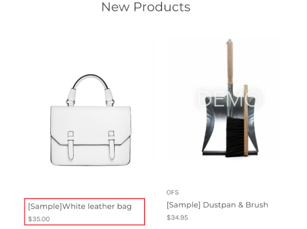

1. Select the **Check out** button.

    > [!div class="mx-imgBorder"]
    > [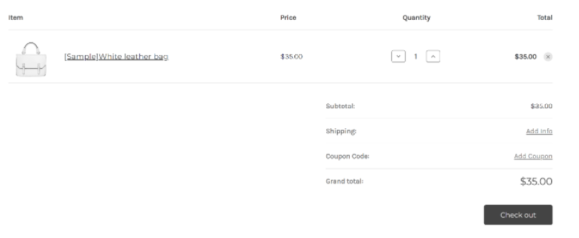](../media/check-out.png#lightbox)

1. Select **Continue**.

    > [!div class="mx-imgBorder"]
    > 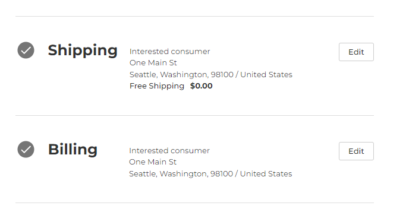

1. Select **Test Payment Provider**. In the **Credit Card Number** field, enter **4111 1111 1111 1111**. In the **Name on Card** field, enter **Success**. You can enter any future expiration date and enter any value in the **CVV** field. Select the **Place Order** button to confirm the order.

    > [!div class="mx-imgBorder"]
    > 

1. After you’ve successfully placed the order, BigCommerce will provide the order number for your order, as shown in the following screenshot.

    > [!div class="mx-imgBorder"]
    > 

1. The order will be waiting for fulfillment, and the order data will be flowing to Dynamics 365 Intelligent Order Management for fulfillment process within the selected frequency of pull that’s set up in the Power Automate flow.

1. Go to Dynamics 365 Intelligent Order Management, and on the left navigation pane, select **Sales Orders**.

    > [!div class="mx-imgBorder"]
    > 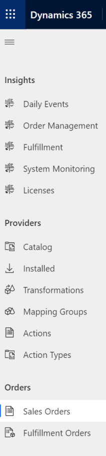

   The order will display on the **Sales Orders** screen, with the BigCommerce order number in the **Name** field. In this case, the BigCommerce order number is 113.

1. In the Dynamics 365 Intelligent Order Management portal, go to the **Sales Order** screen. Order number 113 should display. At this stage, orchestration flow hasn't processed this order yet. It usually takes a minute.

   After an order has been validated, its status should change to **Order Validated**.

    > [!div class="mx-imgBorder"]
    > [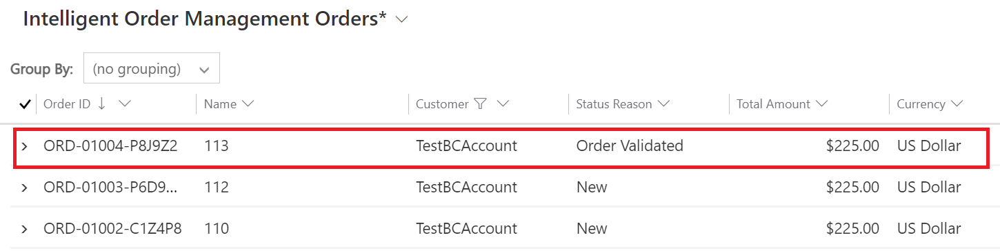](../media/validated.png#lightbox)

Congratulations, you’ve learned about orchestration flows and how to use them to respond to business events that are related to order life cycle.
