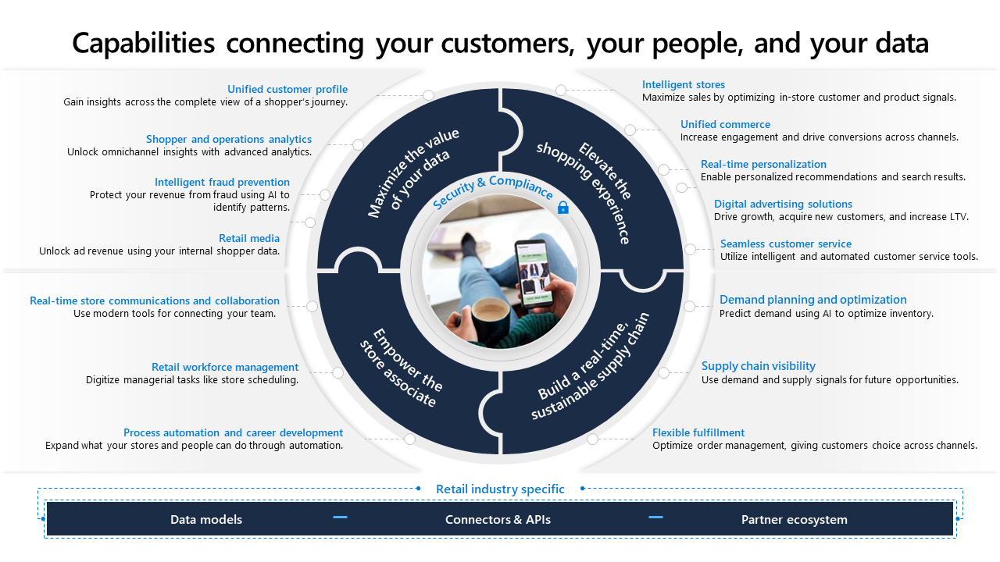
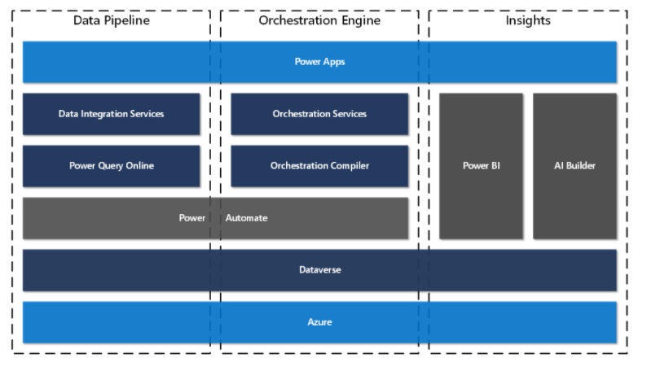

Flexible fulfillment delivers on enhanced customer experience capabilities, such as streamlining curbside pickup and *buy-online-pickup-in-store* operations, while providing customers with real-time inventory and order status and greater control of the entire order life cycle.

Flexible fulfillment delivers on enhanced customer experiences by:

- Streamlining returns management and enabling flexible return scenarios.

- Using AI and anomaly detection models to identify and address fulfillment constraints and improve delivery times while reducing costs.

- Giving customers ordering flexibility, such as home delivery, curbside pickup, and pick up in-store, with connected ordering and fulfillment tools.

- Offering real-time inventory availability and order status with AI, providing a single solution to order-fulfillment orchestration.

> [!div class="mx-imgBorder"]
> 

## Retail story
This lab will focus on the retail story of Fabrikam Retail.

> [!div class="mx-imgBorder"]
> 

In the following exercises, you'll play the role of a system administrator, developer, and a retail customer, as follows:

- **Exercise 1** - Set up and deploy a BigCommerce e-commerce site.

- **Exercise 2** - Set up the Microsoft Dynamics 365 Intelligent Order Management environment.

- **Exercise 3** - Set up a BigCommerce provider in addition to setting up the internal-external mappings.

- **Exercise 4** - In this exercise, you’ll play various roles to complete different actions:
  - Task 1 – Set up the frequency of a Microsoft Power Automate flow.
  - Task 2 - Assume the role of a retail customer, sign up for an account in the e-commerce portal, and then place an order. Later, you'll observe how the order will flow from BigCommerce to Dynamics 365 Intelligent Order Management.

- **Exercise 5** - Assume the role of a system administrator and set up the orchestration flows and policies to validate the location of the sales orders. Later, you'll test the orchestration flow.

- **Exercises 6 and 7** - Review the information on administrative operations and reporting.

## Prerequisites

To complete the exercises in this lab, you'll need to meet the following prerequisites:

- Dynamics 365 Intelligent Order Management

  > [!Note]
  > The [trial version](https://dynamics.microsoft.com/retail-intelligent-order-management/overview/?azure-portal=true) of Intelligent Order Management includes the underlying dependencies (Microsoft Power Platform, Microsoft Dataverse capacity, and so on). However, you need to consider these dependencies for production deployments. Further guidance is available in [Microsoft Power Platform Landing Zones](https://github.com/microsoft/industry/tree/main/foundations/powerPlatform/?azure-portal=true).

- BigCommerce trial subscription

- Postman or CLI such as CURL for troubleshooting APIs (optional)

Dynamics 365 Intelligent Order Management is built on a modern, open platform and provides the flexibility that companies need to capture orders from any order source, such as online e-commerce, marketplace, mobile apps, or traditional sources like Electronic Data Interchange (EDI). Additionally, it helps companies fulfill these orders from their own warehouse, Third-Party Logistics (3PL), stores, or drop-ship with vendors or other delivery fulfillment partners.

Typically, companies will have disparate systems for e-commerce, fulfillment, and shipping/delivery. Intelligent Order Management bridges these disparities and provides a single location for managing the end-to-end life cycle of an order. [Extensibility features](/dynamics365/retail-intelligent-order-management/extensibility/?azure-portal=true) allow customers to integrate Intelligent Order Management with their existing ecosystem of applications.

The system also helps organizations streamline their return processes. Whether returns are collected at a retail store, fulfillment center, or service center, returns can be initiated through an app, online, or at the store.

With a low-code, no-code experience, the orchestration designer tools of Intelligent Order Management help users to model and automate the response to fulfillment constraints and use machine learning to influence and optimize the flow of orders.

> [!div class="mx-imgBorder"]
> 

## Life cycle of an order

The life cycle of an order in Intelligent Order Management can be described as a series of states and actions. Some of these states and actions might be optional or might occur in different sequences based on the system configuration. Additionally, companies might set up some actions to occur automatically or to be performed manually. 
The main stages of an order are:

- Order intake or creation

- Fulfillment

- Delivery

Intelligent Order Management helps you make order fulfillment a competitive advantage. By orchestrating and automating fulfillment by using real-time omnichannel stock data, AI, and machine learning, Dynamics 365 Intelligent Order Management helps you adapt quickly, fulfill efficiently, and deliver on your order promise.

## Architecture of Intelligent Order Management

Intelligent Order Management, which is built on Microsoft Power Platform, seamlessly integrates with existing systems through the provider connector framework. It provides order orchestration capabilities to help you deliver on your business strategy through order, orchestration, fulfillment, optimization, inventory visibility, and fulfillment insights.

Intelligent Order Management shares Common Data Model with Dynamics 365 applications to facilitate back-office application support for your customer service and sales representatives.

The core architecture of Intelligent Order Management has three main components:

- Data pipeline

- Orchestration engine

- Insights

> [!div class="mx-imgBorder"]
> 

[**Data pipeline**](/dynamics365/retail-intelligent-order-management/architecture?azure-portal=true#data-pipeline) consists of integration services and Microsoft Power Query online, which is a transformation engine for the connectors and the orchestration engine. The data pipeline in Intelligent Order Management provides a foundation for the providers to move data in and out of the app.

A *pipeline* is composed of the following elements:

- Provider

- Connectors

- Connection

- Data transformations

- Business events

- Provider action

[**Orchestration engine**](/dynamics365/retail-intelligent-order-management/architecture?azure-portal=true#orchestration-engine) orchestrates a business process flow. Order-to-fulfillment flow is complex to model in a single business app, but when combined with other cloud services and supply chain partner systems, the complexity grows. To help business users in the organization visualize and manage this complexity, Intelligent Order Management ships with a business orchestration designer. Business process flows that are designed with the orchestration designer are compiled into Microsoft Power Automate flows when the flow is published.

Components of the orchestration engine:

- Designer

- Orchestration flow types

  - Order flow

  - Inventory flow

- Policies

- Step

The orchestration engine's components use an orchestration compiler to compile the business process flows into Power Automate. The orchestration builder offers a low-code, no-code experience for building pipelines.

Under **fulfillment optimization** capabilities, you can construct unlimited fulfillment nodes, bring your own nodes, and set up the native distribution order management engine. Additionally, you can set up flexible order validation rules for order routing. With the provider connector capabilities, you can work with warehouse management systems, 3PLs, or other fulfillment systems that you've chosen for your supply chain needs, based on the connectors that Microsoft and partners will provide.

**Inventory visibility** provides a highly scalable microservice that enables real-time, on-hand inventory tracking with a global view of inventory visibility and external system access through RESTful APIs. Moreover, you can use it as a foundation to build available-to-promise processing for your business processes.

Fulfillment insights provides analytics that will monitor order-through-to-fulfillment supply chain, and it offers out-of-the-box, customizable dashboards to help you monitor key metrics. AI-based anomaly detection models provide you with visibility into the order, from fulfillment through to delivery, and they communicate that information to the people and the systems that need this visibility in your organization.

**[Insights](/dynamics365/retail-intelligent-order-management/architecture#insights)** is built on Microsoft Power BI and AI Builder. Intelligent Order Management provides several dashboards to help the business user understand key order and fulfillment metrics. Additionally, it uses machine learning to analyze data by using models, and it uses advanced algorithms to find or predict patterns in data. Customers can build models by using AI builder, which uses data from Intelligent Order Management, so that results are updated on entities that are used during the order and fulfillment flows. This capability helps with decision making in orchestration flows.
