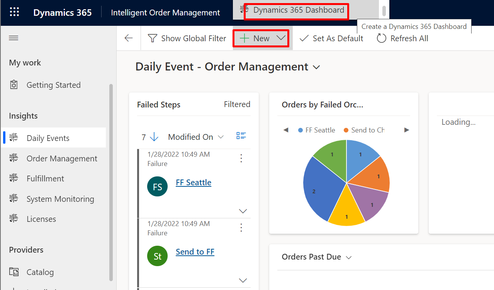
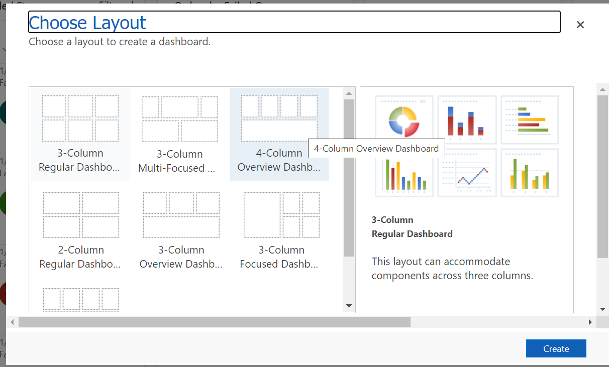

In this exercise, you'll learn about the following concepts:

- Power BI integration

- How to create new dashboards in Intelligent Order Management

- How to access Intelligent Order Management data by using Power BI

Two types of dashboard technologies are available in Intelligent Order Management:

- **Microsoft Unified Client Interface (UCI)** – Use these dashboards to visualize app data that’s stored in Microsoft Dataverse. Intelligent Order Management ships with a dashboard called **Daily Events** that you can use to monitor common data that’s required by the business user on a typical workday.

- **Microsoft Power BI dashboards** – Use these dashboards to visualize app data that’s stored in Dataverse or other data sources that Power BI can work with.

## Task 1: Access and create new dashboards
To access and create new dashboards, follow these steps:

1. Access the Intelligent Order Management dashboards through the Intelligent Order Management portal.

    > [!div class="mx-imgBorder"]
    > 

1. From within the Intelligent Order Management portal, you can create new dashboards. Go to **Insights > New > Dynamics 365 Dashboard**.

    > [!div class="mx-imgBorder"]
    > 

1. Choose a premade layout and then select **Create**.

    > [!div class="mx-imgBorder"]
    > 

1. In the Power Apps portal, you can create a dashboard that could reference a Power BI chart, list, Iframe, and web resource. When the dashboard is ready, you can publish and access it through the Intelligent Order Management portal. For this demo, the dashboard is named **Demo Dashboard**.

    > [!div class="mx-imgBorder"]
    > 

1. To access the dashboard, select **My Dashboards > Demo Dashboard**.

    > [!div class="mx-imgBorder"]
    > 

Intelligent Order Management ships with a set of default dashboards as part of Insights, as shown in the following screenshot.

> [!div class="mx-imgBorder"]
> 

## Task 2: Access Intelligent Order Management data by using Power BI

Intelligent Order Management ships with a dashboard called **Order Management** and is based on Power BI technology. This dashboard provides longer-range insights into the order and fulfillment data that’s moving through the app. You can use Power BI dashboards to visualize app data that’s stored in Dataverse or other data sources that Power BI can work with.

1. In Power BI Desktop, select **New** and then use the **Dataverse** source. Select one of the Dataverse tables as a source.

    > [!div class="mx-imgBorder"]
    > 

1. After you’ve selected a table, you can use DirectQuery mode for querying data in Dataverse.

    > [!div class="mx-imgBorder"]
    > 

Power BI enables complex data analysis scenarios where you can join data across multiple data sources to build insights. After a report has been built, you can publish it as a dashboard for consumption by a wider audience across an enterprise.

Congratulations, you’ve learned about accessing premade dashboards and how to build new reports or dashboards to address complex analytics scenarios.
