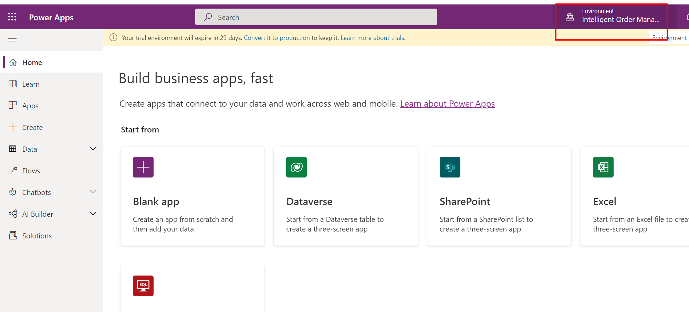
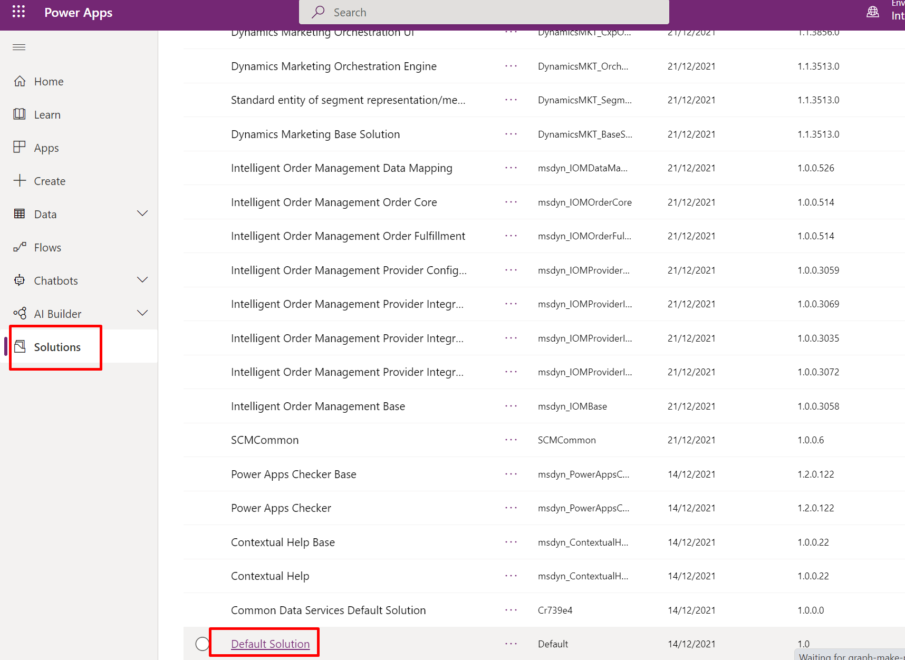
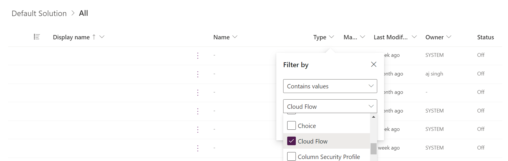
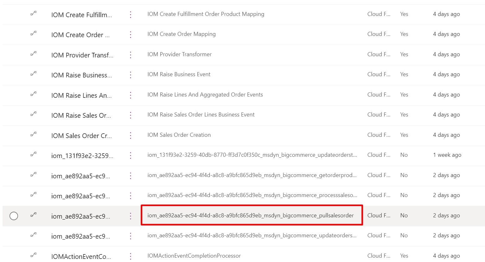
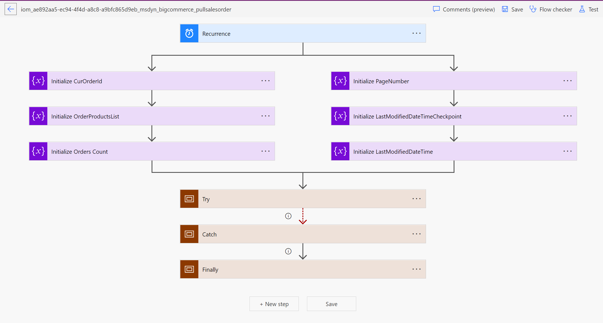
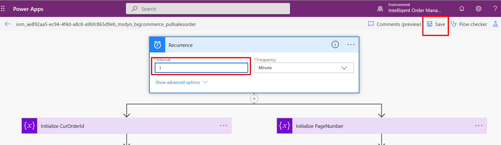
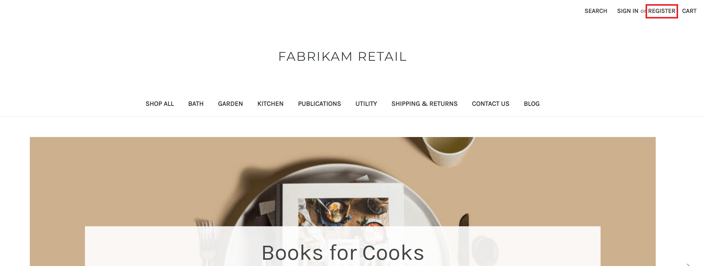
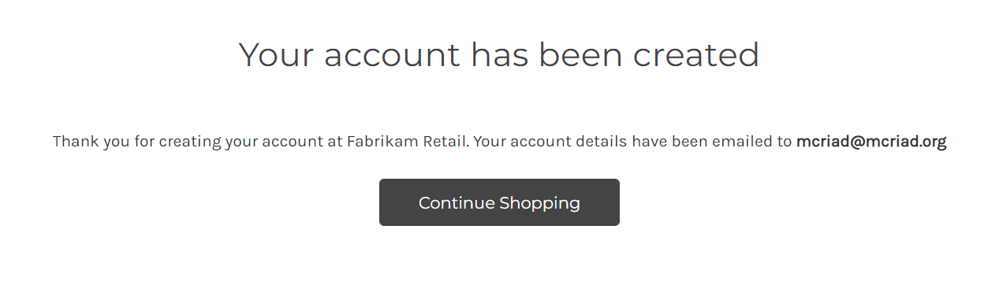
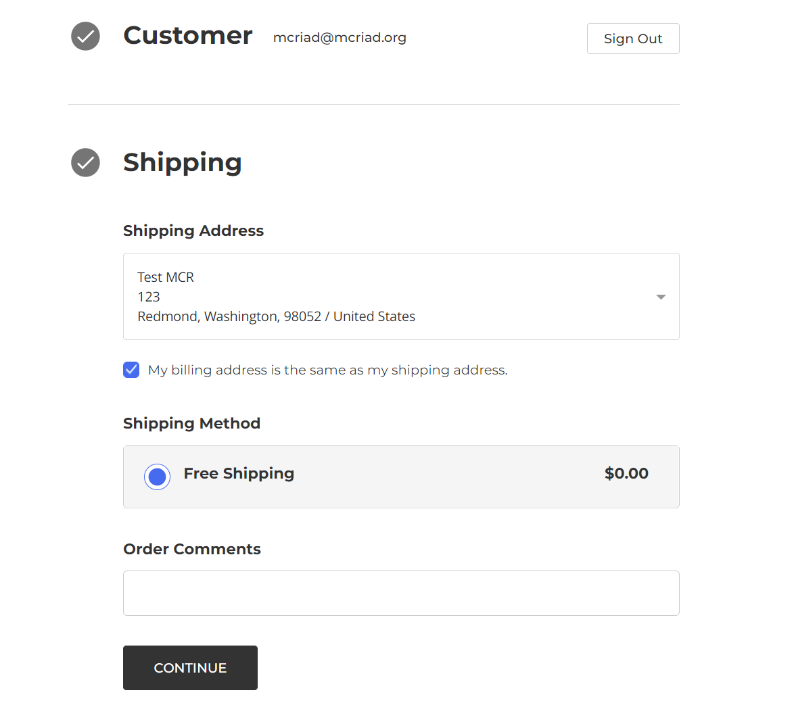
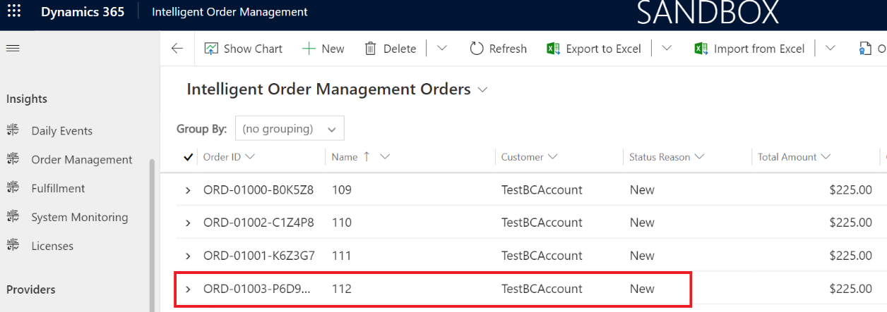

In this exercise, you'll complete the following tasks:

- Set up the recurrence frequency of the flow that pulls sales orders from BigCommerce.

- Generate orders in BigCommerce and validate the flow of orders to Intelligent Order Management.

## Task 1: Set up the frequency of the flow
To set up the frequency of the flow, follow these steps:

1. By default, the flow that pulls the sales orders from BigCommerce is set up to run at 10-minute intervals. You can change this frequency to suit business requirements. To set up the interval, go to [Power Apps](https://make.powerapps.com/?azure-portal=true) and ensure that the correct environment is selected.

    > [!div class="mx-imgBorder"]
    > 

1. Select **Solutions** and then scroll down and select **Default Solution**.

    > [!div class="mx-imgBorder"]
    > 

1. Filter the list of flows based on **Type**. In this case, you’ll select filter records where the type is **Cloud Flow**.

    > [!div class="mx-imgBorder"]
    > 

1. The flow that pulls sales orders from BigCommerce has the suffix **_bigcommerce_pullsalesorder**. Select this flow to view the details.

    > [!div class="mx-imgBorder"]
    > 

1. Select **Edit** to open the editor that you can use to change configuration settings, including the schedule for this flow.

    > [!Note]
    > You can also view history of previous runs, which you can use for troubleshooting purposes. For example, selecting a given run gives you access to JSON output of data that was pulled back from BigCommerce. Similarly, output also gives you BigCommerce API statistics, such as rate limits, quotas, and so on.
    >
    > [!div class="mx-imgBorder"]
    > 

    > [!div class="mx-imgBorder"]
    > 

1. Select the **Recurrence** task to change this flow to run every minute instead of the default 10 minutes and then select **Save**.

    > [!div class="mx-imgBorder"]
    > 

## Task 2: Create an order in BigCommerce

You can create an order in the BigCommerce store portal or in their e-commerce portal. In this task, you'll follow the steps to create an order through the BigCommerce e-commerce portal.

1. Go to the BigCommerce e-commerce portal store. You can access the store link in the BigCommerce environment, as shown in the following screenshot.

    > [!div class="mx-imgBorder"]
    > 

1. If you are using a BigCommerce Trial environment, then the e-commerce portal might be in private mode and expects a private preview code per browser session. Enter the **Preview code** you have made a note as part of Exercise 1 (training environment preparation - step14), mark the check box **I’m not a robot** and then select the **Submit** button to enter the site. 

1. Select **Register** in the upper-right corner of the portal.

    > [!div class="mx-imgBorder"]
    > 

1. Fill in the required fields to create your account. You can enter fictitious information in the **Email Address**, **First Name**, **Last Name**, and **Address Line 1** fields. However, for other address fields, enter the following information because the shipping zone in BigCommerce is set as **United States**.

    - **Suburb/City** - Redmond

    - **Country** - United States

    - **State/Province** - Washington

    - **Zip/Postcode** - 98052

    > [!div class="mx-imgBorder"]
    > 

1. Note the email address and password values that you entered on this form, and then select **Create Account**.

1. Select **Continue Shopping**.

    > [!div class="mx-imgBorder"]
    > 

1. Select the product in the home page that you mapped in Dynamics 365 Intelligent Order Management as part of Exercise 2 - Task 2 - Step 1. After you’ve selected the product, select **Add to Cart**.

1. Select the **Check out** button.

    > [!div class="mx-imgBorder"]
    > 

1. Select **Continue**.

    > [!div class="mx-imgBorder"]
    > 

1. Select **Test Payment Provider**. In the **Credit Card Number** field, enter **4111 1111 1111 1111**. In the **Name on Card** field, enter **Success**. You can enter any future expiration date and enter any value on the **CVV** field. Select the **Place Order** button to confirm the order. The test payment provider will validate the test credit card number and name on the card fields.

    > [!div class="mx-imgBorder"]
    > 

1. After you’ve successfully placed the order, BigCommerce will provide the order number for your order, as shown in the following screenshot.

    > [!div class="mx-imgBorder"]
    > 

1. The order will be waiting for fulfillment, and the order data will be flowing to Intelligent Order Management for the fulfillment process within the pull frequency that’s set in Power Automate from a previous exercise. If the frequency is updated to one minute, then the sales order will be created when the next pull happens.

1. Go to Dynamics 365 Intelligent Order Management, and on the left navigation pane, select **Sales Orders**.

    > [!div class="mx-imgBorder"]
    > 

   The order will show on the **Sales Orders** screen with the BigCommerce order number in the **Name** field. In this case, the BigCommerce order number is 112.

    > [!div class="mx-imgBorder"]
    > 

Congratulations, you’ve validated the successful flow of an order and have set up the pull frequency of the flow to pull orders from the BigCommerce platform.
