In this exercise, you'll complete the following tasks:

- Set up a [BigCommerce](https://www.bigcommerce.com/dm/innovate-ecommerce-v1/?azure-portal=true) demo store.

- Create a BigCommerce API key to use for setting up an Intelligent Order Management provider.

> [!Note]
> This lab uses a 3PL e-commerce platform (BigCommerce) to showcase integration with an external e-commerce platform.

## Task 1: Create and provision a BigCommerce platform

As part of this exercise, you'll deploy a [BigCommerce](https://www.bigcommerce.com/?azure-portal=true) e-commerce trial subscription, and you’ll set up bare minimum requirements so that you can generate orders and integrate BigCommerce with Dynamics 365 Intelligent Order Management through a provider.

1. In an InPrivate or Incognito browser session, go to [BigCommerce](https://www.bigcommerce.com/dm/innovate-ecommerce-v1/?azure-portal=true) and sign up for a trial.

    > [!div class="mx-imgBorder"]
    > 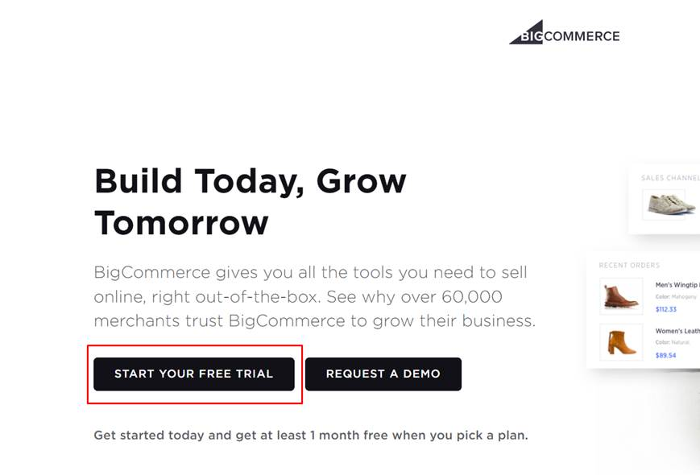

1. Enter your email address. It will be used for demonstration purposes only.

    > [!div class="mx-imgBorder"]
    > 

1. Enter the store details. Choose any name for your store. After you’ve entered the details, select the **Create your store** button.

    > [!div class="mx-imgBorder"]
    > 

   While BigCommerce creates your demo store, the following splash screen should display. This process usually takes two to three minutes to complete.

    > [!div class="mx-imgBorder"]
    > 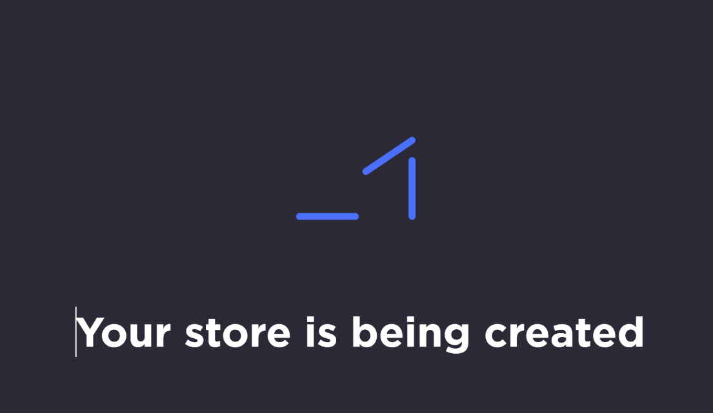

1. For this demo, select **Finish** and then continue.

    > [!div class="mx-imgBorder"]
    > 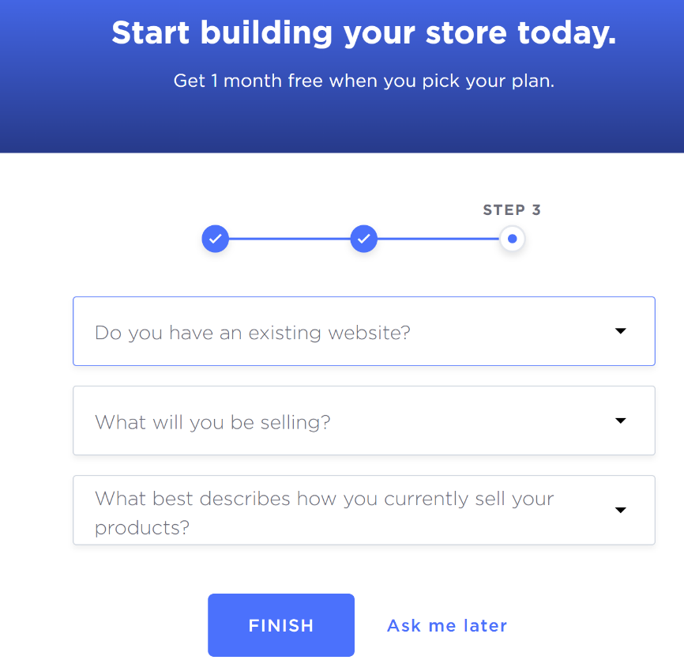

After your online store is ready, you'll be welcomed by a store summary screen. In this case, the store has been named as **Fabrikam Retail**. You can choose a different name. This demo environment is prepopulated and ships with sample data, that is, product master data.

> [!div class="mx-imgBorder"]
> 

## Task 2: Create a BigCommerce API key
To create a BigCommerce API key, follow these steps:

1.	Go to **Advanced Settings** in the left pane.

    > [!div class=”mx-imgBorder”]
    > 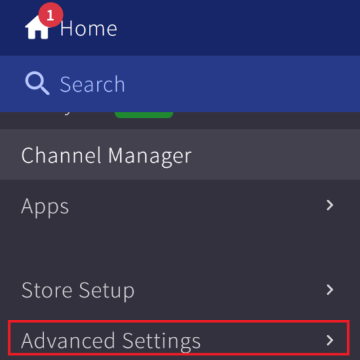

1. Select **Create API Account > Create V2/V3 API token**.

    > [!div class="mx-imgBorder"]
    > 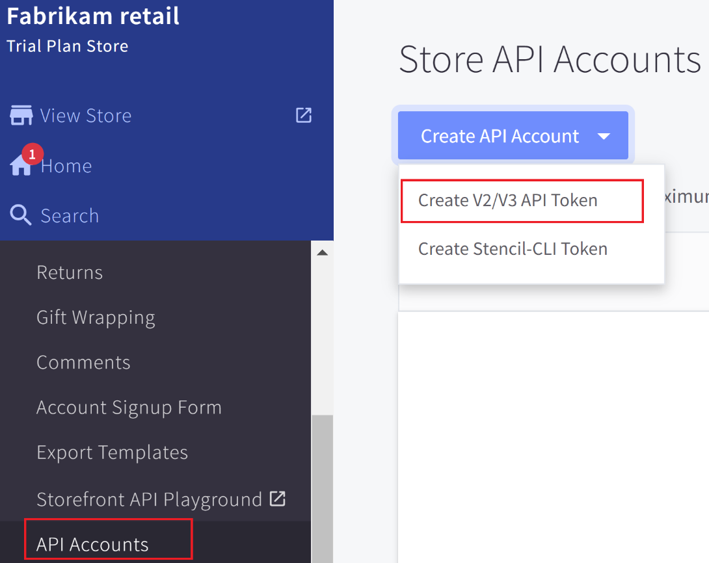

1. Enter a name for the **API account** and then grant access to all scopes. In a production setting, one would follow the principle of least privilege and would only provide access to a set of scopes that are required to complete a function. Choose the maximum scope as **Modify** or as **Manage**, as applicable in the **OAuth Scopes** settings that are shown in the following image.

    > [!div class="mx-imgBorder"]
    > [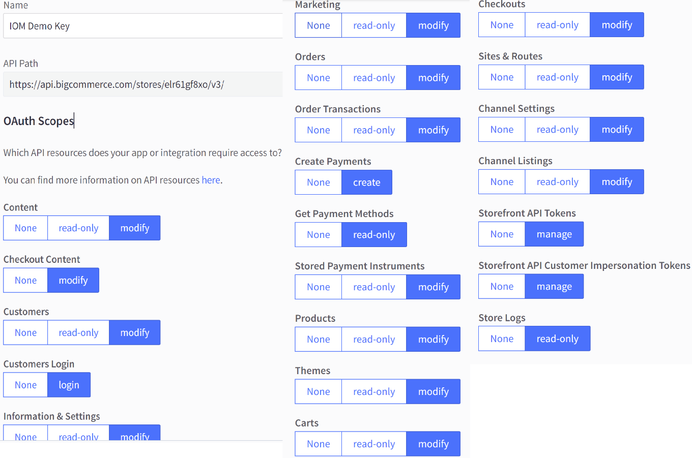](../media/oauth.png#lightbox)

1. Select the **Save** button to generate the **Client ID**, **Client Secret**, and **Access Token** fields. Select the **Copy** button and then save this information because these values are displayed only once. You'll need these values when you set up an Intelligent Order Management provider at a later stage of this exercise.

    > [!div class="mx-imgBorder"]
    > 

1.	Set up the **shipping address** and **shipping zone** because they’re required to place an order. Go to **Store Setup** in the left navigation pane to add a shipping address.

    > [!div class=”mx-imgBorder”]
    > 

1. Under **Store Setup**, select **Shipping** to view the **Shipping Manager** page and then select **Add shipping address**.

    > [!div class="mx-imgBorder"]
    > [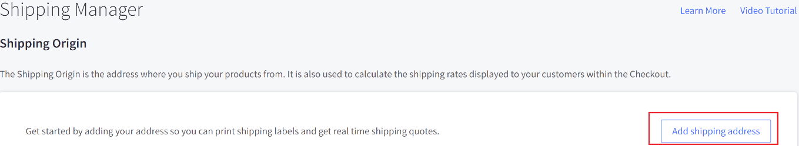](../media/shipping-address.png#lightbox)

1. The **Configure Shipping Address** pop-up window will display, where you can enter the shipping address. Enter the following values and then select **Submit**:

    **Address** - Enter your own address

    **City** - Seattle

    **Postcode** - 98052

    **Country** - United States

    **State** - Washington

    > [!div class="mx-imgBorder"]
    > [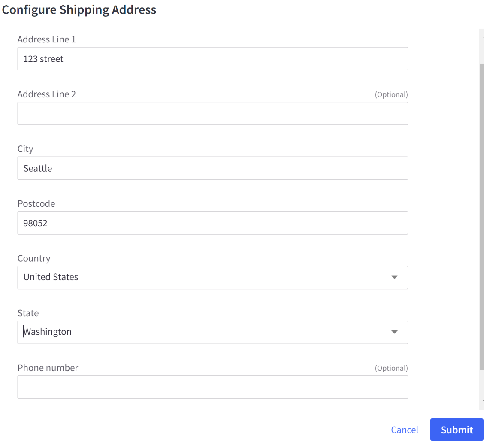](../media/configure-shipping-address.png#lightbox)

1. The shipping address will display in the **Shipping Origin** page.

    > [!div class="mx-imgBorder"]
    > 

1. Scroll down and then select **Checkout Shipping Options > Configure your shipping rules > Add shipping zone**.

1. Select **Add a country zone**.

    > [!div class="mx-imgBorder"]
    > 

1. Select **United States** and then select **Submit**. (If a different country auto populated based on your local country, remove it.)

    > [!div class="mx-imgBorder"]
    > [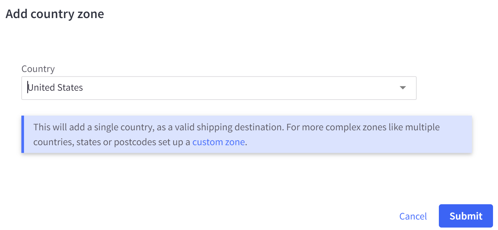](../media/add-country-zone.png#lightbox)

   The country zone will appear, as shown in the following image.

    > [!div class="mx-imgBorder"]
    > [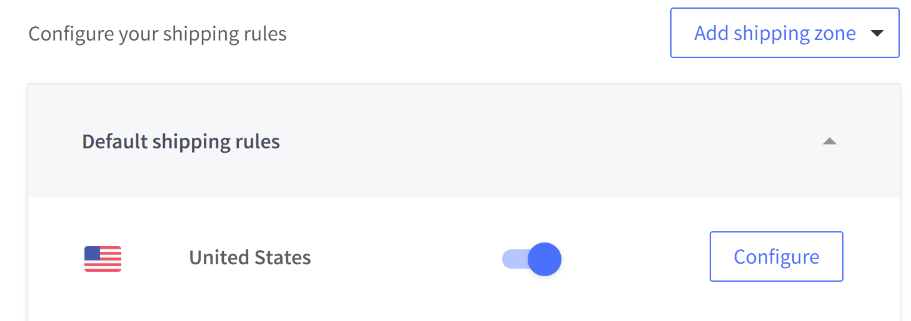](../media/united-states.png#lightbox)

> [!Note]
> To troubleshoot and check if an API key is valid, you can use command line tools, such as CLI tools, or CURL to test/call BigCommerce API. This step is for validation/troubleshooting purposes.
>
> Using CLI, such as Git Bash, will set the variable value for access_token.
>
> 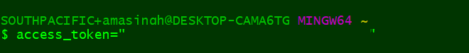
>
> By using the access token that’s published by BigCommerce, you’ll call Products API. This following command will print the output in JSON format. If a list of products displays, then the APIs and the access token are working properly.
>
> [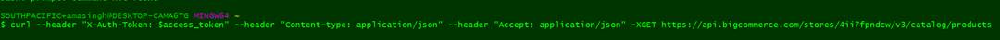](../media/json.png#lightbox)
>
> Similarly, you can use [Postman](https://www.postman.com/?azure-portal=true), which supports a GUI experience to troubleshoot API issues.

1. Select **View store** to navigate to the Bigcommerce e-commerce site.

    

1. Make a note of the preview code. If you/training team is using a BigCommerce Trial environment, then the e-commerce portal might be in private mode and expects a private preview code per browser session.

Congratulations, you’ve successfully set up a BigCommerce demo store. You've also created an API key and saved the information, which you’ll use when setting up the Intelligent Order Management provider in the upcoming exercise.
