In this exercise, you’ll integrate Microsoft Dynamics 365 Commerce with Microsoft Teams to help customers and their employees improve productivity by synchronizing task management between the two applications. The seamless task management that Dynamics 365 Commerce and Teams integration provides will allow store managers and employees to create task lists, assign tasks to multiple stores, and track the status of tasks across stores from either application.

Before you can enable Microsoft Teams integration with Commerce, you’ll first need to register the Teams application with your tenant in the Microsoft Azure portal.

In this exercise, you'll complete the following tasks:

1. Register an app with Azure Active Directory (Azure AD).

1. Add a secret to the registered app.

1. Add API permissions to the registered app.

1. Set up the registered application to expose a web API.

1. Set up a client application to access a web API.

## Task 1: Register an app with Azure Active Directory
To register an app with Azure Active Directory (Azure AD), follow these steps:

1. Sign in to Azure and then make sure that you select the right tenant. In the Azure portal search bar, search for **Active Directory**. In the **Services** list, select **Azure Active Directory** to open it.

    > [!div class="mx-imgBorder"]
    > [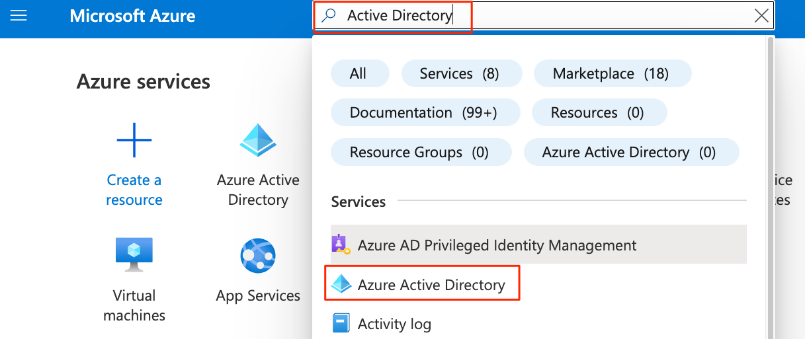](../media/active-directory.png#lightbox)

1. In Azure AD, select **App registrations**.

    > [!div class="mx-imgBorder"]
    > [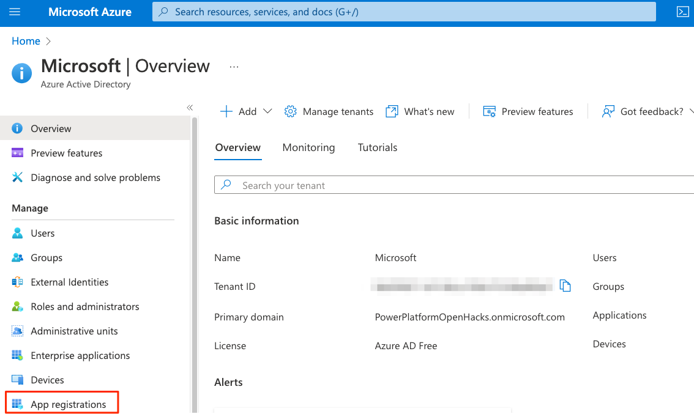](../media/app-registrations.png#lightbox)

1. In **App registrations**, select **New registration**.

    > [!div class="mx-imgBorder"]
    > [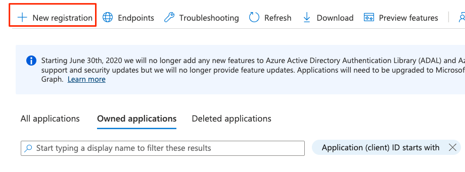](../media/new-registration.png#lightbox)

1. Name the app registration as **Microsoft Teams Commerce**.

1. Under **Supported account types**, select **Accounts in this organizational directory only (Microsoft only - Single tenant)**.

1. Under **Redirect URI**, select **Web**, provide the Commerce Finance and Operations apps URL, and then add the **oauth** suffix. The full URL should resemble: `https://fabrikam.sandbox.operations.dynamics.com/oauth`.

1. Select **Register** in the lower part of the screen to complete the process.

    > [!div class="mx-imgBorder"]
    > [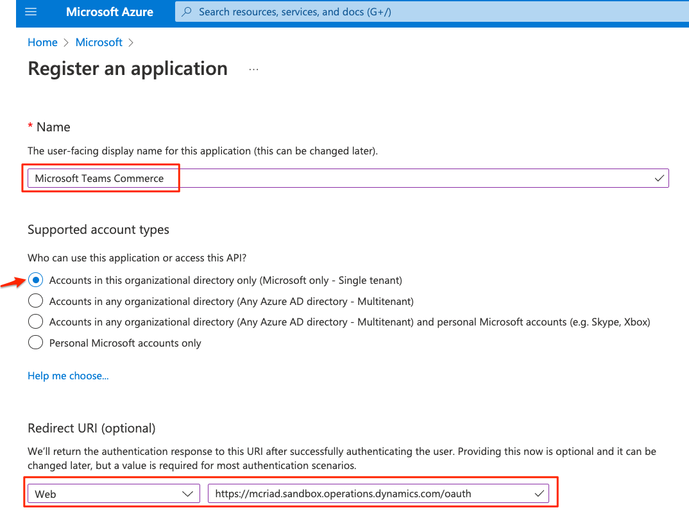](../media/register.png#lightbox)

1. **Important**: Save the **Application (client) ID** in the text editor for your reference because you’ll use it in later steps.

    > [!div class="mx-imgBorder"]
    > [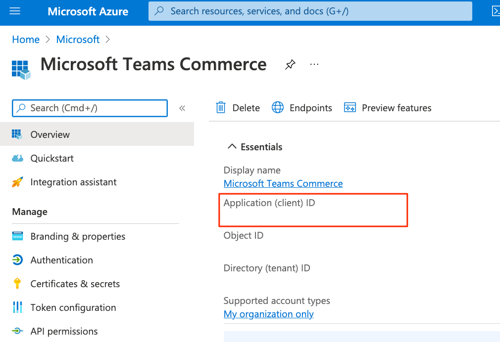](../media/application-id.png#lightbox)

## Task 2: Add a secret to the registered app
To add a secret to the registered app, follow these steps:

1. In the Microsoft Teams Commerce registered app, select **Certificates & secrets**.

    > [!div class="mx-imgBorder"]
    > [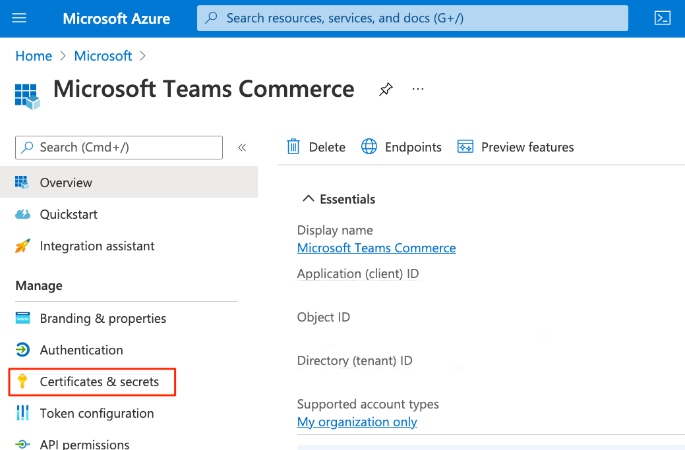](../media/certificates.png#lightbox)

1. Select the **+ New client secret** button.

    > [!div class="mx-imgBorder"]
    > [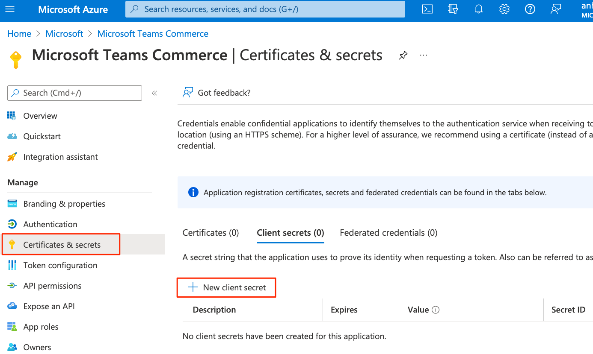](../media/secrets.png#lightbox)

1. In the **Description** field in the **Add a client secret** dialog, provide a name of your choice for the client secret and then select **Add**.

    > [!div class="mx-imgBorder"]
    > [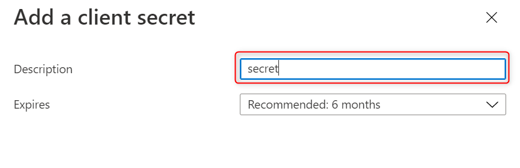](../media/add-client-secret.png#lightbox)

1. Copy the key **Value** that generated for the client secret and save it in a text editor of your choice. The client secret **Value** will be used in later steps. After you close this page, you won't be able to retrieve the value again, and if you don’t note the value now, you’ll need to generate a new client secret.

    > [!div class="mx-imgBorder"]
    > [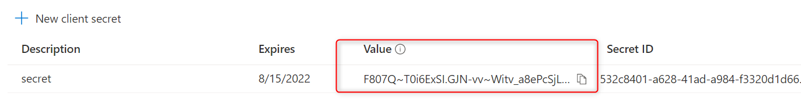](../media/value.png#lightbox)

## Task 3: Add API permissions to the registered app
To add API permissions to the registered app, follow these steps:

1. Select **API permissions** in the left pane and then select **+ Add a permission**.

    > [!div class="mx-imgBorder"]
    > [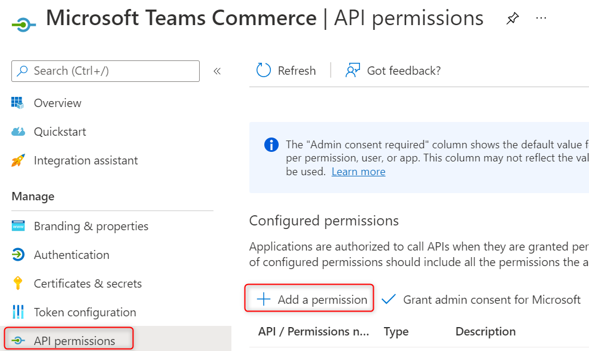](../media/add-permission.png#lightbox)

1. In the **Request API permissions** pop-up window, select **Microsoft Graph**.

    > [!div class="mx-imgBorder"]
    > [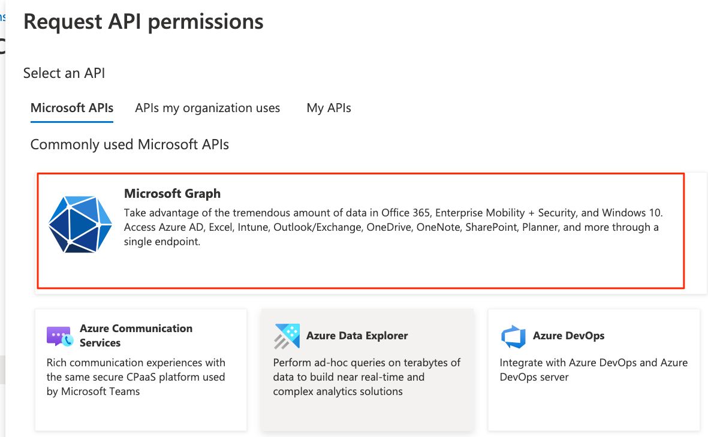](../media/request.png#lightbox)

1. Select **Delegated permissions**, and then in the **Select permissions** search box, type **Group** to filter results.

1. Under **Group**, select **Group.ReadWrite.All** and then select the **Update permissions** button.

    > [!div class="mx-imgBorder"]
    > [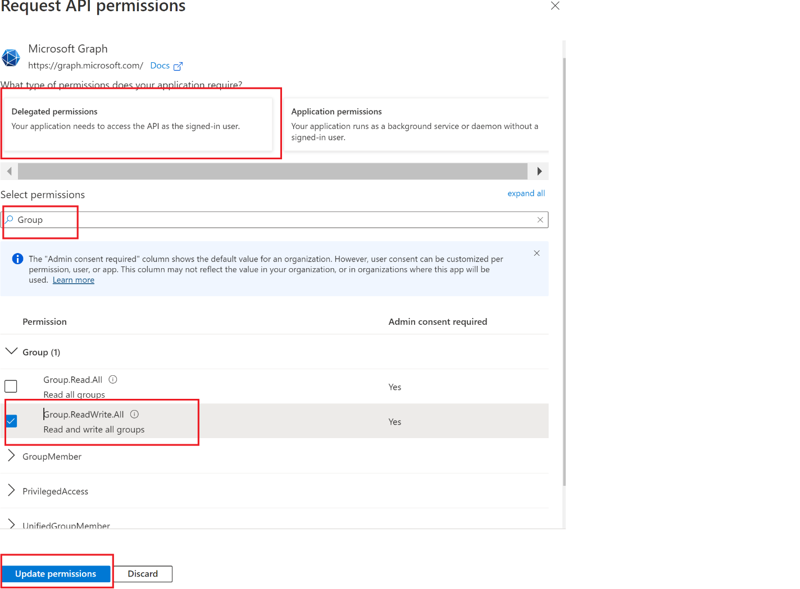](../media/group-permissions.png#lightbox)

1. Select **+ Add a permission** again to add more permissions.

	> [!div class="mx-imgBorder"]
	> 

1. In the **Request API permissions** pop-up window, select **Microsoft Graph**.

    > [!div class="mx-imgBorder"]
    > [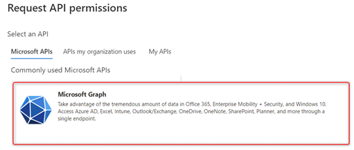](../media/graph.png#lightbox)

1. Select **Application permissions**.

    > [!div class="mx-imgBorder"]
    > [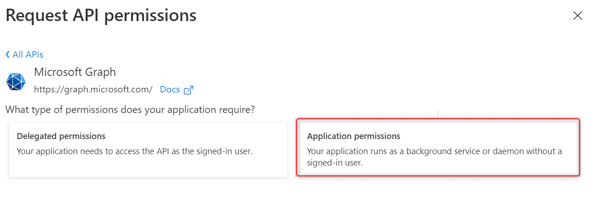](../media/application-permissions.png#lightbox)

1. With **Application permissions** selected, in the **Select permissions** search field, type **Group** to filter results.

1. Expand the **Group** menu, select **Group.ReadWrite.All**, and then select the **Add permissions** button.

    > [!div class="mx-imgBorder"]
    > [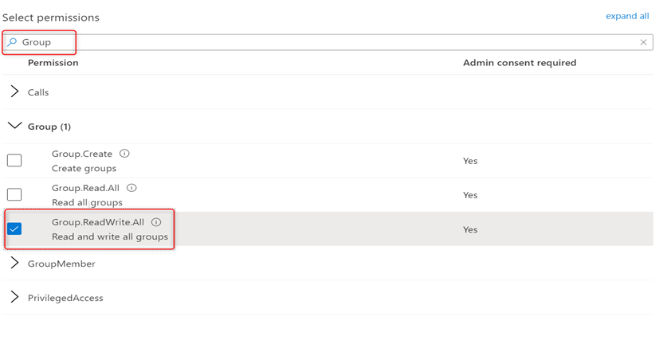](../media/group.png#lightbox)

1. In **API permissions**, select **+ Add permissions**.

    > [!div class="mx-imgBorder"]
    > 

1. In the **Request API permissions** pop-up window, select the **APIs my organization uses** tab, and then search for and select **Microsoft Teams Retail Service**.

    > [!div class="mx-imgBorder"]
    > [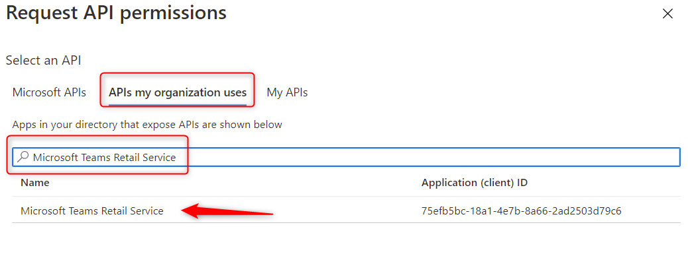](../media/my-organization.png#lightbox)

1. Select **Delegated permissions**

    > [!div class="mx-imgBorder"]
    > [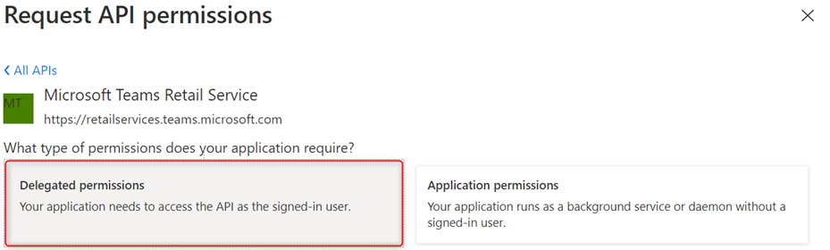](../media/delegated.png#lightbox)

1. Expand the **TaskPublishing** menu, select **TaskPublishing.ReadWrite.All**, and then select the **+ Add permissions** button.

    > [!div class="mx-imgBorder"]
    > [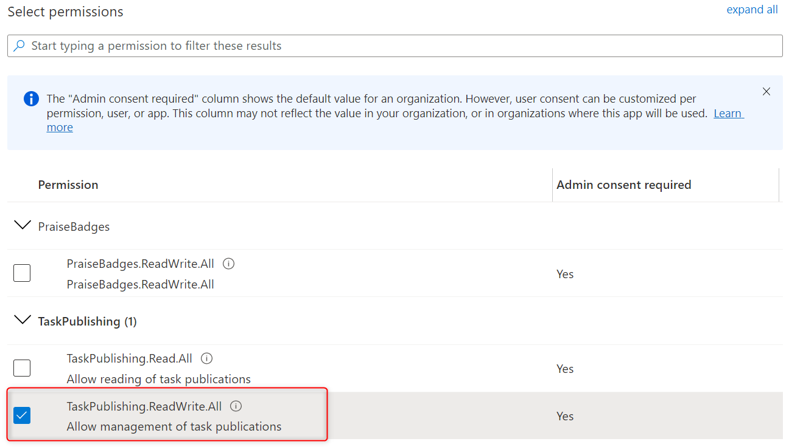](../media/task-publish.png#lightbox)

## Task 4: Set up a registered application to expose a web API
To set up a registered application to expose a web API, follow these steps:

1. In the Azure portal, go to **Azure Active Directory**.

1. In **App registrations**, go to the **Owned applications** tab and select your API's app registration.

    > [!div class="mx-imgBorder"]
    > [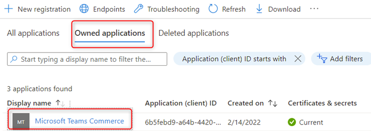](../media/owned.png#lightbox)

1. Select **Expose an API** and then select **+ Add a scope**.

    > [!div class="mx-imgBorder"]
    > [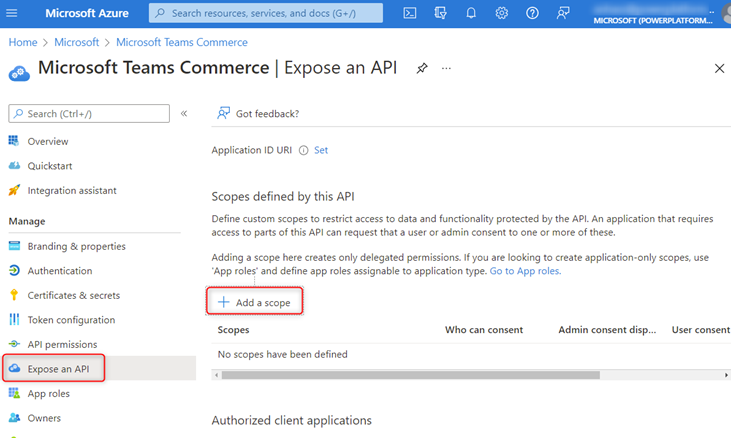](../media/expose.png#lightbox)

1. Use the default value provided, which is in the form `api://<application-client-id>`, or you can specify a more readable URI, such as `https://contoso.com/api`.

    > [!div class="mx-imgBorder"]
    > [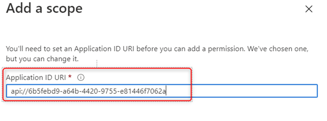](../media/scope.png#lightbox)

1. Select **Save and Continue**.

1. In the **Add a Scope** page, fill in the fields with the values that are shown in the following screenshot.

    > [!div class="mx-imgBorder"]
    > [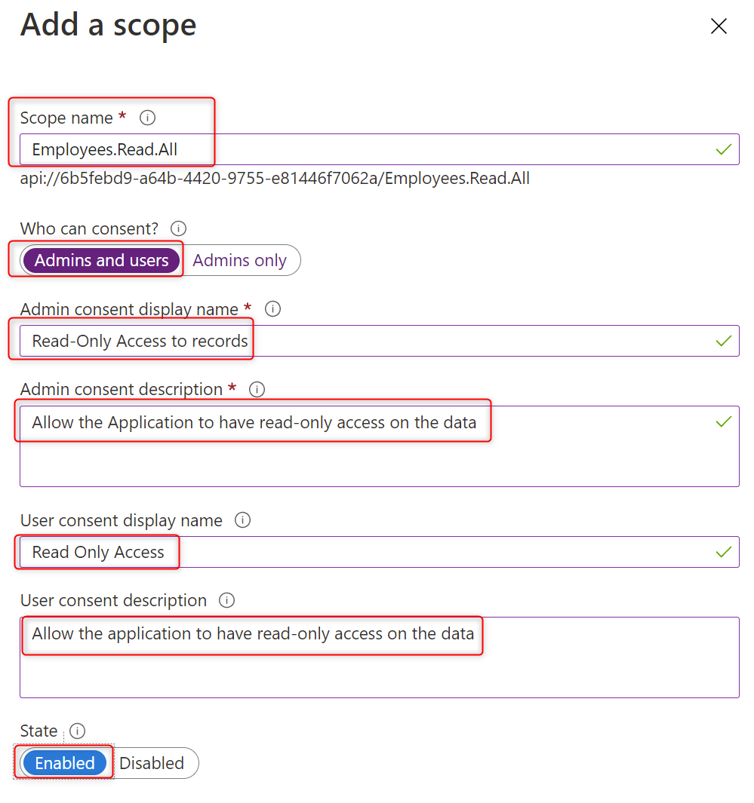](../media/add-scope.png#lightbox)

1. Add another scope by selecting the **Add a scope** button again. Repeat the previous process and use the following values.

    | Setting | Value |
    |---------|-------|
    | **Scope name** | Employees.Write.All |
    | **Who can consent** | Admins only |
    | **Admin consent display name** | Write access to records |
    | **Admin consent description** | Allow the application to have write access to all Employee data |

1. Leave the remaining fields empty and then make sure that the **State** is set to **Enabled**.

1. Select **Add Scope**.

   The final result should resemble the following image.

    > [!div class=”mx-imgBorder”]
    > [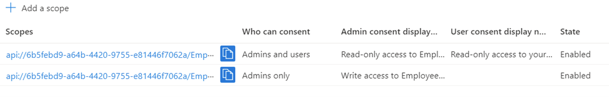](../media/scopes.png#lightbox)

## Task 5: Set up a client application to access a web API
To set up a client application to access a web API, follow these steps:

1. In the Azure portal, go to **Azure Active Directory**.

1. Go to **App registrations** and then select the app registration that you created in Task 1.

1. Select **API permissions > Add a permission > My APIs** tab.

	> [!div class="mx-imgBorder"]
	> 

1. In the **My APIs** tab, select the Application ID that you registered in the previous step.

    > [!div class="mx-imgBorder"]
    > [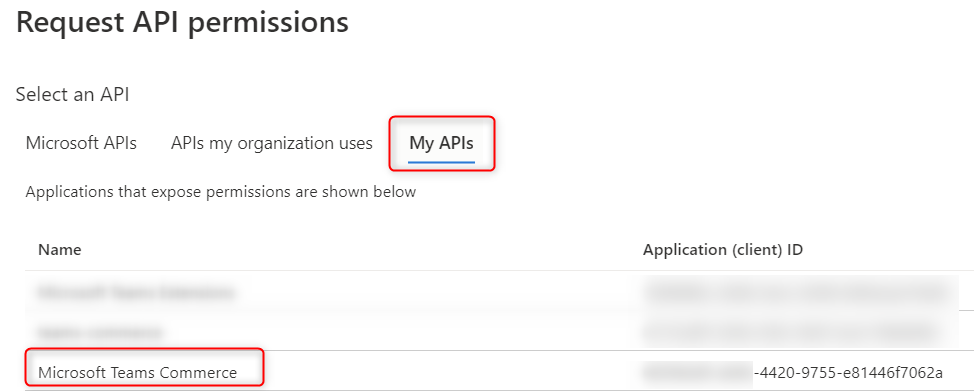](../media/my-api.png#lightbox)

1.	Under **Select permissions**, expand the resource whose scopes you defined for your web API, and then select the permissions.

    If you used the example scope names that were specified in the previous quickstart, the  **Employees.Read.All** and **Employees.Write.All** permissions should display.

    > [!div class="mx-imgBorder"]
    > [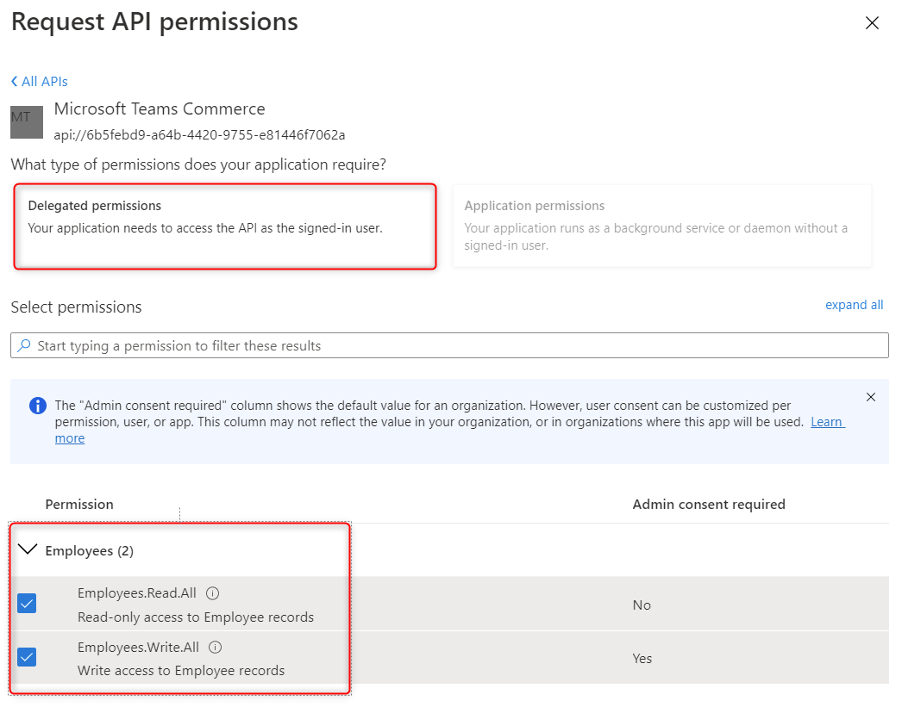](../media/employees.png#lightbox)

6. Select **Add permissions**.

## Task 6: Add Delegated permissions to access Microsoft Graph
To add Delegated permissions to access Microsoft Graph, follow these steps:

1. In the Azure portal, go to **Azure Active Directory**.

1. In **App registrations**, select the **Owned applications** tab and then select your API's app registration.

    > [!div class="mx-imgBorder"]
    > 

1. Select **API permissions > Add a permission.

    > [!div class="mx-imgBorder"]
    > 

1. Select **Microsoft Graph**.

    > [!div class="mx-imgBorder"]
    > 

1. Select **Delegated permissions**.

    > [!div class="mx-imgBorder"]
    > [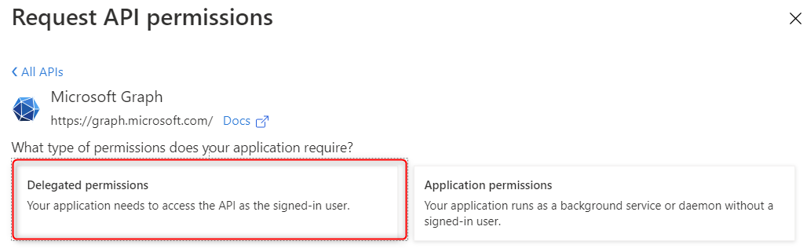](../media/graph-delegated.png#lightbox)

1. In the **Select permissions** search box, type **email**.

1. Under the **Permission** section, select **email**.

    > [!div class="mx-imgBorder"]
    > [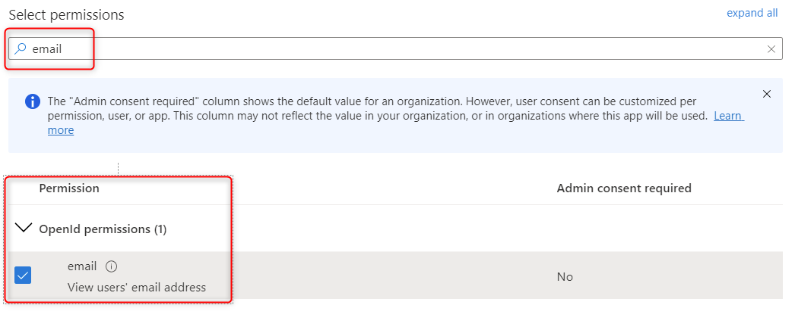](../media/email.png#lightbox)

1. In the **Select permissions** search box, type **offline_access**.

1. Under the **Permission** section, select **offline_access**.

    > [!div class="mx-imgBorder"]
    > [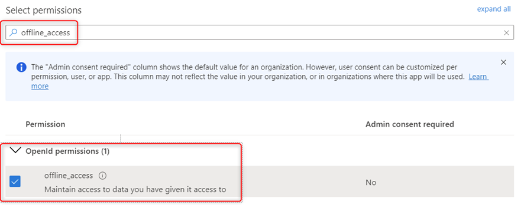](../media/offline.png#lightbox)

1. In the **Select permissions** search box, type **openid**.

1. Under the **Permission** section, select **openid**.

    > [!div class="mx-imgBorder"]
    > [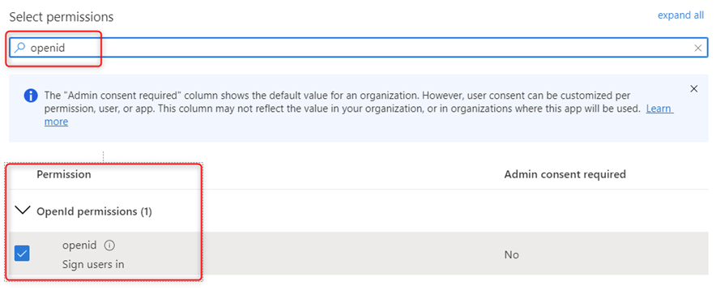](../media/open-id.png#lightbox)

1. In the **Select permissions** search box, search for **profile**.

1. Under the **Permission** section, select **profile**.

    > [!div class="mx-imgBorder"]
    > [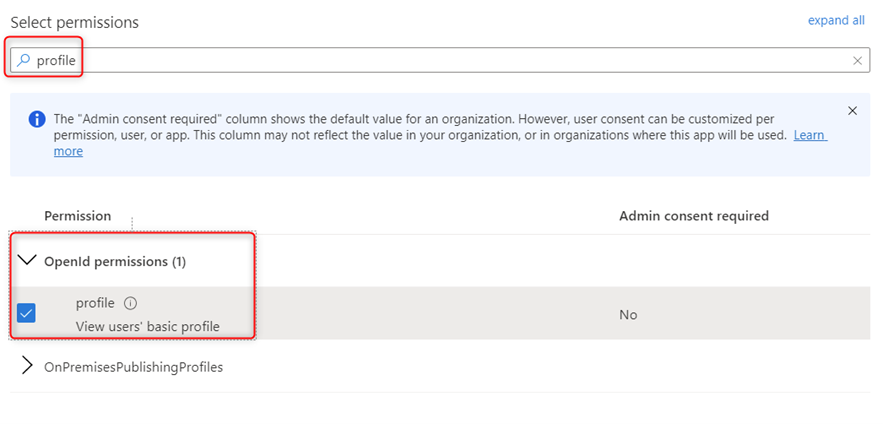](../media/profile.png#lightbox)

1. Select **Add permissions** to complete the process.

## Task 7: Add application permissions to access Microsoft Graph
To add application permissions to access Microsoft Graph, follow these steps:

1. In the Azure portal, go to **Azure Active Directory**.

1. In **App registrations**, select the **Owned applications** tab and then select your API's app registration.

    > [!div class="mx-imgBorder"]
    > 

1. Select **API permissions > Add a permission**.

    > [!div class="mx-imgBorder"]
    > 

1. Select **Microsoft Graph**.

1. Under **Request API permissions**, select **Application permissions**.

    > [!div class="mx-imgBorder"]
    > 

1. In the **Select permissions** search box, type **files**.

1. Under the **Permission** section, select **Files.Read.All**.

1. Select **Add permissions** to complete the process.

    > [!div class="mx-imgBorder"]
    > [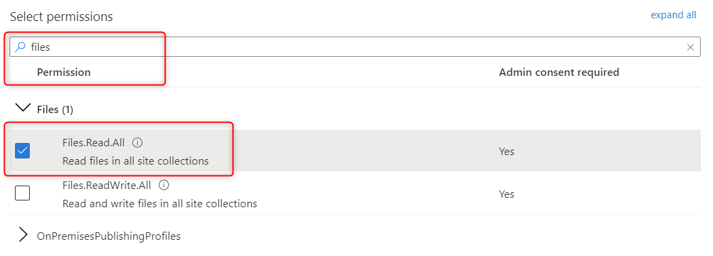](../media/files.png#lightbox)

Congratulations! In this exercise you have created an App registration and assigned the appropriate permissions. 
