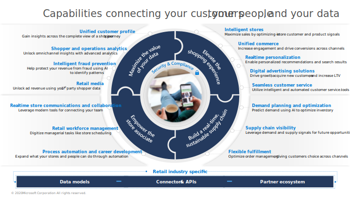
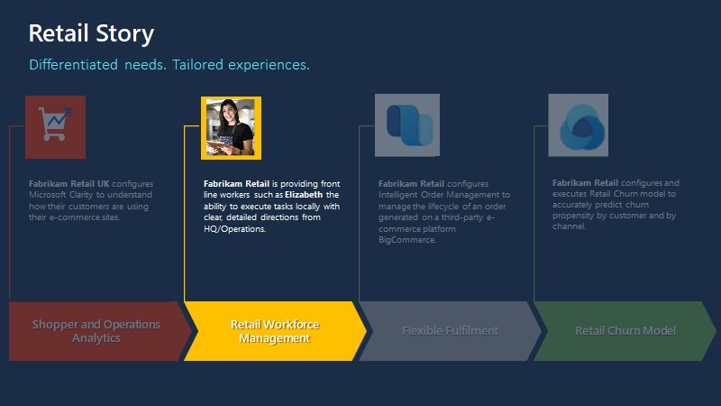

Retail workforce management helps you digitize managerial tasks, such as store scheduling.

With retail workforce management, you can manage shifts seamlessly, connect to your existing workforce, simplify task dissemination, and help your team complete tasks more easily.

With retail workforce management, you can offer seamless scheduling:

- **Manage shifts seamlessly** - Enable managers to create and manage their team's schedule and let employees set their availability and adjust schedules to fluctuating business needs.

- **Track time and attendance** – Employees can clock in and out with geo detection and digital time tracking sheets.

- **Enable Shifts connectors with workforce management systems** – Provide real-time visibility into labor scheduling, time and attendance, and store operation scheduling in a single interface, ensuring a seamless and accurate scheduling experience.

Additionally, you’ll experience simplified task management:

- Enable corporate employees, such as the corporate communications and the retail operations teams, to create, distribute, and track task assignments to a targeted location.

- Equip managers with the ability to manage tasks regionally and assign them to the correct individuals in the store.

- Provide frontline workers with the ability to complete tasks locally with clear, detailed directions from HQ or Operations.

> [!div class="mx-imgBorder"]
> 

## Retail story

This lab will focus on the retail story of Fabrikam Retail.

> [!div class="mx-imgBorder"]
> 

In the following exercises, you'll be playing the role of a system administrator, a retail communications manager, a store manager, and a retail employee, as follows:

- **Exercise 1** - Create an app registration and set up the required permissions.

- **Exercise 2** - Enable the integration between Microsoft Dynamics 365 Commerce and the **Task management** app in Microsoft Teams.

- **Exercise 3** - Play various roles to complete different tasks:

  - **Task 1** - Play the role of a retail communications manager who will sign in to Teams and publish a task called "Set up Women's Spring Lineup Display."

  - **Task 2** - Play the role of a store manager who will sign in to the POS app from Dynamics 365 Commerce to view the tasks and assign the new task to a store employee.

  - **Task 3** - Play the role of a store employee who will view the assigned tasks and then mark them as complete after they’ve been completed.

  - **Task 4** - Sign in to Teams again as a retail communications manager to check the progress of the tasks across stores by using a list report.

### Prerequisites

Make sure that you meet the following prerequisites before starting the exercises in this module:

- Dynamics 365 Commerce

- Microsoft Teams
