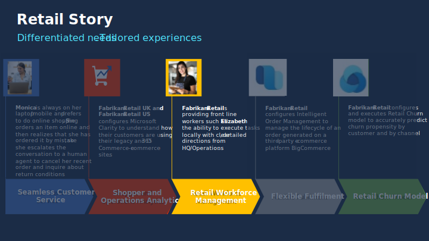

Retail workforce management helps you digitize managerial tasks like store scheduling.

With retail workforce management, manage shifts seamlessly, easily connect to your existing workforce, simplify task dissemination, and help your team complete tasks more easily.

With retail workforce management, offer **seamless scheduling**:

Manage shifts seamlessly—enable managers to easily create and manage their team's schedule and let employees set their availability and easily adjust schedules to fluctuating business needs.

Track time & attendance with easy clock in and out with geo detection and digital time tracking sheets.

Enable Shifts connectors with workforce management systems for real-time visibility into labor scheduling, time and attendance, and store operation scheduling in a single interface—ensuring a seamless and accurate scheduling experience.

Also, experience **task management made easy**:

Enable corporate employees like corporate communications and retail operations team easily create, distribute and track task assignments to targeted location.

Equip managers to manage tasks regionally and assign them to the right individuals in the store.

Provide frontline workers from executing tasks locally with clear, detailed directions from HQ or Operations.

> [!div class="mx-imgBorder"]
> 

## Retail story

> [!div class="mx-imgBorder"]
> 

This lab will focus on the retail story of Fabrikam Retail.

In the following exercises, you'll be playing the role of a **System Administrator**, a **Retail Communications Manager**, a **Store Manager**, and a **Retail Employee**:

- In Exercise 1, you'll be creating an app registration and set up the required permissions.

- In Exercise 2, you'll be enabling the integration between Dynamics 365 Commerce and Teams Task management app.

- You'll then play the role of a Retail communications manager who will sign in to Teams and publish a task "Setup Women's Spring Lineup Display" as part of Exercise 3—Task 1.

- Later, in Exercise 3, Task 2, you'll play the role of a Store manager who will sign in to Dynamics 365 Commerce POS application to view the tasks and assign the new task to a store employee.

- In Exercise 3, Task 3, you'll play the role of a store employee who will view the assigned tasks and mark it as complete once the task is completed.
