In this exercise, you'll use the three roles that you created in the previous exercise (retail communication manager, store manager, and store employee) to practice how task management works in Dynamics 365 Commerce. Your first task will be to play the role of a retail communications manager who will sign in to Teams and publish a task called **Set up Women's Spring Lineup Display**. Next, you'll play the role of a store manager who will sign in to the POS application in Dynamics 365 Commerce to view the tasks and assign the new task to a store employee. Finally, you'll play the role of a store employee who will view the assigned tasks and mark them as complete after the tasks have been completed.

## Task 1: Publish a task list in Teams

In this task, you'll sign in to Teams as a retail communications manager, create a list of tasks, and then assign it to all stores in a region.

1. Sign in to [Microsoft Teams](https://teams.microsoft.com/?azure-portal=true) in a private browser session by using the credentials that you created for the retail communication manager in Exercise 2 - Task 1 (which, for this exercise, is Michael Ellen).

1. In the left navigation pane, select **Tasks by Planner**. If the option doesn't show in your Teams environment, select the ellipsis (**…**) meu located in the lower part of the left navigation pane.

    > [!div class="mx-imgBorder"]
    > [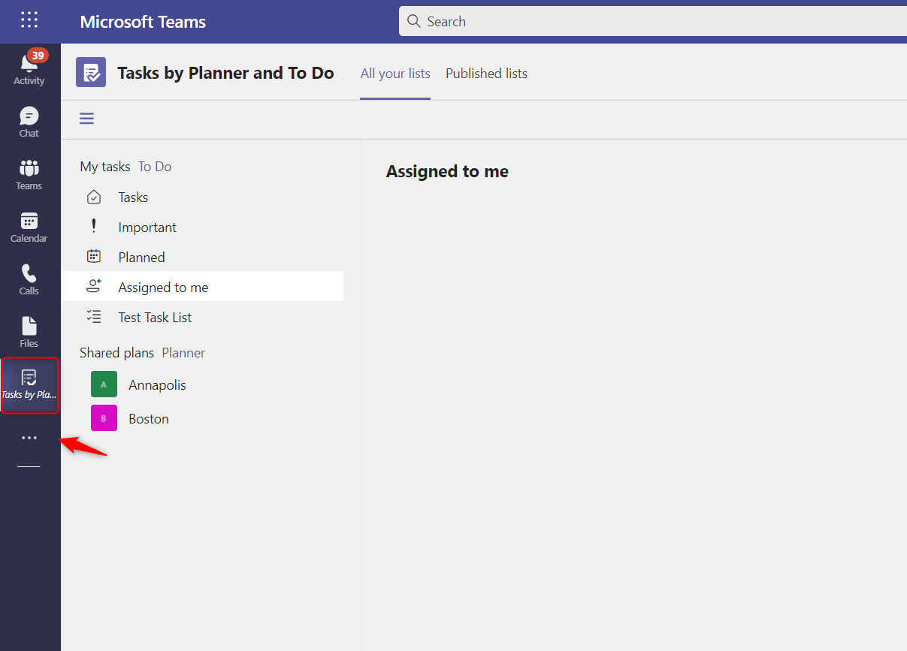](../media/tasks-planner.png#lightbox)

1. On the **Published lists** tab, select **Create a list** in the lower-right corner.

    > [!Important]
    > If tasks still exist, the **Create a list** button will be located in the lower-left corner.

    > [!div class="mx-imgBorder"]
    > [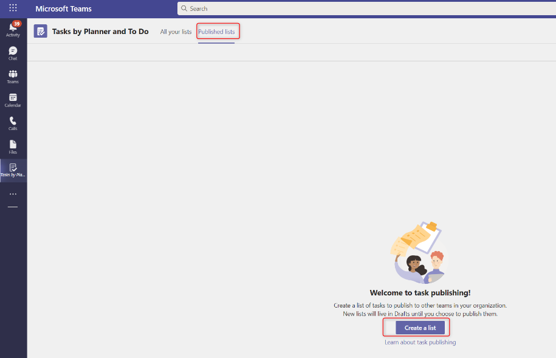](../media/create-list.png#lightbox)

1. Name the new list **Spring Retail update**. From the **Publish from** dropdown menu, select **Retail Communication** and then select **Create**.

    > [!div class="mx-imgBorder"]
    > [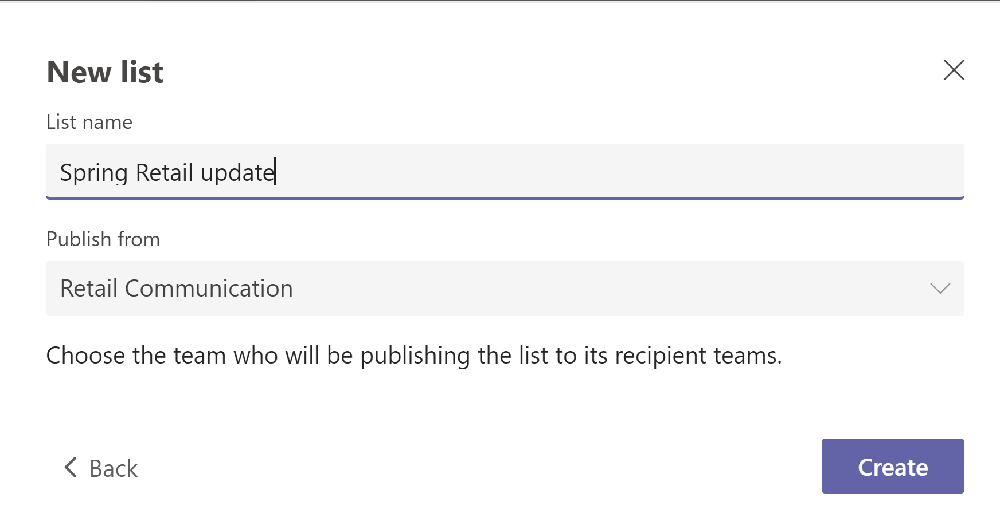](../media/new-list.png#lightbox)

1. Under **Task title**, give the first task the title "Set up Women's Spring Lineup Display." Select **Enter** or select the checkbox on the right.

    > [!div class="mx-imgBorder"]
    > [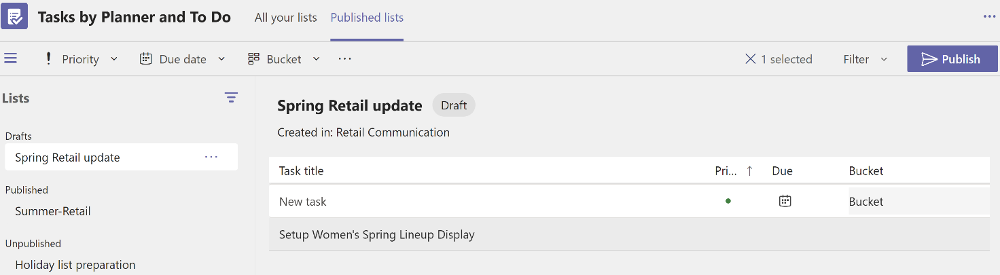](../media/task-title.png#lightbox)

1. In the **Drafts** list, select the task list and then select **Publish** in the upper-right corner.

    > [!div class="mx-imgBorder"]
    > [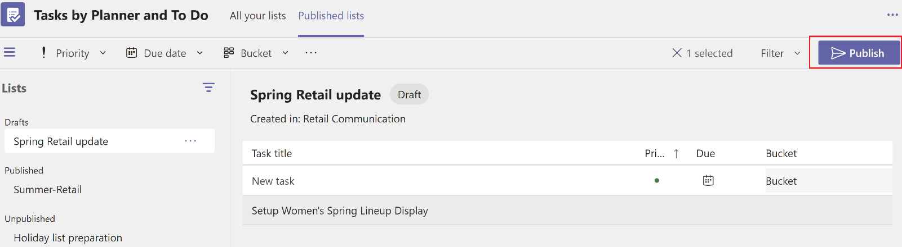](../media/drafts.png#lightbox)

1. In the **Select who to publish to** dialog, select the **Select teams from a hierarchy** option.

    > [!div class="mx-imgBorder"]
    > [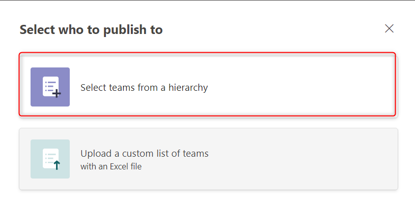](../media/select-teams.png#lightbox)

1. Expand **Retail Communication**, select the **Contoso Retail USA** checkbox, and then select **Next**.

    > [!div class="mx-imgBorder"]
    > [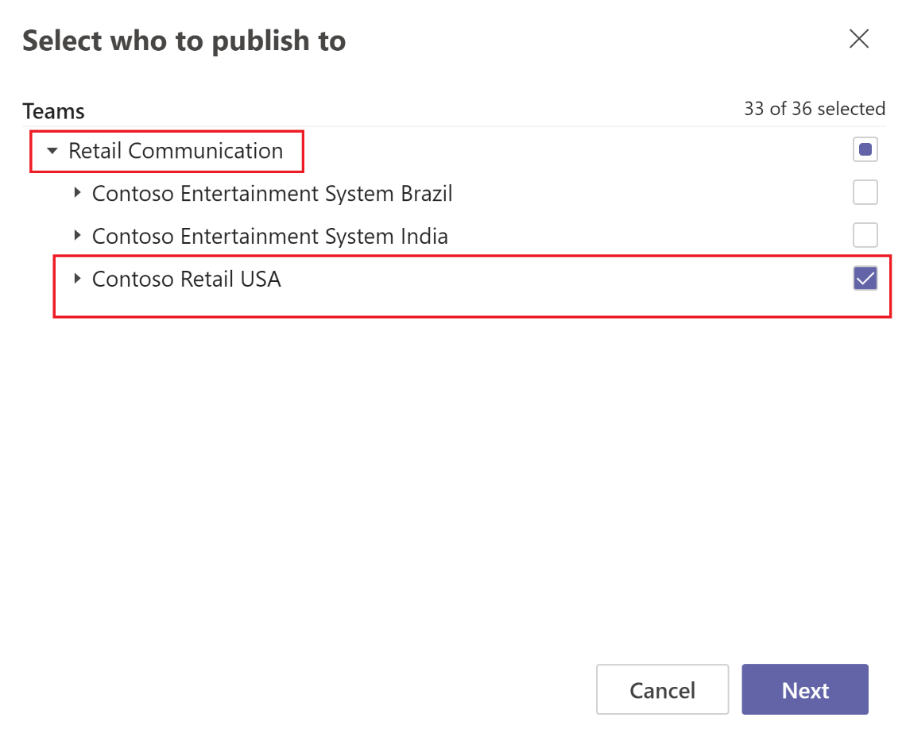](../media/select-publish.png#lightbox)

   The **Take one last look** screen will show that the **Spring Retail update** list that you created is ready to be published to 33 teams, as shown in the following image.

    > [!div class="mx-imgBorder"]
    > [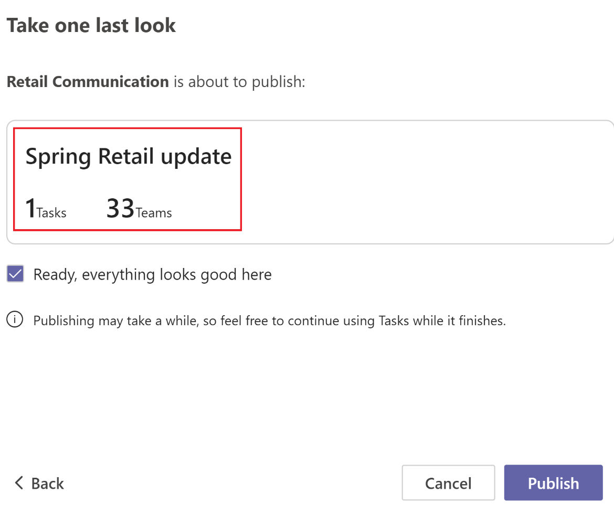](../media/last-look.png#lightbox)

1. Select the **Ready, everything looks good here** checkbox and then select **Publish**.

1. The **Spring Retail update** list has been published for all 33 teams. Now, go to **Received** to ensure that that all teams for each store have received the published task.

    > [!div class="mx-imgBorder"]
    > [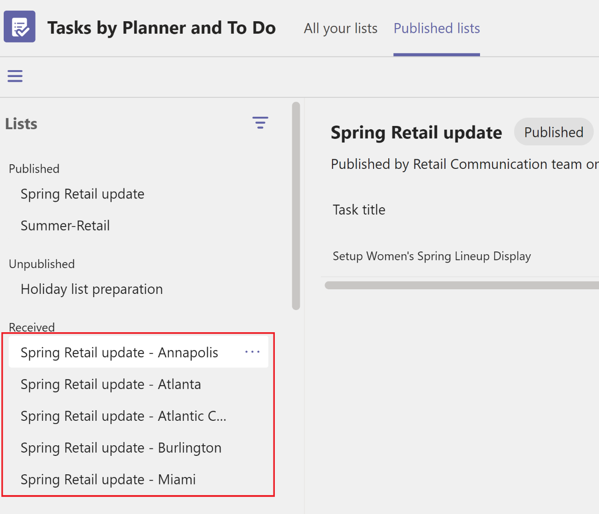](../media/received.png#lightbox)

Congratulations, you’ve successfully created a list of tasks and have assigned them to all stores in a region.

## Task 2: View and assign the tasks in the POS app in Commerce

In this task, you'll act as store manager and sign in to the POS app in a Dynamics 365 Commerce store by using the credentials of user Chris Gallagher (`chrisg@powerplatformopenhacks.onmicrosoft.com`) whom you created in Exercise 2 - Task 1. After signing in to POS, you'll view unassigned tasks and assign them to the store employees.

1. Sign in to the POS app in Dynamics 365 Commerce. Select a store in which you want to manage and assign tasks.

1. After you’ve signed in to the POS app in Commerce, select **Task management**.

    > [!div class="mx-imgBorder"]
    > [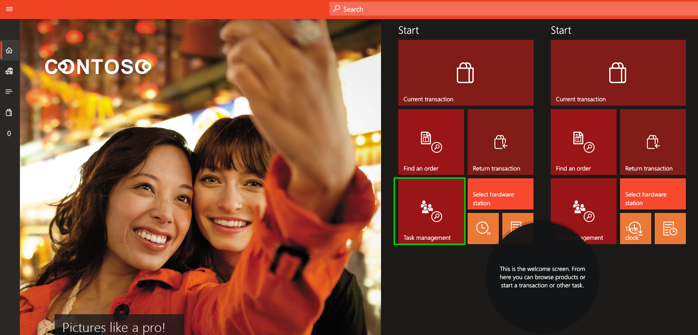](../media/task-management.png#lightbox)

1. In **Task management,** select **All tasks**. The task that you created in Teams and completed in the previous exercise should show up in the **All tasks** list.

1. Select the **Set up Women's Spring Lineup ** task.

    > [!div class="mx-imgBorder"]
    > [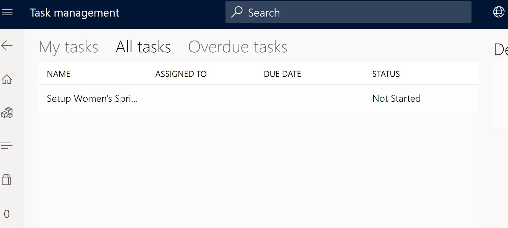](../media/task.png#lightbox)

1. Select the **Assign a task** icon in the lower-right corner of the screen.

    > [!div class="mx-imgBorder"]
    > [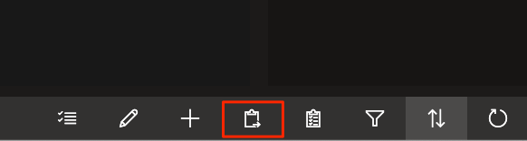](../media/assign.png#lightbox)

1. Select user **Emma Harris** (the store employee) to assign the task to.

    > [!div class="mx-imgBorder"]
    > [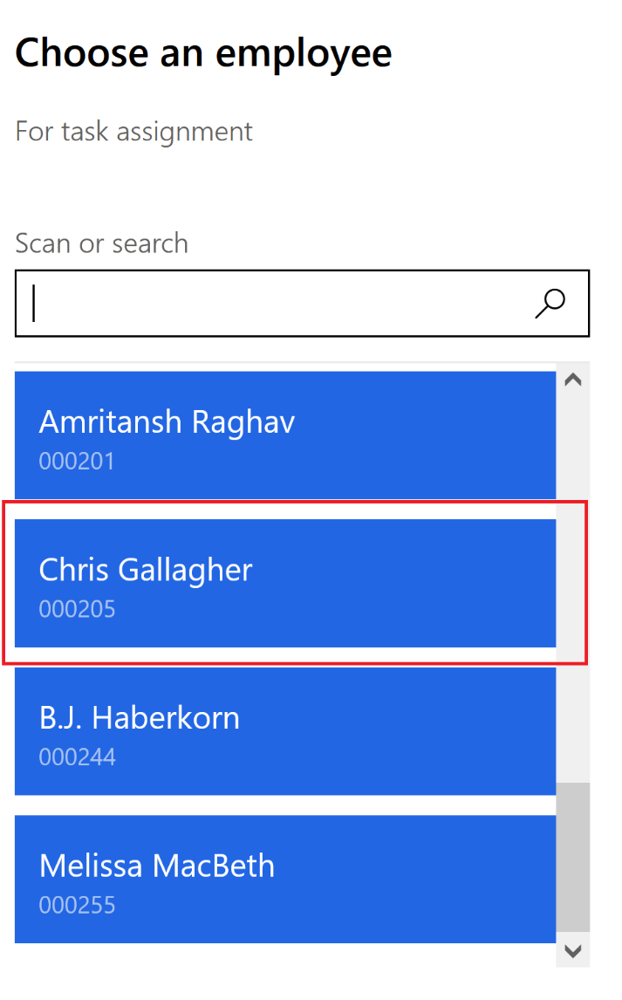](../media/choose-employee.png#lightbox)

1. In the **Assigned to** field in the task list, confirm that the task is assigned to Emma Harris.

Congratulations, you’ve successfully viewed the unassigned tasks and have assigned them to store employees.

## Task 3 - Review assigned tasks in Teams and mark them as complete

In this task, you'll function as a store employee (Emma Harris, for this example), and you’ll review the assigned tasks in Teams and mark them as complete after the assigned task has been completed.

1. Sign in to [Microsoft Teams](https://teams.microsoft.com/?azure-portal=true) and go to the assigned store.

    > [!div class="mx-imgBorder"]
    > [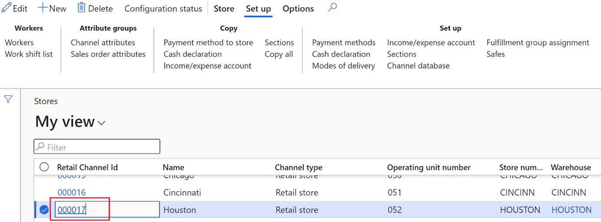](../media/houston.png#lightbox)

1. After you’ve signed in, the updates that you've received will show in the activity feed.

    > [!div class="mx-imgBorder"]
    > [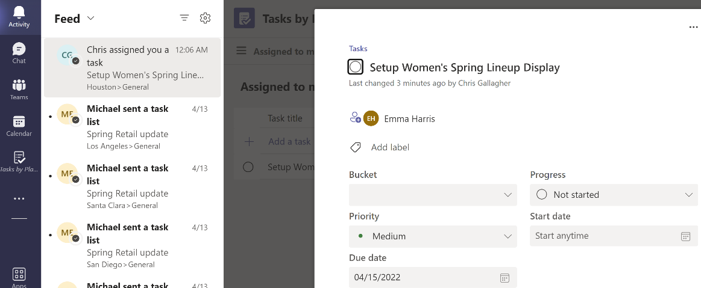](../media/feed.png#lightbox)

1. Go to **Task planner** in Teams and view the assigned tasks under **Assigned to me**. Select **Setup Women's Spring Lineup Display**.

    > [!div class="mx-imgBorder"]
    > [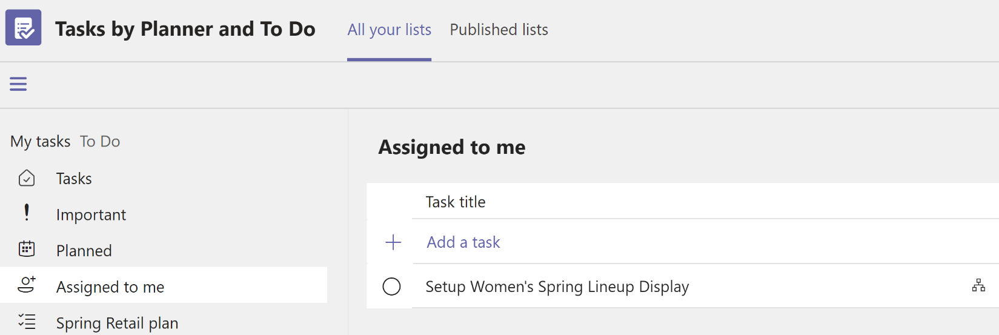](../media/assigned.png#lightbox)

1. Mark the **Set up Women's Spring Lineup Display** task as complete.

    > [!div class="mx-imgBorder"]
    > 

Congratulations, you’ve successfully completed the steps for viewing the assigned tasks and marking them as complete.

## Task 4 - Review the task list report

The retail communication manager can review the progress of the tasks in the list report.

1. Sign in to [Microsoft Teams](https://teams.microsoft.com/?azure-portal=true) and go to the assigned store. In this example, you can sign in as Michael Ellen (the retail communication manager).

1. After you’ve signed in, you can view the task list report and progress of each task by store. (It can take approximately five minutes to update the list report back in Microsoft Teams.)

    > [!div class="mx-imgBorder"]
    > 

Congratulations, you’ve successfully completed the steps for reviewing the progress of assigned tasks by using the list report.
