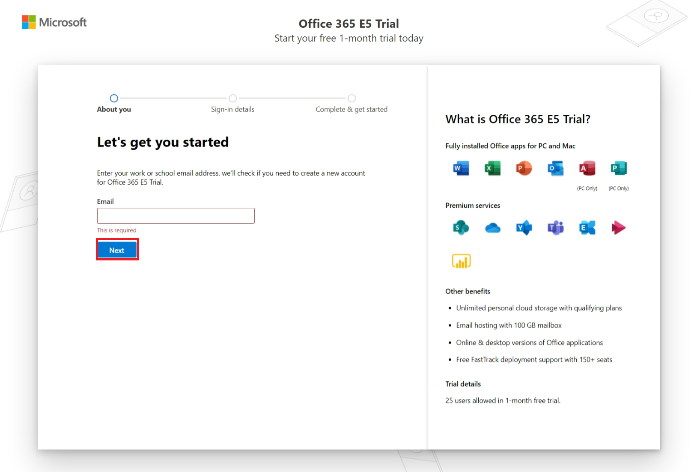
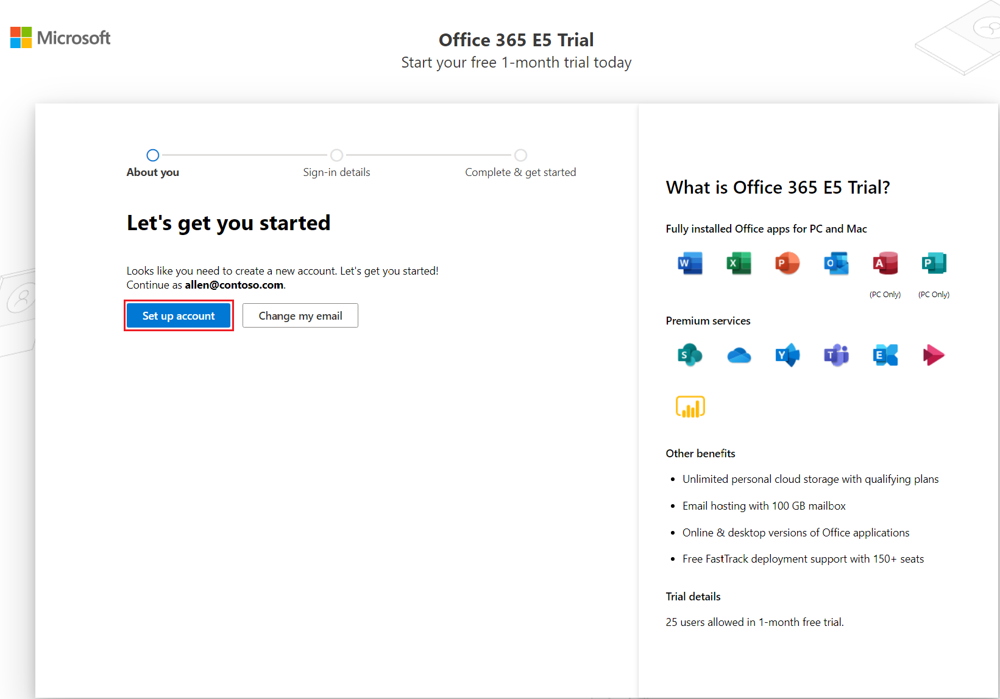
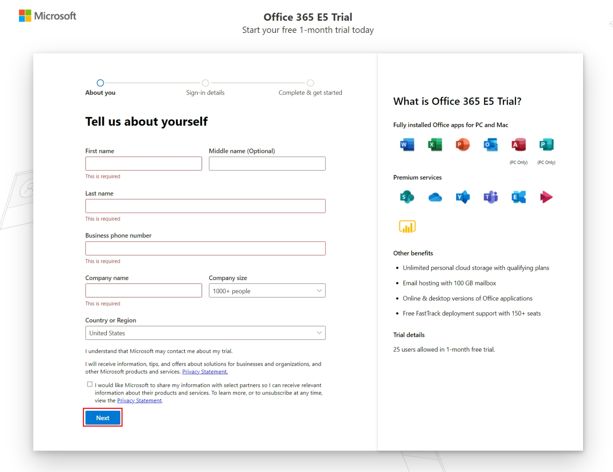
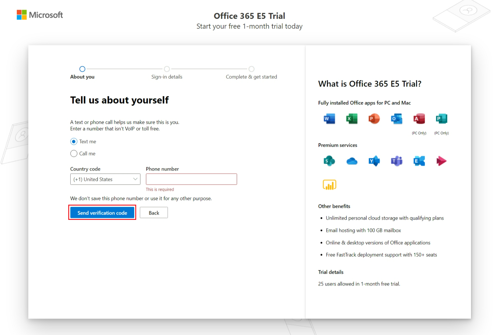
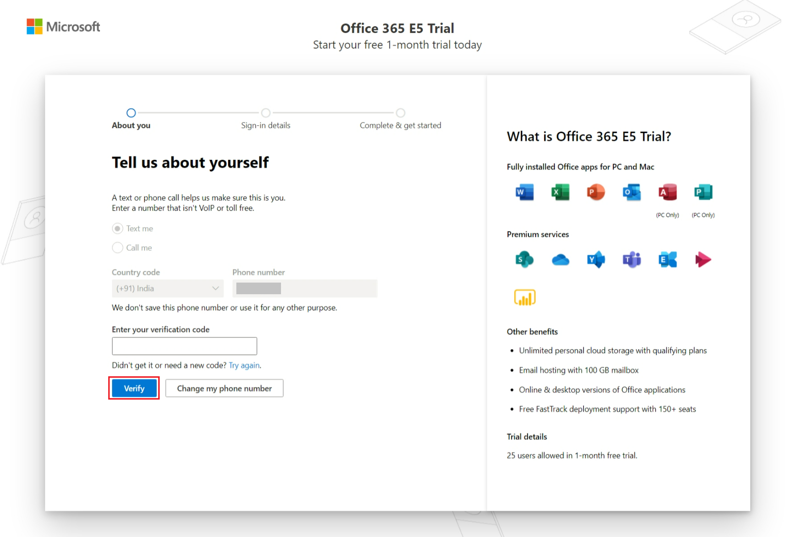
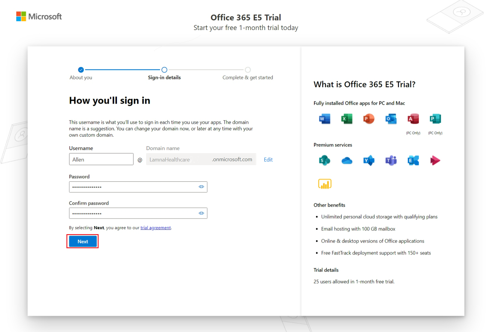
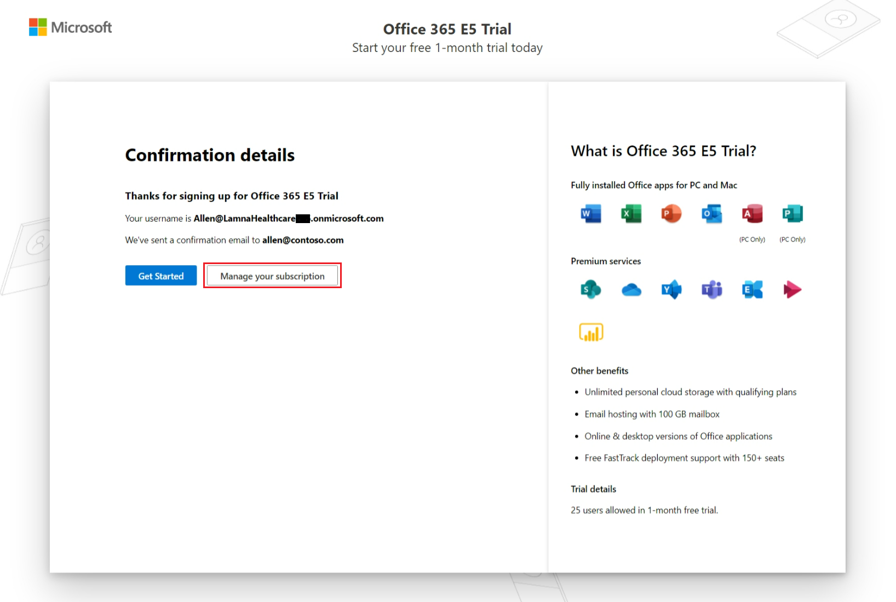
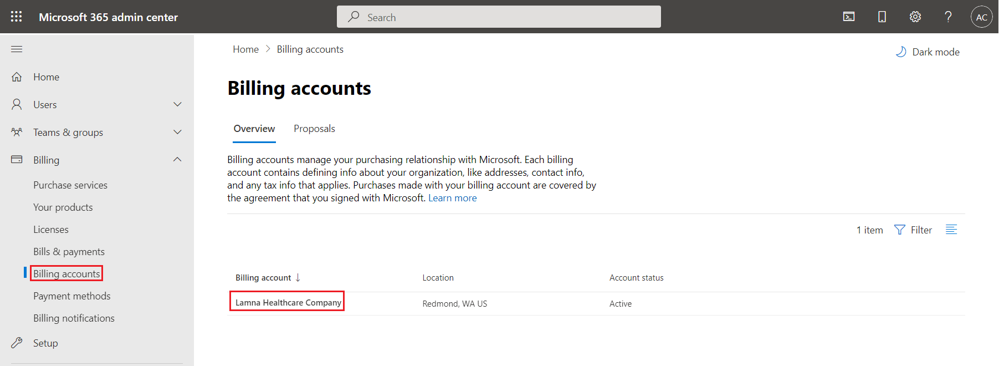
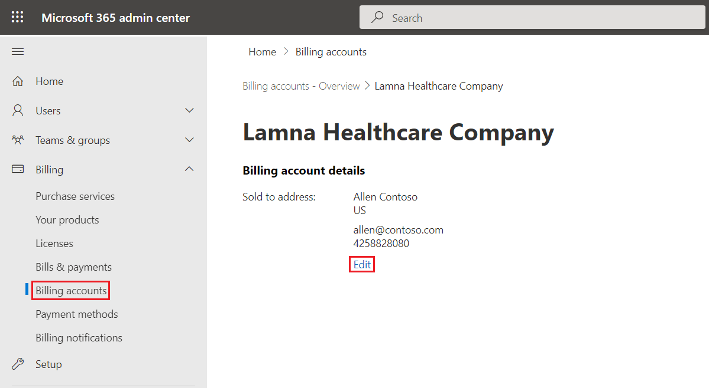
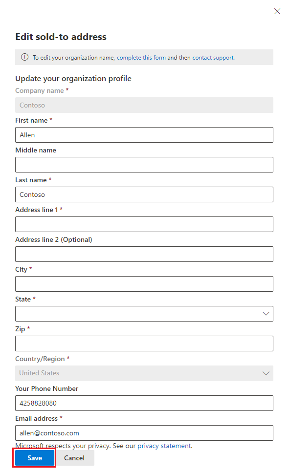

To deploy Microsoft Cloud for Healthcare in a Microsoft Dataverse environment, you need to add a tenant and the prerequisite licenses. 

In this exercise, you'll learn how to create a Microsoft 365 trial tenant. You can skip this exercise if you've already created a trial tenant and added the trial licenses.

## Task 1 - Create a Microsoft 365 tenant 

In this task, you'll learn how to create a Microsoft 365 trial tenant and obtain the Microsoft Office 365 E5 trial license. You can skip this task if you already have a tenant. 

1.  Open an internet browser in In-Private or Incognito mode. 

1.  Go to  [Office 365 E5 Trial](https://signup.microsoft.com/get-started/signup?products=101bde18-5ffb-4d79-a47b-f5b2c62525b3&culture=en-us&ali=1,) page. Enter a valid email and select **Next**.  

	> [!div class="mx-imgBorder"]
	> 

1.  On the next page, select **Set up account.** 

	> [!div class="mx-imgBorder"]
	> 

1.  On the **About you** page, enter the details and select **Next**. 

	> [!div class="mx-imgBorder"]
	>   

1.  On the **About you** page, enter a valid phone number and select **Send verification code**. You can select **Text me** or **Call me** option to receive the verification code. 

	> [!div class="mx-imgBorder"]
	> 

1.  After you receive the verification code, enter the same in the **Enter your verification code** field and select **Verify.**

	> [!div class="mx-imgBorder"]
	>  

1.  On successful verification, you'll be taken to the **Sign-in details** page. Enter your desired username, password, and domain name, then select **Next** to create a Microsoft 365 trial tenant.

	> [!div class="mx-imgBorder"]
	>    

1.  On successful creation of a trial tenant, the **Confirmation details** page appears as shown below.

	> [!div class="mx-imgBorder"]
	>    

## Task 2 - Update billing account details  

In this task, you'll update the billing account details for the trial tenant, which you created in Task 1. 

> [!IMPORTANT] 
> You must update the billing account details to procure additional trial licenses.

1.	In your existing browser, open a new tab and go to [Microsoft 365 admin center.](https://admin.microsoft.com/AdminPortal/Home?#/BillingAccounts/billing-accounts) 

2.	On the left navigation, go to **Billing** > **Billing Accounts**. 

3. Select your billing account name in the right pane. 

    > [!div class="mx-imgBorder"]
    > 

4. On the **Billing account details** page, select **Edit**.

    > [!div class="mx-imgBorder"]
    > 

5. On the **Edit sold-to address** page, enter the details and select **Save.**

    > [!div class="mx-imgBorder"]
    > 

**Congratulations,** you've successfully created a Microsoft 365 tenant with Microsoft Office 365 E5 trial license and updated the billing account details to obtain extra trial licenses.