Microsoft Cloud for Healthcare solution relies on various components and hence you must obtain the following subsequent trial licenses. In this unit, you'll learn about validating product licenses, assigning them to a user account, and creating a free Azure account. 

> [!NOTE]
> To perform these tasks, you must make sure that you’re signed-in with the global administrator user account created in the Set up a Microsoft 365 tenant unit.

Then, complete the following tasks: 

- Dynamics 365 Customer Service Enterprise Trial 
- Dynamics 365 Customer Service Digital Messaging add-on Trial
- Dynamics 365 Sales Premium Trial
- Dynamics 365 Field Service Trial
- Dynamics 365 Marketing Trial
- Microsoft Cloud for Healthcare Trial
- Validate and Assign Licenses to Global Administrator
- Get Microsoft Azure Trial Subscription
  
## Task 1: Obtain Dynamics 365 Customer Service Enterprise Trial

In this task, you'll obtain the Dynamics 365 Customer Service Enterprise Trial license, which is a core component of Microsoft Cloud for Healthcare.

1.  Go to [Microsoft 365 admin center](https://admin.microsoft.com/?azure-portal=true).

2.  Go to **Billing > Purchase services** and select **Dynamics 365** under “View by category” section. 

	> [!div class="mx-imgBorder"]
	> [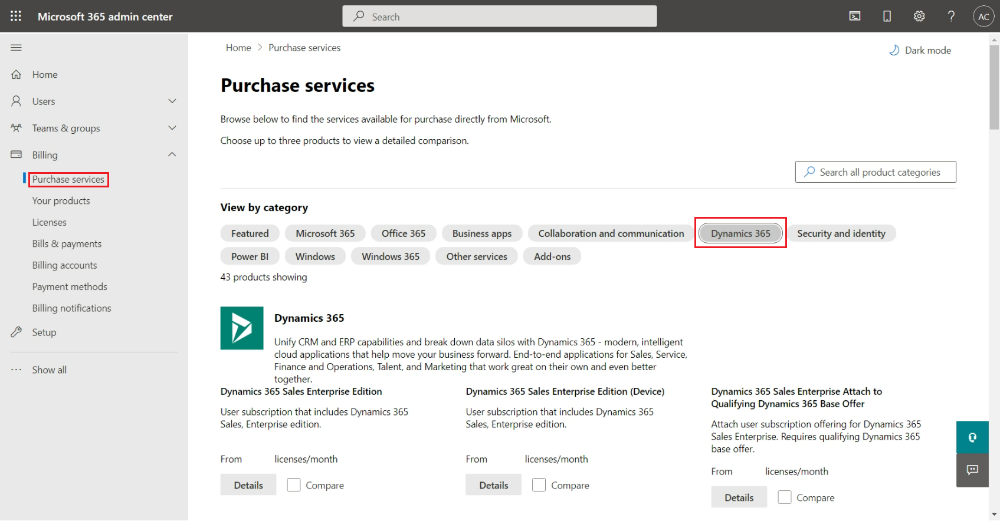](../media/customer-service.png#lightbox)

3. Find **Dynamics 365 Customer Service Enterprise** and select **Details.**

	> [!div class="mx-imgBorder"]
	> [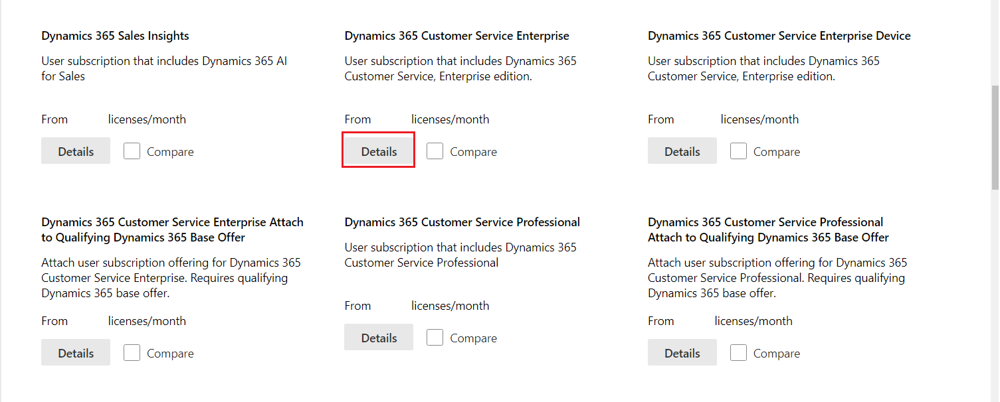](../media/customer-service-details.png#lightbox)

4.	On the **Product details** page, select **Start free trial.**

    > [!div class="mx-imgBorder"]
	> [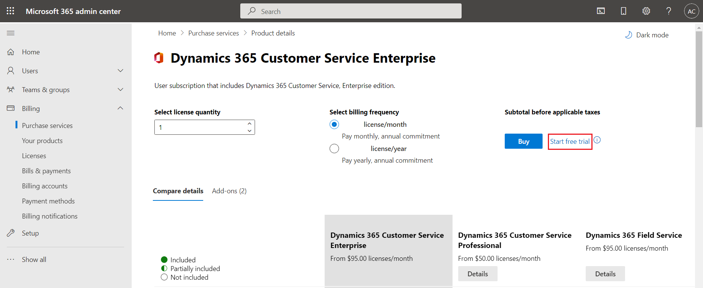](../media/customer-service-trial.png#lightbox)

5.	On the **Check out** page, select **Try now.**

    > [!div class="mx-imgBorder"]
	> [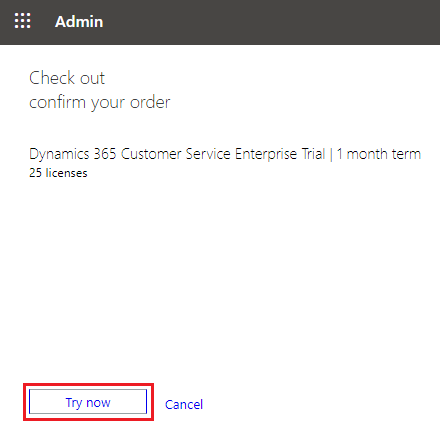](../media/customer-service-try-now.png#lightbox)

If you've not updated the billing account details in the **Set up a Microsoft 365 tenant** unit, you'll see the **Information required** pop-up window will display. Select **Continue** and enter the billing account details before you can check out the order for **Dynamics 365 Customer Service Enterprise Trial** license.

> [!div class="mx-imgBorder"]
> 

6.	On the **order receipt** page, select **Continue.**

    > [!div class="mx-imgBorder"]
    > 

## Task 2: Obtain the Dynamics 365 Customer Service Digital Messaging add-on Trial

In this task, you'll obtain **Dynamics 365 Customer Service Digital Messaging add-on Trial** license that adds multiple digital conversation channels within the **Omnichannel for Customer Service.**

1.  Go to [Microsoft 365 admin center](https://admin.microsoft.com/?azure-portal=true).

1. Navigate to  **Billing > Purchase services**, select **Add-ons** under **View by category** section.

1. In the search box, enter **Digital**.

1. On the **Dynamics 365 Customer Service Digital Messaging add-on** card, select **Details**.

	> [!div class="mx-imgBorder"]
	> [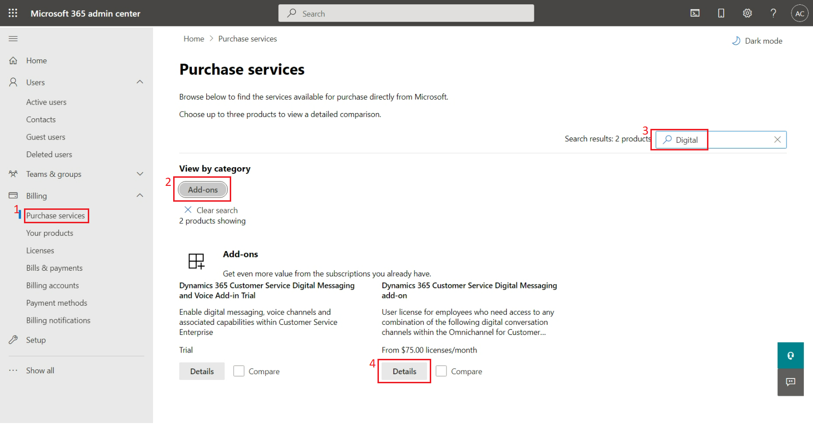](../media/digital-message-search.png#lightbox)

1.  On the **Product details** page, select **Start free trial**.

	> [!div class="mx-imgBorder"]
	> [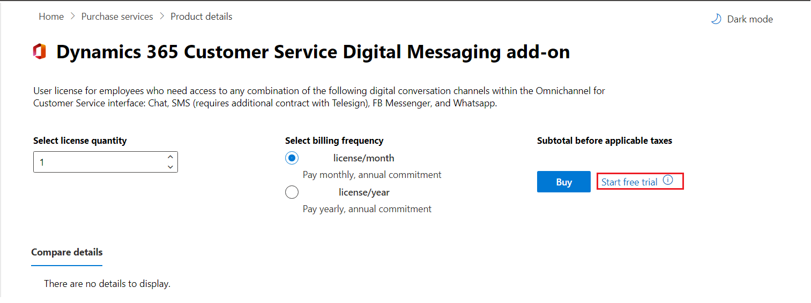](../media/digital-message-free-trial.png#lightbox)

1.  On the **Check out** page, select **Try now**.

	> [!div class="mx-imgBorder"]
	> [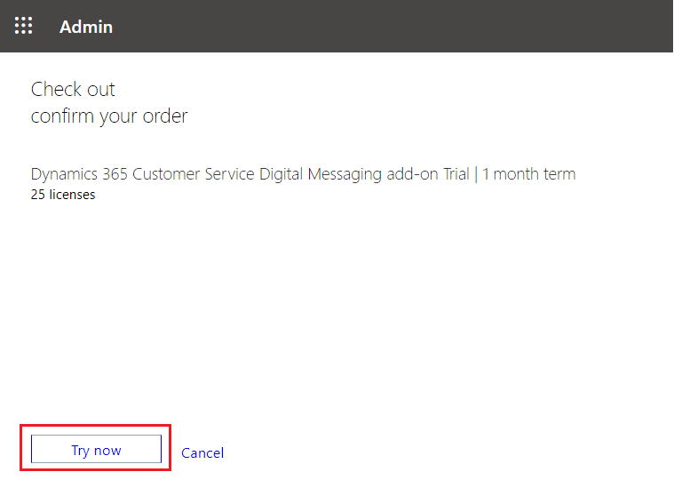](../media/digital-message-try-now.png#lightbox)

1. On the **order receipt** page, select **Continue**.

	> [!div class="mx-imgBorder"]
	> 

> [!NOTE]
>  After you obtain the trial license, it might take up to 24 hours for **Omnichannel for Customer Service** to be available in your **Dynamics 365 apps**.

## Task 3: Obtain Dynamics 365 Sales Premium Trial

In this task, you'll obtain the **Dynamics 365 Sales Premium Trial** license used by Health Assistant feature in Microsoft Cloud for Healthcare.

1.  Go to [Microsoft 365 admin center](https://admin.microsoft.com/?azure-portal=true).

1.  Navigate to  **Billing > Purchase services**, select **Dynamics 365** under **View by category** section.

1. Find **Dynamics 365 Sales Premium**, and select **Details**.

	> [!div class="mx-imgBorder"]
	> [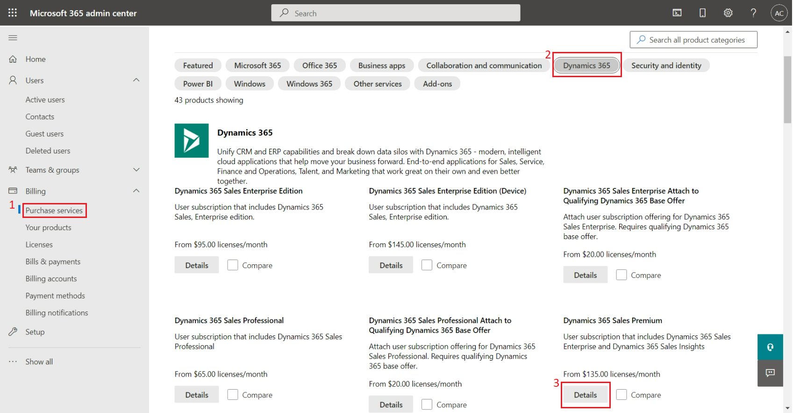](../media/sales-premium.png#lightbox)

1.  On the **Product details** page, select **Start free trial**.

	> [!div class="mx-imgBorder"]
	> [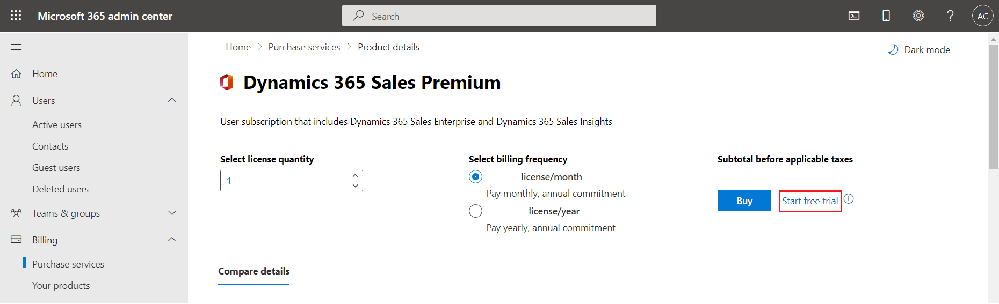](../media/sales-premium-trial-license.png#lightbox)

1.  On the **Check out** page, select **Try now**.

	> [!div class="mx-imgBorder"]
	> [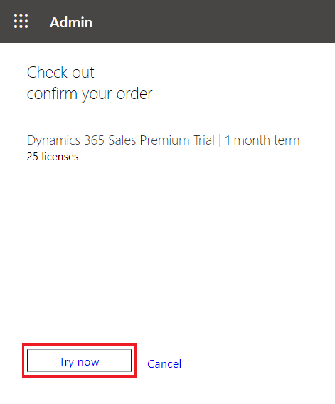](../media/sales-premium-try-now.png#lightbox)

1. On the **order receipt** page, select **Continue**.

	> [!div class="mx-imgBorder"]
	> [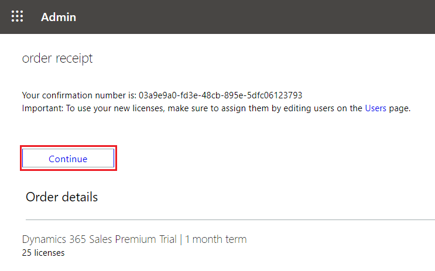](../media/sales-premium-order.png#lightbox)

## Task 4: Obtain Dynamics 365 Field Service Trial

In this task, you'll obtain the **Dynamics 365 Field Service Trial** license used by Home health solution in Microsoft Cloud for Healthcare.

1.  Go to [Microsoft 365 admin center](https://admin.microsoft.com/?azure-portal=true).

1.  Navigate to  **Billing > Purchase services**, select **Dynamics 365** under **View by category** section.

1. Use the search box to search for the string **Field**.

1. On the **Dynamics 365 Field Service** card, select **Details**.

	> [!div class="mx-imgBorder"]
	> [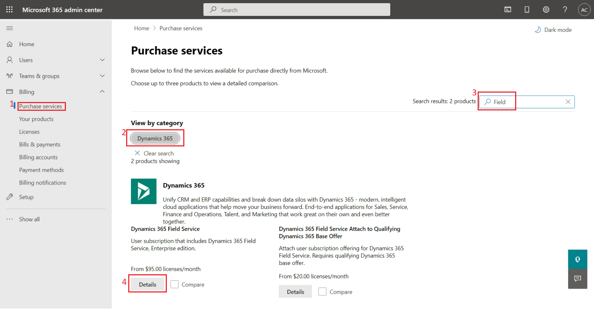](../media/field-service.png#lightbox)

1.  On the **Product details** page, select **Start free trial**.

	> [!div class="mx-imgBorder"]
	> [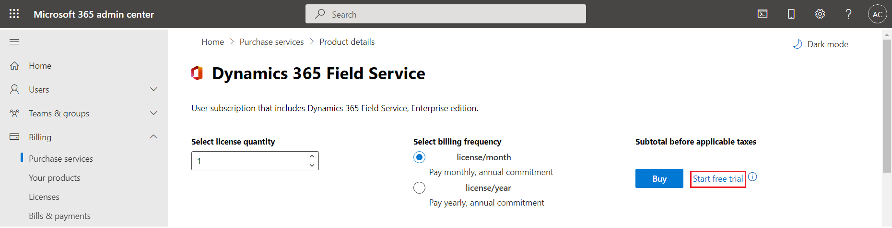](../media/field-service-trial.png#lightbox)

1.  On the **Check out** page, select **Try now**.

	> [!div class="mx-imgBorder"]
	> [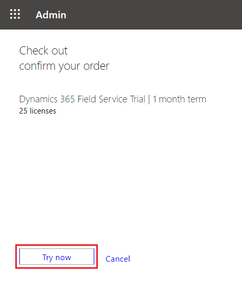](../media/field-service-try-now.png#lightbox)

1. On the **order receipt** page, select **Continue**.

	> [!div class="mx-imgBorder"]
	> [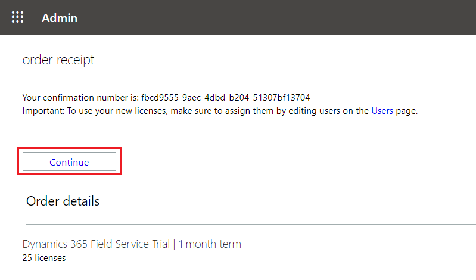](../media/field-service-order.png#lightbox)

## Task 5: Obtain Dynamics 365 Marketing Trial

In this task, you'll obtain the **Dynamics 365 Marketing Trial** license used by Patient Outreach solution in Microsoft Cloud for Healthcare. As **Dynamics 365 Marketing** is a tenant-based license, it’s neither required, nor available to be assigned to each user.

1. Go to [Microsoft 365 admin center](https://admin.microsoft.com/?azure-portal=true).

1. Navigate to  **Billing > Purchase services**, select **Dynamics 365** under **View by category** section.

1. Use the search box to search for the string **Marketing**.

1. On the **Dynamics 365 Marketing** card, select **Details**.

	> [!div class="mx-imgBorder"]
	> [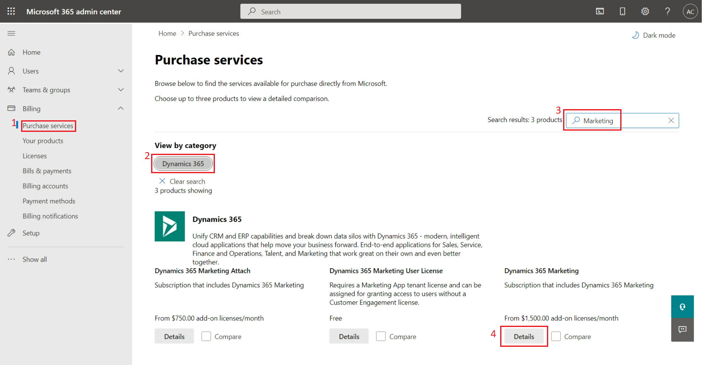](../media/marketing-trial.png#lightbox)

1.  On the **Product details** page, select **Start free trial**.

	> [!div class="mx-imgBorder"]
	> [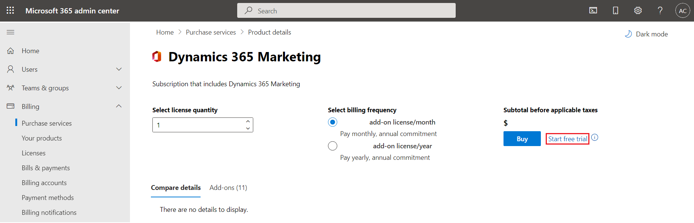](../media/marketing-trial-license.png#lightbox)

1.  On the **Check out** page, select **Try now**.

	> [!div class="mx-imgBorder"]
	> [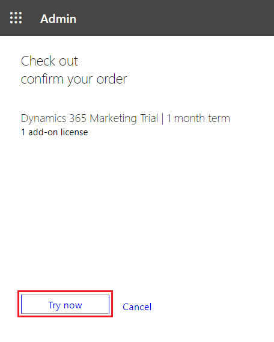](../media/marketing-try-now.png#lightbox)

1. On the **order receipt** page, select **Continue**.

	> [!div class="mx-imgBorder"]
	> 

## Task 6: Obtain a Microsoft Cloud for Healthcare Trial

In this task, you'll obtain a trial license for Microsoft Cloud for Healthcare. 

1.  Go to [Microsoft Cloud for Healthcare Trial License Request Form](https://aka.ms/MCHTrial/?azure-portal=true) and fill out the required information and select **Submit**.

1. You'll receive an email with a URL that contains an offer code that you can use to claim a 30-day trial license for Microsoft Cloud for Healthcare. After you've received that email, copy the URL.

1. Open a new tab while signed in to your **M365 trial tenant** as global administrator, and then paste the URL.

1.  Enter the email address of the global administrator that is associated with your tenant and then select **Next**.

	> [!div class="mx-imgBorder"]
	> [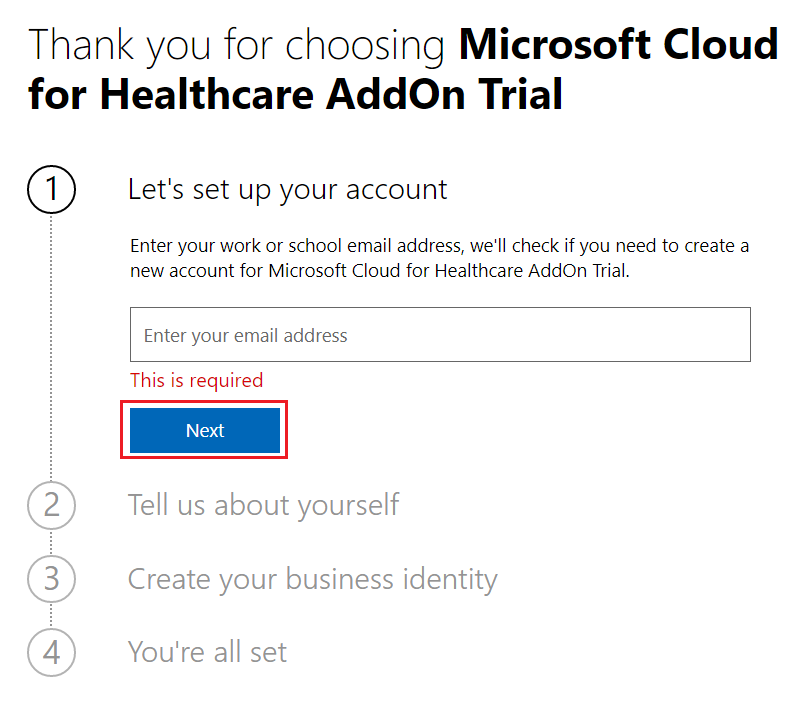](../media/healthcare-add-on.png#lightbox)

1.  Select **Sign in**.

	> [!div class="mx-imgBorder"]
	> [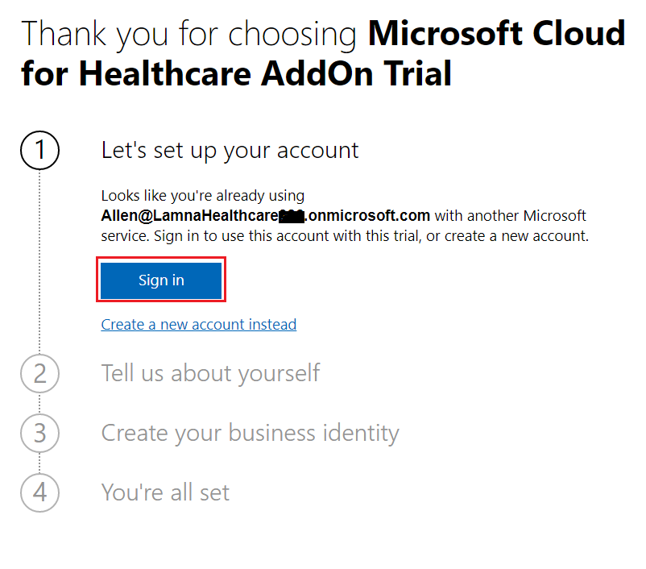](../media/healtcare-signin.png#lightbox)

1. On the **Check out** page, select **Try now**.
	> [!div class="mx-imgBorder"]
	> [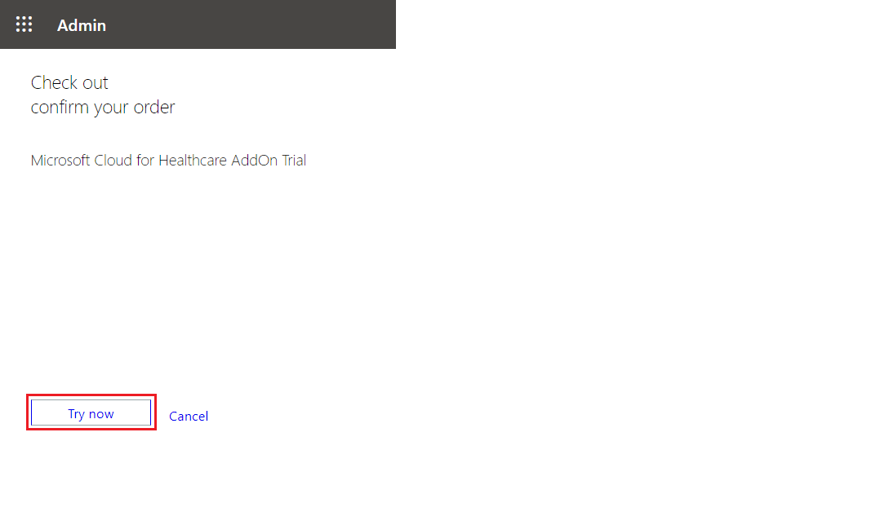](../media/healtcare-try-now.png#lightbox)

1. On the **order receipt** page, select **Continue**.

	> [!div class="mx-imgBorder"]
	> [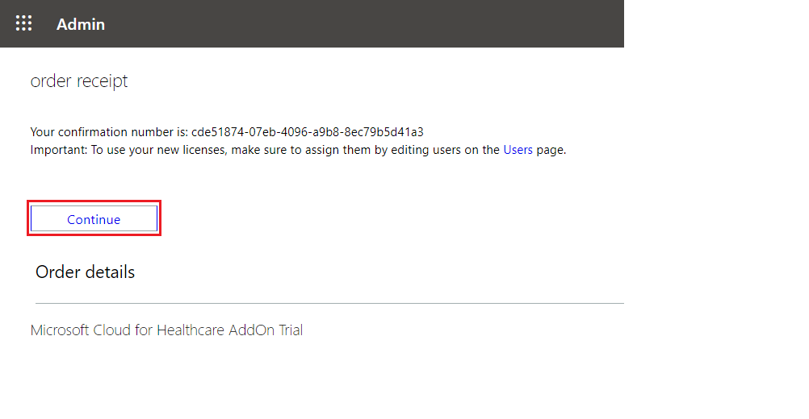](../media/healtcare-order.png#lightbox)

## Task 7: Validate and Assign Licenses to Global Administrator

In this task, you’ll validate if the product licenses obtained are available in the tenant. You’ll assign these trial licenses to a user account. The following steps show how you can assign trial licenses to a global administrator account.

1. Go to [Microsoft 365 admin center](https://admin.microsoft.com/?azure-portal=true).

1. Navigate to  **Billing > Your Products**.

1. In the right pane, under **Products from Microsoft and others** section, you'll be able to view all the product licenses you obtained. 

> [!div class="mx-imgBorder"]
	> [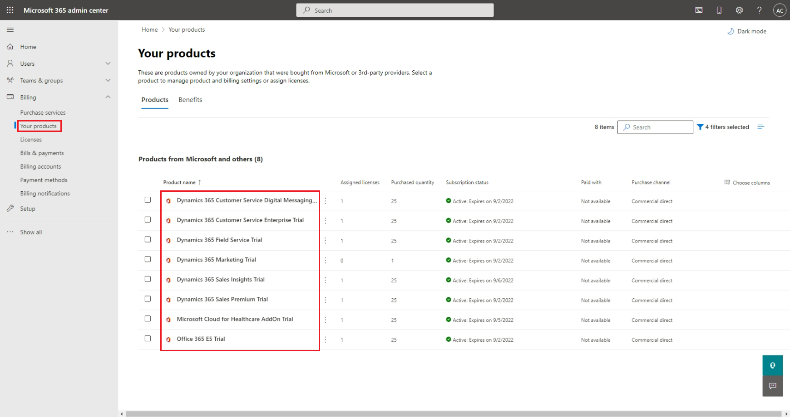](../media/track-installs.png#lightbox)

4. Validate the product licenses. Go to **Users > Active users** to assign these product licenses to the global administrator account. 

5. In the right pane, under **Display name**, select a user with global administrator role. Select **Licenses and apps** and select the product licenses and select **Save changes.**

	> [!div class="mx-imgBorder"]
	> 

> [!NOTE]
> **Dynamics 365 Marketing** is a tenant-based license; hence, it’s not visible under the **Licenses and apps** section to be assigned to a specific user.

## Task 8: Get Microsoft Azure Trial Subscription

In this task, you'll obtain a trial Azure subscription.

> [!NOTE]
> The Terms of Use agreement in Azure limits free trial activation only for a user who’s new to Azure. If you’ve already had any other type of Azure subscription, you won’t be able to activate a free trial.

1.	Log into your **Microsoft 365 tenant** as global administrator, open a new tab in the browser and go to [Create free Azure account](https://azure.microsoft.com/free/) page and select **Start free**.

	> [!div class="mx-imgBorder"]
	> [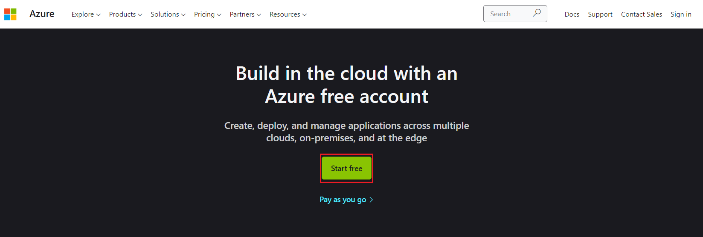](../media/azure-trial-license.png#lightbox)

2.	You’ll be taken to the sign-up page. Fill in all the required information, verify your identity either by selecting **Text me** or **Call me** button, then select **Next.**

    > [!div class="mx-imgBorder"]
	> 

3.	On the **Identity verification by card** page, provide your credit card details and select **Sign up**.

    > [!div class="mx-imgBorder"]
	> [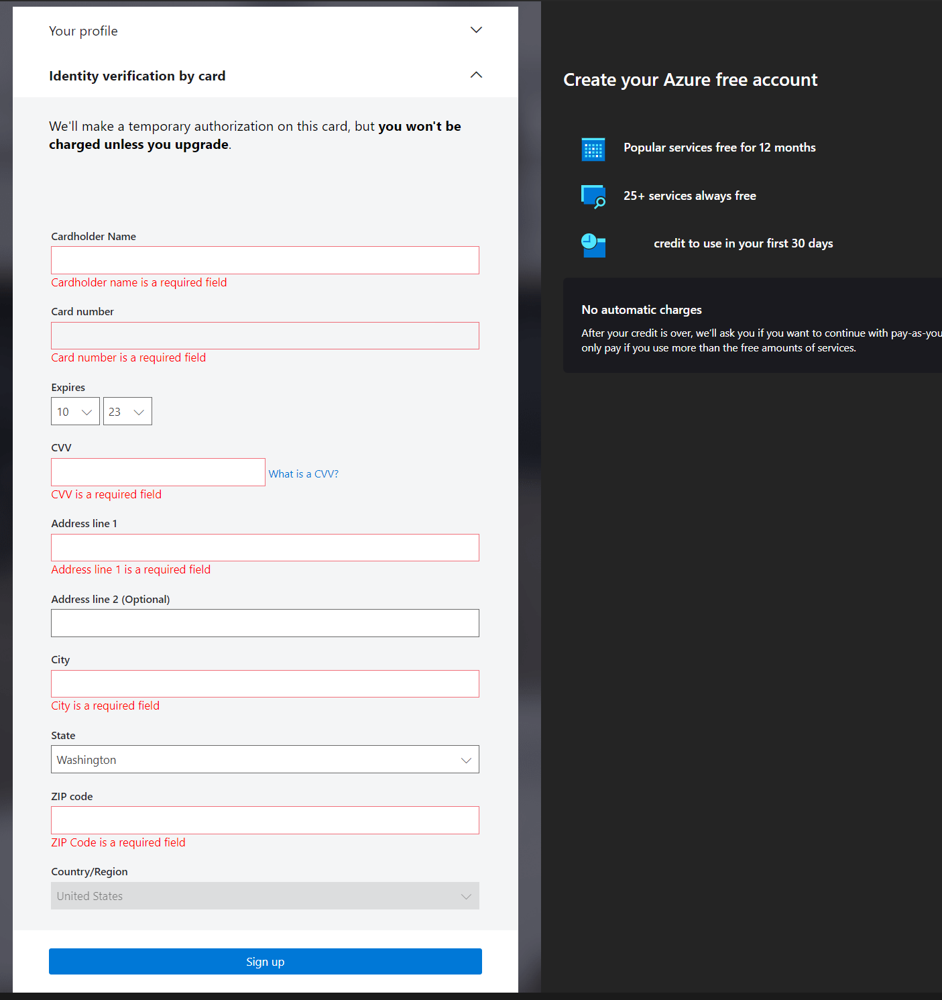](../media/azure-verification-card.png#lightbox)

> [!NOTE]
> A credit card is only required to verify your identity. You will not be charged unless you upgrade your subscription. Please read the following Microsoft Docs to understand how to [Avoid charges with your Azure free account](/azure/cost-management-billing/manage/avoid-charges-free-account).

**Congratulations!**. You successfully added the necessary trial licenses to your **Microsoft 365 tenant** and successfully procured **Azure** trial subscription.
