In this exercise, you'll learn about several configurations that are required to successfully deploy and use Microsoft Cloud for Healthcare. You can make all major configuration changes by using the following four tools:

-   Microsoft Azure portal

-   Microsoft Power Platform admin center

-   Microsoft Power Apps portals

-   Microsoft Cloud Solution Center

> [!NOTE]
> Setting up Omnichannel for Customer Service and Power Apps portals will take several hours to complete (estimated at 3-4 hours to complete for each). We recommend that you set up both applications concurrently. You'll need to complete all configuration steps before deploying **Microsoft Cloud for Healthcare.**

## Task 1: Register an app in Azure AD

In this task, you'll learn how to register a new application in Microsoft Azure Active Directory (Azure AD), grant delegated and
application permissions, and create a client secret.

1.  While signed in to your **Microsoft 365 tenant**, open a new browser tab, and then go to the [Azure portal](https://portal.azure.com). In the upper-left corner of the page, select the hamburger icon (three horizontal lines) and then select **Azure Active Directory**.

	> [!div class="mx-imgBorder"]
	> [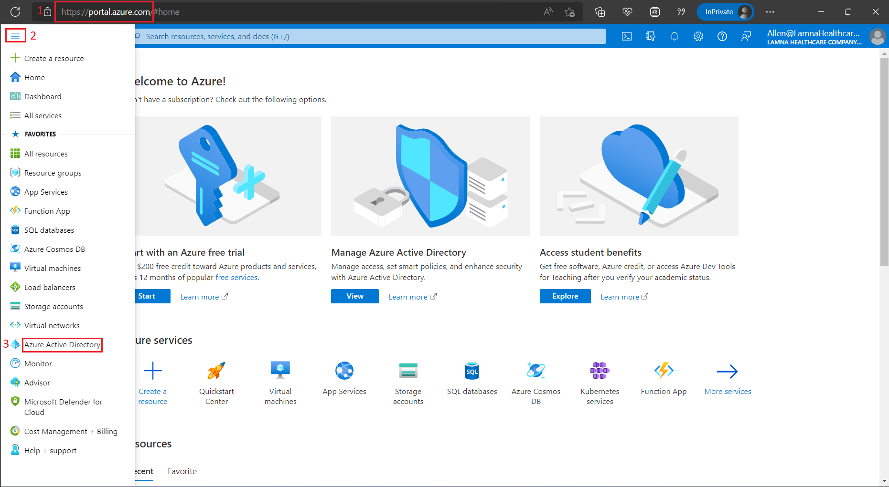](../media/azure-active-directory.png#lightbox)

2.  On the left navigation, select **App registrations** and then select **+ New registration** in the right pane.

	> [!div class="mx-imgBorder"]
	> [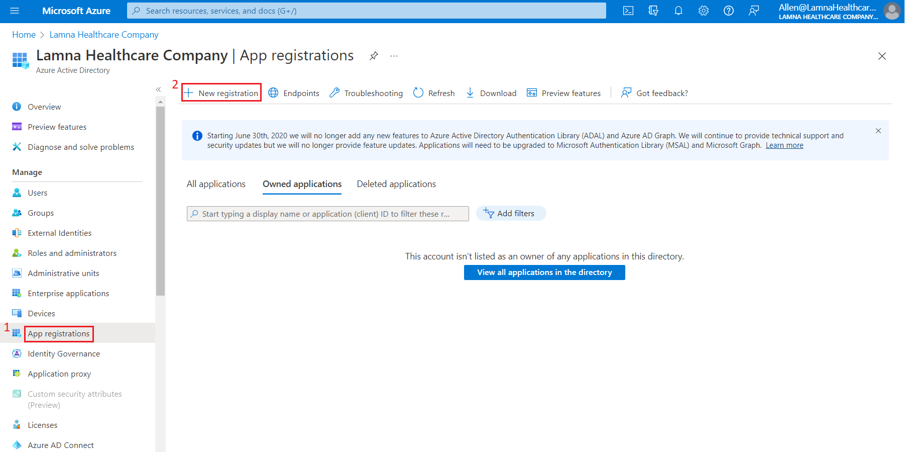](../media/azure-new-registration.png#lightbox)

3.  On the **Register an application** page, enter the name for the bot and then select the **Accounts in any organizational directory (Any Azure AD directory - Multitenant)** option button under the **Supported account types** section. Then, select **Register**.

	> [!div class="mx-imgBorder"]
	> [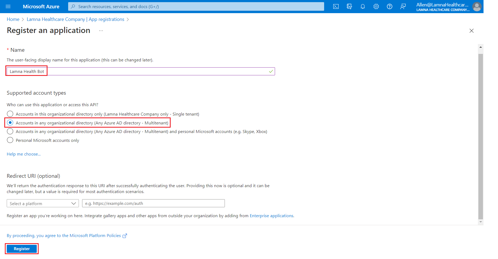](../media/azure-register-application.png#lightbox)

> [!NOTE]
>  You'll need to register the application as multitenant because it enables Microsoft Azure Bot Service (in the botframework.com tenant) to authenticate requests that are coming from the bot that's registered in your tenant. This requirement is part of the service-to-service authentication protocol that's used by Azure Bot Service. Single tenant application registration is also supported by Azure bot created using Bot Framework version 4.15 or later. However, for this learning path,
you'll register the application as multitenant.*

4.  Select **API permissions** on the left navigation. On the right pane, select **+ Add a permission**.

	> [!div class="mx-imgBorder"]
	> [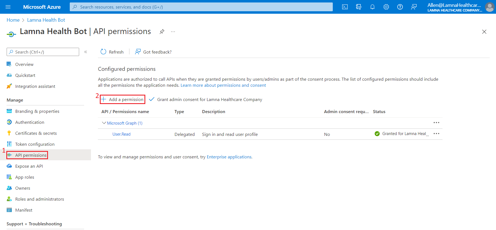](../media/azure-add-permission.png#lightbox)

5.  On the **Request API permissions** page, select **APIs my organization** **uses**. Use the search box to search for the string
    **Dataverse**. From the search result, select **Dataverse**.

	> [!div class="mx-imgBorder"]
	> [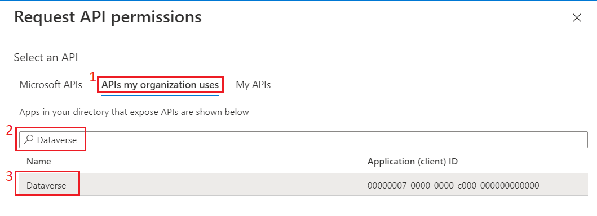](../media/azure-request-api.png#lightbox)

6.  Select **Delegated permissions**. Under the **Select permissions** section, select the checkbox beside  **user_impersonation**. Then, select **Add permissions**.

	> [!div class="mx-imgBorder"]
	> [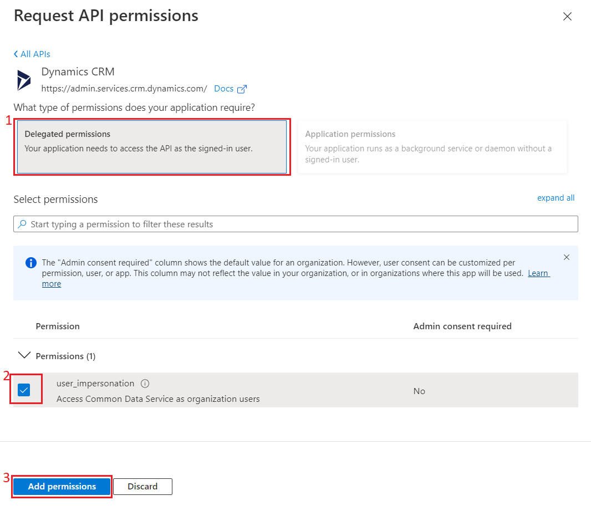](../media/azure-delegate-permission.png#lightbox)

7.  Select **API permissions** on the left navigation. On the right pane, select **+ Add a permission**. Select **Microsoft APIs** and then select **Microsoft Graph**.

	> [!div class="mx-imgBorder"]
	> [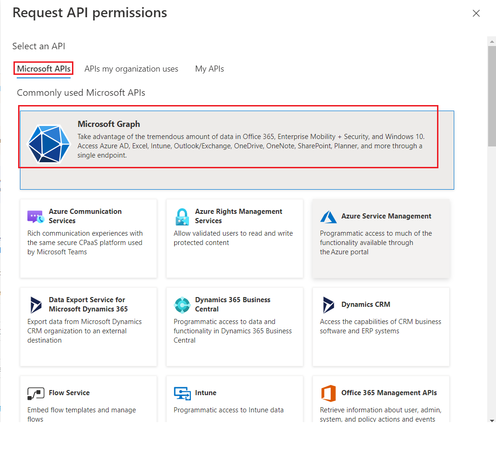](../media/azure-microsoft-api.png#lightbox)

8.  On the **Request API permissions** page, select **Application permissions**. Use the search box to search for the string
    **calendars**. Select the checkbox beside **Calendars.ReadWrite** and then select **Add permissions**.

	> [!div class="mx-imgBorder"]
	> [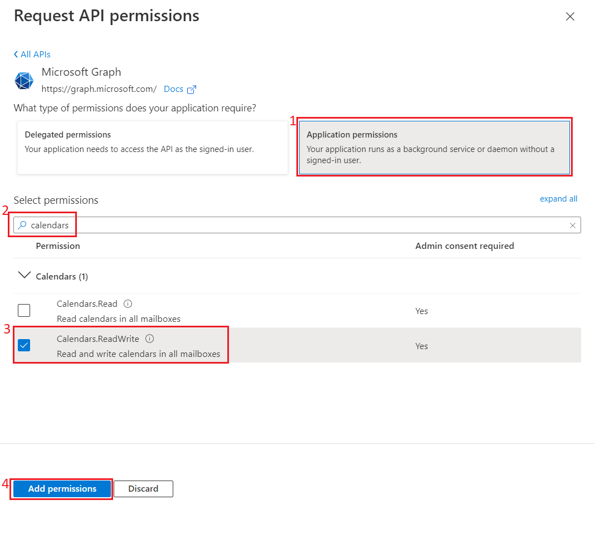](../media/azure-calendar.png#lightbox)

9.  Select **Grant admin consent**, as shown in the following image.

    > [!div class="mx-imgBorder"]
	> [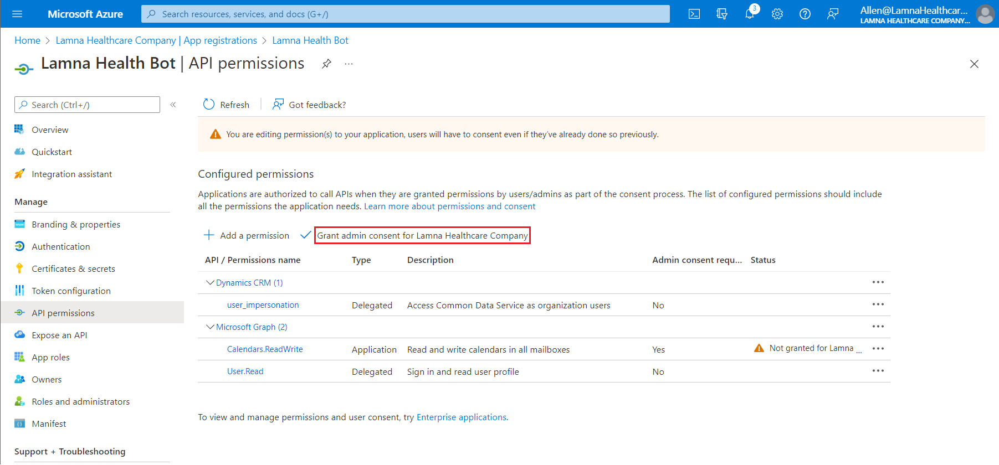](../media/azure-bot-permission.png#lightbox)

10. On the **Grant admin consent confirmation** pop-up window, select **Yes**.

	> [!div class="mx-imgBorder"]
	> [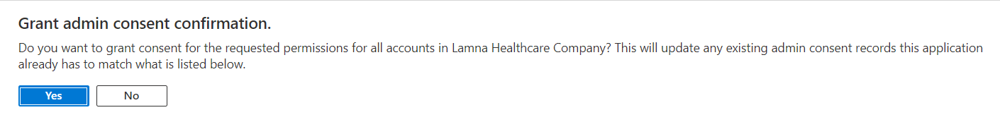](../media/azure-confirmation.png#lightbox)

    The status for each added permission will change to **Granted**, as shown in the following screenshot.

    > [!div class="mx-imgBorder"]
    > [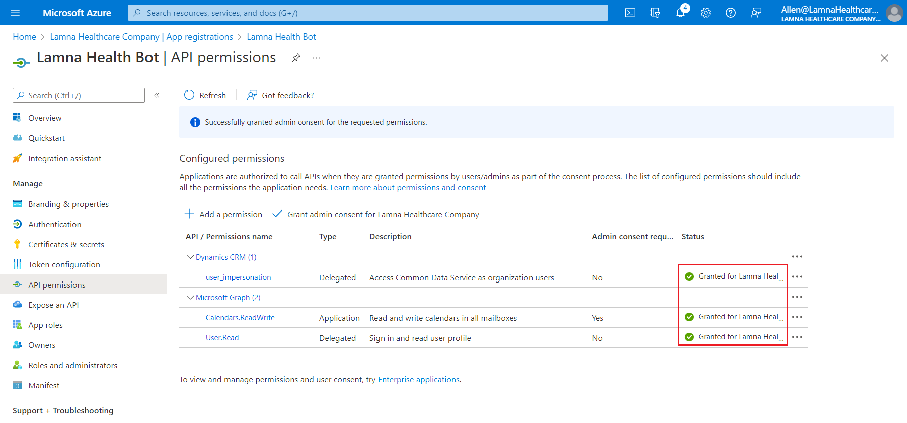](../media/azure-permission-list.png#lightbox)

11. On the left navigation, select **Certificates & secrets**, and then in the right pane, select **+ New client secret**. On the **Add a client secret** blade, provide the **Description**, leave the **Expires** value at its default setting, and then select **Add**.

	> [!div class="mx-imgBorder"]
	> [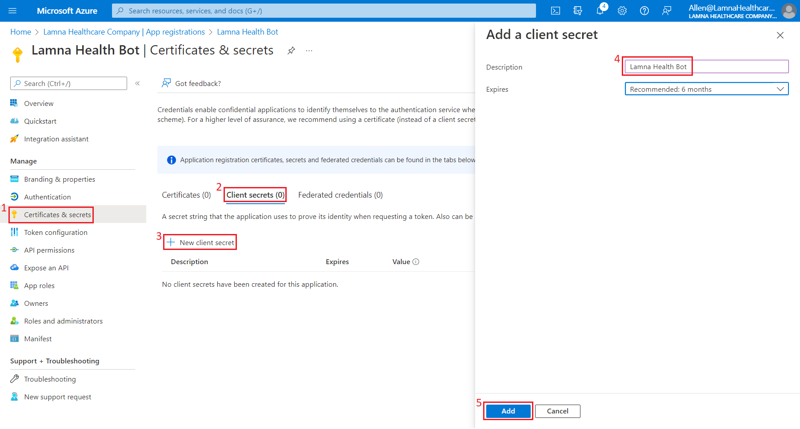](../media/azure-secrets.png#lightbox)

> [!NOTE]
> Next, you'll need to create an application secret so that you can use it along with this application ID to authenticate the bot.

12. Copy the secret value and then save it in a notepad so that you can use it later in this learning path.

	> [!div class="mx-imgBorder"]
	> [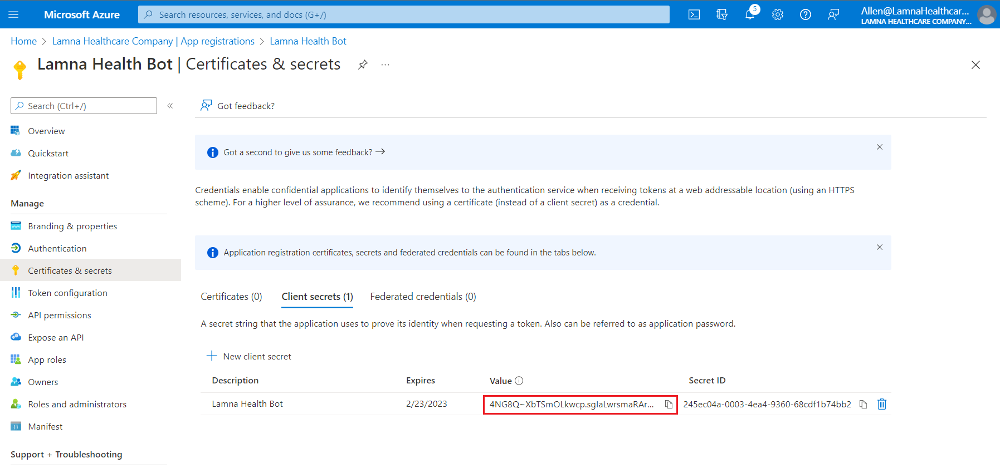](../media/azure-secrets-value.png#lightbox)

> [!NOTE]
> After you've created the secret and the page has refreshed, the secret value will no longer be available to copy.*

13. On the left navigation, select **Overview**. From the right pane, copy the **Application (client) ID** and then save it in a notepad so that you can use it later in this learning path.

	> [!div class="mx-imgBorder"]
	> [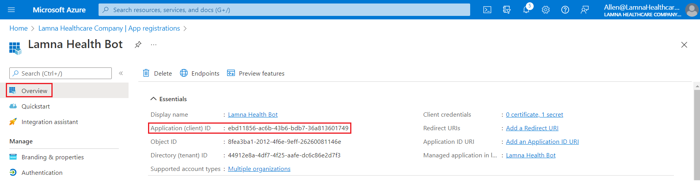](../media/azure-client-id.png#lightbox)

## Task 2: Create a subscription-based, trial Dataverse environment

In this task, you'll create a subscription-based, trial Dataverse environment with a database.

1.  While signed in to your Microsoft 365 tenant, open a new tab, and then go to [Power Platform admin
    center](https://admin.powerplatform.microsoft.com/).

2.  On the left navigation, select **Environments**. In the right pane, select **+ New**.

	> [!div class="mx-imgBorder"]
	> [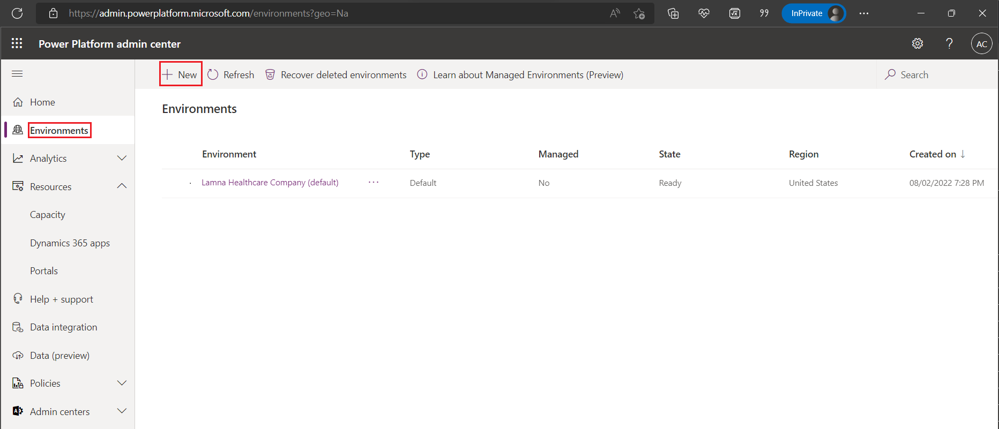](../media/dataverse.png#lightbox)

3.  On the **New environment** form, provide the following details and then select **Next**.

    - **Name** - Lamna Healthcare

    - **Region** - United States

    - **Type** - Trial (subscription-based)

	> [!div class="mx-imgBorder"]
	> [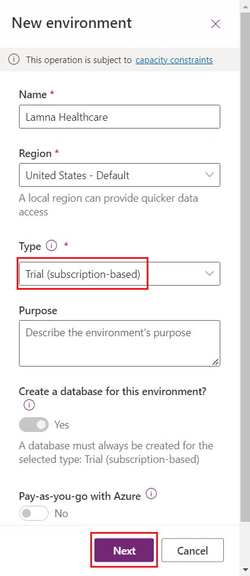](../media/dataverse-trial.png#lightbox)

4.  On the **Add database** form, select **Click** **here**, provide details as shown in the following screenshot, and then select
    **Save**.

    - **URL** - lamnahealthcare

    - **Enable Dynamics 365 apps?** - Yes

    - **Automatically deploy these apps** - None

	> [!div class="mx-imgBorder"]
	> [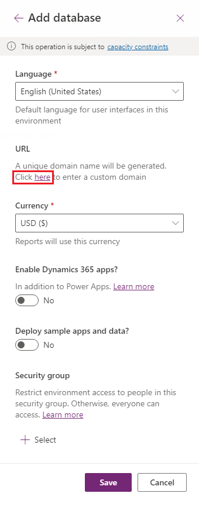](../media/dataverse-database.png#lightbox)

    > [!div class="mx-imgBorder"]
    > [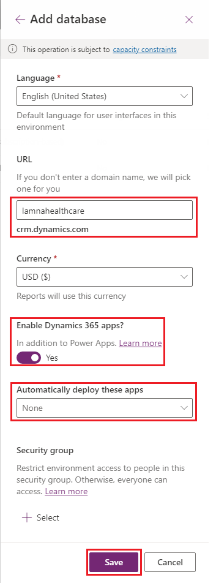](../media/dataverse-database-url.png#lightbox)

1. After the environment has been created successfully, it should appear as shown in the following image.

    > [!div class="mx-imgBorder"]
    > [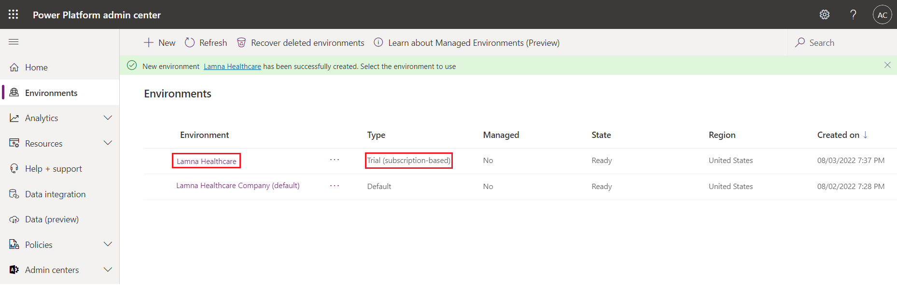](../media/dataverse-trial-subscription.png#lightbox)

## Task 3: Enable the Dynamics 365 Field Service app in the Dataverse environment

In this task, you'll install the **Dynamics 365 Field Service** app in the **Lamna Healthcare** environment.

1.  While signed in to your Microsoft 365 tenant, open a new tab and then go to [Power Platform admin
    center](https://admin.powerplatform.microsoft.com/).

2.  On the left navigation, select **Resources** **\>** **Dynamics 365 apps**.

3.  In the upper-right corner of the page, use the search box to search for the string **Field**.

4.  In the right pane, select **Dynamics 365 for Field Service** and then select **Install**, as shown in the following screenshot.

	> [!div class="mx-imgBorder"]
	> [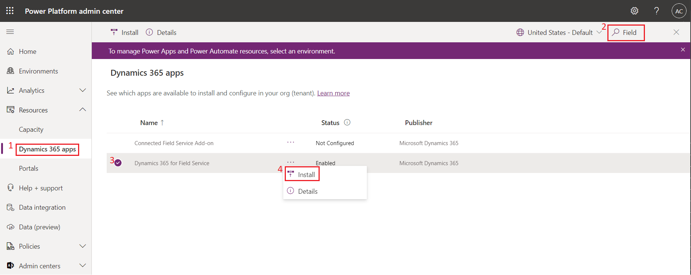](../media/field-install.png#lightbox)

5.  Select **Lamna Healthcare** as the environment to install the app. Select the **I agree to the terms of service** checkbox and then select **Install**.

	> [!div class="mx-imgBorder"]
	> [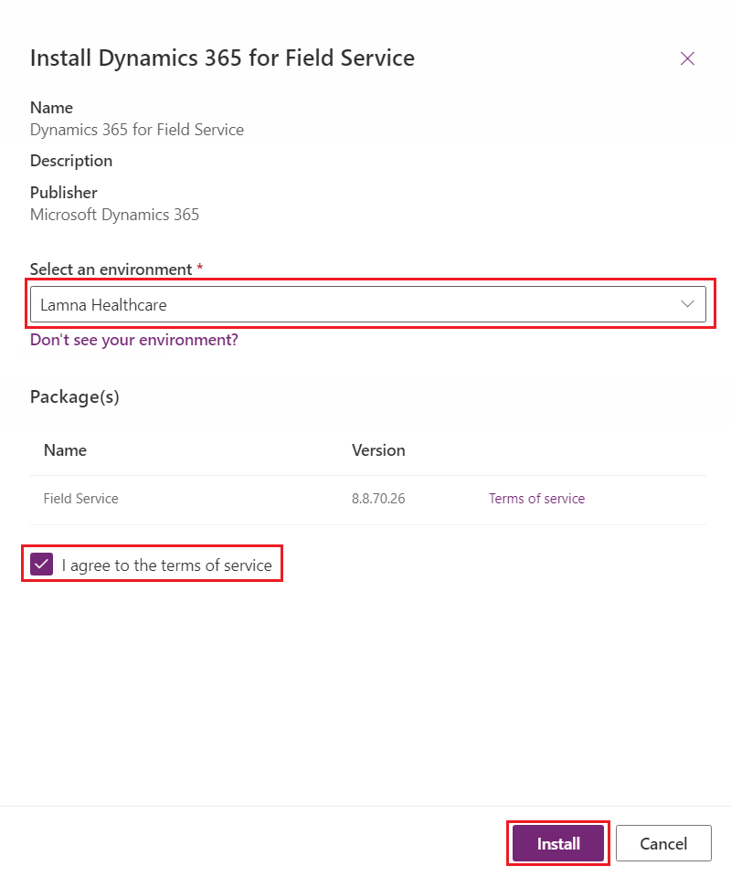](../media/field-terms.png#lightbox)

## Task 4: Enable the Dynamics 365 Sales app in the Dataverse environment

In this task, you'll install the **Dynamics 365 Sales app** in the **Lamna Healthcare** environment.

1.  While signed in to your Microsoft 365 tenant, open a new tab and then go to [Power Platform admin
    center](https://admin.powerplatform.microsoft.com/).

2.  On the left navigation, select **Resources** **\>** **Dynamics 365 apps**.

3.  In the upper-right corner of the page, use the search box to search for the string **Sales**.

4.  In the right pane, select **Dynamics 365 Sales, Enterprise Edition App** and then select **Install**, as shown in the following image.

	> [!div class="mx-imgBorder"]
	> [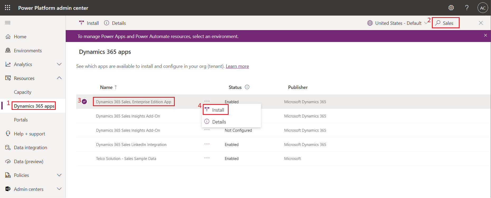](../media/field-install-apps.png#lightbox)

5.  Select **Lamna Healthcare** as the environment to install the app. Select the **I agree to the terms of service** checkbox and then select **Install**.

	> [!div class="mx-imgBorder"]
	> [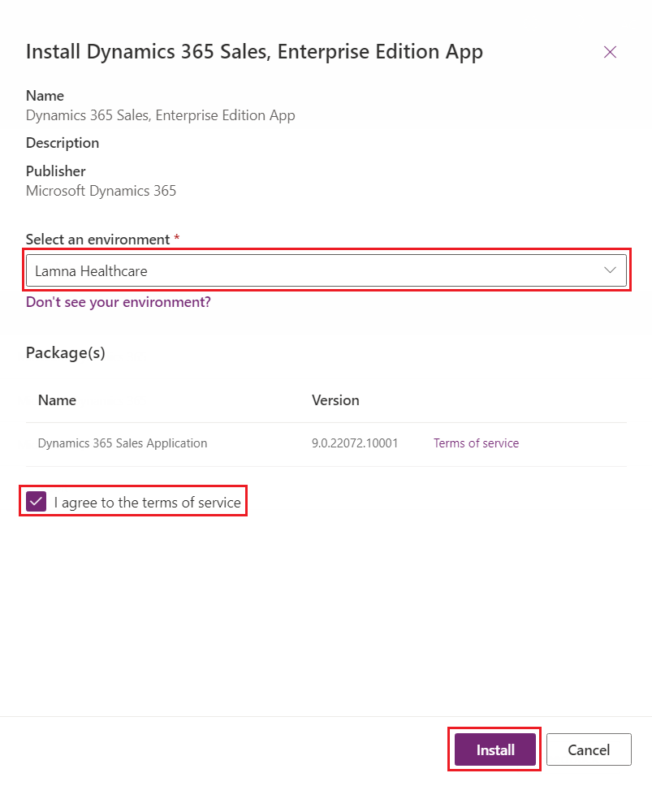](../media/field-install-apps-terms.png#lightbox)

### Task 5: Enable the Dynamics 365 Marketing app in the Dataverse environment

In this task, you'll go through the steps that are involved in setting up the Dynamics 365 Marketing app in the Lamna Healthcare environment.

1.  While signed in to your Microsoft 365 tenant, open a new tab and then go to [Power Platform admin
    center](https://admin.powerplatform.microsoft.com/).

2.  On the left navigation, select **Resources** **\>** **Dynamics 365 apps**.

3.  In the upper-right corner of the page, use the search box to search
    for the string **Marketing**.

4.  In the right pane, select **Dynamics 365 Marketing Application** and then select **Manage**, as shown in the following screenshot.

	> [!div class="mx-imgBorder"]
	> [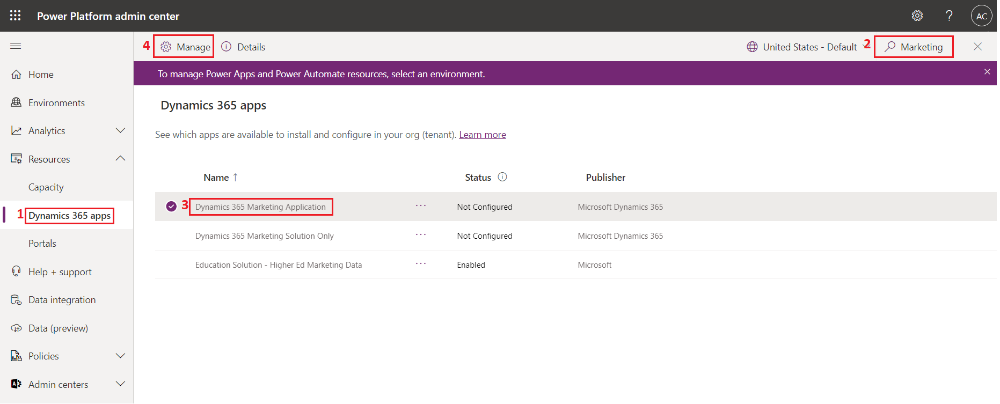](../media/field-marketing.png#lightbox)

5.  Select **Install**.

	> [!div class="mx-imgBorder"]
	> [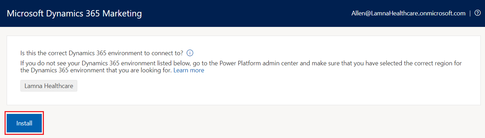](../media/field-marketing-install-button.png#lightbox)

    When installation begins, the setup will show as in progress.

    > [!div class="mx-imgBorder"]
    > [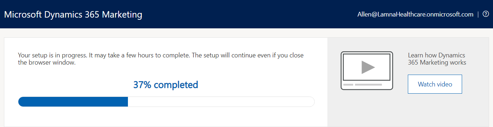](../media/field-marketing-install.png#lightbox)

6.  When setup is finished, select **Take me to the app**.

	> [!div class="mx-imgBorder"]
	> [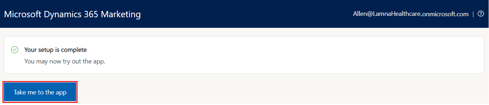](../media/field-marketing-complete.png#lightbox)

    You'll be redirected to the Dynamics 365 Marketing app that's been set up in the Lamna Healthcare environment.

	> [!div class="mx-imgBorder"]
	> [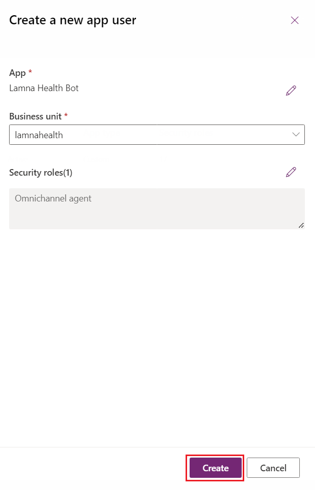](../media/security-create-new-app-user.png#lightbox)

## Task 6: Enable the Omnichannel for Customer Service app in the Dataverse environment

In this task, you'll go through the steps that are involved in setting up the **Omnichannel for Customer Service** app in the **Lamna Healthcare** environment. In this learning path, you'll enable chat and **Microsoft Teams** channels only.

1.  While signed in to your Microsoft 365 tenant, open a new tab and then go to [Power Platform admin
    center](https://admin.powerplatform.microsoft.com/).

2.  On the left navigation, select **Resources** **\>** **Dynamics 365 apps**.

3.  In the upper-right corner of the page, use the search box to search for the string **omni**.

4.  In the right pane, select **Omnichannel for Customer Service** and then select **Manage**, as shown in the following screenshot.

	> [!div class="mx-imgBorder"]
	> [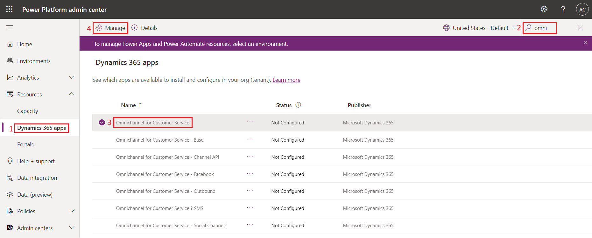](../media/field-omnichannel.png#lightbox)

5.  On the **Permissions requested** pop-up window, select **Accept**.

	> [!div class="mx-imgBorder"]
	> [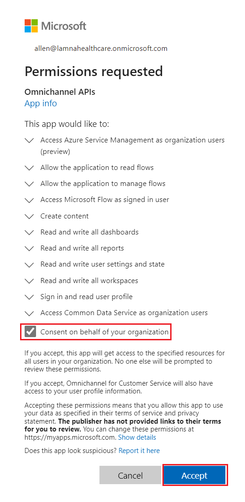](../media/field-permissions.png#lightbox)

6.  You'll be redirected to Dynamics 365 Administration Center. Select **+ Add environment**.

	> [!div class="mx-imgBorder"]
	> [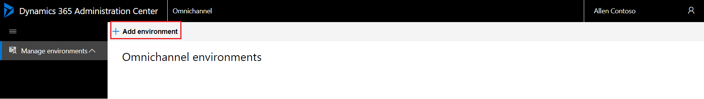](../media/field-add-environment.png#lightbox)

7.  On the **Omnichannel set up** screen, select **Lamna Healthcare** as the environment and then select **Next**.

	> [!div class="mx-imgBorder"]
	> [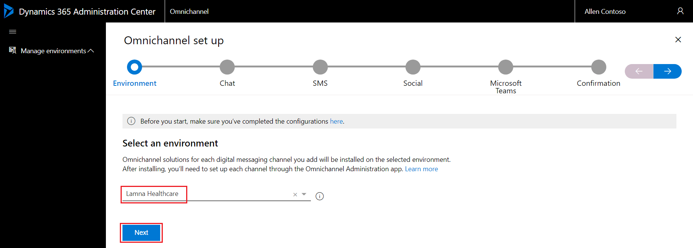](../media/field-select-environment.png#lightbox)

8.  Set the **Add chat** toggle to **Yes** and then select **Next**.

	> [!div class="mx-imgBorder"]
	> [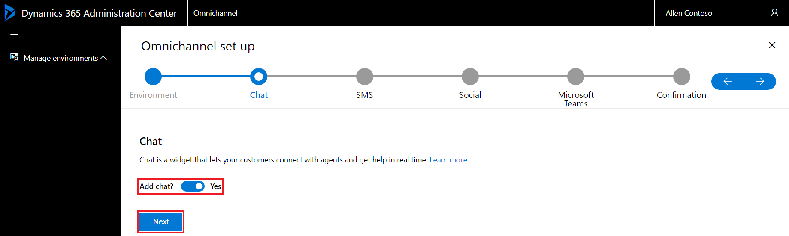](../media/field-add-chat.png#lightbox)

9.  Leave the **SMS** and **Social** settings to their default and then select **Next**.

10. Enable the Microsoft Teams channel and then select **Next**.

11. On the **Confirm your selections** screen, select **Finish**.

	> [!div class="mx-imgBorder"]
	> [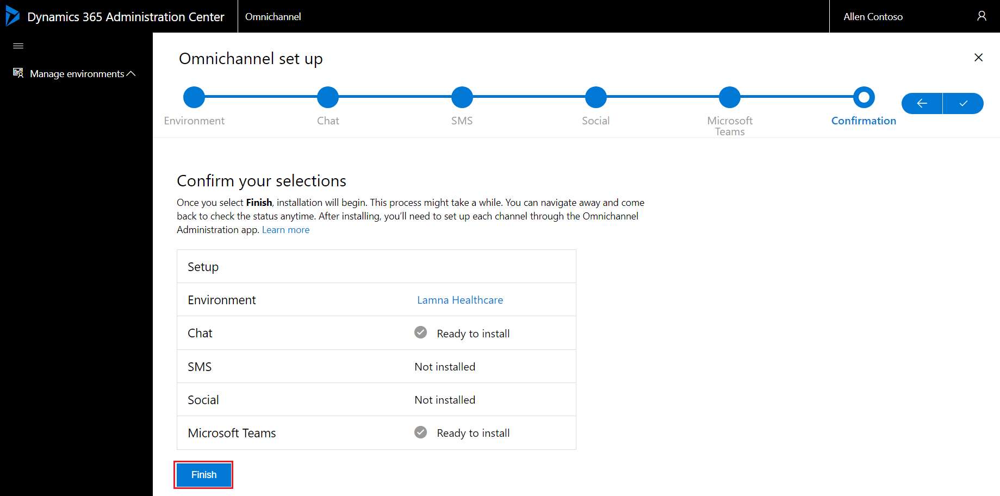](../media/field-omnichannel-set-up.png#lightbox)

    The next screen will show that Omnichannel is being set up.

    > [!div class="mx-imgBorder"]
    > 

    > [!NOTE]
    > It might take a few hours to complete the setup of Omnichannel.

After Omnichannel setup has finished successfully, the **Summary** screen will appear, as shown in the following screenshot.

> [!div class="mx-imgBorder"]
> [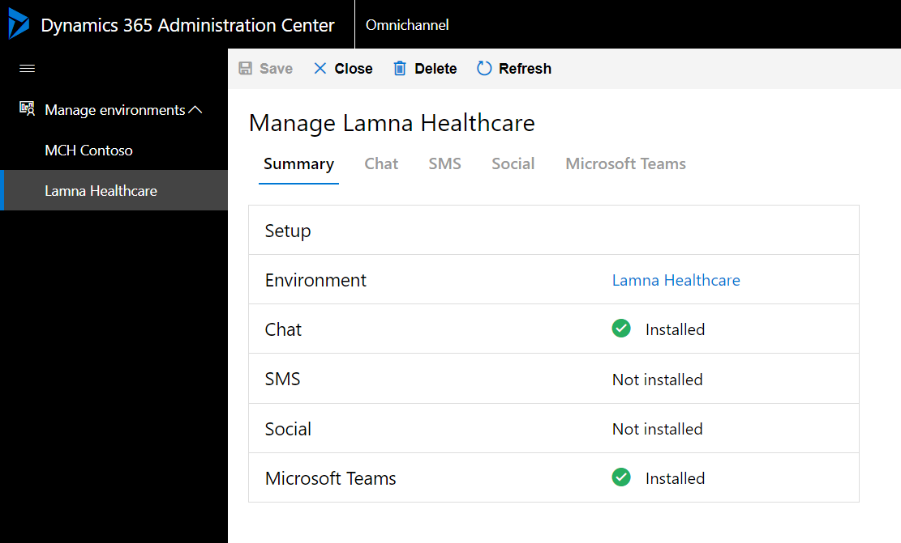](../media/field-omnichannel-installed.png#lightbox)

## Task 7: Create the Lamna Healthcare Patient Portal app

In this task, you'll create a **Microsoft Power Apps** portal in the **Lamna Healthcare** environment. This portal app becomes the patient access portal that will be used by **Microsoft Cloud for Healthcare.**

1.  While signed in to your Microsoft 365 tenant, open a new tab and then go to [Power Apps portal](https://make.powerapps.com/).

2.  Select **Environment** as Lamna Healthcare.

3.  In the right pane, select **More create options**, as shown in the following image.

	> [!div class="mx-imgBorder"]
	> [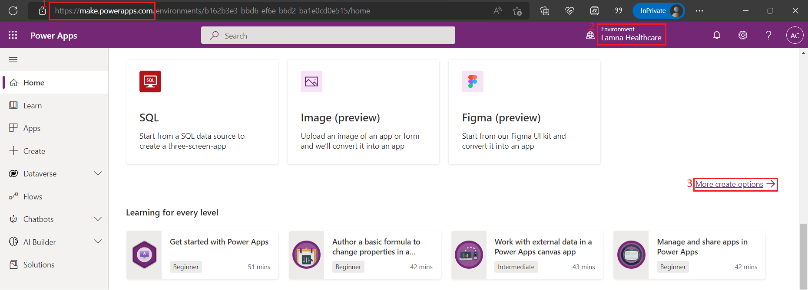](../media/patient-create.png#lightbox)

4.  Use the search box to search for the string **Customer**. Select the **Customer self-service** template.

	> [!div class="mx-imgBorder"]
	> [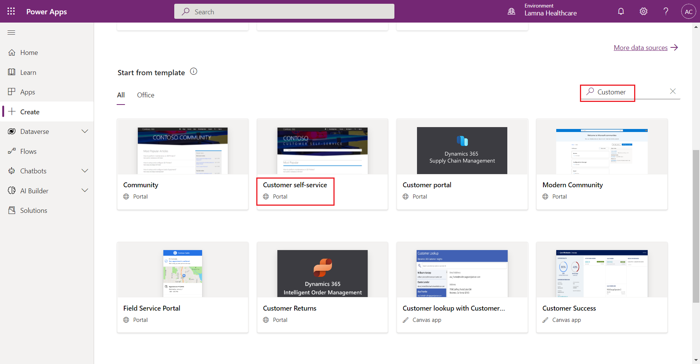](../media/patient-data-source.png#lightbox)

5.  On the **Customer self-service** creation page, provide the following information and then select **Create**.

    - **Name** - Lamna Healthcare Patient Portal

    - **Address** - You can select a desired address for your patient portal (subject to its availability). The portal address is globally unique.

	> [!div class="mx-imgBorder"]
	> [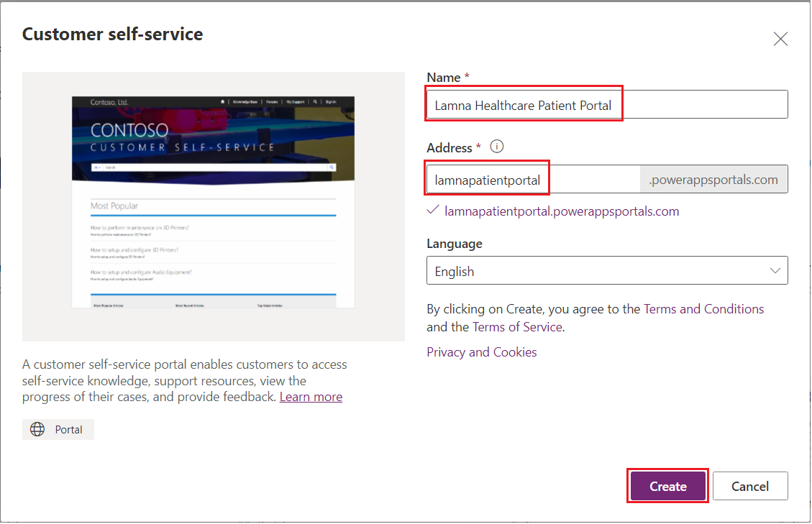](../media/patient-customer-self-service.png#lightbox)

    A pop-up window will appear, indicating that the portal provisioning is in progress.

    > [!div class="mx-imgBorder"]
    > [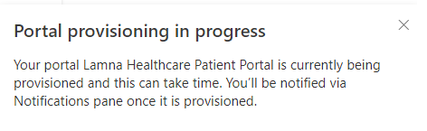](../media/patient-provisioning.png#lightbox)

    > [!NOTE]
    > It might take a few hours for the Customer self-service portal to complete provisioning.

6.  After the portal has successfully provisioned, you can review it on the **Apps** page.

	> [!div class="mx-imgBorder"]
	> [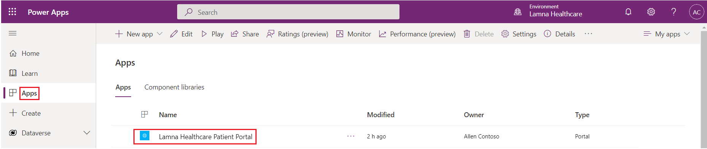](../media/patient-portal.png#lightbox)

## Task 8: Deploy Microsoft Cloud for Healthcare solutions

In this task, you'll go through the steps to deploy the necessary Microsoft Cloud for Healthcare solutions to complete this training course.

You'll need to complete all previous steps before you can deploy Microsoft Cloud for Healthcare solutions.

1.  While signed in to your Microsoft 365 tenant, open a new tab and go to [Microsoft Solution Center](https://solutions.microsoft.com).

2.  On the left navigation, select **Solutions** **\>** **Healthcare** to view all solution modules that are available in Microsoft Cloud for Healthcare.

3.  Select any solution card. For this learning path, you'll select the **Personalized care** solution card.

	> [!div class="mx-imgBorder"]
	> [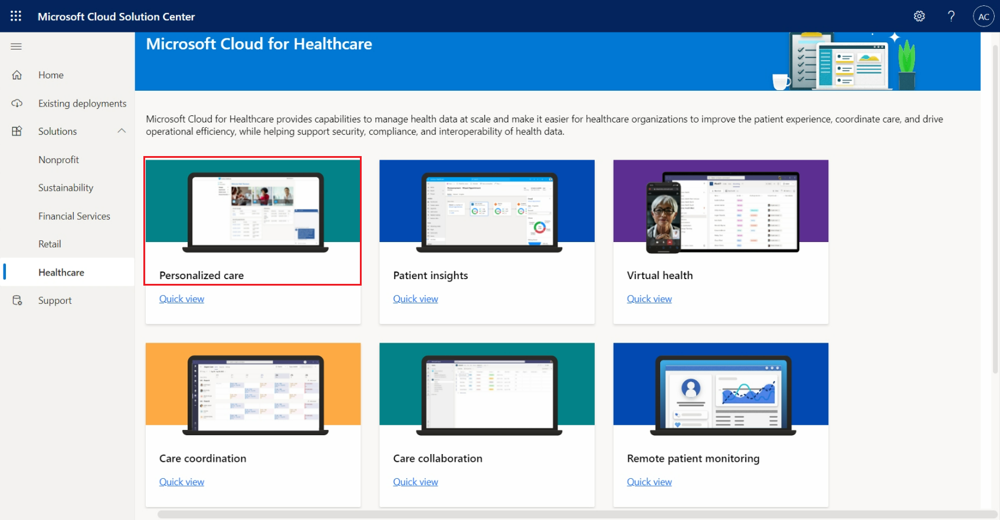](../media/healthcare-deploy.png#lightbox)

4.  Select **All** from the **Filter by capability** dropdown menu. Select the **Add all Microsoft Cloud for Healthcare** checkbox to add all capabilities. For this learning path, you'll clear the **Health assistant** feature, as shown in the following screenshot. Then, select **Deploy**.

	> [!div class="mx-imgBorder"]
	> [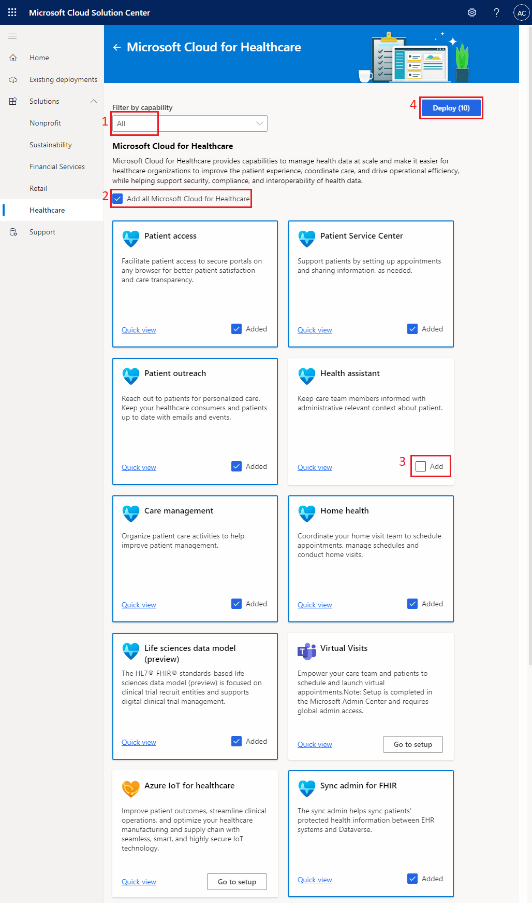](../media/healthcare-add.png#lightbox)

5.  On the **Set up solutions** page, select the **Name**, **Sample data**, and **Codeable concepts** options to add them as extra
    components and then select **Next**.

	> [!div class="mx-imgBorder"]
	> [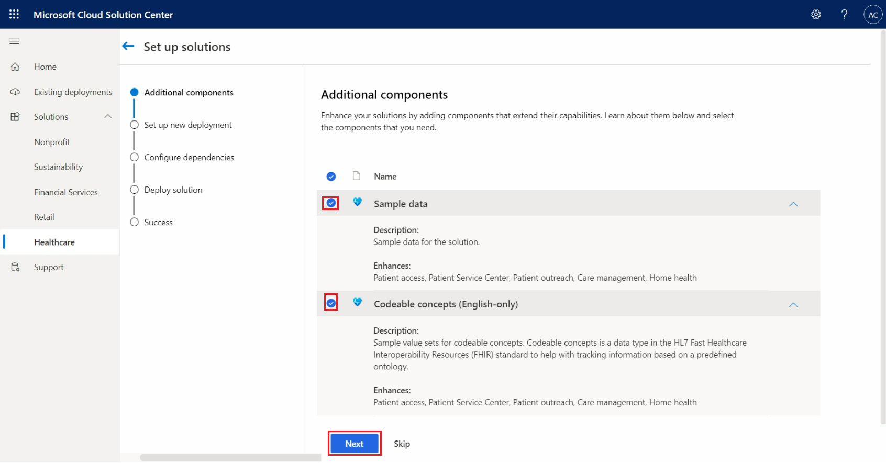](../media/healthcare-add-components.png#lightbox)

6.  On the **Set up new deployment** screen, from the **Enter Dataverse environment** dropdown menu, select the **Lamna Healthcare** environment that you created in the previous task. In the **Name your deployment** box, enter a name for the deployment. Select the **Terms of service** checkbox and then select **Next**.

	> [!div class="mx-imgBorder"]
	> [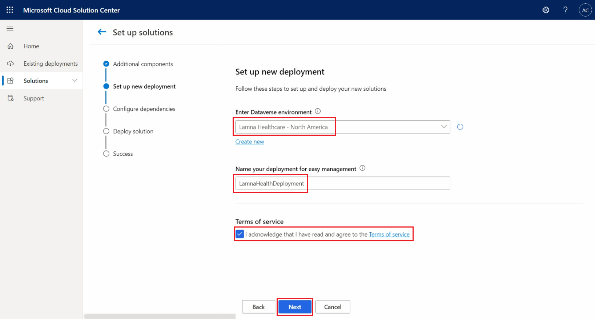](../media/healthcare-new-deployment.png#lightbox)

7.  The **Configure pre-deployment dependencies** page will display a list of all dependencies, and their statuses will be marked green to confirm that you can proceed with deployment. Select **Deploy**.

	> [!div class="mx-imgBorder"]
	> [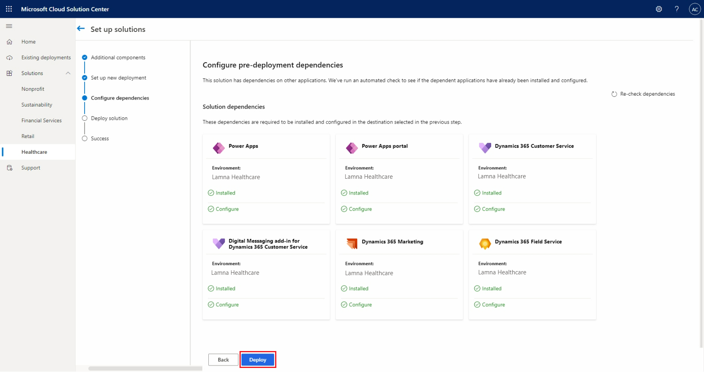](../media/healthcare-dependencies.png#lightbox)

    The **Deploy solution** page will show the progress of the Microsoft Cloud for Healthcare solutions deployment. Because the deployment process can take several hours to complete, you can close this page or keep it open to track the deployment.

    > [!div class="mx-imgBorder"]
    > [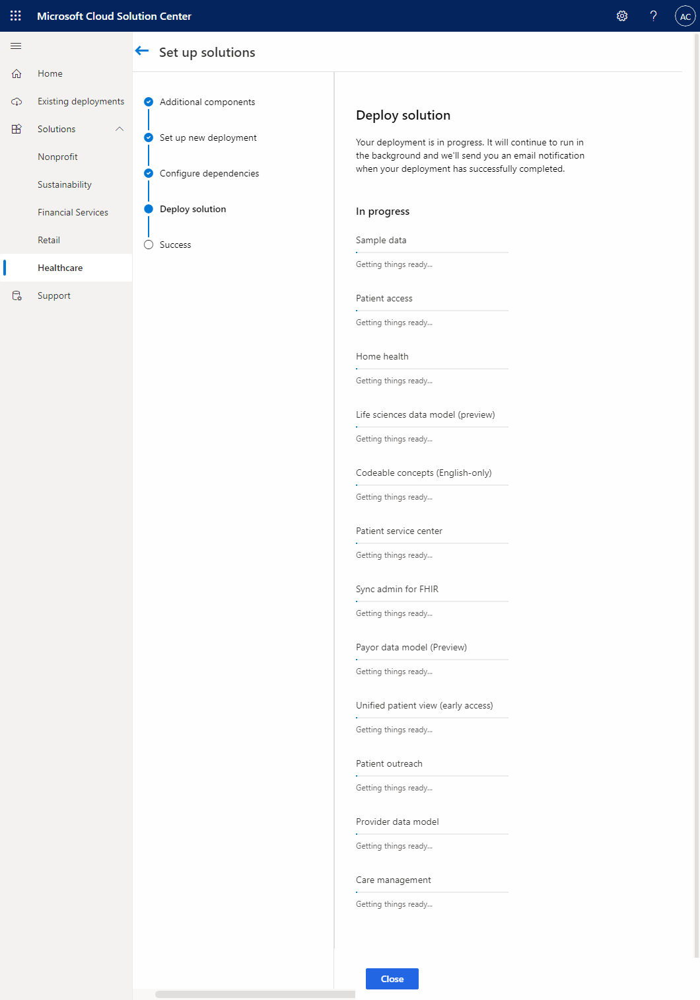](../media/healthcare-deploy-solutions.png#lightbox)

8.  The **Success** page will appear when the deployment of Microsoft Cloud for Healthcare solutions has completed successfully. Select the **Launch solution** option beside any listed solution to open it.

	> [!div class="mx-imgBorder"]
	> [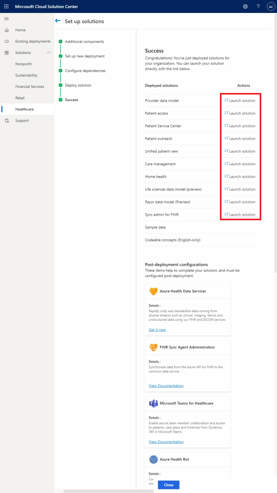](../media/healthcare-deployed.png#lightbox)

## Task 9: Update environment variables in Power Apps portal

In this task, you'll go through the steps to update the environment variables that are used by the virtual visit feature in Microsoft Cloud for Healthcare.

1.  While signed in to your Microsoft 365 tenant, open a new tab and go
    to [Power Apps portal](https://make.powerapps.com/).

2.  In the upper-right corner of the page, select **Lamna Healthcare** as your working environment.

3.  On the left navigation, select **Apps**. In the right pane, select the **See environment variables** option, as shown in the following image.

	> [!div class="mx-imgBorder"]
	> [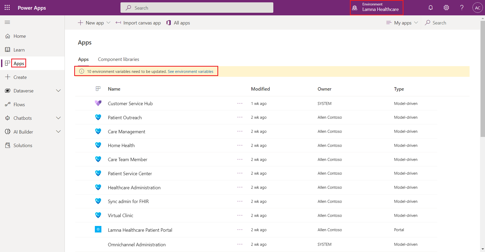](../media/environment-variables.png#lightbox)

4.  On the **Environment variables** form, populate the **Virtual Visit Secret** and **Virtual Visit Client ID** boxes with the client secret and client ID that you've copied in Task 1 of this exercise.

	> [!div class="mx-imgBorder"]
	> [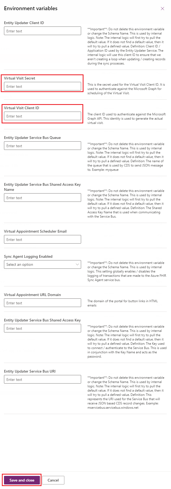](../media/update-environment-variables.png#lightbox)

**Congratulations**, you've successfully set up the **Lamna Healthcare Dataverse** environment and have deployed **Microsoft Cloud for Healthcare** solutions.

