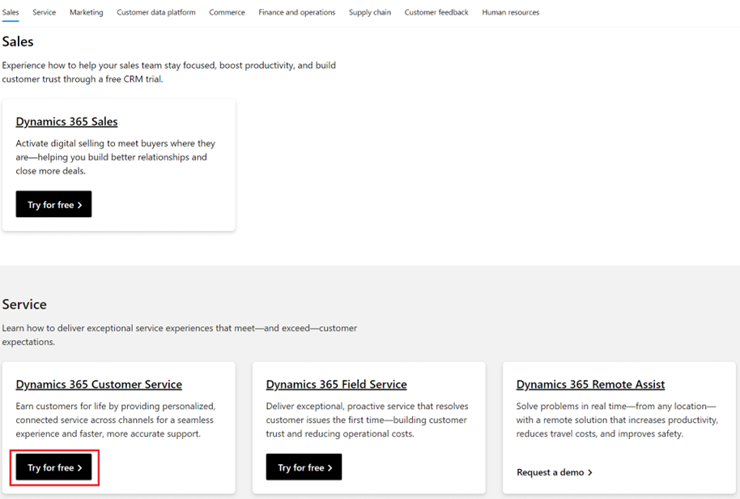
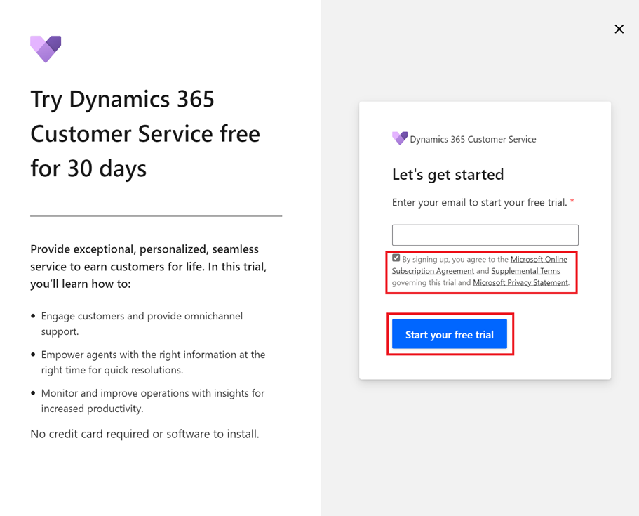
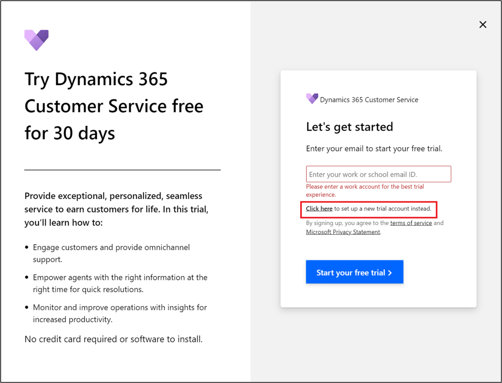
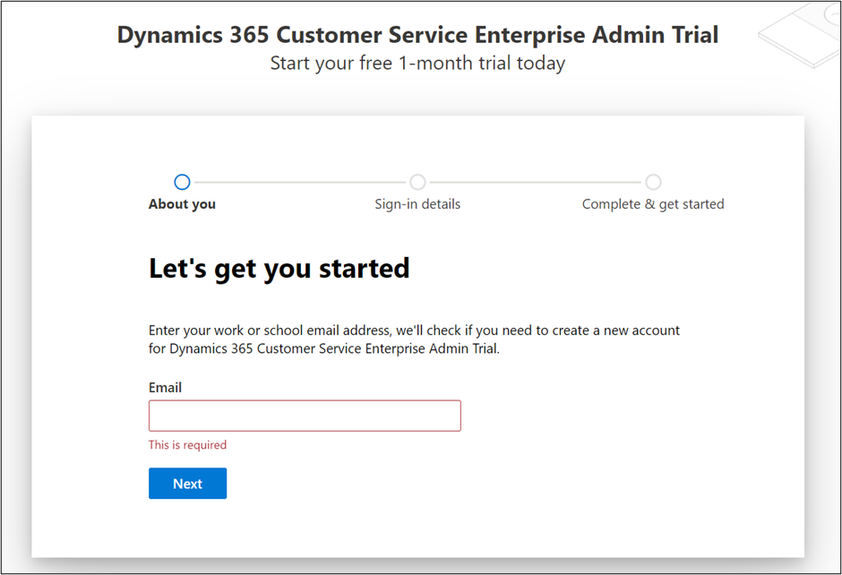
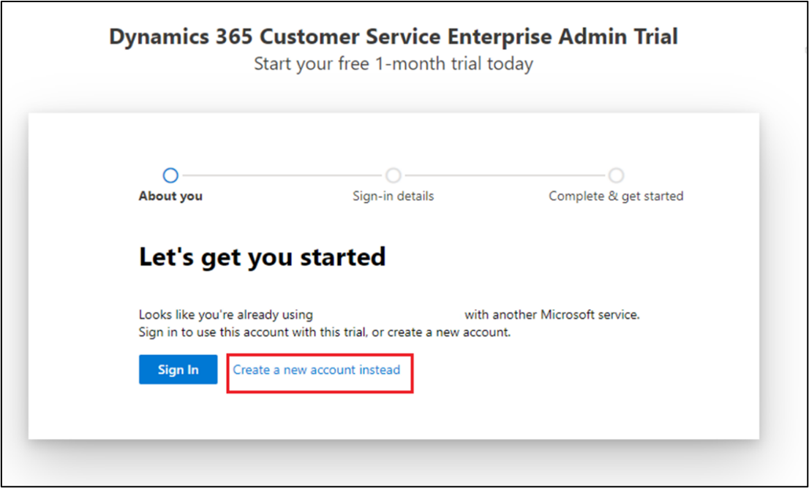
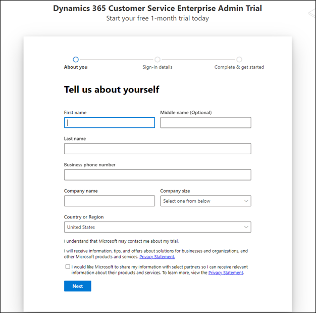
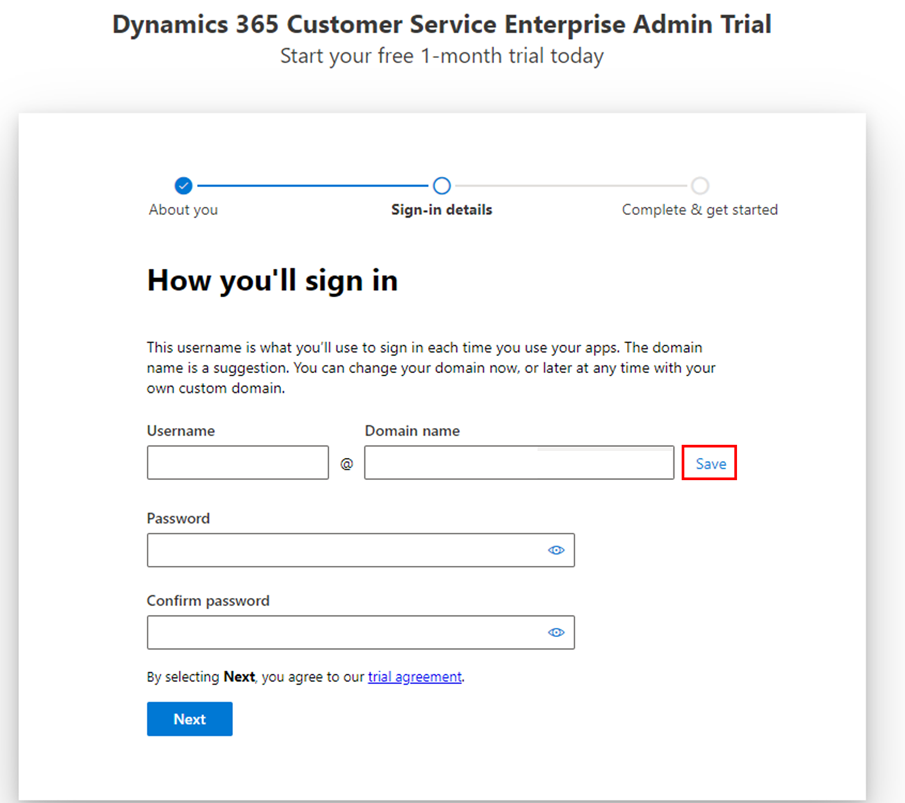
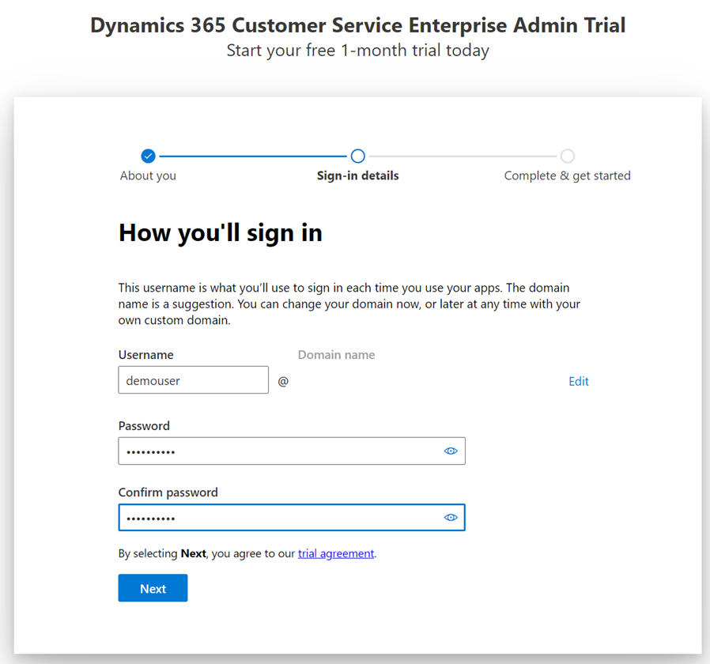
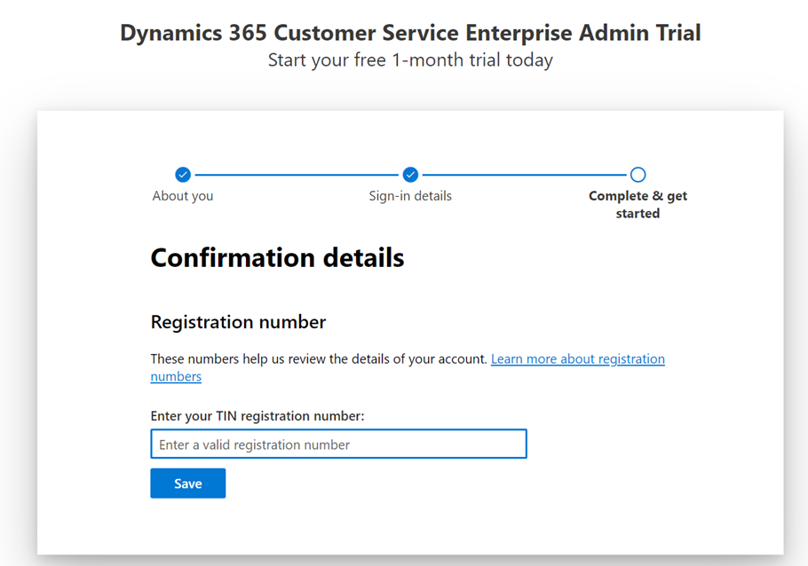
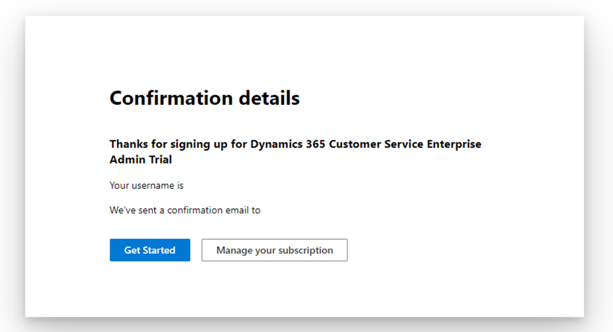

To deploy Microsoft Cloud for Financial Services in a Microsoft Dataverse environment, you need to create a tenant with the prerequisite licenses.

## Task 1: Create a Microsoft 365 tenant

In this task, you'll learn how to create a trial tenant along with the required Microsoft Dynamics 365 and Microsoft 365 trial licenses. You can skip this task if you already have a tenant.

1. Open an internet browser in In-Private or Incognito mode.

1. Go to [https://trials.dynamics.com](https://trials.dynamics.com/?azure-portal=true), scroll down, and then select **Try for free** in the **Dynamics 365 Customer Service** card.

    > [!div class="mx-imgBorder"]
    > 

1. A pop-up window will appear, asking you to enter your email to start your free trial. Leave the **email ID** field blank, check the **By signing up..** checkbox, and then select **Start your free trial**.

    > [!div class="mx-imgBorder"]
    > 

1. An error will display, asking you to provide a valid work or school email ID with a link below to select for setting up a new trial account instead. Select **Click here to set up a new trial account instead**.

    > [!div class="mx-imgBorder"]
    > 

1. A new account creation flow for Dynamics 365 Customer Engagement Plan will display. Get started by entering your email address in the format `<YourUserName>@ <YourUniqueTenantName>.onmicrosoft.com`.

    > [!div class="mx-imgBorder"]
    > 

1. If the email is already using other Microsoft services, the following warning will appear. Select **Create a new account instead**

    > [!div class="mx-imgBorder"]
    > 

      Else, it will prompt you to set up your new account. Select **Set up account**.

    :::image type="content" source="../media/set-up-new-account.png" alt-text="Screenshot of the Set up account":::

7. Provide the necessary information in the About you page. Enter a valid phone number where you can receive a text message to validate the sign-up process.

    > [!div class="mx-imgBorder"]
    > 

1. After the verification has completed, you can request a valid domain name, and then select **Save** to check availability. If an error doesn't appear, the domain is ready to be used.

    > [!div class="mx-imgBorder"]
    > 

1. Set up a username and password and then sign in.

    > [!div class="mx-imgBorder"]
    > 

1. Enter your Company’s TIN (Taxpayer Identification Number) if the following page appears.

   > [!div class="mx-imgBorder"]
   > 

Your Microsoft 365 tenant has been successfully created along with the Dynamics 365 Customer Engagement Plan license that includes a Microsoft Power Apps license as well.

   > [!div class="mx-imgBorder"]
   > 

## Task 2: Obtain a Microsoft Office E5 trial

In this task, you'll add the necessary Office 365 trial to use Microsoft Teams for Collaboration Manager for Loans.

1. With your newly created credentials in the previous task, go to [Microsoft 365 admin center](https://admin.microsoft.com/).

2. Go to **Billing > Billing accounts** and select the **Billing account** record.

:::image type="content" source="../media/billing-accounts.png" alt-text="Screenshot of the Billing accounts page." lightbox="../media/billing-accounts.png":::

3. Select **Edit** to edit the billing account details and provide a valid address and phone number. This step is important for the address validations kick-off. Select **Save**.

:::image type="content" source="../media/edit-address.png" alt-text="Screenshot of the organization profile page.":::

4. Now, go to **Billing > Purchase Services**, select **Office 365**, scroll down to **Office 365 E5**, and then select **Details**.

:::image type="content" source="../media/purchase-services.png" alt-text="Screenshot of the Purchase services page." lightbox="../media/purchase-services.png":::

5. Select **Start free trial**.

:::image type="content" source="../media/start-office-trial.png" alt-text="Screenshot of the Start office free trial page." lightbox="../media/start-office-trial.png":::

6. Enter a valid phone number to prove that you're not a robot and go through the verification process.

:::image type="content" source="../media/prove-not-robot.png" alt-text="Screenshot of verification process to prove the user is not a robot.":::

7. Select **Try now** to start your free trial.

:::image type="content" source="../media/try-now-office-trial.png" alt-text=" Screenshot of the Office 1 month free trial page. ":::

8. Select **Continue** to return to the admin center.

:::image type="content" source="../media/office-trial-confirmation.png" alt-text="Screenshot of the Office trial confirmation page." lightbox="../media/office-trial-confirmation.png":::

9. Assign the newly acquired Office 365 E5 trial license to a user by going to **Users > Active users**. Select a user and then select **Manage product licenses**.

:::image type="content" source="../media/assign-license-user.png" alt-text="Screenshot of the Assign trial license to user page." lightbox="../media/assign-license-user.png":::

10. Select the **Office 365 E5** license and then select **Save changes**.

:::image type="content" source="../media/office-365-e5-license.png" alt-text="Screenshot of the Office 365 E5 Licenses and apps page.":::

**Congratulations!** You have successfully set up your trial tenant.

In the next module, you'll learn how to obtain the various trial licenses that are required to fully run Microsoft Cloud for Financial Services.
