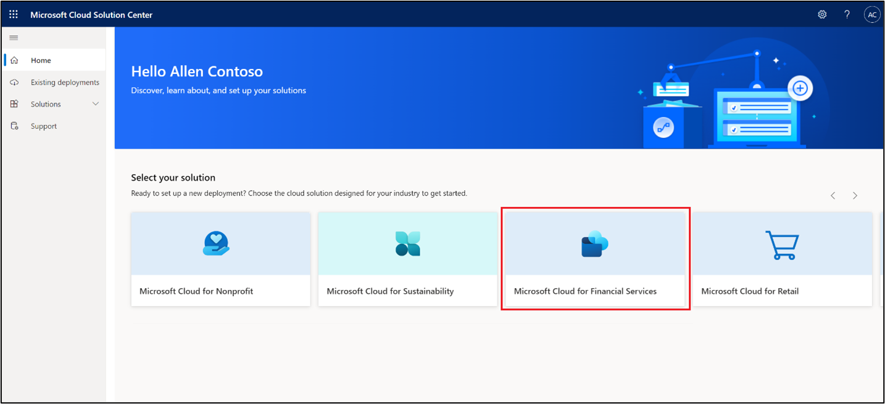
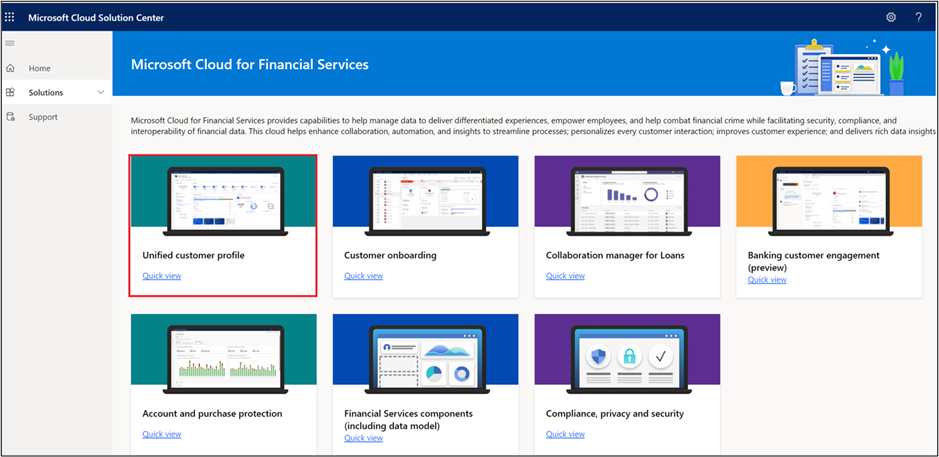
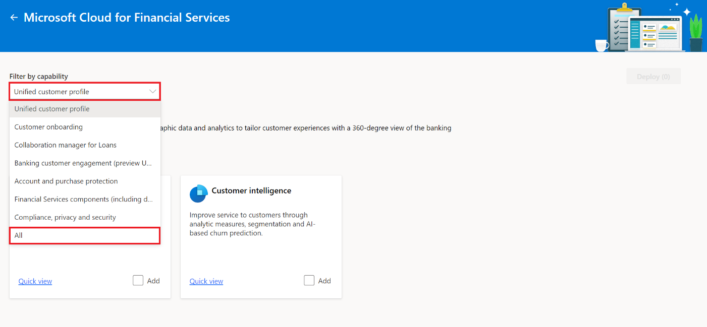
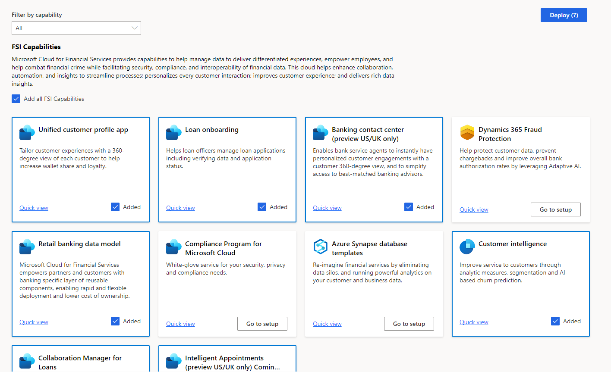
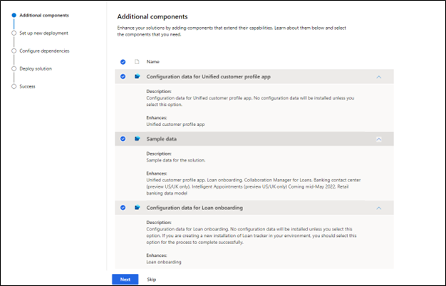
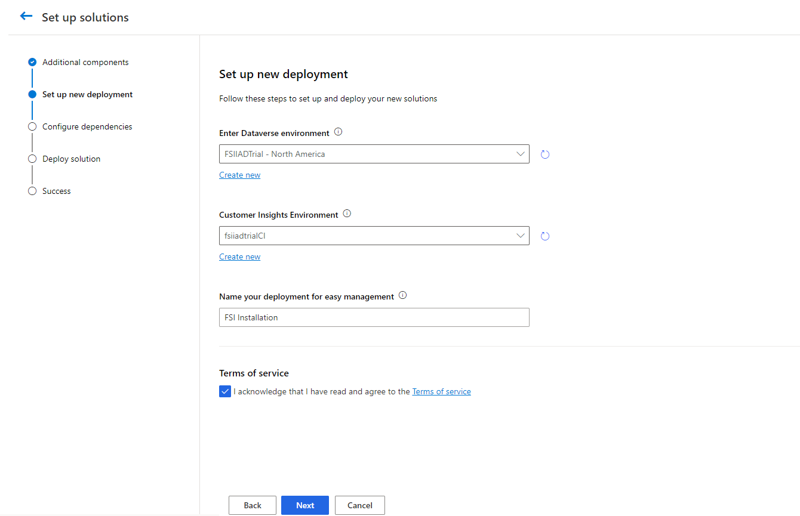
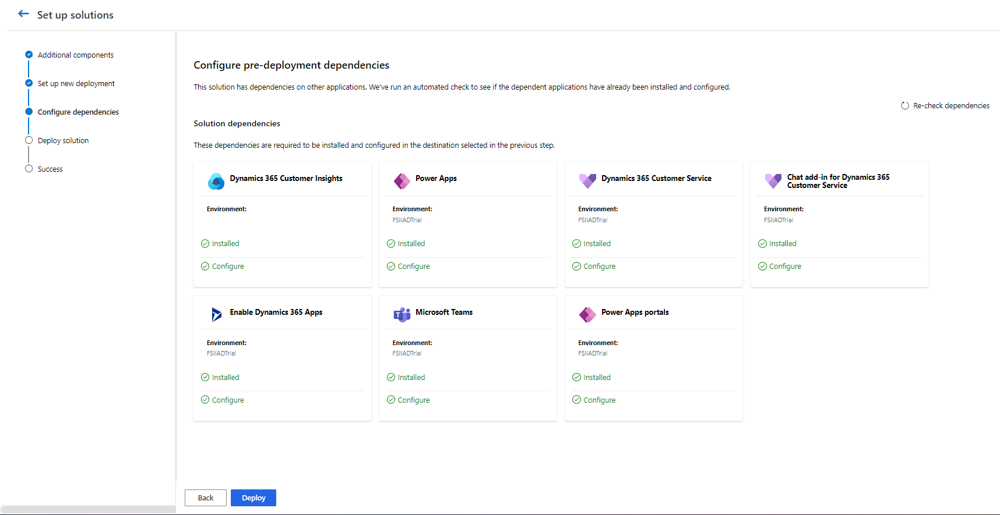
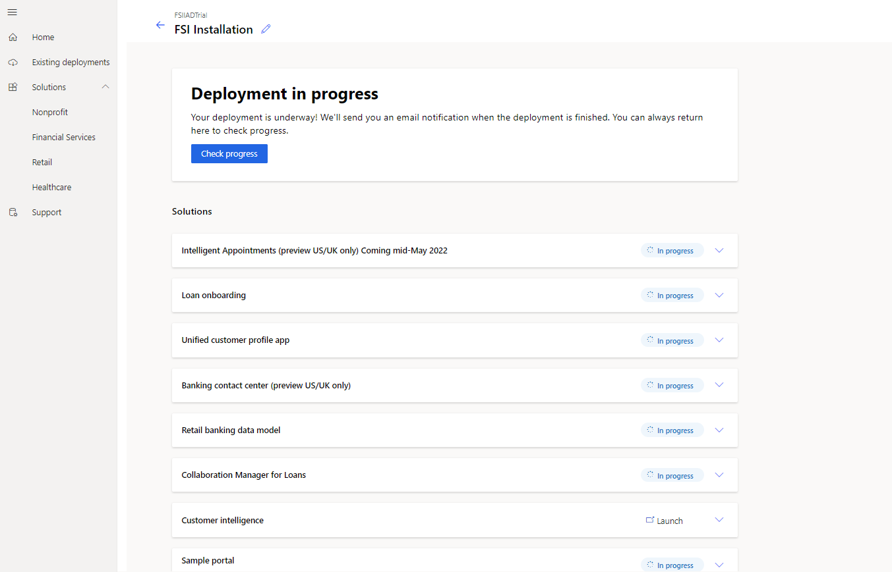

In this exercise, you'll deploy Microsoft Cloud for Financial Services in your Microsoft 365 tenant.

## Task 1: Deploy Microsoft Cloud for Financial Services

In this task, you'll deploy all Microsoft Cloud for Financial Services capabilities.

1. While signed in to your Microsoft 365 tenant, open a new tab and then go to [https://aka.ms/solutioncenter](https://aka.ms/solutioncenter/?azure-portal=true) to access the Microsoft Cloud Solution Center. Select the **Microsoft Cloud for Financial Services** button to begin setup.

    > [!div class="mx-imgBorder"]
    > 

1. Select the **Unified customer profile** capability.

    > [!div class="mx-imgBorder"]
    > 

1. In the **Filter by capability** dropdown menu, select **All**.

    > [!div class="mx-imgBorder"]
    > 

1. Select the **Add all FSI Capabilities** checkbox and then select **Deploy**.

    > [!div class="mx-imgBorder"]
    > 

1. Select all checkboxes and select Next.

    > [!div class="mx-imgBorder"]
    > 

1. In the **Enter Dataverse environment** dropdown menu, select your environment. Select the Customer Insights Environment. Select the **Terms of service** checkbox and then select **Next**.

    > [!div class="mx-imgBorder"]
    > 

1. All pre-deployment dependencies will be installed and set up. Select **Deploy** to complete the installation.

    > [!div class="mx-imgBorder"]
    > 

Congratulations! You are done! The Microsoft Cloud for Financial Services deployment will take several hours to complete. You can check the progress through the Existing deployments section.

> [!div class="mx-imgBorder"]
> 

You can monitor this screen to check the deployment status, or you can view the status of the apps by going to [https://aka.ms/ppac](https://aka.ms/ppac/?azure-portal=true).