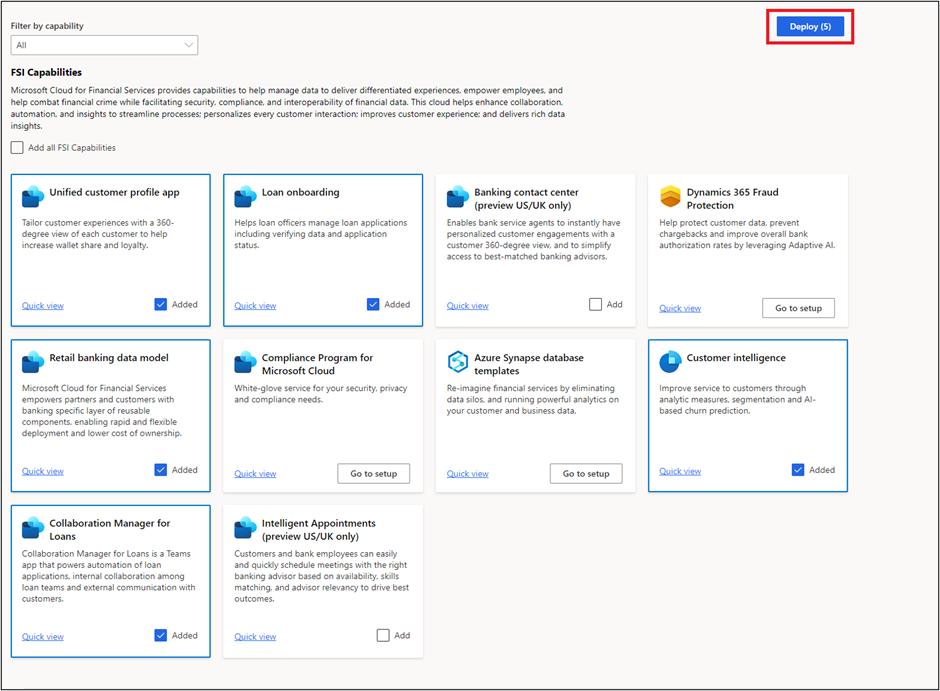
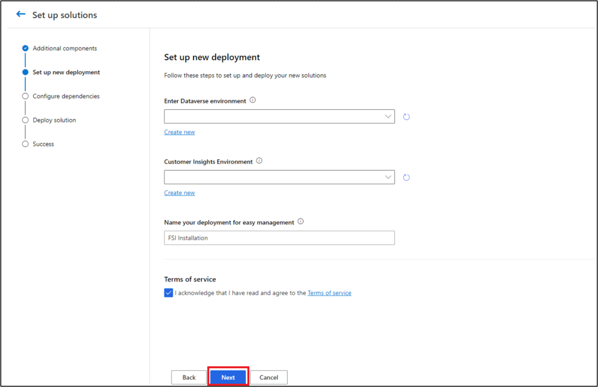
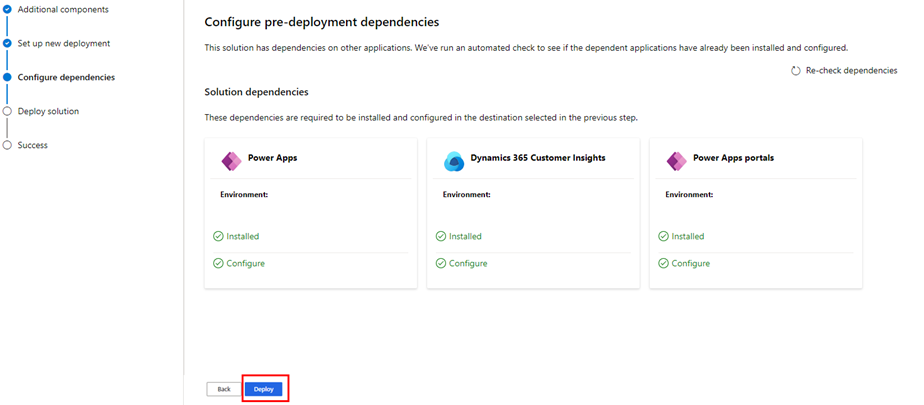
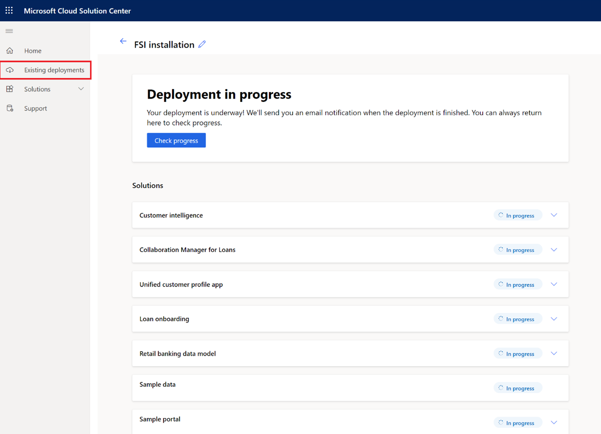

In this exercise, you'll deploy Microsoft Cloud for Financial Services in your Microsoft 365 tenant.

## Task 1: Deploy Microsoft Cloud for Financial Services

In this task, you'll deploy all the Microsoft Cloud for Financial Services capabilities

1. While signed in to your Microsoft 365 tenant, open a new tab and then go to [https://aka.ms/solutioncenter](https://aka.ms/solutioncenter/?azure-portal=true) to access the Microsoft Cloud Solution Center. Select the **Microsoft Cloud for Financial Services** button to begin setup.

    > [!div class="mx-imgBorder"]
    > 

1. Select the **Unified customer profile** capability.

    > [!div class="mx-imgBorder"]
    > 

1. In the **Filter by capability** dropdown menu, select **All**.

    > [!div class="mx-imgBorder"]
    > 

1. In the FSI Capabilities page, select the **Added** checkbox on Unified customer profile app, Loan onboarding, Retail banking data model, Customer intelligence and Collaboration Manager for Loans cards and then select **Deploy**.

    > [!div class="mx-imgBorder"]
    > 

1. In the Additional components page, select all checkboxes and select **Next**.

    > [!div class="mx-imgBorder"]
    > 

1. In the Set up new deployment page, select your Customer Service trial environment in the Dataverse dropdown, then select your Customer Insights Environment, name your deployment and check the Terms of service. Select **Next**.

    > [!div class="mx-imgBorder"]
    > 

1. All pre-deployment solution dependencies will be automatically installed and configured. Select **Deploy** to complete the deployment.

    > [!div class="mx-imgBorder"]
    > 

   The Microsoft Cloud for Financial Services deployment will take several hours to complete. You can check the progress through the Existing deployments section.

   > [!div class="mx-imgBorder"]
   > 

   You can monitor this screen to check the deployment status, or you can view the status of the apps by going to [https://aka.ms/ppac](https://aka.ms/ppac/?azure-portal=true).