In the previous module, you saw all the licenses needed for the pre-requisite platforms and how to acquire trial licenses for them. In this module, you'll go through the details of how to install the pre-requisite components needed and how to configure them before you can proceed to install the Microsoft Cloud for Financial Services.

## Task 1: Install Dynamics 365 Customer Service environment

In this task, you'll create a Dynamics 365 Customer Service Trial Environment in which the FSI Data model and Applications will be installed on. Capabilities such as Banking Customer Engagement use the Dynamics 365 Customer Service.

1. Navigate to [Dynamics 365 free trial](https://trials.dynamics.com/?azure-portal=true).

1. Select **Try for free** on Dynamics 365 Customer Service card.

   > [!div class="mx-imgBorder"]
   > 

3. Enter the user email of the tenant administrator of the Tenant that was created in the previous steps, check the **By signing up..** checkbox, and then select **Start your free trial**.

   > [!div class="mx-imgBorder"]
   > 

4. Fill the relevant information in the following screen and select **Submit**.

   > [!div class="mx-imgBorder"]
   > 

   > [!IMPORTANT]
   > Select a Country/Region where Microsoft Cloud for Financial Services is [available.](/industry/financial-services/availability)

5. The newly created Customer Service workspace application is launched. Copy the root URL of the launched application. It will be of the  format <https://myorg.crm.dynamics.com/>. This URL will be referenced at a later step.

   > [!div class="mx-imgBorder"]
   > 

6. Using your tenant administrator credentials, navigate to [https://admin.powerplatform.com](https://admin.powerplatform.com/?azure-portal=true) and select **Environments**. The newly created Customer Service Environment will be named as **Customer Service Trial**.

7. Select **Customer Service Trial** to open the Environment details and select **Edit**. 
   :::image type="content" source="../media/customer-service-trial.png" alt-text="Screenshot of the customer service trial environment." lightbox="../media/customer-service-trial.png":::

8. Update the name of the organization and the URL as preferred and click **Save**.
   :::image type="content" source="../media/edit-details-save.png" alt-text="Screenshot of customer service trial environment edit details screen.":::

## Task 2: Install Customer Insights environment

In this task, you'll see the Customer Insights installation process.

1. Navigate to [Dynamics 365 Customer Insights](https://home.ci.ai.dynamics.com/startB2C/?azure-portal=true). Select the same Country/Region you selected in the previous task for Customer Service setup, and select **Continue**.

   > [!div class="mx-imgBorder"]
   > 

2. The Home page is launched as seen below. Select **Sign up for trial** at the top right corner of the page.

   > [!div class="mx-imgBorder"]
   > [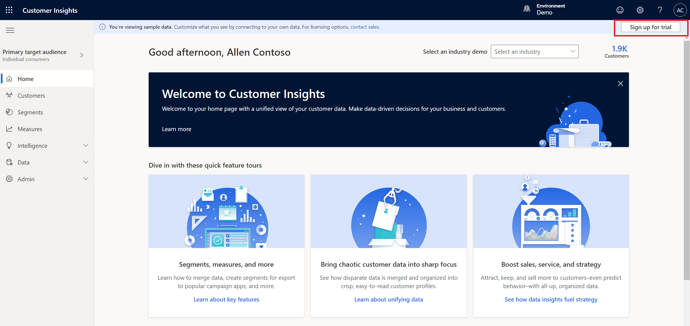](../media/sign-up-trial.png#lightbox)

3. In the Customer Insights trial experience page, enter the same tenant email address that you have been using so far, check the **By signing up..** checkbox, and then select **Start your free trial**.

   > [!div class="mx-imgBorder"]
   > 

4. Select **Sign in**.

   > [!div class="mx-imgBorder"]
   > 

5. Update the account info and select **Get started**.

   > [!div class="mx-imgBorder"]
   > 

6. Provide the confirmation by selecting **Get started**.

   > [!div class="mx-imgBorder"]
   > 

7. Choose business as **Individual consumers (B-to-C)**.

   > [!div class="mx-imgBorder"]
   > 

8. Select the **Demo** environment to change environment and then select **+New** to create a new Customer Insights environment.

   > [!div class="mx-imgBorder"]
   > [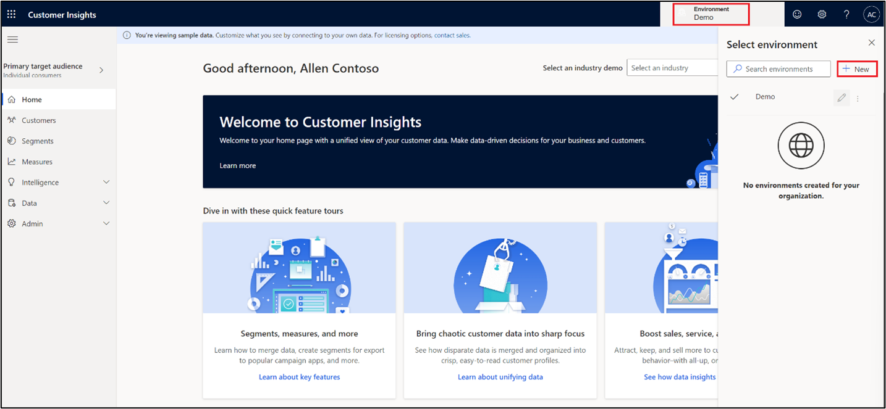](../media/new-demo.png#lightbox)

9. In the Basic information page, provide the **Name**, choose your business as **Individual consumers (B-to-C)**, select the **Type** and **Region** as appropriate and select **Next**.

   > [!div class="mx-imgBorder"]
   > 

10. Input the Data storage options and select **Next**.

    > [!div class="mx-imgBorder"]
    > 

11. Provide the Microsoft Dataverse environment URL that you copied in the previous task. This step is important to tie the Customer Insights environment to the correct Dataverse endpoint.

    > [!div class="mx-imgBorder"]
    > 

12. The review page is shown. Review the selections and select **Create**.

    > [!div class="mx-imgBorder"]
    > 

Upon successful creation of the Customer Insights Tenant, you can proceed forward.

## Task 3: Add Microsoft Cloud for Financial Services trial licenses

In this step, you'll see how to obtain a Microsoft Cloud for Financial Services Trial license.

1. To obtain a trial license for Microsoft Cloud for Financial Services, navigate to this [Microsoft Form](https://aka.ms/FSITrial/?azure-portal=true) and fill out the required information.

1. You'll then receive an email with a URL that contains an offer code that can be used to claim a 30-day trial license for Microsoft Cloud for Financial Services. Once you receive that email, copy the URL, open a new tab while logged into your tenant and paste the URL.

   >[!NOTE]
   >Ensure that there are no trailing hidden spaces when copying the URL.

3. The screen will show the **email address** associated with your tenant. Select **Continue**.

   > [!div class="mx-imgBorder"]
   > [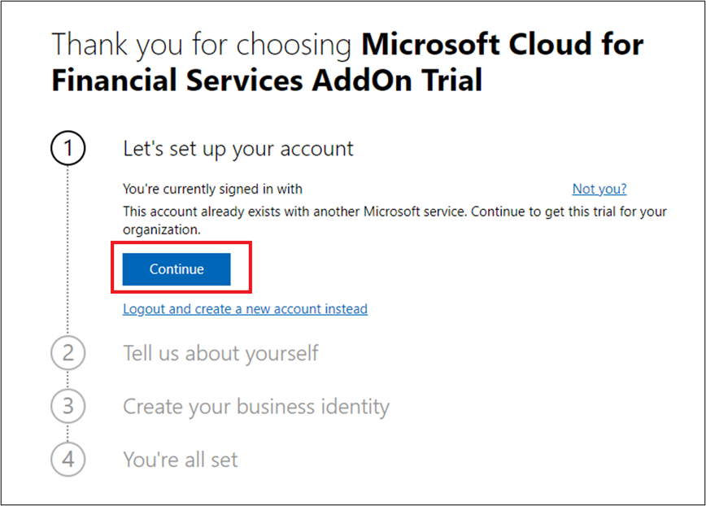](../media/email-trial-confirmation.png#lightbox)

4. Select **Try now** in the Checkout screen.

   > [!div class="mx-imgBorder"]
   > [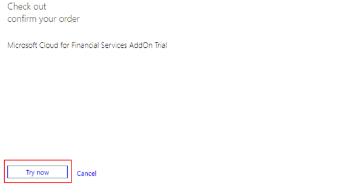](../media/addon-try-now.png#lightbox)

5. Select **Continue** in the order receipt page.

   > [!div class="mx-imgBorder"]
   > [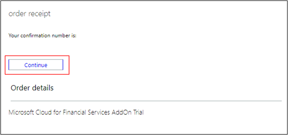](../media/order-receipt-continue.png#lightbox)

## Task 4: Setup prerequisite configurations

Now that you have the necessary licenses and platform elements created, in this task, you'll walk through the pre-requisite configurations needed for installing Microsoft Cloud for Financial Services Capabilities.

### Setup Teams configurations

In this step, you'll walk through the Microsoft Teams configuration settings to integrate with Dynamics 365 platform.

1. Using your tenant administrator credentials, navigate to [Power Platform admin center](https://admin.powerplatform.com/?azure-portal=true) and select your environment.

   > [!div class="mx-imgBorder"]
   > [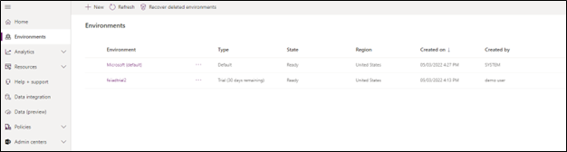](../media/teams-environment.png#lightbox)

2. Select the Environment that was created and open its details page. Select **Settings**.

   > [!div class="mx-imgBorder"]
   > [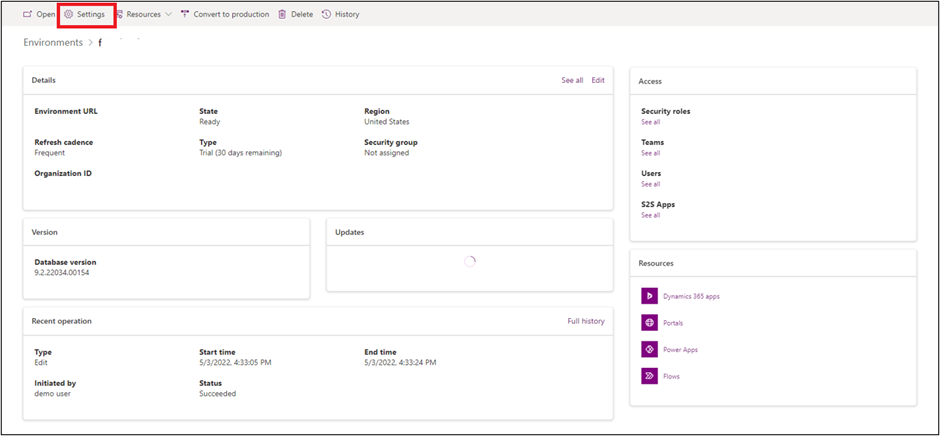](../media/customer-trial-settings.png#lightbox)

3. In the Settings page, select **Integration** and select **Teams integration settings**.

   > [!div class="mx-imgBorder"]
   > 

4. Change setting to **Yes** on **Turn on the linking of Dynamics 365 records to Microsoft Teams channels**. Select **Save**.

   > [!div class="mx-imgBorder"]
   > [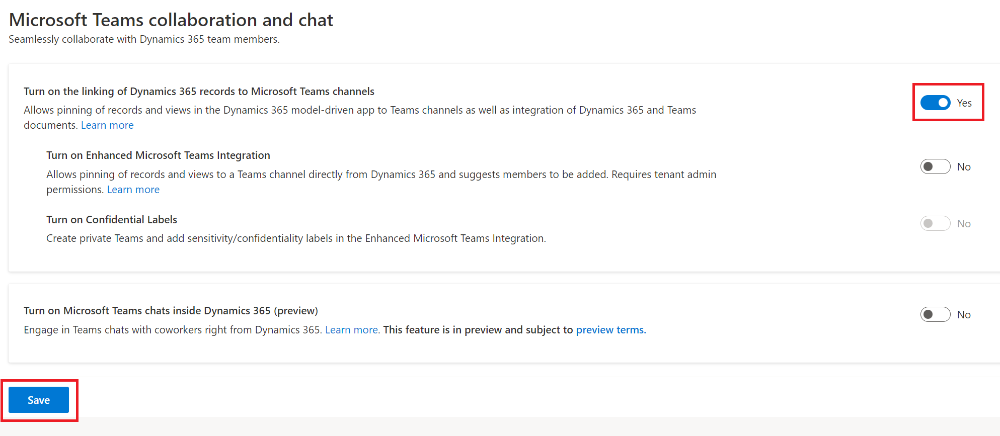](../media/settings-save-dynamics-365-records.png#lightbox)

5. After the page finishes saving, change settings to **Yes** on **Turn on Enhanced Microsoft Teams Integration**.

   > [!div class="mx-imgBorder"]
   > [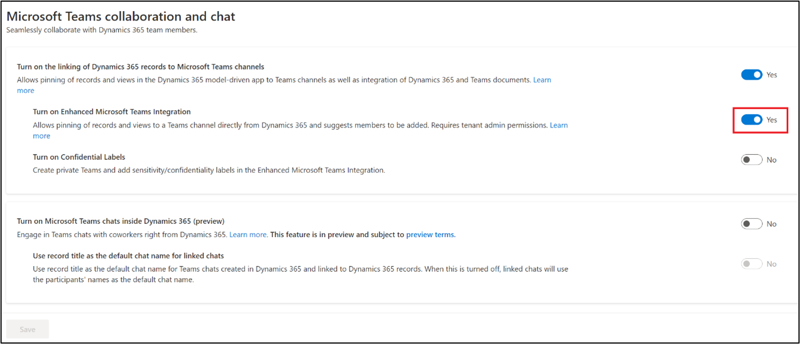](../media/settings-save-microsoft-teams-integration.png#lightbox)

6. Another pop-up window will open to grant permissions. Select the user you're signed in as currently.

   > [!div class="mx-imgBorder"]
   > [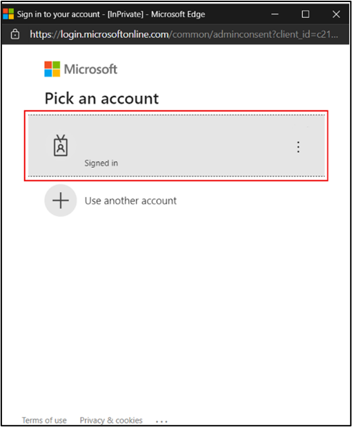](../media/pick-an-account.png#lightbox)

7. Select **Accept** for requested permissions.

   > [!div class="mx-imgBorder"]
   > [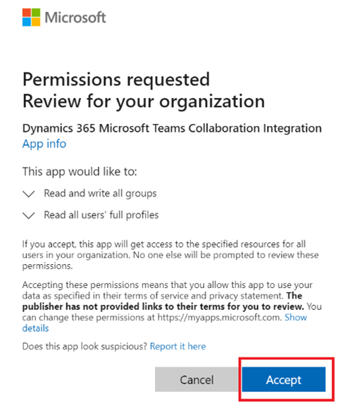](../media/accept-permissions.png#lightbox)

   > [!NOTE]
   > It may take several minutes to complete the Teams integration. Ensure you do not have pop ups blocked that may interfere with the configuration.  If so, turn off blockers for this website, cancel and try connecting again.

8. After the dialog disappears, select **Save**.

   > [!div class="mx-imgBorder"]
   > [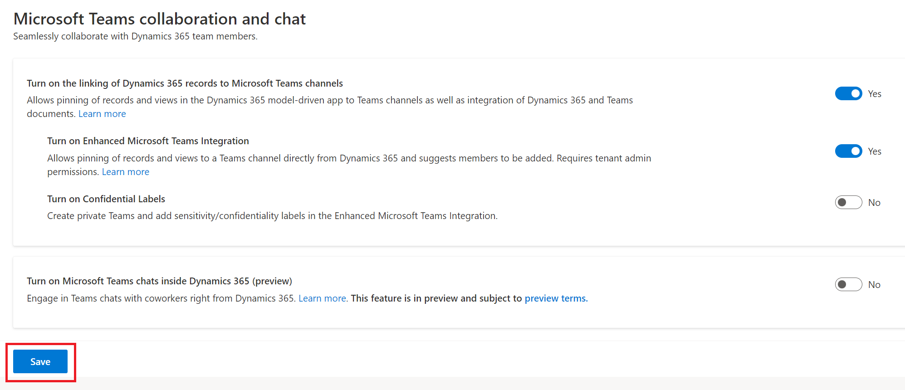](../media/microsoft-teams-collaboration-save.png#lightbox)

**Congratulations!**  You have enabled Microsoft Teams integration for Dynamics 365.

### Create Power Apps portal

In this task, you'll create a Power Apps Portal that will be used as a sample portal by the Customer onboarding capability.

1. While signed into your Microsoft 365 tenant, open a new tab and go to [Power Apps](https://make.powerapps.com/?azure-portal=true).

1. Change your **Environment** from default to the Trial environment you created in the previous task.

   > [!div class="mx-imgBorder"]
   > 

1. In the left nav, select **Apps** and then select **+New App > Portal**.

   > [!div class="mx-imgBorder"]
   > 

1. Set the new portal properties as shown below:

    **Name:** Woodgrove Banking Portal

    **Address:** fsitrialdemo

    Select **Use data from existing website record** and then select **Create**.

   > [!div class="mx-imgBorder"]
   > 

    Your portal will provision in the background. Proceed only after the portal provisioning completes.

    :::image type="content" source="../media/portal-provision.png" alt-text="Screenshot of the portal provisioning process in the background.":::

 