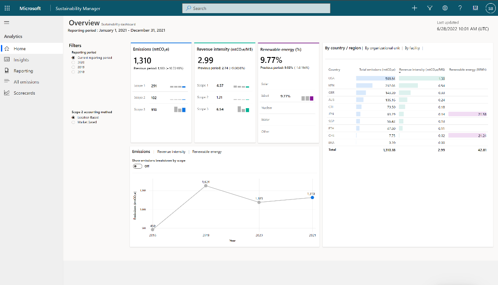
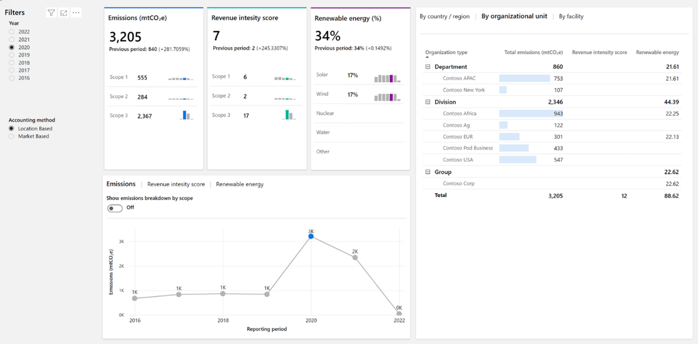
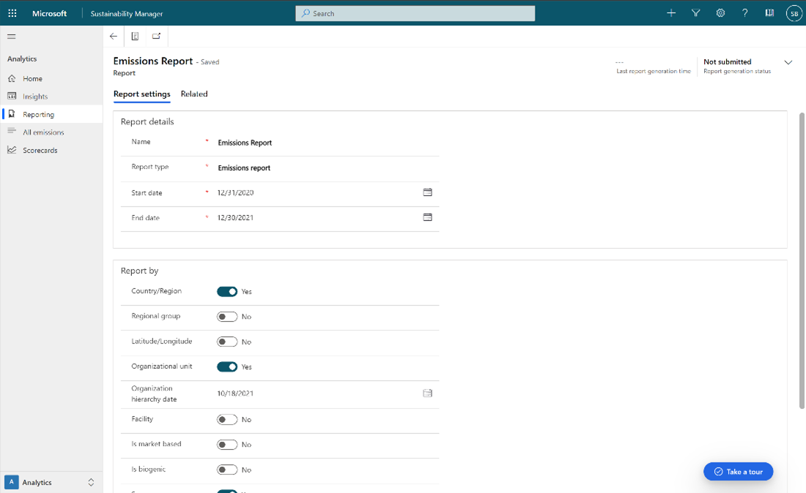

Analytics reports present your calculated emissions in an organized way so that you can detect trends or explore your data. These reports are updated soon after your calculations are run, and you can review the outcome of your calculations in an aggregated format. You can also export data in predefined report formats that include groupings for emissions and activity and other dimensions.

For analytics and reporting, you’ll use Microsoft Power BI Embedded and Azure Data Lake. Currently, Sustainability Manager stores all analytical data in Azure Data Lake, and the Power BI interface is a managed Power BI. You can’t customize this storage option, but Microsoft plans to offer this capability in the future. 

Reports are refreshed periodically and automatically, so you don’t need to take action to do so. However, keep in mind that a few minutes will elapse between when you calculate emissions and when the impact is reflected in your reports.

To reflect the calculated emissions in your reports, follow these steps:

1. Go to **Analytics > Home**. 
2. To find out when data was last refreshed, go to **Home** or **Insights**, and then check the time stamp in the upper-right corner of the screen. It’s in coordinated universal time (UTC). 

> [!div class="mx-imgBorder"]
> 

Two main levels of detail that you’ll find in the reports: 
- The Home page includes a summary of your progress.
- Under Insights, you can explore your emissions data in greater detail. 

## Chart features

All charts are organized by source type, country/region, organization unit, facility, and the time. Now, you’ll examine the different features of the charts. 

> [!div class="mx-imgBorder"]
> 
 
- **Interactive** - All charts are interactive. Essentially, you can select specific data and all related charts will filter based on your selection. This feature will help you understand your own data and find opportunities. 
- **Toggle** - Another design element is the toggles that you’ll find on some charts, such as toggles that show emissions breakdown by scope. Toggles give you flexibility to optimize the way that you visualize data analysis within a single chart.
- **Sorting** - Sorting is available on data grids to help you focus on the most important data that contributes to your emissions. For Scope 2 reports, you’ll find filters for location-based or market-based accounting methods.

## Insights

Insights screen allow you to conduct a more in-depth analysis of your data by scope. The tabs at the top of the screen will help you organize data based on scope, renewable energy, and deep analysis. For each scope type, data is organized by emission source, which you can explore by navigating through the tabs. 

- **Deep Analysis** - Deep analysis allows you more flexibility to explore your data by using the decomposition tree. You can drill down into your data by using dimensions, such as scope type, emission source facility, country/region, and organization. Additionally, you can enable the dimensions in any order that you want.

- **Reporting period** - To influence how insights are grouped, you can define a reporting period in the company profile. Also, this set influences the reports, which are available under **Reports**, where you can prepare to report different groupings of information.

    > [!Note]
    > Some organizations use the calendar year, while others will use fiscal year or an increment other than calendar year as a reporting period.

The reporting period start date is set under the organization unit that’s set up, and it will influence how data is grouped. After a report has been generated, you can download it as an Excel file and then use it for further analysis. 

To download a report, follow these steps:

1. Go to **Analytics > Reporting**   
2. Select the **Emissions Report** to display groupings.

    > [!div class="mx-imgBorder"]
    > 
