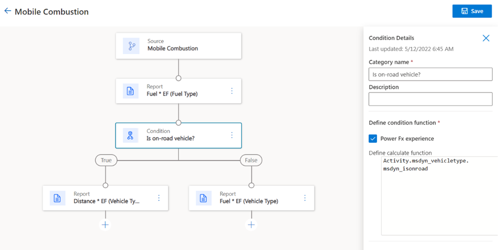
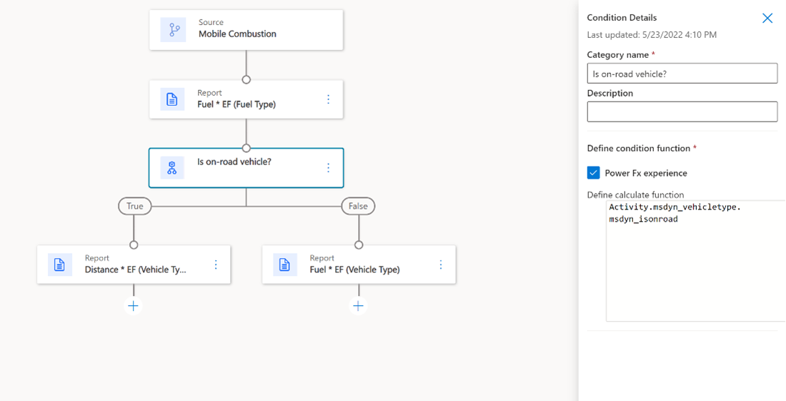
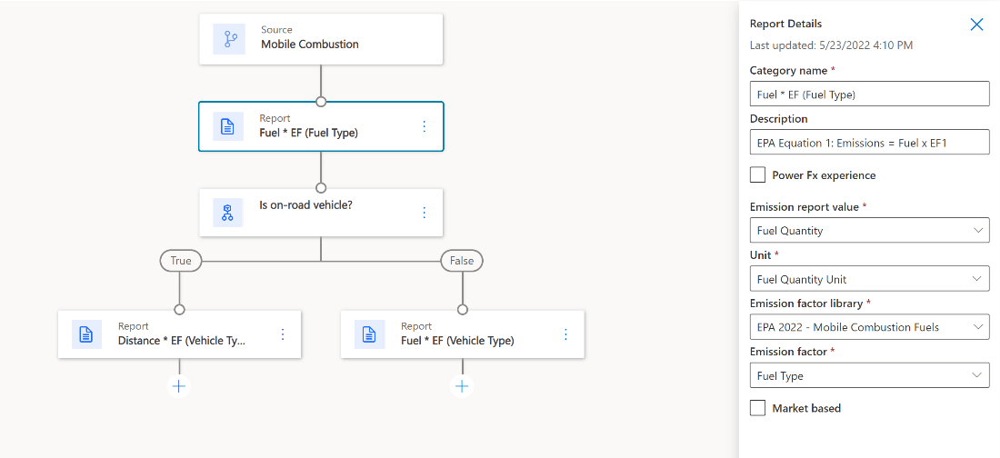
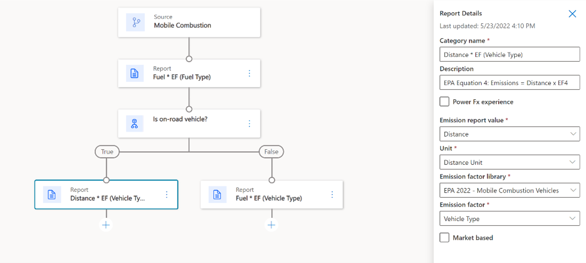
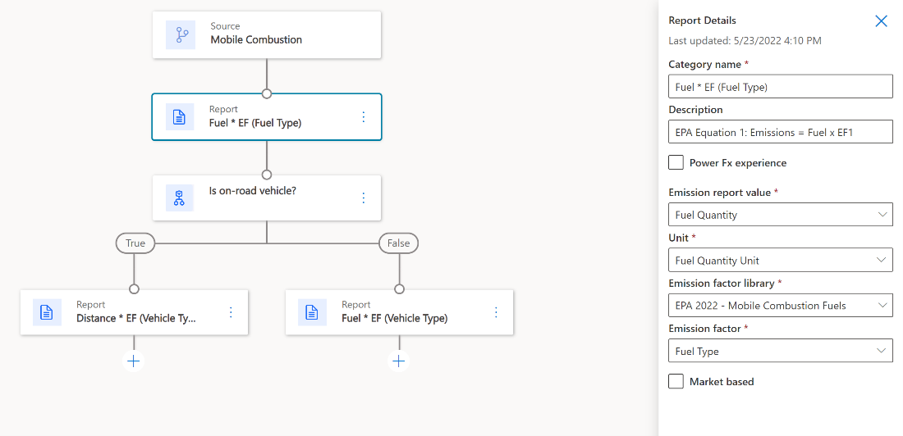

The following example calculation shows greenhouse gas emissions from mobile combustion. Mobile combustion means emissions from cars, trucks, vans, and other vehicles that burn fossil fuels like gasoline, diesel, or natural gas.

The model opens with a condition, which asks if it’s an on-road vehicle. The answer will be true or false. True means that the vehicle drives on roads, and False means that the vehicle runs off-road.

> [!Note]
> An on-road vehicle would be a typical passenger car. An off-road vehicle could be a bulldozer, tractor, or specialized industrial vehicle.

> [!div class="mx-imgBorder"]
> 

## Conditions

Conditions in Sustainability Manager are flexible and can use the Microsoft Power Fx experience. Power Fx is a low-code, human-friendly language that’s used across Microsoft Power Platform, which makes common programming tasks simpler. 

Conditions can include arithmetic operators, a wide range of math functions, and even conditional operators, such as the **"If"** condition. It provides a straightforward way to migrate your computation from an Excel workbook into a sustainability product. Documentation about using Power Fx is available online.

To work with the Power Fx experience, follow these steps:

1. Select the **Power Fx experience** checkbox. 

    In this field, you can generate any formula that you want. This checklist is especially useful if you want to use a formula that has values that aren’t present in the dropdown menus. 

The following example shows a Power Fx formula. It has an entity, a field, and a condition.

- **Entity** - Activity
- **Field** - Vehicle type
- **Condition value** – The **is-on-road** value will be **True** or **False**

This example shows why Power Fx is helpful. The value is on road isn’t available as a default in the dropdown menus. Power Fx makes it possible for you to use that variable. 

2. Select **Power Fx to enable UI (user interface)**.

    > [!div class="mx-imgBorder"]
    > 

## Reports

The following section describes the report nodes in more detail. 

> [!div class="mx-imgBorder"]
> 

The right side of the preceding screenshot shows four dropdown menus, such as Emission report value, Unit, Emission factor library, and Emission factor. These dropdown menus are conducting calculations on your source data, which in this case is Mobile Combustion.

The model in this example will ask the following categorical questions:

- **Emission factor value** - What is the fuel quantity that is being consumed? 
- **Unit** - In what unit is the fuel quantity measured? For example, is it measured in gallons or liters? Fortunately, the most common unit conversions have been prepopulated into the solution for you.
- **Emission factor library** - Which calculation library will you use to measure the emissions impact of fuel consumption? In this case, the answer is EPA.
- **Emission factor** - What is the emission factor? In this case, you’re using a factor mapping called Fuel Type. An option is available for you to include a specific emission factor, but when you select the factor mapping of Fuel Type, the system will automatically assign the correct factor from the EPA as different fuel types are parsed through the system.

    These factors will be multiplied together in a dynamic calculation, and the result of that multiplication will be part of the overall calculation. Therefore, by stacking several report nodes, the overall calculations can become complex. 

Below that condition, the model will ask about fuel type on both branches. The true branch of the formula asks about distance, and the false branch asks about vehicle type.

### Report node for distance under the true branch

Now, you’ll zoom into the report node for distance in the lower-left of the screen. You’re still pulling data from the Mobile Combustion source, but now a new set of selections is in the dropdown menus on the right.

> [!div class="mx-imgBorder"]
> 

You’ve selected:
- Distance

- Distance Unit
- EPA calculation library
- Vehicle Type 

To ensure that the company’s fleet is mapped to the EPA’s vehicle categories, an emission factor is dynamically assigned, meaning that this single model can accurately represent an entire company fleet.

### Report node for fuel type under the false branch

On the other branch of the formula, under the false value for on-road vehicles, you’ll use the following selections:

- Fuel Quantity
- Fuel Quantity Unit
- EPA
- Fuel Type

    > [!div class="mx-imgBorder"]
    > 
