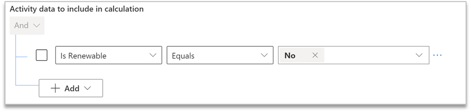
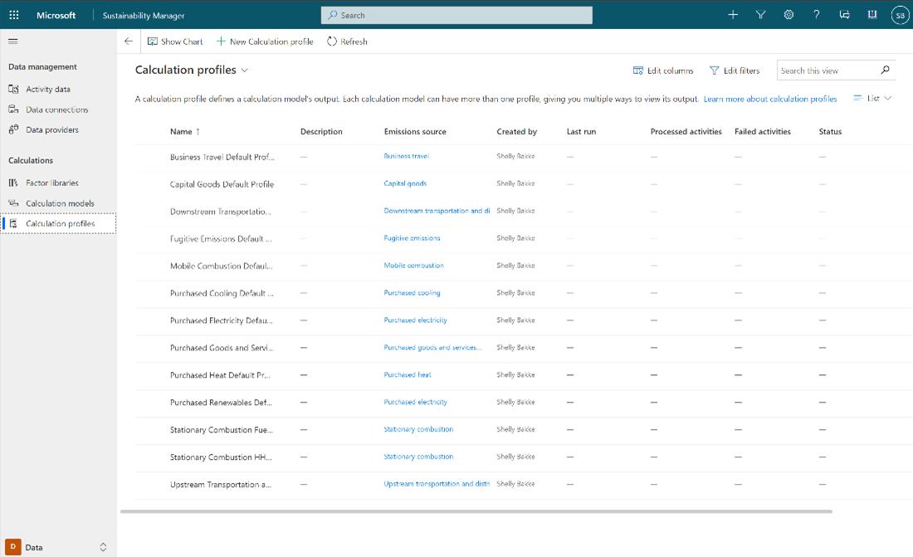
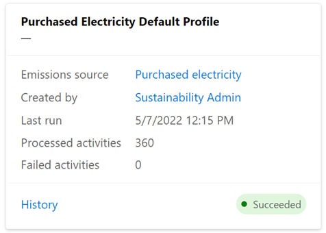
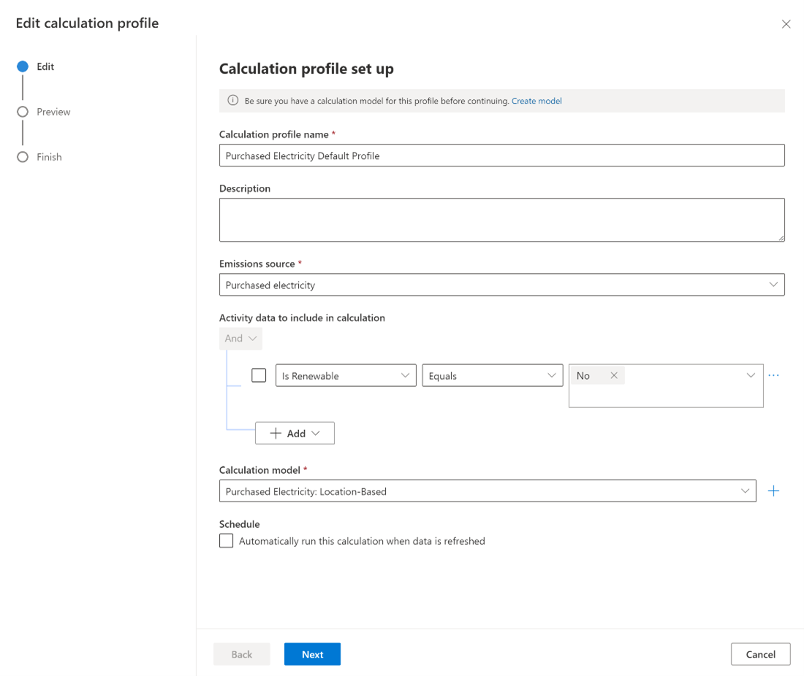
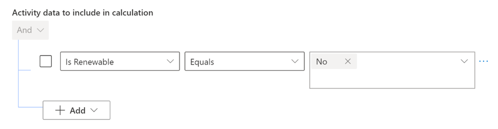
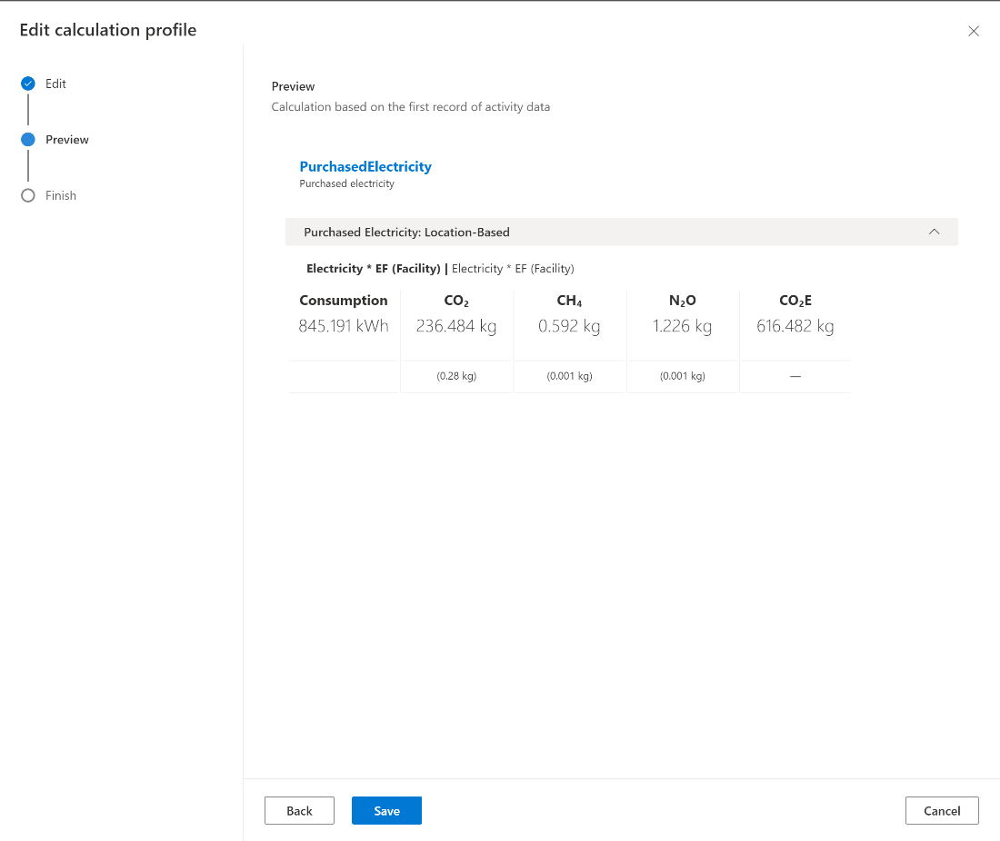

You can use a profile to connect activities, including live data ingestion, to models. Models don’t run the calculations on their own; they provide the definitions. A profile connects those definitions to real data. 

> [!div class="mx-imgBorder"]
> 

A profile is a job setup that will run when a recent activity is refreshed or will run on demand. You can also limit a profile to specific datasets, or ranges of data, so that only data within that range is run through the model. This feature is beneficial when you’re getting started with Sustainability Manager because it allows you to test your models on small sets of data to help make validation easier. 

## View profiles

Select **Calculations > Profiles**. This screen displays all existing profiles in one place. 
 
> [!div class="mx-imgBorder"]
> 

You can view the status of the profiles at the bottom of each card, and more information will be visible on this screen as the solution becomes more sophisticated.

> [!div class="mx-imgBorder"]
> 

## View profile history 

Every profile has a history. History provides a view into the times when the profile has run the calculation. You can open each instance to view errors that the profile has identified, which will help inform troubleshooting.

## Edit a profile

To edit a profile, follow these steps: 

1. Select the profile and then select **Edit calculation profile**.

    > [!div class="mx-imgBorder"]
    > 

2. Edit the profile as follows: 
    - Change the name of the calculation.
    - Write a brief description.
    - Select your emissions source.
    - Select your calculation model.
    - Select the checkbox that sets up the calculation to run automatically when new data comes in. If you clear the checkbox, you’ll need to select **Run Calculation** to run the calculation manually.
    - Select activity data for the calculation. You can limit profiles to a specific dataset.
 
        > [!div class="mx-imgBorder"]
        > 

        By using this selection tool, you can add logic to select data to run the calculations by using the AND/OR functionality. 

        You can select any entity within the emission source data model, and you can select conditions of a specific selection. In other words, your profiles can be as broad or specific as needed. For example, you can set up a profile to only calculate emissions for one country. 

3. Select **Next** to preview the calculation. 

    > [!div class="mx-imgBorder"]
    > 

    The screen displays the global warming impacts of CO2 and other greenhouse gases alongside resource consumption. Make sure that the correct factors apply to the correct data.  

    The outcome will be the calculated emissions, and you can preview and validate them before final setup. You can also remove previous calculations that are present. 

4. Select **Save** to update your profile if the information in the preview seems correct.
