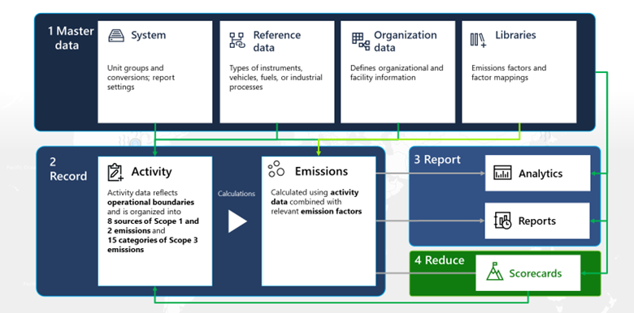

Now, you’ll examine the data flow process in detail, starting with master data. 

The following diagram shows the four steps of the data flow process: 
1. Use master data
2. Record
3. Report
4. Reduce

## Set up master data

The Master data section allows you to collect data to help establish a baseline and to understand the environmental footprint of your organization and value chain across Scopes 1, 2, and 3. 
- In the system, you can preload unit groups and unit conversions by using the most common forms of carbon accounting. However, this step isn’t necessarily complete, especially if you need to do a special conversion based on what you foresee in the data. 

- Reference data includes contextual, supplemental information that goes into an emissions calculation or helps provide context for calculation outputs. Examples of reference data include facilities, locations, industry, equation definitions, and activity metadata.
If you want to calculate mobile combustion emissions, you’ll need to know fuel types and vehicle types. The solution has some standard definitions based on the Greenhouse Gas Protocol, but organizations might have their own. You can import reference data under Data Connections by creating a connection. 

- With organization data, the organization can define its company information and facilities. Additionally, the organization can define its mappings and revenue to calculate the concept that you call carbon intensity, based on revenue units. You can use connectors in this step.

- The libraries contain emission factors and factor mappings, the latter being unique to this Sustainability Manager. The solution comes preloaded with some common libraries, but you can also import your own. 

    > [!Important]
    > Organizations that are getting started with Sustainability Manager should follow items in this section in sequence before moving on to the next section. This sequencing will help provide the highest rate of success.

## Record

The Record section allows you to automate data collection, break down data silos, and calculate emissions more accurately across organization scopes.

Activity data represents the operational boundaries, including everything that contributes to an organization’s emissions. This data will be different for every organization, depending on what they do as part of their business. All activities will have three scopes, but the types of activities will be different. For example, some activities will have industrial processes, while others will be more intense on Scopes 1 and 2 or some categories of Scope 3. 

Sustainability Manager provides connectors for all activities.

You can calculate the emissions by combining activity data with relevant emission factors, using profiles and models. 
The emission calculations are dependent on all pieces of reference data and activities that have been defined as transactional data.

## Report

The Report section allows you to visualize your impact, track your performance against goals, gain actionable insights, and streamline reporting. 

When you’ve calculated emissions, the results and insights are generated through analytics and out-of-the-box reports. 

## Reduce

The Reduce section allows you to set goals, act to reduce your emissions footprint, and transform your business through Sustainability Manager.

Again, the sequence is critical. The master data feeds into activities and calculations to inform meaningful analytics and reports. The data will populate scorecards that you can use to help track your reduction progress. You don’t need to refresh or push data to the analytics; the data will automatically refresh. 

Under the data flow process is the Microsoft Cloud for Sustainability data model, which centralizes organization data from various sources. It streamlines data ingestion, integration, emission calculations, and reporting. These groups of data are related and dependent on one another.
