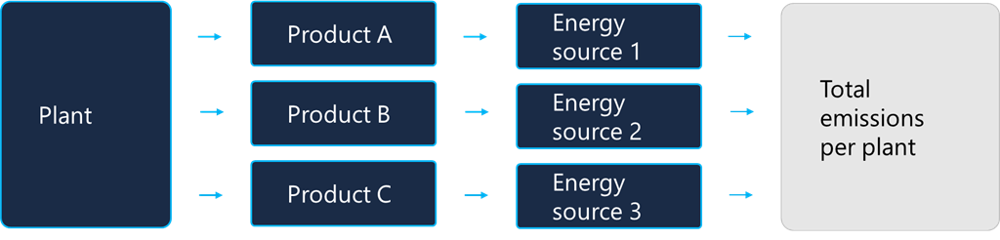

Data ingestion includes identifying the various sources that generate emissions and then connecting these data sources. In this step, you’ll determine the different scopes and activities that contribute to your organization’s emissions. 

The rate at which any organization can implement emissions reductions is dependent on factors that can fluctuate over time. Organizations’ operations and improvements undergo constant evolution; therefore, the supporting data to continuously calculate the carbon footprint can also change. You should carefully consider all operational factors for successfully recording, reporting, and reducing carbon emissions.

The structure of businesses can change, such as when they add new operations, facilities, or product lines. If you don’t have the relevant facilities in the solution when you bring in emission source data, the calculations will break. You can manage these types of updates manually, but it’s most efficient to use connectors to business systems or other sources to enable a continuous stream of data. 

A live stream of data is a more reliable way of keeping supporting data accurate and complete. This way, changes to an organization, facilities, or reference data elements won’t disrupt your ability to do carbon calculations at scale.
 
## Data types 

Three types of data in Sustainability Manager are reference or master data, transactional data, and analytical data. 
- **Master data** - The system or master data is the reference data that supports the continuous flow of activity data, allowing for near real-time emissions calculations.
- **Transactional data** – This data represents the activity and includes everything that can produce emissions. You can perform the calculations on the transactional data, which is ingested periodically. 

    > [!Note]
    > The master data and transactional data is stored in Microsoft Dataverse, which is where the recording happens.

- **Analytical data** – This data is used to feed all insights and the scorecards. It’s the data that results from periodic calculations and combines master data, and it’s used for optimal analytical purposes. 

    > [!Note]
    > Analytical data is stored in Azure Data Lake and is used for reporting and reduction goals.

## Example – Track emissions by segment within manufacturing plants
The following example describes a scenario that a Microsoft customer encountered.

> 

This organization has facilities (or plants) where they manufacture three distinct products in each plant, and the organization wants to track emissions by three different segments within each plant.

The organization uses different energy providers for each line of business. Therefore, the emission factors are different, even inside a single plant. The organization faced a challenge when defining the facility type. They discovered that they needed to expand the solution to support multiple dimensions within a facility and other types of core data.

The organization needs to address this problem so that they can identify the facility for production of product line A, B, or C. This step will ensure that the organization will have enough granularity to do correct carbon math and other sustainability analysis for each product within each facility.
