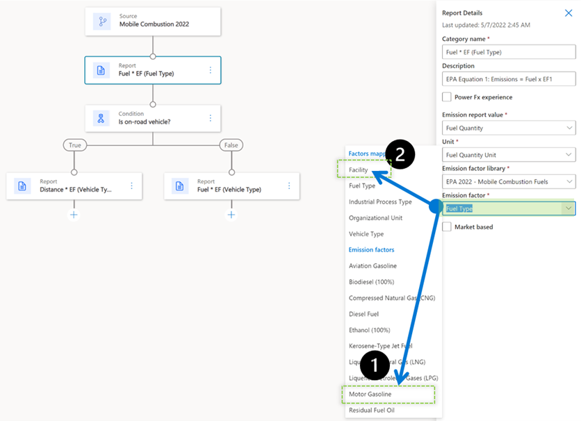
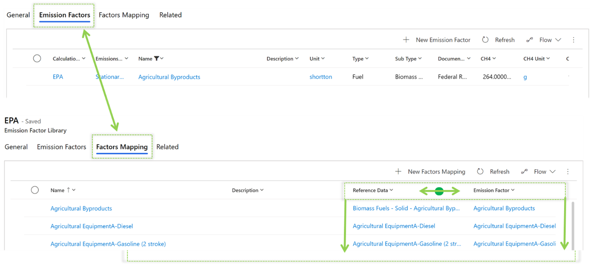

Consider a scenario where you need to calculate mobile combustion for gas-powered passenger vehicles of all model years. 

You can identify the correct emission factors by:
- Mapping directly to specific emission factors by fuel type.
- Mapping in advance by using the library for all fuel types and emission factors.

> [!div class="mx-imgBorder"]
> 
 
**Scenario 1**

You can set emission factor directly in the formula as Gasoline Passenger Car 2000 and then use its calculations in this formula, working only for this combination.
This approach requires you to create several formulas according to available fuel types, resulting in a complex setup.

**Scenario 2**

When selecting a factors mapping of Fuel Type (reference data), the formula will use the library to dynamically search for the factor and to find a match with the correct emission factor and fuel type for the activity. This approach simplifies the number of formulas but requires you to define a factors mapping in the library.

Before factors mapping can occur, you’ll need to set up emission factors and reference data. Make sure that you include a factors mapping for each piece of reference data in a category. If a calculation is based on factors mapping, but you haven’t mapped one piece of reference data, the calculation will fail because the factors mapping can’t be assigned.

> [!div class="mx-imgBorder"]
> 

Next, you’ll complete the steps for setting up factors mapping:

1. In the left navigation pane, select Factor **library**.
2. Select the library that contains the emission factors that you want to map to. 
3. On the Action Pane, select New **Factors Mapping** to manually add the mapping information. You can also use the **Connection** functionality.
4. Enter a name for the mapping.
5. Find and select the entity name that you're mapping to. This entity can be any type of reference data that you've added, such as facility or fuel.
6. Find and select the emission factors to map to.
7. Save your changes and close the page.
