Data collection is one of the most important steps in the process of defining your greenhouse gas emissions and carbon footprint. Sustainability Manager provides a streamlined data collection process that you can use to import the required activity data, reference data, and precalculated emissions data.

Now, you’ll explore how to pull in data by different methods such as importing files, using direct connections, or using power queries.

Regardless of how you pull in data, you’ll need to organize it to some degree. You can use the predefined templates, which are useful references for simplifying data preparation and helping organize data in destination files. These templates will help align your data with the Cloud for Sustainability data model.

Organizations can use a combination of methods to ingest data into the solution.
- **Manual** - You can enter data manually. Even global organizations that are otherwise automated will occasionally need the option to enter data manually. For example, many Fortune 500 companies operate in several countries, including countries that lack consistent connections to databases for pulling electricity consumption data. These organizations might be examining electricity bills and transferring that data into spreadsheets. For those organizations, you should select the option to manually enter data.
- **File based** – Instances might occur when organizations need to import data from Microsoft Excel or CSV files. 
- **New connections** - Sustainability Manager also supports direct connections to databases and other business applications. It can be connected to data sources, regardless of solution provider, vendor, or platform, by using Power Query.
- **Prebuilt connectors** - Eventually, you’ll provide customers with a marketplace of prebuilt connectors straight to other data sources. To simplify the process of connecting customer data, Microsoft is collaborating with partners to create connectors to meet industry and customer-specific requirements. You can also create your own private connectors to enable specific scenarios by extending Sustainability Manager.

## Example - Use Excel templates

Templates are available in the Configuration Guide to support data management. The templates define the columns that are needed to cleanly import data by using different import methods. 

Some columns are mandatory, while others are recommended. The templates should always contain the mandatory columns that the solution expects when you import them back with your own data.

> [!div class="mx-imgBorder"]
> [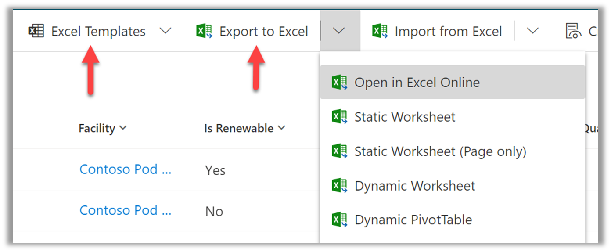](../media/excel-template.png#lightbox)
 
To create a Data Connector for managing your data, follow these steps:

1. Go to **Data Management > Data Connections > New**,  where you’ll have the option to create data connections. **Select Activity Data > Purchased electricity**.  

    > [!div class="mx-imgBorder"]
    > [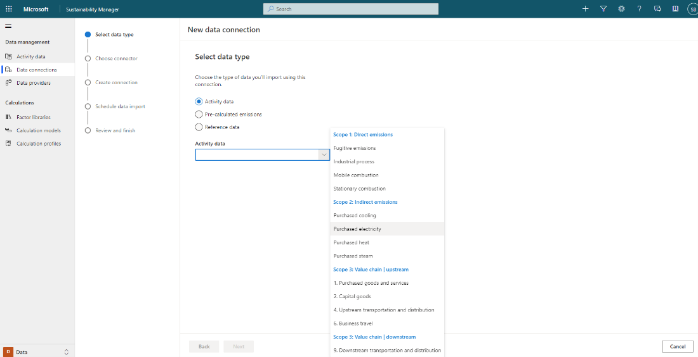](../media/select-data-type.png#lightbox)

    You can also choose a file for data that’s already loaded, export that file to Excel, and use one of the sample files as a guide. This approach helps streamline the data ingestion process. 

2. To explore what happens if you choose to use an Excel file, select **Excel**.
3. Select the **Pick a file** option. The file needs to be available in OneDrive and you’ll need to create a live connection to the file. That way, after you’ve set up the connection, as data is updated in that file, it will continue to be ingested into the solution if you set a schedule or define import frequency.

    > [!div class="mx-imgBorder"]
    > [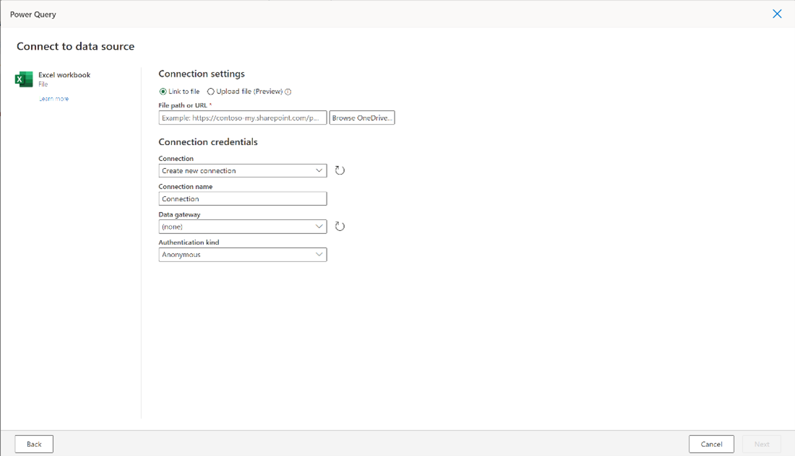](../media/connect-data-source.png#lightbox)

    You might need to transform data. Assume that you’ve picked an Excel file that contains all mandatory data. If the file contains column names that match the column names in the predefined templates, you can skip this step and the solution will map data automatically for you. This process will be familiar if you’ve connected data to Microsoft Power BI in the past. However, the Excel file could also include extra columns. If you choose to transform the data, you can set a sequence of steps to transform data as you import it. 

4. Select **Next**. 
5. Select **Transform data**. A name in the organization units might appear. If so, you should update the name to standardize naming conventions. 
    
    > [!div class="mx-imgBorder"]
    > [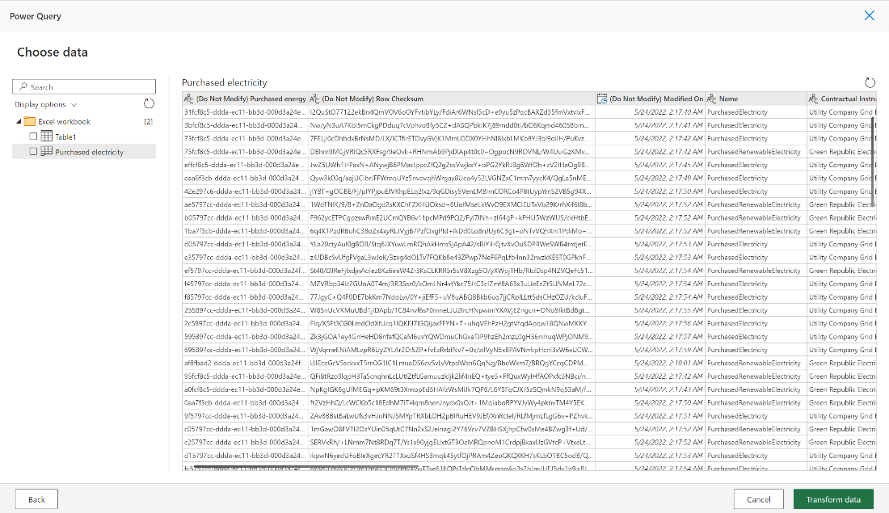](../media/choose-data.png#lightbox)

6. Select **Transform** from the lower right, where you can change or replace values. This step is optional, depending on the quality of the data. However, after you’ve established a connection to clean data, you won’t have to do this step again.

    Next, you might want to map to an entity. The system will try to auto map. If you rely on templates to import data by using the appropriate columns that are labeled correctly, everything will map automatically. 

    However, you can decide if you want to do something different. You can transform from the source and bring your clean data into Sustainability Manager. This action can be your most efficient, long-term approach if your processes involve intensive transformation. 

7. Once the data has been transformed, select Map to entity, this will allow you to map the columns in the excel (or source format) to the columns in the Sustainability data model. 
    > [!div class="mx-imgBorder"]
    > 

8.	Select **Create**, once mapping is complete select **OK**.  

    > [!div class="mx-imgBorder"]
    > [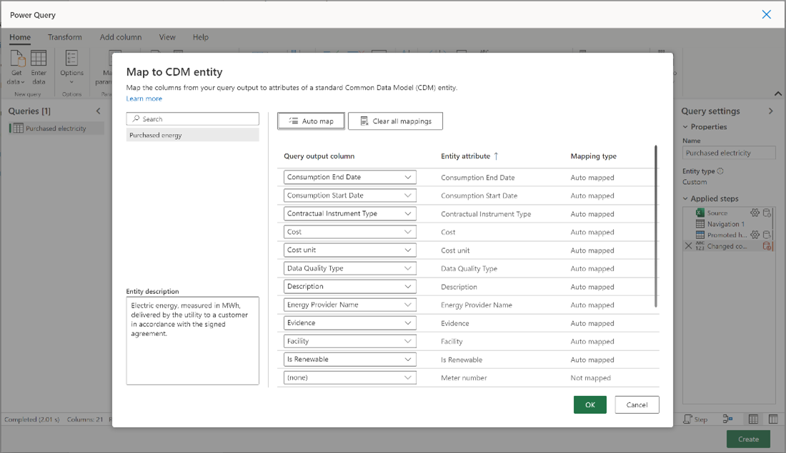](../media/map-entity.png#lightbox)

9.	Select **Create**.
    
    > [!div class="mx-imgBorder"]
    > [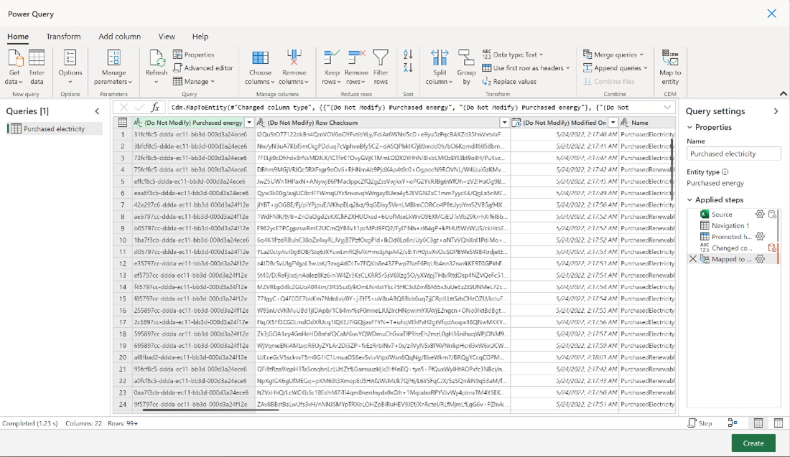](../media/create-mapped-data.png#lightbox)

    When you’re importing data, you can do it once, or you can schedule an import for the future. 

10. Select **Schedule data refresh**.  You’ll have several decisions to make, such as whether you want to remove previously imported data.
11. Select **Remove previously imported data** and then enter a name in the **Connection Name** field. 
12.	Select **Automatic** to set the frequency and the schedule and to enable the job. Now, the application will read the Excel file and start to report it. 
13.	Enter a name for the connection and choose **Connect**.

    > [!div class="mx-imgBorder"]
    > [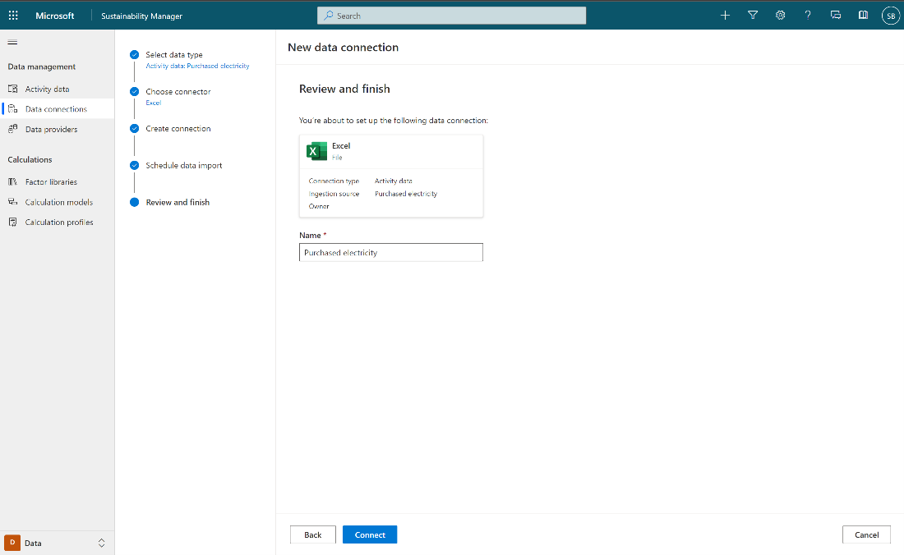](../media/new-data-connections.png#lightbox)
 
14.	After the data is in the application, you can get the emission details. Go to **Data Connections**, select **Purchased Electricity**. 

    > [!div class="mx-imgBorder"]
    > [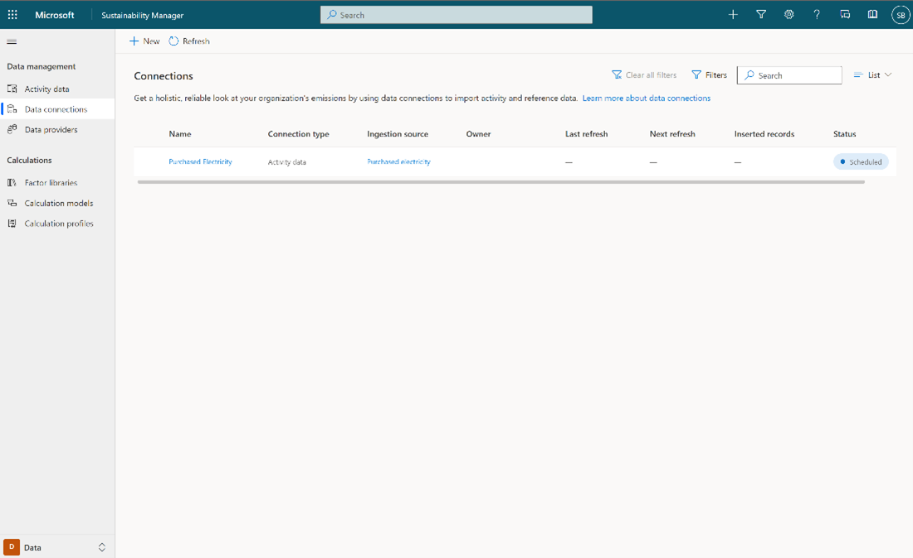](../media/data-connectors.png#lightbox)

    On the Data Connections screen, you can get the history and different jobs and look for errors, such as whether the solution successfully imported the data. 

    > [!div class="mx-imgBorder"]
    > [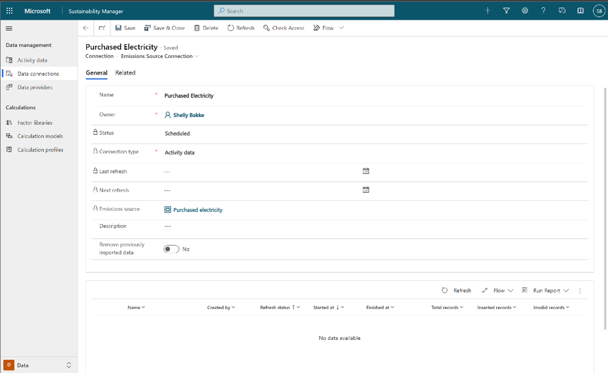](../media/history-data.png#lightbox)

## Example - Use a Power Query connector 

Microsoft Sustainability Manager is open to all types of sources and business applications. Another type of connector is Power Query. If you’ve used power queries in other applications, such as Power BI or Excel, the process will work similarly in Sustainability Manager. When you pass the authentication, you’ll go to the mapping and schedule the data refresh.

1. Go to **Data Connections > New > Activity Data > Purchased Electricity**.  Select **Next**

    > [!div class="mx-imgBorder"]
    > 

2.	Select **See all Power Query connectors** and then select a connector and choose **Next** to create a connection.

    > [!div class="mx-imgBorder"]
    > [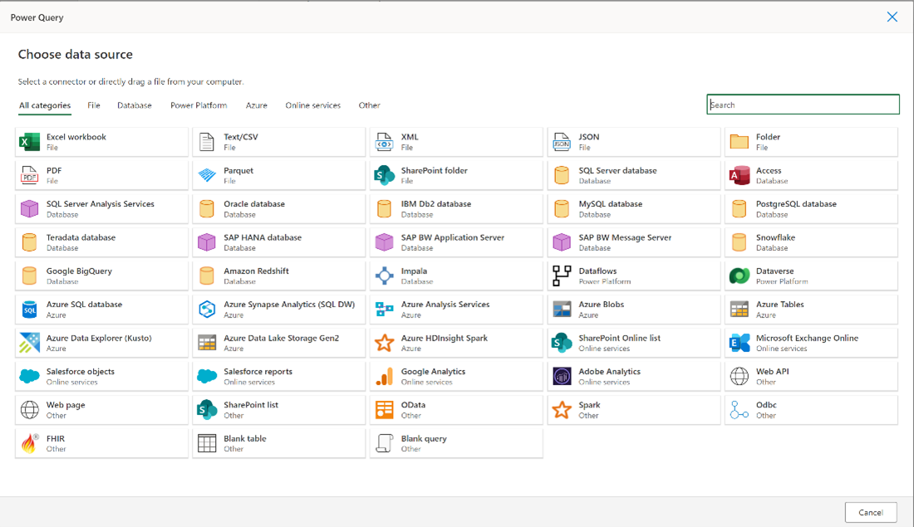](../media/power-query-connectors.png#lightbox)

## Example - Use a prebuilt connector

Another type of connector that you might use is a prebuilt connector. 

Consider a scenario where you’re using a connector to a utility company. Using a data provider connector will simplify the process even more by removing the need for extra transformation or data mapping during setup because those connectors are preconfigured. 

1. Go to **Data Connections > Activity data > Purchased Electricity**.
2. Select **Adatum Utility Management**.
    
    > [!div class="mx-imgBorder"]
    > [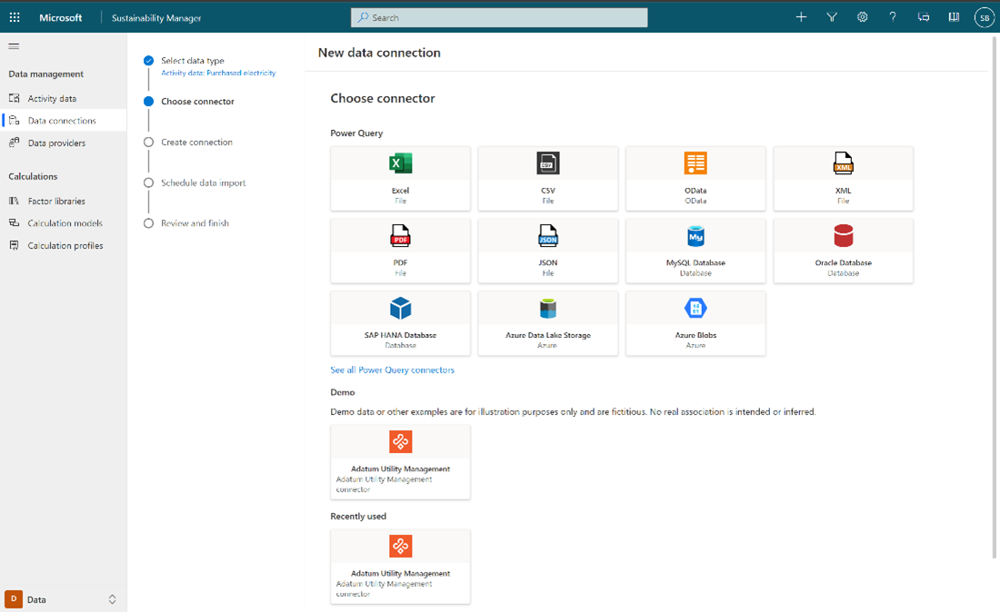](../media/utility-management.png#lightbox)

3. After you’ve selected prebuilt connectors, you’ll need to confirm security. The solution will automatically do the transformation and mapping to the data source. Select **Next**. 

    > [!div class="mx-imgBorder"]
    > [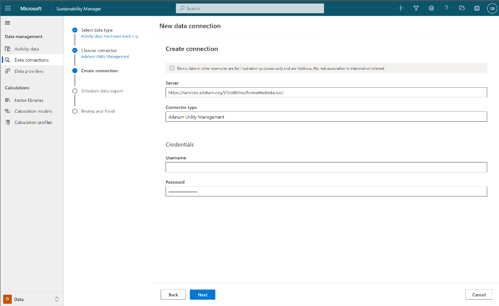](../media/security-mapping.png#lightbox)

4. After you schedule the data refresh, the application will start to pull the data from that data source connector. Select **Next** to schedule the data refresh.

    > [!div class="mx-imgBorder"]
    > [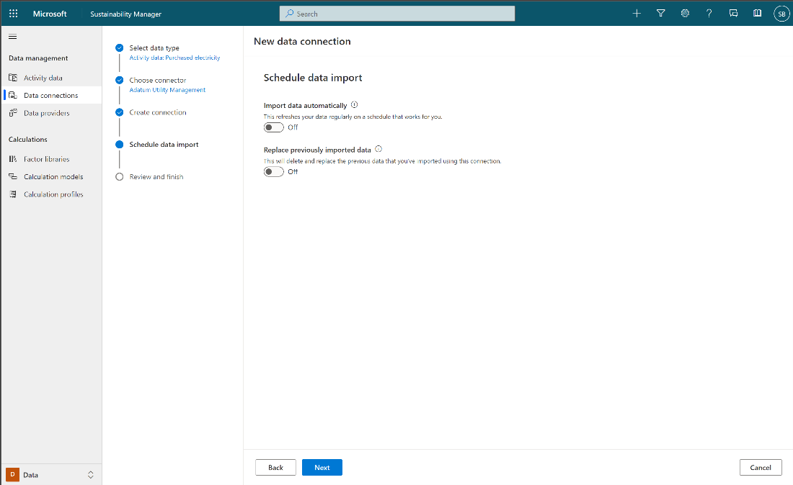](../media/schedule-data-import.png#lightbox)

5.	Select **Create connection** at the Summary.

    > [!div class="mx-imgBorder"]
    > [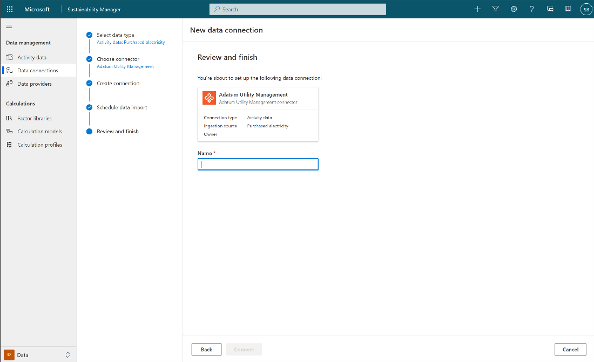](../media/creation-summary.png#lightbox)

## Recommended practices for data ingestion

By following a crawl-walk-run approach, organizations can get started smoothly. IT teams would want to support more complex scenarios immediately. We recommend that you start with simple scenarios to quickly demonstrate the value of the solution. 

Start by using the organization’s Excel files to pull data into the solution to demonstrate the experience end to end. Then, you can gradually add connections to the databases or plan prebuilt connectors. 

Change takes time, and the sustainability journey will require change management and business transformation. However, organizations can start by doing a rollout by country/region, type of operation, or type of activity. They can focus on using Sustainability Manager to manage Scope 1 emissions and then add Scope 2 later. Alternatively, they can do these tasks in different combinations. 

Be flexible about how you get started with ingesting the data. Replace manual processes as much as possible, whenever practical, and automate more over time. Aim to start simple, get value fast, and then keep expanding. Microsoft Sustainability Manager is flexible enough for you to start this way.

Keep the following important considerations in mind for data ingestion: 
- Plan your approach based on organization landscape, technical capabilities, and source data format. 
- Partner with IT to manage data ingestion.
- Define roles for data management security.
- Start simple with manual or file-based data ingestion methods.
- Be flexible about how your organization imports data; blend methods where possible.

## Monitor data ingestion

When you’re importing data into the solution, you’ll want to schedule, monitor, and troubleshoot as you go, but you can always check the job card to know the status of the job. 

The lower-right corner of the card will indicate if the data connection is complete or scheduled, or if errors have occurred that indicate if something requires attention. 

> [!div class="mx-imgBorder"]
> [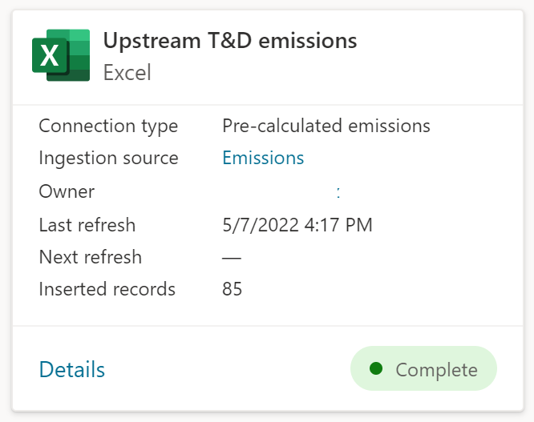](../media/upstream-emissions.png#lightbox)

 
Importing data allows you to conduct a one-time import or to schedule an import for the future. You can set up direct connections to organizational unit data so that when changes are made to that data, they’re also made dynamically within Sustainability Manager. You can set up this connection for a live feed of data by setting up an automatic import and defining the schedule or frequency for the import.

> [!div class="mx-imgBorder"]
> [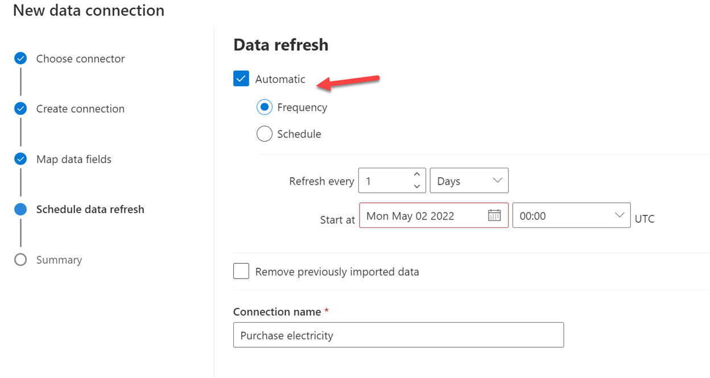](../media/data-refresh.png#lightbox)

During import you can: 
- Monitor 
- Remove and replace data as you work. 

> [!Note]
> This step will trigger new calculations.
