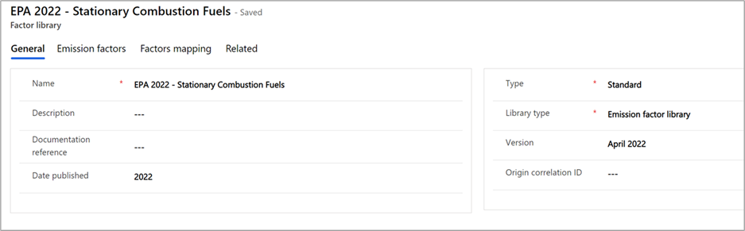

Through the calculation model setup process, you’ve learned about emission factors. They can vary based on the emission source activity and on extra supporting data in Sustainability Manager, called reference data. Examples of reference data include facilities, fuel lists, or vehicles. 

This combination of reference data and emission factors creates factors mapping. Factors mapping will provide you with the flexibility to map factors based on the different reference data that’s available in the solution. Factors mapping enables dynamic calculations at scale.

You’ll store factors mapping in the factor library. A library is a container of emission factors and factors mapping for a specific year and version.

> [!div class="mx-imgBorder"]
> 
 
For example, you have 100 facilities, each of which is in a different region and has different emission factors. By creating a factor mapping to the emission factor based on the location of the facility, you can efficiently set up a single calculation model to support those 100 facilities. 
