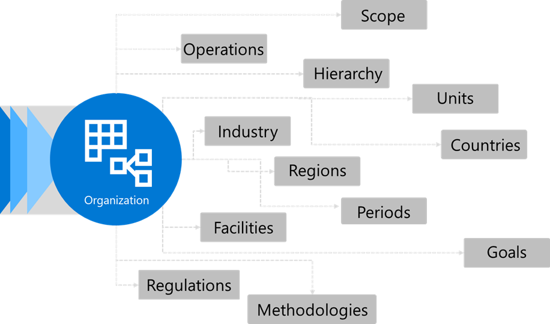

You’ll begin by defining the scope for your organization. For example, consider the number of countries/regions that you operate in. 

The answers will help you understand the following aspects:

- Types of regulations that you’ll need to address in each country/region

- Emission factors
- Types of data that you’ll need to collect 
- Granularity of the data and insights that you’ll need to produce

These answers will help you track and report your sustainability progress and meet your emissions reduction goals. 

 

Defining all attributes of the organization up front is important. For example, some organizations require you to segregate data by units. This approach requires accounting for the use of different units of measurements in different countries/regions. Some countries/regions use imperial units, while others use the metric system. This difference impacts calculations and formulas. 

Understanding this level of detail will help you create a blueprint for the organization in this solution. Defining attributes properly at the start will help set up the organization for success with a solid configuration and an architecture that can scale. 
