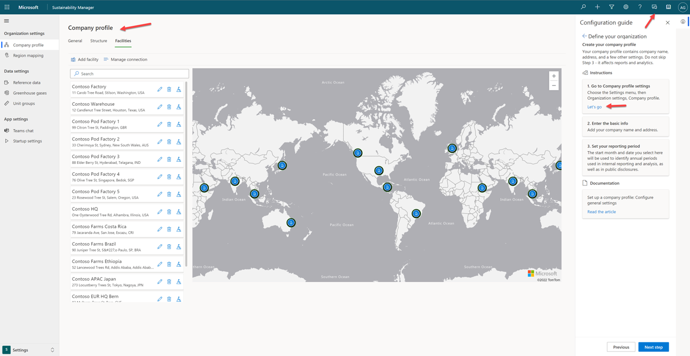
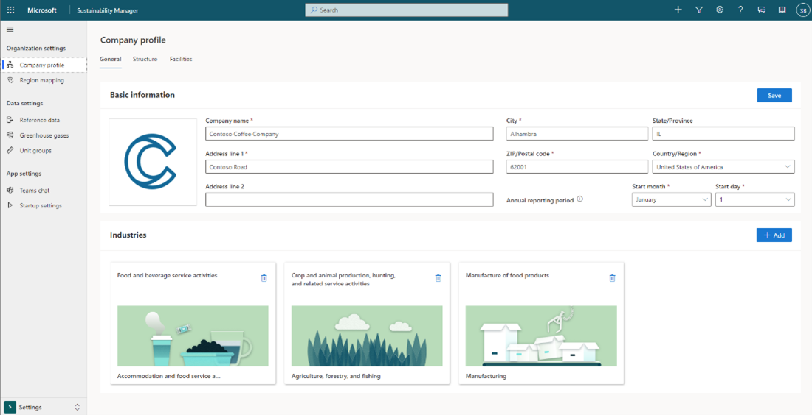

One of the initial processes is defining your organization.

## Prerequisite 

Complete this process before you go further. You’ll have to create a company profile, set up your organizational structure and hierarchy and then add some facilities.

> [!div class="mx-imgBorder"]
> 
 
Different ways are available for you to set up an organization’s structure in the solution. 

In the Company profile section, you can set up your organization and define your facilities. This step is important because adding units and defining their hierarchy helps you understand the structure of the organization. Additionally, it enables the solution to connect the correct emission factors to specific locations.

1. Go to the navigation bar and open **Configuration guide**.
2. Create a company profile. 
3. Enter the information on the three tabs in the **Company profile** section. 
    
    > [!div class="mx-imgBorder"]
    > 

- **General** – Contains basic information.
- **Structure** – Contains organizational units and their hierarchy.
- **Facilities** – Contains information about specific facilities. 

You can enter data on the Facilities tab manually. This approach works when the organization has a small set of units, but it isn’t always practical. The manual process can be too slow and labor-intensive for large corporations, such as if an organization has 1,500 facilities. Therefore, for a large organization, you can import existing data by using the connector wizard as a one-time import.
