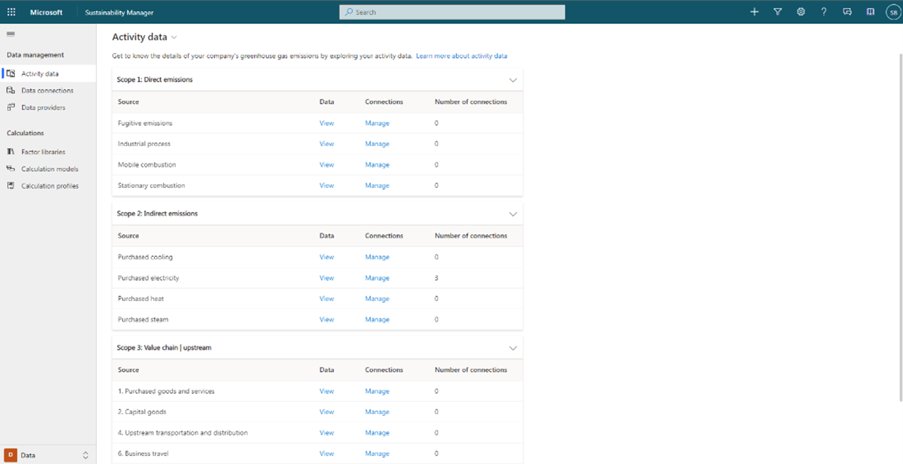

The reference data includes essential information such as fuel types, vehicle types, facilities, spend types, and contractual instrument types. Some reference data is unique to your organization, and some will come from standard or industry sources.

You can establish direct connections to any business system, ERP system, or cloud platform that an organization uses. 

The Data section of the application includes activity data and reference data, and you can create a connection for both. 

> [!div class="mx-imgBorder"]
> 

Alternatively, you can go to the form and create new records manually. After you set up the connection, you’ll have a continuous stream of data if you set up a schedule or define import frequency. 

You can also pull in precalculated emissions. This feature is useful for organizations that are already calculating emissions in certain scenarios but want to pull that data into the solution to take advantage of the analytics. When you use precalculated emissions, Sustainability Manager will skip the activity and calculations and feed the precalculated emissions straight into analytics. 

## Recommended practices for setting up reference data

When setting up reference data, you should:
- Identify regulatory requirements in countries/regions where operations exist. Regulatory requirements in different countries will dictate your needs, determining aspects such as emission factors. 
- Specify units and conversions to avoid calculation errors. You can convert units of measurement. If you’ve set up conversions in the application, the calculations will work.
- Define the solution landscape in terms of reporting needs and level of granularity. Consider the level of granularity that you’ll need for reporting purposes. For example, if you need to track a specific line of business, you’ll want to set up your facilities with a name that contains “Facility + Line of business” in the name, such as “Contoso Pod facility – Organic beans.”

Organizations might be presently getting started, or they might have reached a certain level of maturity in a sustainability area and know what they need. By finding out how detailed your organization wants their insights and reporting to be, you can set up Microsoft Sustainability Manager to support their needs. 
