In this unit, you’ll create two calculation groups. Before you create the calculation groups, you’ll review the sample data model and create some measures.

## Task 1: Review the data model

Download and open the Adventure Works DW 2020 M08.pbix file.

Verify that you have Tabular Editor 2 installed.

> [!Note]
> If the **External Tools** ribbon tab doesn’t show, or if that tab doesn’t include Tabular Editor, return to Unit 2 for guidance on how to complete the installation.


In Power BI Desktop, switch to **Model** view and then review the model design.

> [!div class="mx-imgBorder"]
> [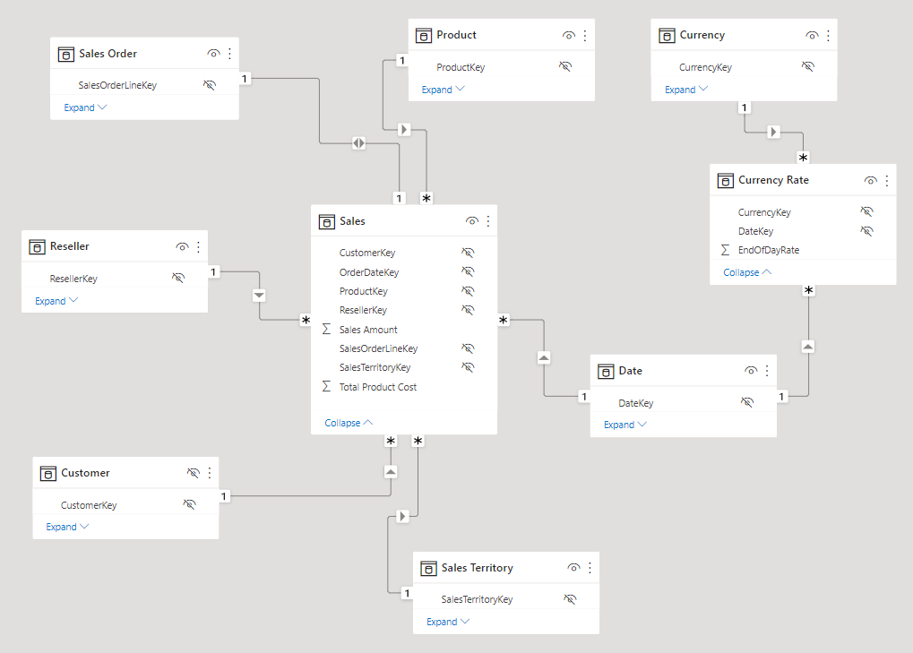](../media/model-view.png#lightbox)

The model comprises seven dimension tables and two fact tables. The **Sales** fact table stores sales order details. The **Currency Rate** fact table stores daily currency exchange rates for multiple currencies. It’s a classic star schema design.
Switch to **Report** view, and then in the **Fields** pane (located to the right), expand the **Sales** table to review the fields.

> [!div class="mx-imgBorder"]
> [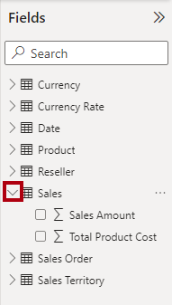](../media/field-sales.png#lightbox)

The two **Sales** table fields are decorated with the sigma symbol (∑). The sigma symbol indicates that the fields will automatically summarize by using aggregation functions, such as sum, count, average, or others.

However, when you add calculation groups to a model, you’ll need to disable this automatic behavior. Specifically, Power BI can only achieve summarization by using measures, which you’ll define by using DAX formulas. Therefore, you’ll now add measures to the model.

## Task 2: Create measures

In the **Fields** pane, right-click the **Sales** table and then select **New measure**.

> [!div class="mx-imgBorder"]
> [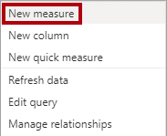](../media/new-measure.png#lightbox)

In the formula bar (located beneath the ribbon), replace the text with the following measure definition and then select **Enter**.

```dax
Sales = SUM('Sales'[Sales Amount])
```
> [!Tip]
> You can copy the DAX code by pressing Copy.

> [!div class="mx-imgBorder"]
> [](../media/copy.png#lightbox)
 
On the **Measure tools** contextual ribbon tab (available when a measure is in focus), format the measure to use two decimals places.

> [!div class="mx-imgBorder"]
> [](../media/decimal-place.png#lightbox)

Create and similarly format a second measure named **Cost** by using the following definition:

```dax
Cost = SUM('Sales'[Total Product Cost])
```
Create and similarly format a third measure named **Profit** by using the following definition:

```dax
Profit = [Sales] - [Cost]
```
In the **Fields** pane, right-click the **Sales Amount** field and then select **Hide**.

> [!div class="mx-imgBorder"]
> [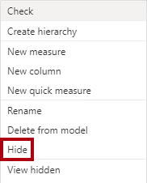](../media/hide.png#lightbox)

Also hide the **Total Product Cost** field.

Now, the **Sales** table is listed first in the **Fields** pane, and it’s decorated with a multi-calculator icon.

> [!div class="mx-imgBorder"]
> [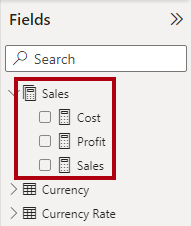](../media/sales-table.png#lightbox)

When a table comprises only visible measures, it’s presented at the top of the pane. This way, it behaves like a measure group (an object of a multidimensional model). Don’t confuse this cosmetic representation of a tabular model with DAX calculation groups.

## Task 3: Create a time intelligence calculation group

Now, you’ll use Tabular Editor to create a calculation group. It will simplify the creation of many time-related calculations, including PY (prior year), YoY (year-over-year), and YoY % (year-over-year percentage). The calculation group will allow you to analyze any measure by using different time intelligence calculations.

On the **External Tools** ribbon, select **Tabular Editor**.

> [!div class="mx-imgBorder"]
> [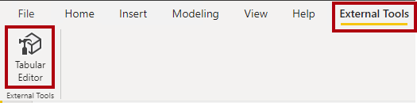](../media/tabular-editor.png#lightbox)

In the **Tabular Editor** window, in the left pane, right-click the **Tables** folder and then select **Create New > Calculation Group**.

> [!div class="mx-imgBorder"]
> [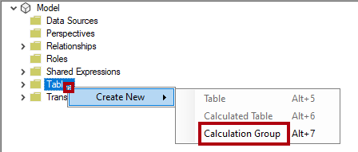](../media/calculation-group.png#lightbox)

In the left pane, replace the default name with **Time Intelligence** and then select **Enter**. Then, expand the **Time Intelligence** table.

The calculation group comprises this single column, while rows of data define the group of calculations. It’s a good practice to rename the column to reflect the subject of the calculations. Select the **Name** column.

> [!div class="mx-imgBorder"]
> [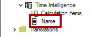](../media/name.png#lightbox)

In the **Properties** pane (located in the lower-right corner), select the **Name** property and then rename it as **Time Calculation**.

> [!div class="mx-imgBorder"]
> [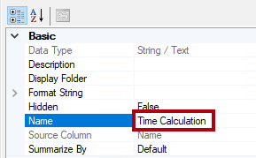](../media/time-calculations.png#lightbox)
 
To create a calculation item, right-click the **Time Intelligence** table and then select **Create New > Calculation Item**.

> [!div class="mx-imgBorder"]
> [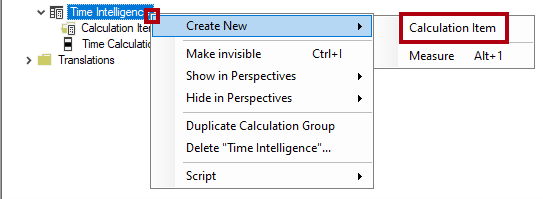](../media/calculation-item.png#lightbox)

In the left pane, replace the default name with **Current** and then select **Enter**.

In the **Expression Editor** pane (located above the **Properties** pane), enter the following formula:

```dax
SELECTEDMEASURE()
```
> [!div class="mx-imgBorder"]
> [](../media/selected-measure.png#lightbox)

The `SELECTEDMEASURE` DAX function returns a reference to the measure that’s currently in context when the calculation item is evaluated. In this model, it could be the **Sales**, **Cost**, or **Profit** measure.

In the **Expression Editor** pane toolbar, select the check mark icon to accept changes.

> [!div class="mx-imgBorder"]
> [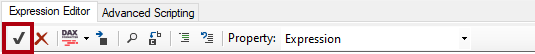](../media/../media/check.png#lightbox)

Create a second calculation item named **PY** by using the following formula:

```dax
CALCULATE(SELECTEDMEASURE(), SAMEPERIODLASTYEAR('Date'[Date]))
```
This formula calculates the value for the selected measure in the prior year.

Create a third calculation item named **YoY** by using the following formula:

```dax
SELECTEDMEASURE()
    - CALCULATE(SELECTEDMEASURE(), 'Time Intelligence'[Time Calculation] = "PY")
```
The year-over-year (YoY) formula calculates the difference of the selected measure of the current year to the prior year.

Create a forth calculation item named **YoY %** by using the following formula:

```dax
DIVIDE(
    CALCULATE(SELECTEDMEASURE(), 'Time Intelligence'[Time Calculation] = "YoY"),
    CALCULATE(SELECTEDMEASURE(), 'Time Intelligence'[Time Calculation] = "PY")
)
```
The year-over-year percentage (YoY %) formula calculates the percentage change of the selected measure over the prior year.

In the **Properties** pane, set the **Format String Expression** property to **"0.00%;-0.00%;0.00%"**.

> [!div class="mx-imgBorder"]
> [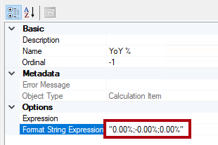](../media/format-string-expression.png#lightbox)

Verify that the **Time Intelligence** calculation group has four calculation items.

> [!div class="mx-imgBorder"]
> [](../media/time-intelligence.png#lightbox)

To save the changes to the Power BI Desktop model, on the **File** menu, select **Save** (or press the **Ctrl+S** keyboard shortcut).

> [!div class="mx-imgBorder"]
> [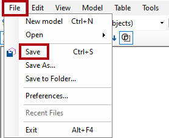](../media/file-save.png#lightbox)

Switch back to Power BI Desktop, where a yellow banner will display across the top of the report designer.

> [!div class="mx-imgBorder"]
> [](../media/banner.png#lightbox)

To the right of the banner, select **Refresh now**.

> [!div class="mx-imgBorder"]
> [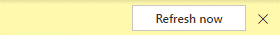](../media/refresh-now.png#lightbox)

Refreshing will apply the changes by creating the calculation group as a model table. Then, it will load the calculation items as rows of data.

In the **Fields** pane, expand the **Time Intelligence** table.

> [!div class="mx-imgBorder"]
> [](../media/time-intelligence-table.png#lightbox)

## Task 4: Update the matrix visual

In the report, select the matrix visual. Then, in the **Visualizations** pane, in the **Values** well, select **X** to remove the **Sales Amount** field.

> [!div class="mx-imgBorder"]
> [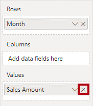](../media/sales-amount.png#lightbox)

From the **Fields** pane, from inside the **Sales** table, drag the Sales field into the **Values** well.

> [!div class="mx-imgBorder"]
> [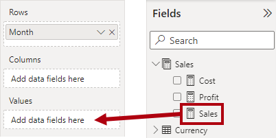](../media/add-field-data-sales.png#lightbox)
 
From the Fields pane, from inside the Time Intelligence table, drag the Time Calculation field into the Columns well.

> [!div class="mx-imgBorder"]
> [](../media/add-field-data-time.png#lightbox)

Verify that the matrix visual shows a grid of time-related **Sales** measure values that are grouped by month.

> [!div class="mx-imgBorder"]
[](../media/sales-measure-values.png#lightbox)

Notice the format of each measure. Ordinarily, Power BI derives the format from the selected measure. However, recall that you set the format string expression for the **YoY %** measure to produce a percentage format.

## Task 5: Create a currency conversion calculation group

Your next task is to create a currency conversion calculation group. This calculation group will provide flexibility to convert the **Sales** table measures to different currencies.

Switch to the **Data** view and then select the **Currency** table. Notice the **FormatString** hidden column that contains format string expressions.

> [!div class="mx-imgBorder"]
> [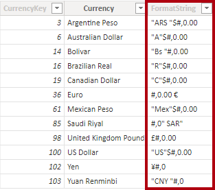](../media/format-string.png#lightbox)

Switch to Tabular Editor and then create a calculation group named **Currency Conversion**.

> [!div class="mx-imgBorder"]
> [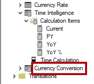](../media/currency-conversion.png#lightbox)

Rename the **Name** column to **Converted Currency**.

> [!div class="mx-imgBorder"]
> [](../media/rename-converted-currency.png#lightbox)

Create a calculation item named **Currency Conversion** by using the following formula:

```dax
IF(
    HASONEVALUE('Currency'[Currency]),
    SUMX(
        VALUES('Date'[Date]),
        CALCULATE(
            DIVIDE(SELECTEDMEASURE(), MAX('Currency Rate'[EndOfDayRate]))
        )
    )
)
```

This formula uses the `HASONEVALUE` DAX function to test whether only one currency is in the filter context. When that factor is true, the `SUMX` DAX function will iterate over all dates in the filter context and divide the selected measure by the end-of-day rate for each date. The function will sum all converted amounts to produce the convert amount for all dates.

Save the changes to the Power BI Desktop model, and then switch to Power BI Desktop and refresh the changes.

Switch to **Report** view and then select the matrix visual.

From the **Fields** pane, from within the **Currency Conversion** table, drag the **Converted Currency** field into the **Filters** pane, into the **Filter** on this visual group.

> [!div class="mx-imgBorder"]
> [](../media/converted-currency.png#lightbox)

In the filter card, check the **Currency Conversion** value.

> [!div class="mx-imgBorder"]
> [](../media/check-conversion.png#lightbox)

In the **Currency** slicer, select a different currency, and then in the matrix visual, notice the updated values. You might notice that something’s wrong. All values have formatted by using the currency symbol (event for currencies that don’t use that symbol), and the **YoY %** values are now incorrect.

> [!div class="mx-imgBorder"]
> [](../media/currency-matrix.png#lightbox)

The formatting issue will be addressed when you learn about dynamic formatting in the next unit. The issue that’s related to the **YoY %** measure will also be addressed in the next unit when you learn about calculation precedence.

Revert the **Currency** slicer to **US Dollar**.

> [!div class="mx-imgBorder"]
> [](../media/currency-dollar.png#lightbox)
