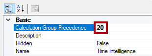
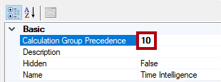
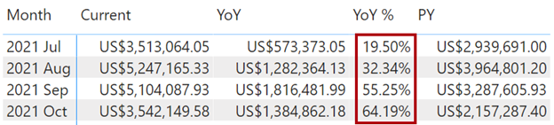

In this unit, you'll learn how to order calculation items, set dynamic formatting, and set calculation precedence. You'll also learn about limitations and restrictions when working with calculation groups.

## Order calculation items

You can set up calculation items to sort in any order that you prefer. By default, calculation items are sorted alphabetically. The reason is because all calculation item **Ordinal** properties default to -1.

When you set the **Ordinal** property to zero or a positive number, Tabular Editor will update all calculation items with a sequential number. You can adjust the numbers to suit. Calculation items with lower numbers will sort before those with higher numbers.

Switch to Tabular Editor, and then set the **Ordinal** property of the **Time Intelligence** calculation items to sort them in the order shown in the following image.

- 0 – Current
- 1 – YoY
- 2 – YoY %
- 3 – PY

> [!div class="mx-imgBorder"]
> [](../media/ordinal-property.png#lightbox)

Save the changes to the Power BI Desktop model, and then switch back to Power BI Desktop and refresh the changes.

Switch to **Report** view and then review the matrix visual. The calculation items across the columns are now sorted in the new order.

## Set dynamic formatting

You can set the calculation item format string to use a DAX expression.

Now, you'll set up the **Currency Conversion** calculation group to format currency values by using the format code that's stored in the **Currency** table.

Switch to Tabular Editor and then select the Currency **Conversion calculation** item. In the **Properties** pane, set the **Format String Expression** property to the following formula:

```dax
SELECTEDVALUE('Currency'[FormatString])
```

This formula will return the format string of the selected currency. This way, formatting is dynamically driven by the data in the **Currency** dimension table.

Save the changes to the Power BI Desktop model, and then switch back to Power BI Desktop and refresh the changes.

Switch to **Report** view and then review the matrix visual. In the **Currency** slicer, select a different currency and then notice the formatted values.

Revert the **Currency** slicer back to **US Dollar**.

## Set calculation precedence

You can set up calculation items so that they evaluate in a specific order. That approach is important when calculation dependencies exist.

Consider that the **Time Intelligence** and **Currency Conversion** calculations groups are applied in the matrix visual, but an issue has occurred with the **YoY %** calculation. Presently, when that calculation happens, the currency conversion will add daily calculation results over the month. To produce the correct result, you'll need to reverse the calculation order.

You can control calculation order by setting the **Calculation Group Precedence** property. A higher number indicates greater precedence, meaning that Power BI will evaluate it before calculation groups with lower precedence.

Switch to Tabular Editor and then select the **Time Intelligence** calculation group.

> [!div class="mx-imgBorder"]
> [](../media/time-intelligence-other-work.png#lightbox)

In the **Properties** pane, set the **Calculation Group Precedence** property to **20**.

> [!div class="mx-imgBorder"]
> [](../media/calculation-group-precedence.png#lightbox)

Set the calculation group precedence for the **Currency Conversion** calculation group to **10**.

> [!div class="mx-imgBorder"]
> [](../media/precedence-currency-conversion.png#lightbox)

Setting these two properties will ensure that the **Time Intelligence** calculations will happen later.

Save the changes to the Power BI Desktop model and then switch to Power BI Desktop.

The **YoY %** values will now display percentages.

> [!div class="mx-imgBorder"]
> [](../media/matrix-display-percentage.png#lightbox)

## Limitations and restrictions

When working with calculation groups, you'll need to keep in mind some limitations and restrictions:

- When you add a calculation group to your model, the `DiscourageImplicitMeasures` model-level property is set to **True** automatically. This property means that you can no longer summarize columns in report visuals. Therefore, you'll need to complete all model summarizations by using explicit measures, which you can define by using DAX.
- You can't define row-level security (RLS) or object-level security (OLS) on calculation groups, directly or indirectly.
- [Detail Rows Expressions](/analysis-services/tutorial-tabular-1400/as-supplemental-lesson-detail-rows?view=power-bi-premium-current&preserve-view=true) aren't supported with calculation groups.
- The smart narrative visual isn't supported with calculation groups.
- When you're creating Power BI reports by using a live connection, dynamic format strings aren't applied to report-level measures.

For more information, see [Calculation groups](/analysis-services/tabular-models/calculation-groups?view=power-bi-premium-current&preserve-view=true).