In this unit, you'll create an airline on-time performance (OTP) report for the Tailspin Toys company. This task will involve transforming and importing text data to create a model, enhancing the model with Data Analysis Expressions (DAX) calculations, and creating a report layout.

A division of Tailspin Toys owns a small airline that's headquartered in SeaTac, Washington. It operates three aircraft that provide daily passenger services between SeaTac (International Air Transport Association, or IATA, airport code **SEA**) and three west coast airports:

- Portland, Oregon (**PDX**)
- San Francisco, California (**SFO**)
- Los Angeles, California (**LAX**)

The on-time performance (OTP) report is a widely accepted measure of punctuality for transport services. In aviation, an airline arrival (or departure) is considered to be on time when it occurs within 15 minutes of the scheduled time.

At Tailspin Toys, the airline strives to achieve a minimum of 80 percent, which means that flights should arrive within at least 15 minutes of the scheduled arrival time at least 80 percent of the time.

The report that you'll create will resemble the following image.

> [!div class="mx-imgBorder"]
> [](../media/report-page-preview.png#lightbox)

## Task 1: Retrieve the data

To retrieve an extract of flight statistics for fiscal year 2022, download the FlightDataFY2022.csv file. Be sure to save it to a location that you'll remember.

If you open the file in a text editor, such as Notepad, the first row will contain column names.

> [!div class="mx-imgBorder"]
> [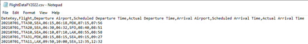](../media/data-extract.png#lightbox)

The column names are:

- **DateKey** - The flight date in ISO 8601 format, expressed as a whole number by using the format YYYYMMDD, where YYYY is the year, MM is the month number, and DD is the day number.
- **Flight** – A unique flight code. Codes are unique for a date.
- **Departure Airport** – The IATA airport code of the departure airport.
- **Scheduled Departure Time** – The scheduled departure time of day in ISO 8601 format, expressed as hh:mm.
- **Actual Departure Time** – The actual departure time of day in ISO 8601 format, expressed as hh:mm.
- **Arrival Airport** – The IATA airport code of the arrival airport.
- **Scheduled Arrival Time** – The scheduled arrival time of day in ISO 8601 format, expressed as hh:mm.
- **Actual Arrival Time** – The actual arrival time of day in ISO 8601 format, expressed as hh:mm.

Each row after the column header row describes a scheduled flight.

If you scroll down within the file, you'll locate rows that have missing arrival and departure times. When these times are missing, it means that the scheduled flight was canceled.

In the following image, notice that flights **TTA20** and **TTA21** on July 3, 2021 have missing arrival and departure times. Both flights were canceled.

> [!div class="mx-imgBorder"]
> [](../media/data-extract-canceled-flights.png#lightbox)

## Task 2: Transform and import the data

You'll start by transforming and importing the data. You'll add three columns that store the flight sector, the number of minutes late, and the flight status (on-time, late, or canceled).

Open Microsoft Power BI Desktop and then select the **Get data** dropdown menu from the CSV file that you retrieved previously.

> [!div class="mx-imgBorder"]
> [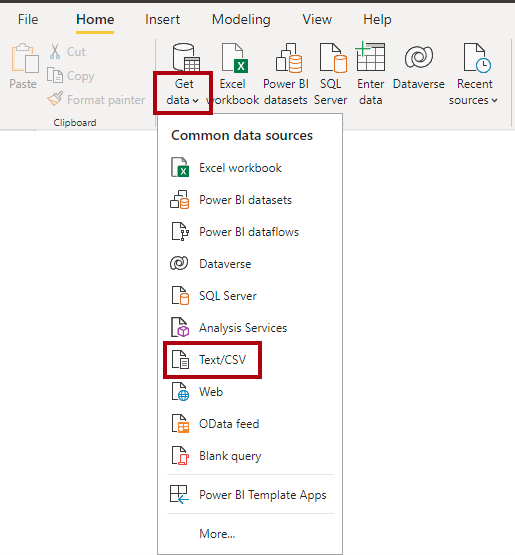](../media/get-data-desktop.png#lightbox)

When you're presented with a preview of the data, select **Transform Data** to open the Power Query Editor window.

> [!div class="mx-imgBorder"]
> [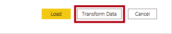](../media/transform-data.png#lightbox)

In the Power Query Editor window, in the **Query Settings** pane (located to the right), in the **Name** box, replace the text with **Flight**.

> [!div class="mx-imgBorder"]
> [](../media/query-setting-name.png#lightbox)

To create a column to analyze flight sectors, which are flight routes that are defined as pairs of airports, select the **Departure Airport** column header. Then, while pressing the **Ctrl** key, select the **Arrival Airport** column header.

> [!div class="mx-imgBorder"]
> [](../media/select-airport-coloumns.png#lightbox)

On the **Add Column** ribbon tab, from inside the **From Text** group, select **Merge Columns**.

> [!div class="mx-imgBorder"]
> [](../media/merge-columns.png#lightbox)

In the **Merge Columns** window, in the **Separator** dropdown list, select **Custom**. Then, in the box beneath the dropdown list, enter a hyphen (-) character. In the **New column name** box, replace the text with **Sector**.

> [!div class="mx-imgBorder"]
> [](../media/merge-columns-setup.png#lightbox)

Notice the addition of the **Sector** column.

> [!div class="mx-imgBorder"]
> [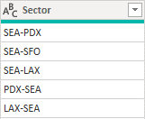](../media/sector-preview.png#lightbox)

Because the OTP calculation is based on the difference of scheduled and actual arrival minutes, you'll now create a column that stores the number of minutes late. To do so, select the **Actual Arrival Time** column header. Then, while pressing the **Ctrl** key, select the **Scheduled Arrival Time** column header.

> [!div class="mx-imgBorder"]
> [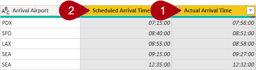](../media/minutes-late-column.png#lightbox)

On the **Add Column** ribbon tab, from inside the **From Date & Time** group, select **Time** and then select **Subtract**.

> [!div class="mx-imgBorder"]
> [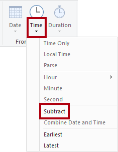](../media/time-subtract.png#lightbox)

Notice the addition of the **Subtraction** column, which stores a value of type duration. A duration type stores a time period. You'll now convert the time period to the number of minutes. To do so, ensure that the **Subtraction** column is selected, and then on the **Transform** ribbon tab (not the **Add Column** ribbon), from inside the **Date & Time Column** group, select Duration and then select **Total Minutes**.

> [!div class="mx-imgBorder"]
> [](../media/column-total-minutes.png#lightbox)

Rename the column as **Minutes Late**. Verify that the first flight (row 1) was 41 minutes late.

> [!div class="mx-imgBorder"]
> [](../media/review-minutes-late.png#lightbox)

To assign a status to each flight, you'll now add a conditional column. On the **Add Column** ribbon tab, from inside the **General** group, select **Conditional Column**.

> [!div class="mx-imgBorder"]
> [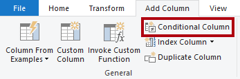](../media/conditional-column.png#lightbox)

In the **Add Conditional Column** window, in the **New column name** box, replace the text with **Status**.

> [!div class="mx-imgBorder"]
> [](../media/additional-column-setup.png#lightbox)

To define the first condition, in the **Column Name** dropdown list, select the **Minutes** Late column. In the **Value** box, enter **null**, and then in the **Output** box, enter **Canceled**.

> [!div class="mx-imgBorder"]
> [](../media/conditional-column.png#lightbox)

To add another condition, select **Add Clause**.

> [!div class="mx-imgBorder"]
> [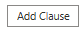](../media/add-clause.png#lightbox)

Define the new condition to show (output) as **Late** when the **Minutes Late** column is greater than **15**.

> [!div class="mx-imgBorder"]
> [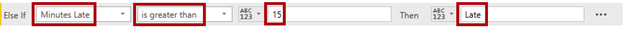](../media/minutes-late-conditional-column.png#lightbox)

In the **Else** box (located in the lower part of the screen), enter **On-time**.

> [!div class="mx-imgBorder"]
> [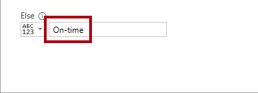](../media/additional-column-else.png#lightbox)

The **Status** column will classify each flight as on-time, late, or canceled.

> [!div class="mx-imgBorder"]
> [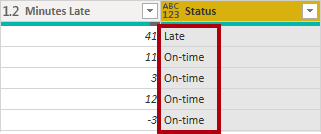](../media/desktop-review-status.png#lightbox)

Now, you've applied all required transformations. To import the data into the data model, on the **Home** ribbon tab, from inside the **Close** group, select the **Close & Apply** icon.

> [!div class="mx-imgBorder"]
> [](../media/close-apply.png#lightbox)

## Task 3: Add a date table

Tailspin Toys analyzes flight performance metrics over time, so you'll now add a date table to the data model. To do so, you'll create a DAX calculated table.

To create a calculated table, on the **Modeling** ribbon tab, from inside the **Calculations** group, select **New table**.

> [!div class="mx-imgBorder"]
> [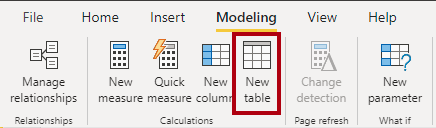](../media/desktop-new-model.png#lightbox)

In the formula bar, remove the existing text, and then paste in the following calculated table definition.

> [!TIP]
> You can copy the DAX code by selecting **Copy**.

> [!div class="mx-imgBorder"]
> [](../media/code-copy.png#lightbox)

```dax
Date = ADDCOLUMNS(
    CALENDAR(DATE(2021, 7, 1), DATE(2022, 6, 30)),
    "DateKey", ((YEAR([Date]) * 10000) + (MONTH([Date]) * 100) + DAY([Date])),
    "Year", "FY" & (YEAR([Date]) + IF(MONTH([Date]) > 6, 1)),
    "Month", FORMAT([Date], "YYYY-MM")
)
```

The formula uses the `CALENDAR` DAX function to return a table of dates between July 1, 2021 and June 30, 2022. The `ADDCOLUMNS` DAX function adds three columns to that table.

To ensure that the DAX time intelligence functions will work correctly, make sure that you mark date tables explicitly as date tables.

In the **Fields** pane, right-click the **Date** table and then select **Mark as date table** > **Mark as date table**.

> [!div class="mx-imgBorder"]
> [](../media/mark-date-table.png#lightbox)

In the **Mark as date table** window, in the **Date column** dropdown list, select **Date**.

> [!div class="mx-imgBorder"]
> [](../media/date-table-setup.png#lightbox)

Next, you'll relate the model tables, so switch to **Model** view.

To relate the tables, from the **Date** table, drag the **DateKey** column to the DateKey column of the **Flight** table.

> [!div class="mx-imgBorder"]
> [](../media/desktop-create-relationship.png#lightbox)

## Task 4: Create the report layout

Switch to **Report** view so that you can create the report layout.

Add a slicer in the upper left of the page.

> [!div class="mx-imgBorder"]
> [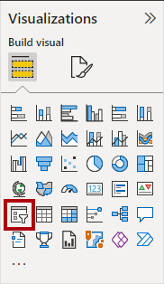](../media/visualization-pane-slicer.png#lightbox)

Add the **Sector** column (from the **Flight** table) to the slicer. (While developing the report, you don't need to slice by any particular sector.)

> [!div class="mx-imgBorder"]
> [](../media/report-page.png#lightbox)

Add a table visual that fills the remainder of the page. Add the **Month** field (from the **Date** table) to the table visual.

> [!div class="mx-imgBorder"]
> [](../media/report-page-filled.png#lightbox)

Whenever you create a measure, you'll add it to the table visual.

## Task 5: Create measures

Now, you'll create a series of DAX measures to support flight performance analysis.

In the **Fields** pane, right-click the **Flight** table and then select **New measure**.

> [!div class="mx-imgBorder"]
> [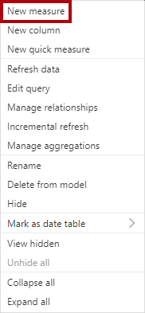](../media/new-measure.png#lightbox)

In the formula bar, paste in the **Scheduled Flights** measure definition.

```dax
Scheduled Flights = COUNTROWS('Flight')
```

On the **Measure Tools** contextual ribbon tab (available when a measure is in focus), format the measure to use the thousands separator.

> [!div class="mx-imgBorder"]
> [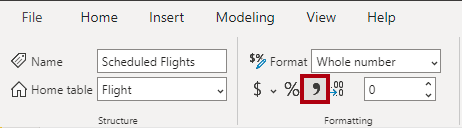](../media/format-measure.png#lightbox)

Because each row in the **Flight** table represents a scheduled flight, the formula uses the `COUNTROWS` DAX function to count the scheduled flights.

Add the **Scheduled Flights** measure to the table visual.

> [!div class="mx-imgBorder"]
> [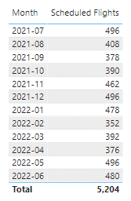](../media/table-visual-preview.png#lightbox)

Add the **Operational Flights** measure to the **Flight** table and then format it to use the thousands separator. Add the new measure to the table visual.

```dax
Operational Flights = CALCULATE(COUNTROWS('Flight'), Flight[Status] <> "Canceled")
```

Notice that the measure uses the `CALCULATE` DAX function to filter the count of table rows to those that don't have a canceled status.

Add the **Canceled Flights** measure to the **Flight** table and then format it to use the thousands separator. Add the new measure to the table visual.

```dax
Canceled Flights = [Scheduled Flights] - [Operational Flights]
```

This measure computes the difference of two other measures.

Add the **Canceled %** measure to the **Flight** table and then format it as a percentage with two decimal places. Add the new measure to the table visual.

```dax
Canceled % = DIVIDE([Canceled Flights], [Scheduled Flights])
```

Notice that the measure uses the `DIVIDE` DAX function to divide two measures safely and efficiently.

Add the **Late Flights** measure to the **Flight** table and then format it to use the thousands separator. Add the new measure to the table visual.

```dax
Late Flights = CALCULATE(COUNTROWS('Flight'), Flight[Status] = "Late")
```

Add the **On-time Flights** measure to the **Flight** table and then format it to use the thousands separator. Add the new measure to the table visual.

```dax
On-time Flights = [Operational Flights] - [Late Flights]
```

Add the **OTP** measure to the **Flight** table and then format it as a percentage with two decimal places. Add the new measure to the table visual.

```dax
OTP = DIVIDE([On-time Flights], [Operational Flights])
```

Add the **OTP PM Growth** measure to the **Flight** table and then format it as a percentage with two decimal places. This measure returns the percentage growth of the OTP measure since the prior month. When it returns a positive number, it means that OTP has improved since the previous month; when it returns a negative number, it means that OTP has deteriorated since the previous month. Add the new measure to the table visual.

```dax
OTP PM Growth = 
VAR CurrentMonth = [OTP]
VAR PriorMonth = CALCULATE([OTP], PARALLELPERIOD('Date'[Date], -1, MONTH))
RETURN
    IF(
        ISINSCOPE('Date'[Month]),
        DIVIDE(CurrentMonth - PriorMonth, PriorMonth)
    )
```

Notice that the measure uses the `PARALLEL` DAX function, which is a time intelligence function. This function modifies the filter context to the dates that belong to the previous month. The value for July 2021 is BLANK because no previous month exists. The measure uses the `IF` and `INSCOPE` DAX functions to return a value only when month is included in the filter context and it's a grouping column. That way, the total value, representing all months, is BLANK.

Verify that the table visual includes the seven new measures.

> [!div class="mx-imgBorder"]
> [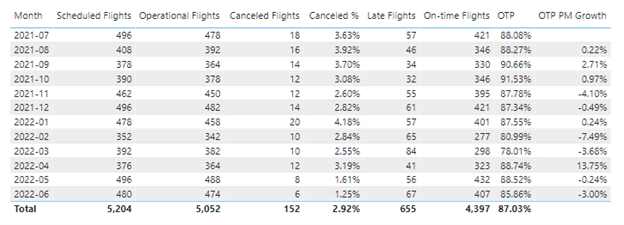](../media/table-visual-columns.png#lightbox)

## Task 6: Enhance the report layout

To enhance the report layout, you'll use conditional formatting. Conditional formatting can highlight OTP values that fall below the 80 percent acceptable threshold.

Select the table visual, and then in the **Visualizations** pane, add background color conditional formatting to the **OTP** field.

> [!div class="mx-imgBorder"]
> [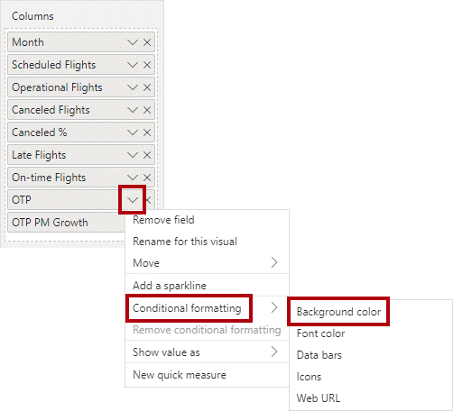](../media/conditional-formatting.png#lightbox)

In the **Background color** window, set the **Format style** dropdown list to **Rules**.

> [!div class="mx-imgBorder"]
> [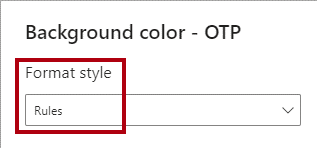](../media/background-color-rule.png#lightbox)

Set up the rule so that the upper range value is **0.8** and the color is a shade of red. That way, OTP values that are less than 80 percent will have a red background.

> [!div class="mx-imgBorder"]
> [](../media/formatting-color-rule.png#lightbox)

In the table visual, verify that March 2022 is the only month with an OTP value that's less than 80 percent.

> [!div class="mx-imgBorder"]
> [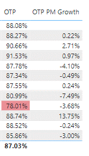](../media/growth-columns.png#lightbox)

You can also enhance the **OTP PM Growth** values by adding icons to indicate trend. Add icon conditional formatting to the **OTP PM Growth** field.

> [!div class="mx-imgBorder"]
> [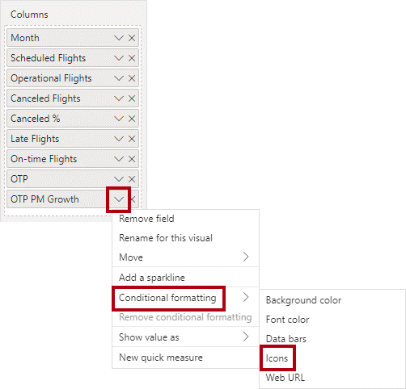](../media/growth-formatting.png#lightbox)

In the **Icons** window, in the **Style** dropdown list, select the icon set that's second from the bottom. It comprises three icons: a downward pointing red triangle, a yellow bar, and an upward pointing green triangle.

> [!div class="mx-imgBorder"]
> [](../media/icon-style.png#lightbox)

Modify the three rules:

- **Rule 1** –  Set the upper bounds of the first rule to less than zero (number).
- **Rule 2** –  Set the lower bounds to equals zero (number). (The upper bounds value is removed.)
- **Rule 3** –  Set the lower bounds to greater than zero (number).

> [!div class="mx-imgBorder"]
> [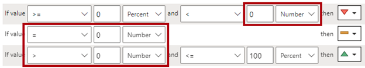](../media/formatting-rules.png#lightbox)

Verify that each **OTP PM Growth** value includes an icon.

> [!div class="mx-imgBorder"]
> [](../media/growth-completed.png#lightbox)

You can now select different **Sector** slicer items to analyze the different flight routes.

## Review the Unit 1 solution

The solution involved transforming and importing data from a CSV file. Part of the design involved creating columns, such as **Minutes Late** and **Status**, that simplify the DAX measures that you needed to create.

While you can create the **OTP** measure without these columns, the result is more complex and less elegant. (You don't need to add this measure to the data model.)

```dax
OTP = 
VAR OperationalFlights = CALCULATE(COUNTROWS(Flight), NOT ISBLANK(Flight[DepartureTime]))
VAR LateFlights = COUNTROWS(FILTER(Flight, DATEDIFF([ScheduledArrivalTime], [ArrivalTime], MINUTE) > 15))
RETURN
    DIVIDE(OperationalFlights - LateFlights, OperationalFlights)
```

The measure formula is also less efficient, and it could degrade query performance when the **Flight** table contains millions of rows. The reason is because the `FILTER` DAX function, which is an iterator function, must operate over each table row that's in the filter context.