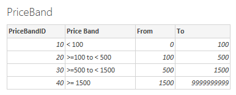
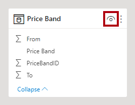
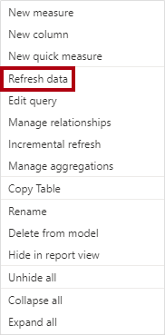

In this unit, you’ll create calculated columns that dynamically classify products into price bands. The price bands and their range of values are defined in a Microsoft Excel workbook, and they will be loaded into the data model as a disconnected table.

## Task 1: Import price band data
Download the PriceBand.xlsx file. Be sure to save it to a location that you’ll remember.

> [!NOTE]
> If you don’t have Excel installed, you can download the PriceBand.csv file instead. You’ll need to adapt the instructions to use this file.

In the **Adventure Works DW 2020 M09.pbix file**, select the **Get data** option from the Excel workbook file that you retrieved.

> [!div class="mx-imgBorder"]
> [](../media/data-excel.png#lightbox)

Check the **PriceBand** table.

> [!div class="mx-imgBorder"]
> [](../media/price-band.png#lightbox)

Review the preview data in the right pane.

> [!div class="mx-imgBorder"]
> [](../media/priceband-data.png#lightbox)

Notice that four price bands are shown, with the following columns:
- **PriceBandID** – A unique identifier that also defines the sort order of the price bands.
- **Price Band** – A descriptive label for the price band.
- **From** – The lower boundary value.
- **To** – The upper boundary value.

To import the data to the data model, select **Load**.

> [!div class="mx-imgBorder"]
> [](../media/load-transform-data.png#lightbox)

Switch to the model diagram, and then hide the **PriceBand** table.

> [!div class="mx-imgBorder"]
> [](../media/price-band-table.png#lightbox)

## Task 2: Create calculated columns

Switch to **Data** view so that you can create calculated columns and review them.

To create a calculated column, in the **Fields** pane, right-click the **Product** table and then select **New column**.

> [!div class="mx-imgBorder"]
> [](../media/new-column.png#lightbox)

In the formula bar, paste in the following calculated column definition:

```dax
Price Band = 
CALCULATE(
    VALUES(PriceBand[Price Band]),
    FILTER(
        PriceBand,
        'Product'[List Price] >= PriceBand[From]
            && 'Product'[List Price] < PriceBand[To]
    )
)
```

The formula uses the `FILTER` DAX function to return a filtered **PriceBand** table. That table contains a single row for the price band where the current **Product** table row’s list price is between its boundaries. The `CALCULATE` DAX function uses that table as a filter, and the `VALUES` DAX function retrieves the price band name.

To sort the price bands in a logical order, add a second calculated column to the **Product** table.

```dax
PriceBandSort = 
CALCULATE(
    VALUES(PriceBand[PriceBandID]),
    FILTER(
        PriceBand,
        'Product'[List Price] >= PriceBand[From]
            && 'Product'[List Price] < PriceBand[To]
    )
)
```

To finalize the design of the **Product** table, complete the following steps:

1. Sort the **Price Band** column by the **PriceBandSort** column.
2. Hide the **PriceBandSort** column.

## Task 3: Test the calculated column

Switch to **Report** view and then select **Page 2**.

Notice that the page contains a **100% Stacked Column** chart visual, showing product categories and their sales amounts.

Add the **Price Band** column (from the **Product** table) to the **Legend** well of the visual.

> [!div class="mx-imgBorder"]
> [](../media/legend-price-band.png#lightbox)

Review the **100% Stacked Column** chart visual, and notice that the **Bikes** category has sold in excess of 72 percent of high-priced products (> 1500 dollars).
<IMAGE: DAX-09-stacked-column-visual-final.png | Alt text: Image shows the stacked column chart visual with four product categories and four price bands in the legend.>

> [!div class="mx-imgBorder"]
> [](../media/visual-final.png#lightbox)

Now, you’ll modify the price band data to include a new band for products that are priced between 500 and 1,000 dollars. Open the **PriceBand.xlsx** workbook (or **PriceBand.csv** file), and then complete the following steps:

1. In cell **B4**, rename the price band to >=**500** to > **1000**.
2. In cell **D4**, modify the value from **1500** to **1000**.
3. Insert a new row beneath row **4**.
4. Enter a new price band with an ID of **35**, name of >= **1000** to < **1500**, from range of **1000**, and to range as **1500**.

    > [!div class="mx-imgBorder"]
    > [](../media/add-price-band.png#lightbox)

Save the Excel workbook and then close the file.
In Power BI Desktop, switch to **Data** view. Then, in the **Fields** pane, right-click the **PriceBand** table and then select **Refresh data**.

> [!div class="mx-imgBorder"]
> [](../media/refresh-data.png#lightbox)
 
In the **Product** table, notice that the calculated column assigned some products to the new price band.

Switch to **Report** view. The **100% Stacked Column** chart visual now shows five different price band groups.
 
> [!div class="mx-imgBorder"]
> [](../media/column-visual-final.png#lightbox)

## Review the Unit 3 solution

The solution involved creating a disconnected table that contains rows of price bands. The purpose of this table is to allow lookups to assign products to price bands.

A calculated column achieves the lookup by using the `CALCULATE`, `FILTER`, and `VALUES` DAX functions.
