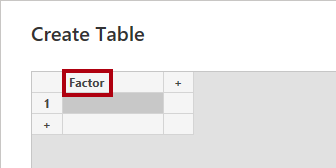
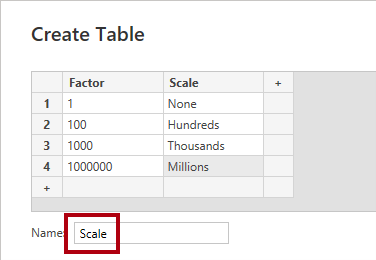
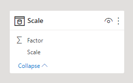
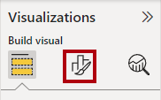
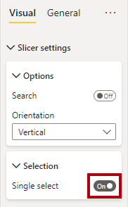
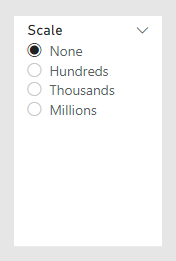

In this unit, you'll create a disconnected table (a table that isn't related to other tables) that stores scaling options. Options will allow report consumers to scale measures to the hundreds, thousands, or millions.

## Task 1: Create a disconnected table

Download and open the **[Adventure Works DW 2020 M09.pbix](https://TODO)** file.

To create the disconnected table, on the **Home** ribbon tab, from inside the **Data** group, select **Enter data**.

> [!div class="mx-imgBorder"]
> [](../media/desktop-enter-data.png#lightbox)

In the **Create Table** window, double-click the **Column1** column header, replace the text with **Factor**, and then press **Enter**.

> [!div class="mx-imgBorder"]
> [](../media/data-create-table.png#lightbox)

To add a new column, select the plus (+) symbol.

> [!div class="mx-imgBorder"]
> [](../media/add-column.png#lightbox)

Rename the new column as **Scale**.

Enter the following rows of data in the table.

|     Row    |     Factor column value    |     Scale column value    |
|---|---|---|
|     1    |     1    |     None    |
|     2    |     100    |     Hundreds    |
|     3    |     1000    |     Thousands    |
|     4    |     1000000    |     Millions    |

In the **Name** box (located in the lower-left corner), replace the text with **Scale**.

> [!div class="mx-imgBorder"]
> [](../media/create-table-name.png#lightbox)

Select **Load**.

> [!div class="mx-imgBorder"]
> [](../media/desktop-load.png#lightbox)

Switch to **Model** view, and notice that the table isn't related to any other model table. (If the table isn't visible, you might need to change the zoom level or scroll horizontally.)

> [!div class="mx-imgBorder"]
> [](../media/scale-table.png#lightbox)

You'll use this table to scale measure values, so you won't need to propagate filters to other tables.

To ensure that the scale options sort in a logical order, in the diagram, select the **Scale** column. In the **Properties** pane, expand the **Advanced** section and then set the **Sort by column** dropdown list to **Factor**.

> [!div class="mx-imgBorder"]
> [](../media/sort-column.png#lightbox)

In the diagram, select the **Factor** column. In the **Properties** pane, set the **Is hidden** property to **Yes**.

> [!div class="mx-imgBorder"]
> [](../media/desktop-hidden.png#lightbox)

## Task 2: Add a slicer

Switch to **Report** view. Add a slicer in the upper-left corner of **Page 1**. Add the **Scale** column (from the **Scale** table) to the slicer.

> [!div class="mx-imgBorder"]
> [](../media/report-page-upper-left.png#lightbox)

Ensure that the slicer is selected, and then in the **Visualizations** pane, select the **Format Your Visual** icon.

> [!div class="mx-imgBorder"]
> [](../media/visualization-format.png#lightbox)

Expand the **Slicer settings** section, and then expand the **Selection** section. To ensure that report consumers can select only one item, set the **Single select** option to **On**.

> [!div class="mx-imgBorder"]
> [](../media/single-select.png#lightbox)

In the slicer, select the **None** option.

> [!div class="mx-imgBorder"]
> [](../media/report-page-slicer.png#lightbox)

## Task 3: Create a measure

Your next task is to add the **Sales (Scaled)** measure to the **Sales** table and then format it as currency with two decimal places.

```dax
Sales (Scaled) = 
DIVIDE(
    SUM(Sales[Sales Amount]),
    SELECTEDVALUE(Scale[Factor], 1)
)
```

The formula uses the `SELECTEDVALUE` DAX function to determine the filtered value of the **Factor** column. If more than one factor is in the filter context, the function will return the alternate value, which in this case is **1**. When the function returns the alternate value, it will effectively divide the sum of sales amount values by 1, meaning no scaling applies.

Next, you'll add the new measure to the table visual.

> [!div class="mx-imgBorder"]
> [](../media/tables-sales-scaled.png#lightbox)

In the slicer, test the measure by selecting different scale options.

## Review the Unit 2 solution

The solution involved creating a table that contains rows of scale options. The table isn't related to other model tables, so it's called a disconnected table. The purpose of this table is to obtain input so that it can be used by calculations.

In this solution, filtering the **Scale** table to a single row will allow you to divide sales values by that factor of that row.