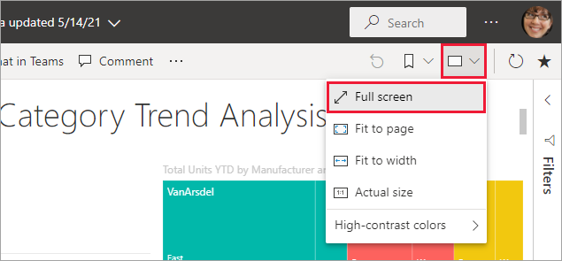

While Power BI has countless features and gives developers a multitude of ways to interact with their data, Power BI empowers you to quickly create stunning reports with a friendly user interface while incorporating a variety of features to make data easy and beautifully accessible. In this unit, you will learn how Power BI makes creating beautiful data presentations easy.

  

## Power BI -- alignment and grouping

  

Power BI includes formatting and canvas layout features to make building well formatted reports straightforward such as the following:

  

- Align visual borders within the canvas.

  

- Visuals will "snap" into place when they align.

  

- Visuals can also be distributed horizontally and vertically.

  

> [!div class="mx-imgBorder"]

> 

  

- Group visuals together.

  

- Ctrl + click (or click + lasso) to select multiple items. Then right click and select **Group.**

  

- Lasso and group visuals to align and resize.

  

## Power BI -- Themes

  

You can change the entire theme right from the ribbon. You can use pre-defined themes or import your own custom theme to quickly change the design of the report.

  

> [!div class="mx-imgBorder"]

> 

  

## Power BI -- Accessibility

  

Power BI is designed to meet three of the strictest accessibility standards and guidelines to enable more people access to data.

  

- Web Content Accessibility Guidelines (WCAG 2.1)
- US Section 508 for Governments and Federal Agencies
- EN 301 549 the Harmonized European Standards for Accessibility requirements

### Accessibility Features
1.	Full Screen
	-	Reports can be set to fit to the screen, to the page, or to screen width for improved viewing and readability.
	-	Full screen mode hides extraneous menus to focus on the report itself.
	>	[!div class="mx-imgBorder"] 
1.	Focus Mode
	-	Individual visuals can be expanded to a full screen view using "Focus Mode".
	-	Inspect any single dashboard tile or visual for a closer look.
	>	[!div class="mx-imgBorder"] 
1.	Alt Text Property
	-	Use the Alt Text property of visuals to provide a description of the visual content.
1.	Tab Order and Keyboard Navigation
	-	Manage keyboard accessibility and user workflow.
1.	Screen-Reader Compatibility
1.	High Contract Color View

> [How to apply Power BI's Accessibility features while creating reports.](https://docs.microsoft.com/power-bi/create-reports/desktop-accessibility-creating-reports)
