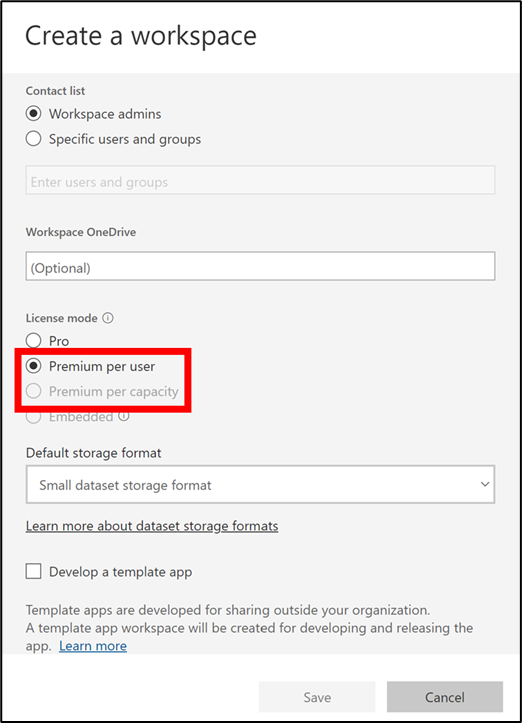
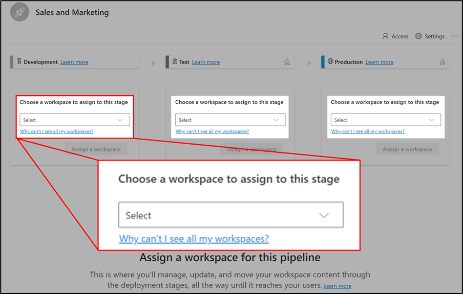
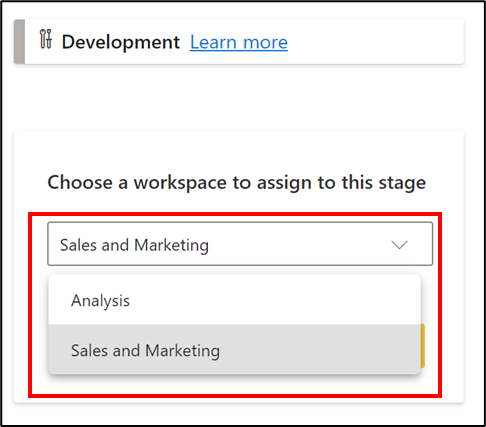

After creating a pipeline, you need to add the content you want to manage to the pipeline. Adding content to the pipeline is done by assigning a workspace with the content (reports, paginated reports, dashboards, datasets, and dataflows) to the pipeline stage. You can assign a workspace to any stage, but it is most common to assign the workspace first to the Development stage, and from there deploy some or all of the workspace items to Test and Production. 
## Create a Premium workspace

Ensure you have a Premium workspace created already to ensure this workspace can be used to create a pipeline. Choosing one of the premium license modes will enable this.
 
> [!div class="mx-imgBorder"]
> 

Once created, these workspaces are denoted by the diamond icon appearing on them.

> [!div class="mx-imgBorder"]
> 

## Assign a workspace to a stage

To assign a workspace to a pipeline stage, follow these steps:
1. Open the pipeline.  

    > [!div class="mx-imgBorder"]
    > 

2. In the stage to which you want to assign a workspace, expand the dropdown titled **Choose a workspace to assign to this stage**. Again, it is most common to start with the Development stage.  

    > [!div class="mx-imgBorder"]
    > 

> [!NOTE]
> To assign a workspace to a pipeline, the pipeline stage you want to assign the workspace to has to be empty. 

3.	From the dropdown menu, select the workspace you want to assign to this stage.

    > [!div class="mx-imgBorder"]
    > 

4. Select **Assign a workspace**.
  
    > [!div class="mx-imgBorder"]
    > 

