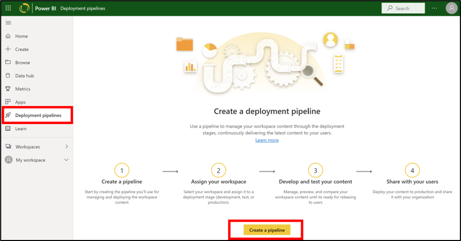
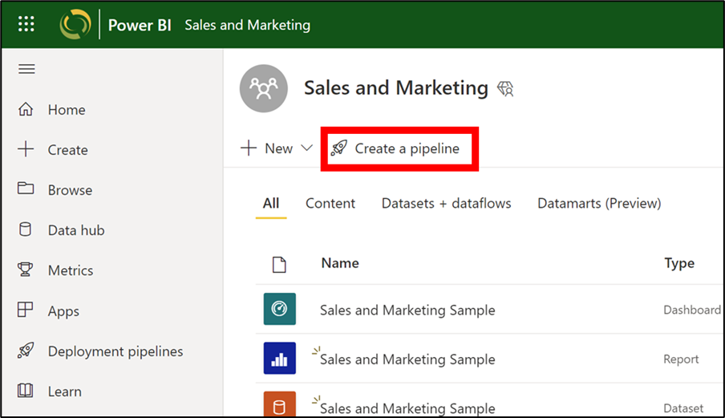

A deployment pipeline can be created using two different methods: 
- From the **Deployment pipelines** tab (on the left navigation panel)
- From a workspace
After the pipeline is created, you can share it with other users or delete it. When you share a pipeline with others, the users you share the pipeline with will be given access to the pipeline. Pipeline access enables users to view, share, edit, and delete the pipeline.

## Create a pipeline from the Deployment pipelines tab

Follow these steps to create your first pipeline from the **Deployment pipelines** tab:
1. Go to the navigation panel on the left side, select **Deployment pipelines** and then select **Create pipeline**.
  
    > [!div class="mx-imgBorder"]
    > 

2. A dialog box will appear. Enter the pipeline name. The description section is optional, but may be helpful, log purpose and other notes.
  
    > [!div class="mx-imgBorder"]
    > 

Once you have selected **Create**, a new dialog box will appear asking you to assign a workspace to a pipeline stage. We’ll cover that in our next unit.

## Create a pipeline from a workspace
You can create a pipeline from an existing workspace.
1. From the workspace, select **Create a pipeline**.
  
    > [!div class="mx-imgBorder"]
    > 

2. In the **Create a deployment pipeline** dialog box (See step #2 in the section **Create a pipeline from the Deployment pipelines tab** above), enter a name and description for the pipeline, and select **Create**. 

In both cases, once a pipeline is created, it will navigate to a page where you can assign a workspace. We’ll look at that in more detail in the next unit.
