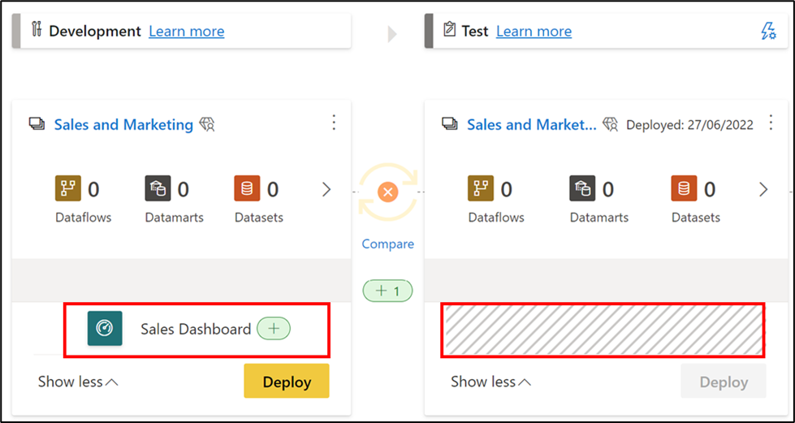

The deployment process lets you clone content from one stage in the pipeline to another, typically from development to test, and from test to production.

During deployment, Power BI copies the content from the current stage, into the target one. The connections between the copied items are kept during the copy process. When deploying content to an empty stage, the relationships between the items are kept. For example, a report that is bound to a dataset in the source stage, will be cloned alongside its dataset, and the clones will be similarly bound in the target workspace.

Power BI also applies the configured deployment rules to the updated content in the target stage – we’ll learn more about deployment rules in the next unit. Deploying content may take a while, depending on the number of items being deployed. 

## Deploy all content to a stage

Select the stage to deploy from and then select the deployment button. The deployment process creates a duplicate workspace in the target stage. This workspace includes all the content existing in the current stage.

> [!div class="mx-imgBorder"]
> 

  
## Selective deployment

To deploy only specific items, select the **Show more** link, and then select the items you wish to deploy. When clicking the deploy button, only the selected items are deployed to the next stage.

Since dashboards, reports, datasets, and dataflows are related and have dependencies, you can use the select related button to check all items that those items are dependent on. For example, if you want to deploy a report to the next stage, clicking the select related button will mark the dataset that the report is connected to, so that both will be deployed at once and the report will not break.

> [!div class="mx-imgBorder"]
> 

> [!NOTE]
> - You can't deploy a Power BI item to the next stage if the items it's dependent on don't exist in the stage you are deploying to. For example, deploying a report without a dataset will fail, unless the dataset already exists in the target stage.
> - You might get unexpected results if you choose to deploy a Power BI item without the item it's dependent on. This can happen when a dataset or a dataflow in the target stage has changed and is no longer identical to the one in the stage you're deploying from.
