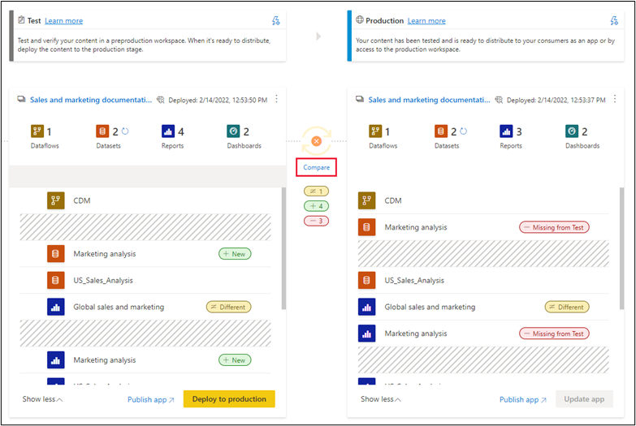

Once you have content in a pipeline stage, you can deploy it to the next stage. Deploying content to another stage is usually done after you've performed some actions in the pipeline. For example, you made development changes to your content in the development stage or tested your content in the test stage. A typical workflow for moving content from stage to stage, is development to test, and then test to production.

To deploy content to the next stage in the deployment pipeline, select the deploy button at the bottom of the stage.

When reviewing the test and production stage cards, you can see the last deployment time. This indicates the last time content was deployed to the stage.

Deployment time is useful for establishing when a stage was last updated. It can also be helpful if you want to track time between test and production deployments.

## Compare stages

When two sequential stages have content, the content is compared based on the content item’s metadata. This comparison doesn't include comparing data or refresh time between stages.  

> [!div class="mx-imgBorder"]
> 

To allow a quick visual insight into the differences between two sequential stages, a comparison icon indicator appears between them. The comparison indicator has two states:

> 

> 

When two sequential stages aren't the same, a link appears underneath the orange comparison icon. Clicking the link opens the content item list in both stages in Compare view. Compare view helps you track changes or differences between items, in each pipeline stage. Changed items get one of the following labels:

|     NEW    |     DIFFERENT    |     MISSING    |
|---|---|---|
|     A new item in the source stage.   This item doesn't exist in the target stage. After deployment,   this item will be cloned to the target stage.    |     An item that exists both in the source   and the target stage, where one of the versions was changed after the last   deployment. After deployment, the item in the source stage will overwrite the   item in the target stage, regardless of where the change was made.    |     This label indicates that an item   appears in the target stage, but not in the source stage.    |

 
> [!div class="mx-imgBorder"]
> 

## Deployment rules enable customization of stages

While working in a deployment pipeline, different stages may have different configurations. For example, each stage can have different databases or different query parameters. For example, the development stage might query sample data from the database, while the test and production stages query the entire database.

Configuring deployment rules enables you to allow changes to content when you deploy content between pipeline stages. For example, if you want a dataset in a production stage to point to a production database, you can define a rule for dataset. The rule is defined in the production stage, under the appropriate dataset. Once the rule is defined, content deployed from test to production will inherit the value as defined in the deployment rule, and will always apply it as long as the rule is unchanged and valid.

See [Create deployment rules](/power-bi/create-reports/deployment-pipelines-get-started#step-4---create-deployment-rules/?azure-portal=true) for detailed information on how to configure deployment rules.

## Collaborate with others – permissions

Pipeline permissions and workspace permissions are granted and managed separately. By configuring permissions, pipeline creators:
- Workspace permissions: Can control who can make changes in any stage in a pipeline.
- Pipeline permissions: Can set who can view and/or deploy from one stage to another.

For example, a user with pipeline access that doesn't have workspace permissions, will be able to view the pipeline and share it with others. However, this user won't be able to view the content of the workspace in the pipeline, or in the workspace page, and won't be able to perform deployments.

Managing permissions at both the pipeline and workspaces level (different stages) allows different people to work on them with different permissions. 

Managing the deployment processes, especially for larger applications with multiple contributors, can be error prone if everyone has the same permissions – managing these permissions provides a streamline and tight method of control on who can do what. 

Review more details at [Deployment pipeline and workspaces permissions](/power-bi/create-reports/deployment-pipelines-process#permissions/?azure-portal=true).
