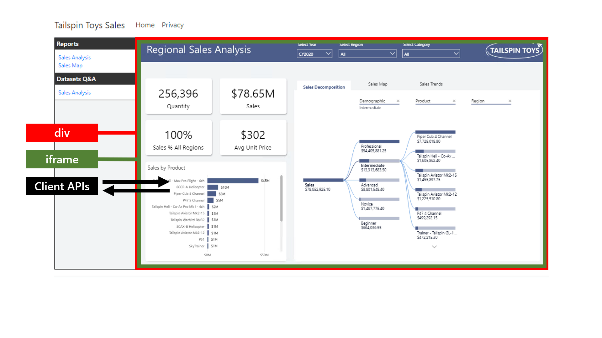

To embed Power BI content in your app, you need to complete the following development tasks.

1.  Add the client library to programmatically control embedding.

1.  Include the client library.

1.  Add an embedding container.

1.  Output server-side generated facts.

1.  Set up a configuration object.

1.  Embed the Power BI content.

## Add the client library

Use the Power BI client API to embed Power BI content by using JavaScript or TypeScript. It's a client library that provides programmatic control of the entire embedding experience.

The APIs comprises three packages:

-   **powerbi-client** - Includes all APIs that embed content, except for those found in the **powerbi-report-authoring** library (described below).

-   **powerbi-models** - Contains object models. Each model has a TypeScript interface, a JSON schema definition, and a validation function to ensure a given object is a valid model.

-   **powerbi-report-authoring** - An extension for creating and personalizing visuals, and authoring a Power BI report after it's loaded. It also allows your app to programmatically edit embedded Power BI reports.

You can install the Power BI client API library using NuGet or npm.

For more information, see [What is the Power BI embedded analytics Client API?](/javascript/api/overview/powerbi/embedded-analytics-client-api/?azure-portal=true).

## Include the client library

Your app must include a `script` element to source the client library.

```cshtml
<script src="/powerbi-client/dist/powerbi.js"></script>
```

It's also possible to source the client library from a content delivery network (CDN). For an example, see [JSDelivr powerbi-client](https://www.jsdelivr.com/package/npm/powerbi-client/?azure-portal=true).

```cshtml
<script src="https://cdn.jsdelivr.net/npm/powerbi-client@2.19.1/dist/powerbi.min.js"></script>
```

When included directly, the client library is exposed as a global named **powerbi-client**. There's also another global named **powerbi**, which is an instance of the Power BI service.

## Add an embedding container

The app must include a `div` element that acts as the embedding container.

```cshtml
<div id="embedContainer"></div>
```

The app embeds Power BI content in the `div` element, hosting the content within an `iframe` element. The `iframe` element creates a separation between the app and the embedded content, making sure the data is secure. The client APIs always communicate securely between the app and the embedded content.

Watch the following video that demonstrates how the client library works.

<!-- > [!VIDEO https://www.microsoft.com/videoplayer/embed/] -->

> [!div class="mx-imgBorder"]
> [](../media/power-bi-client-library.png#lightbox)

## Output server-side generated facts

Your app must acquire an access token that is output client-side. In addition, your app must output certain Power BI artifact properties client-side.

> [!TIP]
> To learn how to acquire access tokens and retrieve Power BI artifact properties, work through the Set up permissions to embed Power BI content module.

The following `script` element contains three variables. The `accessToken` variable stores the server-side generated access token. The `reports` and `datatsets` variables store JSON representations of embeddable artifacts. In this example, the artifact types are reports and datasets. Specifically, the variables store artifact ID and embed URL properties that must be available client-side to support embedding. It also includes the **name** property so the app can present artifact names to the user in a friendly way, like in a menu.

```cshtml
<script>
    var accessToken = "@Model.AccessToken";
    var reports = @Html.Raw(Model.ReportsJson)
    var datasets = @Html.Raw(Model.DatasetsJson)
</script>
```

## Set up a configuration object

Your app must create a configuration object to provide all the information required to embed Power BI content. You must set the following five properties of the configuration object:

-   `tokenType` - It's either `models.TokenType.Aad` when using the *For your organization* scenario (the access token is an Azure AD token), or `models.TokenType.Embed` when using the *For your customers* scenario (the access token is an embed token).

-   `accessToken` - The server-side generated access token.

-   `type` - It's either **report** (for Power BI report or paginated report), **visual** (for a Power BI report visual), **dashboard** (for a dashboard), **tile** (for a dashboard tile), or **qna** (for the Q&A experience). Units 2 and 3 describe how to embed each type of Power BI content.

-   `id` - The Power BI artifact ID.

-   `embedUrl` - The Power BI artifact embed URL. This URL becomes the source of the `iframe` element that hosts the embedded artifact. Specifically, the API assigns the URL to the `src` attribute of the `iframe` element.

The following code shows how to create a configuration object to embed a Power BI report by using the *For your customers* scenario. `models` is a reference to the client library models, which contain useful enumeration types (enums).

```javascript
// Get models. models contains enums that can be used.
models = window['powerbi-client'].models;

// Create the embed configuration object.
let config = {
    tokenType: models.TokenType.Embed,
    accessToken: accessToken, // Server-side generated access token
    type: 'report',
    id: '<Server-side retrieved Report ID>',
    embedUrl: '<Server-side retrieved Report embed URL>'
};
```

There are additional content-specific configuration properties that you can set. They're described in units 2 and 3.

## Embed the Power BI content

Use the `powerbi.embed(embedContainer, config)` function to embed the Power BI content.

The following code shows how to embed a Power BI report. The `embedContainer` variable stores a reference to the embedding container (`div` element), while the `config` variable stores the configuration object set up for a specific Power BI report. The last statement does the embedding by passing in the embedding container and the configuration object. The `report` variable stores a reference to the embedded report.

```javascript
// Get models. models contains enums that can be used.
models = window['powerbi-client'].models;

// Get a reference to the embedding container.
let embedContainer = $('#embedContainer')[0];

// Create the embed configuration object.
let config = {
    tokenType: models.TokenType.Embed,
    accessToken: accessToken, // Server-side generated access token
    type: 'report',
    id: '<Server-side retrieved Report ID>',
    embedUrl: '<Server-side retrieved Report embed URL>'
};

// Embed the report in the embedding container.
report = powerbi.embed(embedContainer, config);
```
In the next unit, you'll learn how to embed a Power BI report, which is the most commonly embedded Power BI content type.
